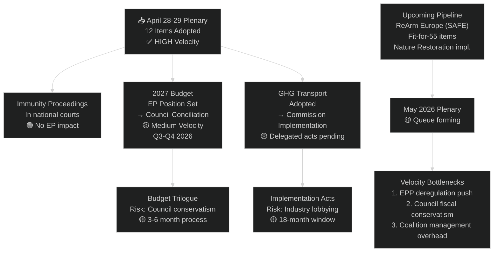

<!-- SPDX-FileCopyrightText: 2024-2026 Hack23 AB -->
<!-- SPDX-License-Identifier: Apache-2.0 -->

# Legislative Velocity Risk — EP Motions: April 28–29, 2026 Strasbourg Plenary

**Article Type:** motions | **Run Date:** 2026-04-30 | **Confidence:** 🟡 Medium

---

## Legislative Velocity Overview

**Velocity Definition:** The rate at which the EP can advance legislative initiatives from committee stage through plenary adoption, measured against procedural bottlenecks, coalition friction, and external constraints.

---

## Current Velocity Assessment

| Process | Status | Velocity Assessment |
|---------|--------|-------------------|
| Immunity waivers (PRIV procedure) | ✅ Completed | 🟢 HIGH velocity — rapid parallel processing of 3 cases |
| 2027 Budget Guidelines | ✅ EP position adopted | 🟡 MEDIUM velocity — now enters Council phase |
| GHG Transport accounting | ✅ Adopted | 🟢 HIGH velocity — Green Deal pipeline continuing |
| Animal welfare | ✅ Adopted | 🟢 HIGH velocity |
| EU-Iceland PNR | ✅ Adopted | 🟢 HIGH velocity |
| ReArm Europe (SAFE bonds) | 🔄 Committee stage | 🟡 MEDIUM velocity — contentious |
| Subsequent Fit-for-55 measures | 🔄 Pipeline | 🟡 MEDIUM velocity |

---

## Velocity Risk Factors

### VR-1: Budget Trilogue Slowdown (Risk: MEDIUM)

The 2027 budget guidelines adopted by the EP must now enter conciliation with the Council. Historical trilogue duration for annual budgets: 3–6 months. Key velocity risks:
- Council's fiscal conservatism vs. EP's defence/climate priorities
- ReArm Europe financing mechanism (SAFE bonds) not yet legally established
- Northern member states' fiscal stance limits Council flexibility

**Expected velocity impact:** 🟡 MODERATE SLOWDOWN in Q3–Q4 2026 budget conciliation

### VR-2: Immunity Proceedings — External Variable (Risk: LOW)

Once immunity is waived, legislative velocity for the EP is unaffected — proceedings occur in national courts. The velocity risk is contained. However, if MEPs are detained or face distractions, their committee participation may reduce, slightly reducing relevant committee velocity.

**Expected velocity impact:** 🟢 LOW — contained to national proceedings

### VR-3: EPP Deregulatory Push vs. Green Deal Pipeline (Risk: MEDIUM)

EPP's "competitiveness first" shift creates friction with Green Deal legislative pipeline items waiting in committee. GHG transport adoption shows the pipeline continues, but future measures (packaging, nature restoration implementation) may slow.

**Expected velocity impact:** 🟡 SELECTIVE SLOWDOWN on specific Green Deal items

### VR-4: Parliamentary Calendar Constraints (Risk: LOW-MEDIUM)

May 2026 plenary schedule (Strasbourg: May 19–22) and Brussels micro-sessions are the next available plenary slots. Pipeline items must queue for committee completion before plenary listing.

---

## Legislative Velocity Diagram

---

## Velocity Score by Policy Domain

| Domain | Current Velocity | Q2 2026 Forecast | Q4 2026 Forecast |
|--------|----------------|-----------------|-----------------|
| Judicial accountability | 🟢 HIGH (9/10) | 🟡 MEDIUM (6/10) | 🟡 MEDIUM (6/10) |
| Budget/fiscal | 🟡 MEDIUM (6/10) | 🟡 MEDIUM (5/10) | 🔴 SLOWDOWN (4/10) |
| Climate regulation | 🟡 MEDIUM (6/10) | 🟡 MEDIUM (5/10) | 🟡 MEDIUM (5/10) |
| Defence/security | 🟡 MEDIUM (5/10) | 🟡 MEDIUM (6/10) | 🟡 MEDIUM (5/10) |
| Animal/consumer protection | 🟢 HIGH (8/10) | 🟢 HIGH (7/10) | 🟢 HIGH (7/10) |

*Score 1–10: 1 = fully stalled, 10 = rapid unimpeded passage*

---

## Reader Briefing

**What is "legislative velocity" and why does it matter?**

Legislative velocity describes how quickly the EU Parliament can turn proposals into adopted law. A slow-moving parliament frustrates its own agenda; a fast one risks insufficient deliberation. The April 28–29 session shows the EP operating at high velocity on routine and procedural items (immunity, animal welfare, PNR) but facing medium velocity on the big fiscal items because those require agreement with the Council of member states — a separate institution with different priorities. The budget guidelines adopted this week will take months of negotiation before they become binding; the immunity waivers, by contrast, take immediate effect.

---

**Data Sources:** EP adopted texts April 2026, plenary session data, early warning system stability 84. EP Open Data Portal, CC BY 4.0.
