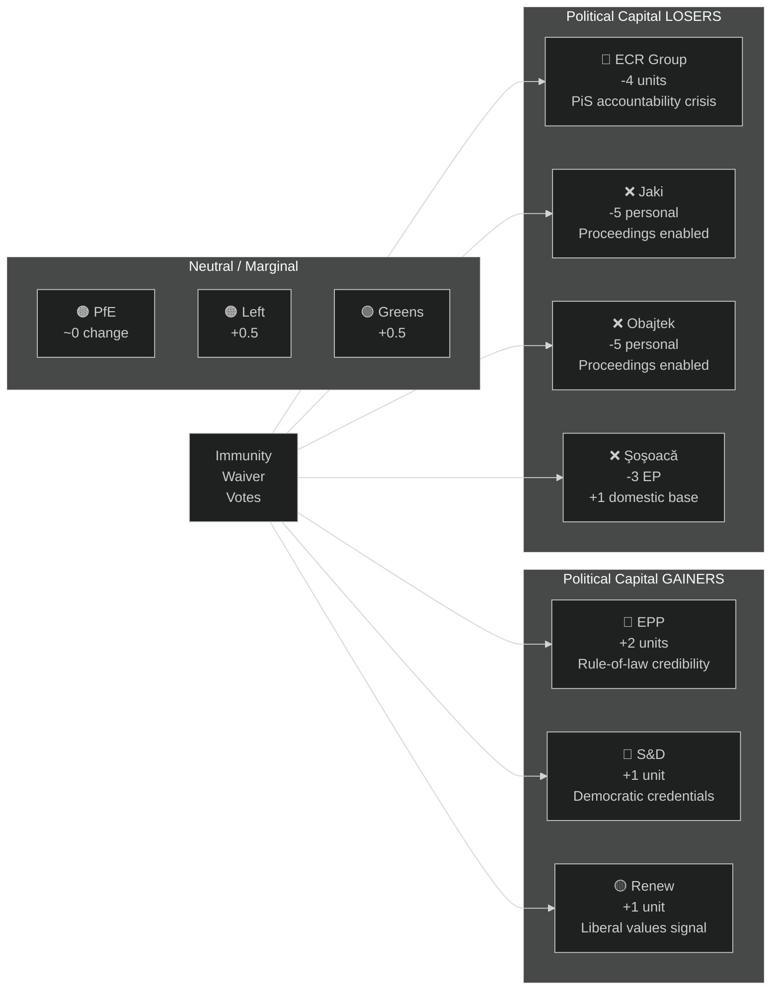

<!-- SPDX-FileCopyrightText: 2024-2026 Hack23 AB -->
<!-- SPDX-License-Identifier: Apache-2.0 -->

# Political Capital Risk — EP Motions: April 28–29, 2026 Strasbourg Plenary

**Article Type:** motions | **Run Date:** 2026-04-30 | **Confidence:** 🟡 Medium

---

## Political Capital Framework

Political capital is assessed as the ability of key actors to build, spend, or lose the coalition support needed for future legislative objectives.

---

## Actor Political Capital Assessment

### EPP Group — Manfred Weber

**Current capital level:** 🟢 HIGH (stable majority, agenda-setting)

**Capital spend on immunity votes:** LOW-MEDIUM
- Voting FOR three waivers was consistent with EPP's stated rule-of-law positioning but may modestly alienate EPP MEPs with nationalist-adjacent national parties (Austria's ÖVP, Hungary's Fidesz-adjacent remnants)
- Weber's signal: EPP is not a political shield for judicial accountability avoidance

**Capital gain:** MEDIUM
- Strengthens EPP's credibility with liberal democracies; builds inter-group trust with S&D and Renew
- Reinforces Weber's "responsible centre-right" positioning ahead of Commission President relationship management

**Net:** 🟢 POSITIVE (+2 units)

---

### ECR Group — Nicola Procaccini / Adam Bielan

**Current capital:** 🟡 MEDIUM (second-largest group, but consistently outvoted)

**Capital spend on immunity votes:** HIGH
- Three ECR members' immunities stripped in one week is a significant group cohesion test
- ECR leadership must either rally around expelled members (solidarity) or distance (rule-of-law credibility)
- Jaki and Obajtek are Polish PiS figures; ECR's Polish delegation is its largest component

**Capital loss:** HIGH
- Polish PiS's ongoing accountability crisis spills directly into ECR's group discipline
- If proceedings result in prominent convictions of PiS/ECR figures, ECR's national support base in Poland erodes
- EU credibility for ECR as serious governing group damaged if members cannot maintain legal accountability

**Net:** 🔴 NEGATIVE (-4 units)

---

### S&D Group

**Current capital:** 🟢 HIGH (consistent majority partner)

**Capital spend:** LOW (routine FOR votes on rule-of-law)

**Capital gain:** LOW-MEDIUM
- Reinforces S&D's progressive democratic credentials
- Budget guidelines social spending inclusion: partial success

**Net:** 🟢 POSITIVE (+1 unit)

---

### Patryk Jaki, Daniel Obajtek (ECR/PL)

**Current capital:** 🔴 LOW and FALLING

**Impact:** Immunity stripped; national judicial proceedings enabled; both face reputational damage regardless of case outcome. Their EP platform for influence is now constrained. Jaki's Justice Ministry involvement and Obajtek's Orlen tenure are both high-profile in Poland.

**Net:** 🔴 VERY NEGATIVE (personal capital -5)

---

### Diana Şoşoacă (ESN/RO)

**Current capital:** 🟡 MEDIUM in Romanian populist context (has national visibility)

**EP capital impact:** Near-zero (ESN is marginally influential in EP)
**Domestic capital impact:** Paradoxically POSITIVE for her base — "EU punishing Romanian patriot" narrative plays well with ~15-20% of Romanian far-right electorate

**Net:** 🟡 MIXED (+1 domestic, -3 EP institutional)

---

## Capital Flow Diagram

---

## Reader Briefing

**What is "political capital" and why does it matter?**

In parliamentary politics, political capital is the informal credit that a party or leader builds through successful alliances, credible commitments, and consistent positioning. You spend it when you take controversial positions; you gain it when you act in ways that reinforce your allies' trust or your voters' expectations.

The April votes cost ECR real political capital: its two most prominent Polish MEPs now face judicial proceedings, and the group could not protect them. EPP, by contrast, reinforced its positioning as a legitimate governing centre-right force — not a nationalist shield. This matters for the next big institutional negotiation: the 2027 budget.

---

**Data Sources:** EP plenary data, political landscape, group seat allocations. EP Open Data Portal, CC BY 4.0.
