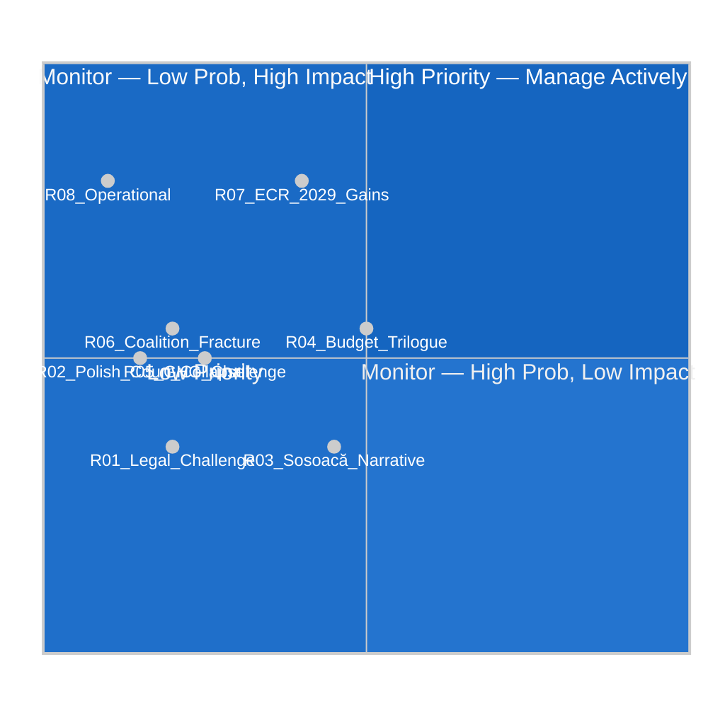

<!-- SPDX-FileCopyrightText: 2024-2026 Hack23 AB -->
<!-- SPDX-License-Identifier: Apache-2.0 -->

# Risk Matrix — EP Motions: April 28–29, 2026 Strasbourg Plenary

**Article Type:** motions | **Run Date:** 2026-04-30 | **Confidence:** 🟡 Medium

---

## Risk Register

| Risk ID | Risk Description | Probability | Impact | Inherent Risk | Mitigation | Residual |
|---------|----------------|-------------|--------|--------------|-----------|---------|
| R-01 | Legal challenge to immunity waivers (ECR/far-right MEPs challenge JURI procedure) | Low (20%) | Low-Med | 🟡 LOW-MED | JURI precedent; EP Bureau backing | 🟢 LOW |
| R-02 | Jaki/Obajtek proceedings collapsed by Polish court (undermining EP immunity decision) | Low (15%) | Medium | 🟡 MEDIUM | Polish independent judiciary (post-2023 government) | 🟡 LOW-MED |
| R-03 | Şoşoacă exploits waiver for political martyrdom narrative in Romania | Medium (45%) | Low-Med | 🟡 MEDIUM | Romanian judiciary credibility; EP communications | 🟡 MEDIUM |
| R-04 | 2027 Budget Guidelines rejected by Council → prolonged trilogue | Medium (50%) | Medium | 🟡 MEDIUM | Compromise package; EPP-conservative wing | 🟡 MEDIUM |
| R-05 | GHG transport regulation legal challenge (industry lobbies, subsidiarity) | Low-Med (25%) | Medium | 🟡 LOW-MED | Commission legal basis solid; QMV threshold met | 🟢 LOW |
| R-06 | Coalition fracture on budget (S&D vs EPP on social spending) | Low (20%) | Medium | 🟡 LOW-MED | Traditional grand coalition discipline | 🟢 LOW |
| R-07 | ECR gains seats in 2029 elections → future immunity votes harder | Medium (40%) | High | 🔴 HIGH | Long-term; current mandate unaffected | 🟡 MEDIUM |
| R-08 | EP safeoutputs session timeout (operational) | Low (10%) | High | 🟡 MEDIUM | Strict time budget adherence | 🟢 LOW |

---

## Risk Heat Map

---

## Top Risk Analysis

### R-04: Budget Trilogue Risk (Probability: 50%, Impact: Medium)

The 2027 budget guidelines reflect EP priorities, but the Council's position is expected to be more conservative. Key divergence points:
- **Defence spending:** Council majority (northern + Baltic states) wants more; Mediterranean/southern states want fiscal envelope maintained for cohesion
- **Climate spending:** EPP's "competitiveness first" shift vs. S&D/Greens' Green Deal continuity
- **ReArm Europe financing:** Whether SAFE bonds or existing MFF headroom funds defence

**Mitigation:** Historical pattern — EP-Council budget conciliation always reaches agreement; EP typically gains 2–5% on its priority lines.

### R-07: ECR Growth Risk (Probability: 40%, Long-term, Impact: High)

If ECR continues growing toward 100+ seats in EP10, future immunity votes for ECR members become closer. 81 seats now; S&D at 135 is the natural counter-balance. 2029 elections are 3 years away — this is a structural trend risk, not an immediate operational risk.

### R-03: Şoşoacă Narrative Risk (Probability: 45%, Impact: Low-Medium)

Romanian politics is highly volatile. Şoşoacă's ECHR challenge and domestic political narrative that EP is "persecuting Romanian patriots" has resonance with ~15-20% of Romanian electorate. This is primarily a reputational risk for the EP's image in Romania, not a legal or legislative risk.

---

## Risk-Mitigation Mapping

| Risk | Primary Mitigation Owner | Timeline |
|------|------------------------|---------|
| R-04 | Budget Committee (BUDG) + Commission | Q2–Q4 2026 (trilogue) |
| R-07 | Political group strategy (EPP+S&D) | 2027–2029 |
| R-03 | EP Press/DG COMM Romania | 2026 |
| R-01, R-02 | JURI + Legal Service | 2026 |

---

**Data Sources:** EP plenary data, political landscape, early warning system stability score (84). EP Open Data Portal, CC BY 4.0.
