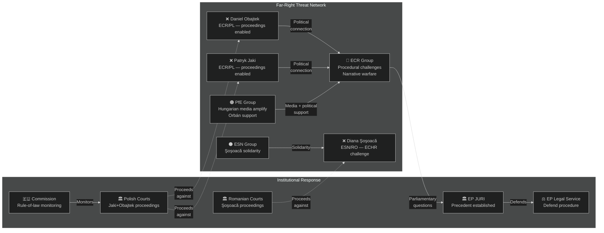

<!-- SPDX-FileCopyrightText: 2024-2026 Hack23 AB -->
<!-- SPDX-License-Identifier: Apache-2.0 -->

# Actor Threat Profiles — EP Motions: April 28–29, 2026 Strasbourg Plenary

**Article Type:** motions | **Run Date:** 2026-04-30 | **Confidence:** 🟡 Medium
**Methodology:** Actor-level threat characterization + behavioral prediction

---

## Threat Profile Roster

### Actor: ECR Group (European Conservatives and Reformists)

**Threat Type:** Political opposition | **Current Threat Level:** 🟡 MEDIUM

**Profile:** ECR is the second-largest EP group (81 seats) and is structurally opposed to mainstream agenda on rule-of-law, immigration, and fiscal items. With Jaki and Obajtek members having their immunity stripped, ECR now has a heightened personal and political stake in opposing the mainstream coalition.

**Behavioral Prediction:**
- File procedural motions questioning JURI process (high probability, ~70%)
- Commission rule-of-law report responses framing immunity as persecution (high probability)
- Coordinated MEP speeches in plenary framing immunity votes as "judicial warfare" (certain)
- Attempt to peel off EPP conservative MEPs on future similar votes (medium probability, ~35%)

**Capability:** MEDIUM (cannot block votes; can amplify narrative and cause procedural delays)

**Key vulnerability:** ECR's domestic political exposure — if PiS loses further ground in Polish polls, ECR's largest delegation weakens

---

### Actor: PfE Group (Patriots for Europe)

**Threat Type:** Populist narrative amplification | **Current Threat Level:** 🟡 MEDIUM

**Profile:** PfE (85 seats, largest individual group in opposition) is less directly affected by the April votes but has structural incentive to support the "political persecution" narrative. PfE includes Orbán's Fidesz (Hungary) as a key player; Hungary has direct interest in framing EU rule-of-law enforcement as political weaponization.

**Behavioral Prediction:**
- Hungarian state media amplification of immunity waiver narratives (certain)
- PfE MEPs filing parliamentary questions to JURI on procedure (high probability)
- Blocking or abstaining on future EP rule-of-law resolutions related to Hungary/Poland (high probability)

**Capability:** MEDIUM (cannot block; can amplify internationally)

---

### Actor: Diana Şoşoacă (ESN/RO)

**Threat Type:** Individual disruptive actor | **Current Threat Level:** 🟡 MEDIUM

**Profile:** Şoşoacă is known for highly confrontational plenary behaviour, including verbal disruptions, costume protests, and media stunts. Her immunity waiver removal enables Romanian proceedings but also hands her a powerful narrative weapon.

**Behavioral Prediction:**
- ECHR application within 6 months (high probability, ~65%)
- Romanian nationalist media campaign: "Brussels vs. Romanian patriots" (certain)
- Continued disruptive behaviour in EP plenary to generate publicity (certain)
- Attempt to organize street protests in Romania framing EU as enemy (medium probability)

**Capability:** LOW in EP legislative terms; MEDIUM in Romanian domestic narrative

---

### Actor: ESN Group (Europe of Sovereign Nations)

**Threat Type:** Far-right narrative actor | **Current Threat Level:** 🔴 LOW-MEDIUM

**Profile:** ESN (27 seats) is the smallest and most extreme EP group. Losing Şoşoacă to proceedings is both a group loyalty test and a propaganda opportunity.

**Behavioral Prediction:**
- Coordinated show of support for Şoşoacă at next plenary (high)
- Parliamentary questions on EP procedure (medium)
- Limited substantive legislative impact

---

### Actor: National Judicial Authorities (Poland, Romania)

**Threat Type:** External institutional actor (positive-direction threat to immunity subjects)

**Profile:** These are not threats to the EP's institutional agenda but are key actors in determining whether the immunity votes have real-world consequences.

**Polish Prosecution — Adam Bielan et al.:**
- Post-2023 Tusk government has strengthened prosecution independence
- Active PiS accountability investigations ongoing
- Jaki (Justice Ministry) and Obajtek (Orlen) are high-profile, politically motivated cases from prosecution's perspective

**Romanian Prosecution (DIICOT context for Şoşoacă):**
- Romanian prosecution independence more fragile than Polish
- Şoşoacă case may be less aggressively pursued
- ECHR challenge could be used to slow domestic proceedings

---

## Actor Threat Network Map

---

## Reader Briefing

**Who are the threat actors and what can they actually do?**

The parties whose members had immunity stripped (ECR with Jaki and Obajtek, ESN with Şoşoacă) cannot undo the EP's votes. What they can do is make noise — filing legal challenges, giving speeches accusing the EP of political bias, and using their media connections (especially in Hungary, Poland, and Romania) to frame the votes as "Brussels attacking national politicians." This is primarily a communications and reputational challenge for the EP, not a legislative threat. The real deciding factor is what happens in Polish and Romanian courts — if proceedings are vigorous and substantiated, the far-right narrative of persecution loses credibility. If proceedings stall or collapse, the narrative gets a boost.

---

**Data Sources:** EP plenary data, political landscape, coalition dynamics, early warning system. EP Open Data Portal, CC BY 4.0.
