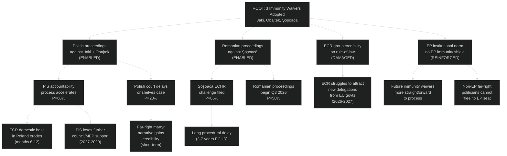
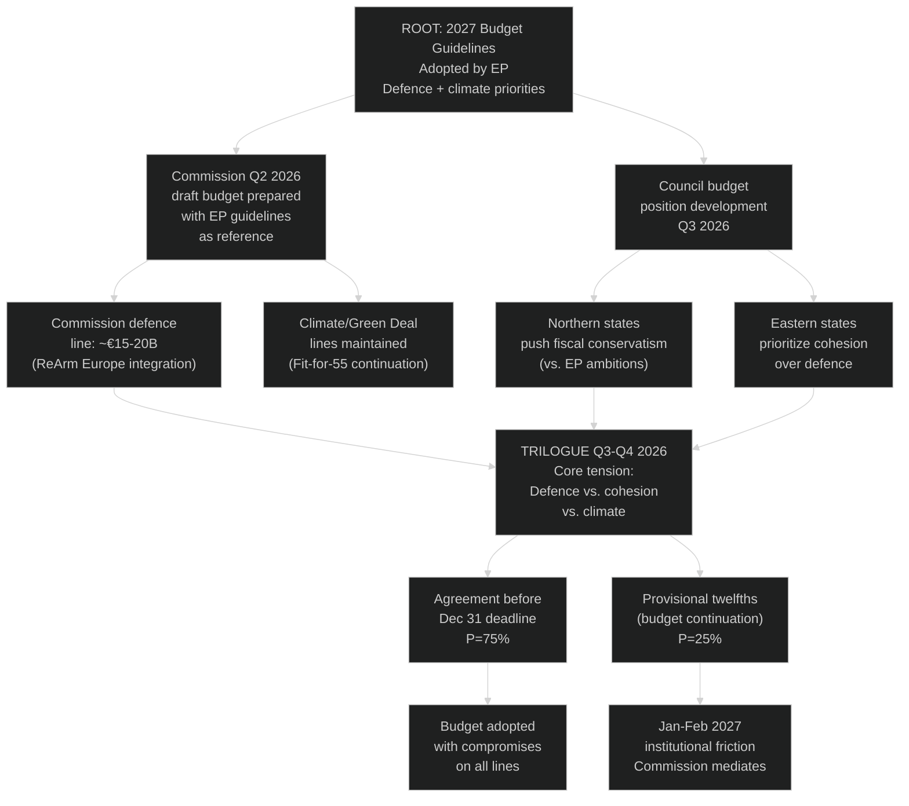

<!-- SPDX-FileCopyrightText: 2024-2026 Hack23 AB -->
<!-- SPDX-License-Identifier: Apache-2.0 -->

# Consequence Trees — EP Motions: April 28–29, 2026 Strasbourg Plenary

**Article Type:** motions | **Run Date:** 2026-04-30 | **Confidence:** 🟡 Medium

---

## Consequence Tree 1: Immunity Waiver Cascade

**Root event:** Three MEP immunity waivers adopted, April 28, 2026

---

## Consequence Tree 2: Budget Guidelines Cascade

**Root event:** 2027 Budget Guidelines (TA-10-2026-0112) adopted, April 28, 2026

---

## Key Consequence Likelihood Summary

| Consequence | Probability | Timeline | Significance |
|-------------|------------|---------|-------------|
| Polish proceedings against Jaki/Obajtek | 65% active | Q2-Q3 2026 | HIGH |
| ECR domestic credibility damage | 55% | 6-12 months | HIGH |
| Şoşoacă ECHR challenge filed | 65% | 3-6 months | LOW (procedural only) |
| Budget agreement before Dec 31 | 75% | Dec 2026 | HIGH |
| Provisional twelfths (budget failure) | 25% | Jan 2027 | MEDIUM |
| Future immunity processes streamlined | 80% | Ongoing | MEDIUM |

---

## Second-Order Consequences

**S1:** If Polish courts pursue PiS-era accountability successfully, it strengthens S&D and Renew's argument for Commission rule-of-law conditionality attached to EU structural funds.

**S2:** If budget conciliation achieves a strong defence line, it accelerates ReArm Europe implementation timelines and shapes EU-NATO coordination discussions.

**S3:** If the EP immunity norm is consistently applied over 2026–2029, it reduces the political appeal of EU Parliament seats as legal shields — which may shift the candidate profiles for far-right parties.

---

## Reader Briefing

**Why do "consequence trees" matter for understanding EU politics?**

Today's votes don't just matter today. When the EU Parliament strips immunity from three MEPs, it triggers a cascade of consequences: national courts can now proceed, political groups face credibility tests, and the norm that EU seats are not immunity shields is reinforced. When it adopts budget guidelines, it opens months of negotiations with national governments. Consequence tree analysis helps us understand not just what was decided, but what will happen next — and what could go differently. The most important consequence from this week's session is not which texts passed, but what they signal: that the EP's mainstream coalition is functional, that rule-of-law accountability extends to far-right MEPs, and that the 2027 budget negotiation has begun with EP's priorities on record.

---

**Data Sources:** EP adopted texts April 2026, plenary session data, political landscape, coalition dynamics. EP Open Data Portal, CC BY 4.0.
