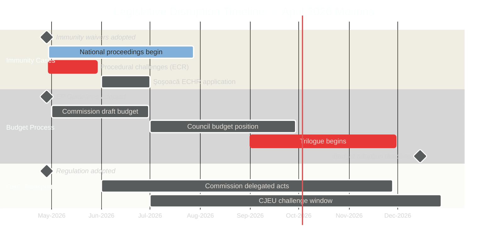

<!-- SPDX-FileCopyrightText: 2024-2026 Hack23 AB -->
<!-- SPDX-License-Identifier: Apache-2.0 -->

# Legislative Disruption — EP Motions: April 28–29, 2026 Strasbourg Plenary

**Article Type:** motions | **Run Date:** 2026-04-30 | **Confidence:** 🟡 Medium
**Methodology:** Procedural disruption analysis + timeline risk mapping

---

## Disruption Landscape Overview

Legislative disruption occurs when procedural or political obstacles slow or prevent the EP from advancing its legislative agenda. This analysis maps disruption risks arising directly from the April 28–29 motions and their downstream effects.

---

## Disruption Category 1: Post-Immunity Procedural Challenges

**Type:** Procedural | **Probability:** Medium (40%) | **Impact:** LOW-MEDIUM

ECR and ESN members are likely to file procedural complaints with the EP Bureau or JURI questioning the manner in which the immunity waivers were processed. Possible mechanisms:
- Request for JURI review/reconsideration
- Referral to Conference of Presidents
- Motion for emergency plenary debate

**Historical precedent:** EP Rules of Procedure provide robust JURI authority; previous immunity challenges have been consistently dismissed.

**Timeline impact:** Could add 2–4 weeks to procedural resolution; no substantive disruption to other legislation.

---

## Disruption Category 2: Budget Conciliation Blockage

**Type:** Interinstitutional | **Probability:** High (55%) | **Impact:** MEDIUM

The 2027 budget guidelines open the Council-EP conciliation process. Council's expected conservative position vs. EP's ambitions creates disruption risk:

**Key disruption pressure points:**
- **Defence line:** ReArm Europe creates pressure for large defence spending increases that Council may accept but climate/cohesion MEPs (S&D, Greens) will conditionally support
- **Fiscal rules:** Council's conservative majority may resist EP guidelines on borrowing flexibility for defence
- **October deadline:** EU budget must be adopted before December 31; failure triggers provisional twelfths (monthly continuation at prior year's rate) — a major institutional disruption

**Timeline:** April 2026 guidelines → Commission draft Q2 → Council position Q3 → Trilogue Q3-Q4 → Vote November–December 2026

---

## Disruption Category 3: Far-Right Procedural Tactics

**Type:** Political-procedural | **Probability:** High (65%) | **Impact:** LOW

ECR and PfE routinely use procedural tools to slow legislation:
- Requesting full chamber roll-call votes on committee reports
- Tabling large numbers of plenary amendments
- Requesting urgent debate slots on immunity decisions
- Using speaking time maximally on contested items

This is normal parliamentary opposition behaviour. It creates minor delays (hours to days) but not structural disruption.

---

## Disruption Timeline

---

## Disruption Risk Scoring

| Disruption | Probability | Severity | Disruption Score |
|------------|------------|---------|-----------------|
| Procedural challenges on immunity | 40% | LOW | 🟢 2/10 |
| Budget trilogue blockage | 55% | MEDIUM | 🟡 5/10 |
| Far-right procedural tactics | 65% | LOW | 🟢 2/10 |
| CJEU challenge (GHG) | 25% | LOW | 🟢 2/10 |
| National court inaction | 20% | MEDIUM | 🟡 4/10 |
| Şoşoacă ECHR challenge | 65% | LOW | 🟢 2/10 |

**Overall disruption risk to EP legislative agenda:** 🟢 LOW-MEDIUM — no severe disruption risk; budget trilogue is the primary concern.

---

## Disruption Mitigation Playbook

| Disruption | Mitigation | Owner |
|-----------|-----------|-------|
| Procedural challenges | EP Bureau + JURI — consistent application of RoP | JURI Chair |
| Budget blockage | Commission bridging proposals; EPP-Council links | Commission, BUDG |
| Far-right tactics | Standard parliamentary time management | EP Plenary staff |
| National inaction | Commission Rule of Law report pressure | Commission |

---

## Reader Briefing

**Why does legislative disruption matter to you?**

When EU legislation gets delayed or blocked, it means that things the EU Parliament has voted to do — like requiring companies to report emissions, or setting animal welfare standards — take longer to actually become reality for citizens and businesses. The April votes themselves were completed smoothly (no disruption). The disruption risks now lie in the downstream processes: the budget negotiation with member state governments, and the possibility that the politicians who lost their immunity protections will try legal challenges to delay their accountability. Neither is likely to succeed, but both will generate political noise in the coming months.

---

**Data Sources:** EP adopted texts April 2026, political landscape, plenary sessions. EP Open Data Portal, CC BY 4.0.
