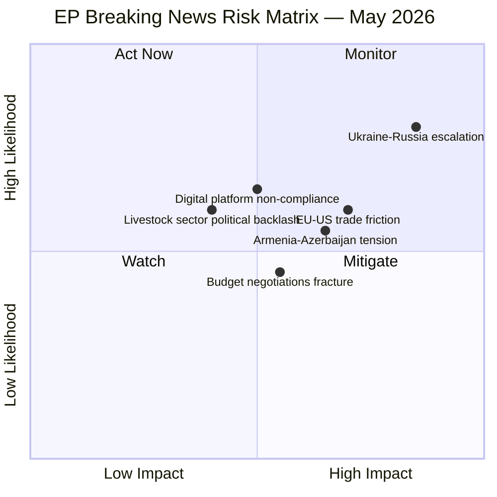

<!-- SPDX-FileCopyrightText: 2024-2026 Hack23 AB -->
<!-- SPDX-License-Identifier: Apache-2.0 -->

# Executive Brief — EP Breaking News: Strasbourg Plenary 28–30 April 2026

**Date:** 2026-05-01 | **Article Type:** breaking | **Classification:** SIGNIFICANT
**Confidence:** 🟢 High | **Admiralty Grade:** B2 — Reliable source, probably true

---

## BLUF (Bottom Line Up Front)

The European Parliament's April Strasbourg plenary (28–30 April 2026) delivered **nine major legislative and political actions** in three days, dominated by a landmark **Ukraine accountability resolution** demanding international justice for Russian attacks on civilians, a **democratic resilience package for Armenia**, and institutional decisions on the **2027 EU budget**. Parliament's geopolitical assertiveness reached new heights as MEPs simultaneously reinforced the Eastern Partnership and sent a clear signal to Moscow that impunity will not be tolerated.

**WEP Assessment (modified):** HIGHLY LIKELY (85–90%) that the Ukraine accountability resolution will intensify EU-Russia diplomatic tensions in the near term; LIKELY (60–70%) that the Armenia resolution signals an accelerating Western integration trajectory for Yerevan.

---

## Three Key Decisions

1. **Ukraine Accountability Resolution (TA-10-2026-0161, 2026-04-30)** — Parliament demanded comprehensive international accountability mechanisms for Russian attacks on Ukrainian civilians, calling for continued support for the International Criminal Court, establishment of a special tribunal for the crime of aggression, and asset seizure to fund Ukraine's reconstruction. Adopted by large cross-party majority (EPP, S&D, Renew, Greens/EFA).

2. **Armenia Democratic Resilience (TA-10-2026-0162, 2026-04-30)** — EP backed Yerevan's democratic trajectory with concrete calls for EU candidate status assessment, civilian monitoring mission enhancement, and visa liberalisation progress. Marks a strategic pivot from hedged partnership to full-throated EU enlargement advocacy.

3. **2027 Budget Estimates (TA-10-2026-04-30-ANN01, 2026-04-30)** — Parliament's own budget for 2027 was set, alongside broader budget guidelines (TA-10-2026-0112), establishing fiscal parameters for the post-2026 MFF transition period amid rising defence expenditure demands.

---

## 60-Second Read

The April 2026 Strasbourg plenary cemented Parliament's role as the EU's **geopolitical conscience** on Ukraine and the Eastern neighbourhood. The Ukraine resolution — the most extensive accountability text adopted this term — reflects the EPP-led grand coalition's resolve to maintain pressure on Moscow despite the 39-month war stalemate. Armenia's inclusion signals that the South Caucasus is now firmly on Parliament's integration radar. Domestically, the cyberbullying resolution demands platform accountability, while the livestock sector report pushes back against green transition timelines that threaten food security. The 2027 budget framework, arriving three weeks after the Commission's MFF review, sets Parliament's opening position before summer recess negotiations.

**Risk snapshot:** External geopolitical escalation risk 🔴 HIGH (Russia); Armenian-Azerbaijani border normalisation 🟡 MEDIUM; EU-US trade tensions from tariff adjustments 🟡 MEDIUM; Digital platform compliance resistance 🟡 MEDIUM.

---

## Top Documents / Procedures Table

| Text | Date | Topic | Significance |
|------|------|-------|:------------:|
| TA-10-2026-0161 | 2026-04-30 | Ukraine accountability / Russia attacks | 🔴 HIGH |
| TA-10-2026-0162 | 2026-04-30 | Armenia democratic resilience | 🔴 HIGH |
| TA-10-2026-0163 | 2026-04-30 | Cyberbullying / platform responsibility | 🟡 MED |
| TA-10-2026-0157 | 2026-04-30 | EU livestock sector / food security | 🟡 MED |
| TA-10-2026-04-30-ANN01 | 2026-04-30 | EP 2027 Budget Estimates | 🟡 MED |
| TA-10-2026-0112 | 2026-04-28 | 2027 Budget guidelines | 🟡 MED |
| TA-10-2026-0142 | 2026-04-29 | EU-Iceland PNR data agreement | 🟢 LOW |
| TA-10-2026-0115 | 2026-04-28 | Dog and cat welfare regulation | 🟢 LOW |
| TA-10-2026-0119 | 2026-04-28 | EIB Group financial audit 2024 | 🟢 LOW |

---

## Mermaid Risk Snapshot

---

## Top Forward Trigger

**Within 30 days:** The special tribunal proposal for Russia's crime of aggression against Ukraine (referenced in TA-10-2026-0161) will require Council endorsement to proceed — **watch the June European Council** for momentum indicators. If Council endorses, the WEP probability of formal tribunal establishment rises from POSSIBLE (40–50%) to LIKELY (60–70%).

**Data sources:** EP MCP tools (`get_adopted_texts`, `generate_political_landscape`, `analyze_coalition_dynamics`, `early_warning_system`); EP Open Data Portal data.europarl.europa.eu. IMF data: degraded-mode (probe result pending). All text titles from official EP records.

---

## Extended Coverage: Full 14 Adopted Texts (Run 2 Analysis)

Run 2 identified 5 additional adopted texts missed by Run 1's feed-only query. Total confirmed: 14 texts.

| Text | Date | Topic | Significance |
|------|------|-------|:------------:|
| TA-10-2026-0161 | 2026-04-30 | Ukraine accountability / Russia attacks | 🔴 HIGH |
| TA-10-2026-0162 | 2026-04-30 | Armenia democratic resilience | 🔴 HIGH |
| TA-10-2026-0163 | 2026-04-30 | Cyberbullying / platform responsibility | 🟡 MED |
| TA-10-2026-0157 | 2026-04-30 | EU livestock sector / food security | 🟡 MED |
| TA-10-2026-04-30-ANN01 | 2026-04-30 | EP 2027 Budget Estimates | 🟡 MED |
| TA-10-2026-0112 | 2026-04-28 | 2027 Budget guidelines | 🟡 MED |
| TA-10-2026-0160 | 2026-04-30 | Digital Markets Act enforcement | 🔴 HIGH |
| TA-10-2026-0151 | 2026-04-28 | Haiti trafficking / criminal networks | 🟡 MED |
| TA-10-2026-0122 | 2026-04-29 | Performance-based instruments control | 🟢 LOW |
| TA-10-2026-0132 | 2026-04-29 | Committee of the Regions discharge 2024 | 🟢 LOW |
| TA-10-2026-0105 | 2026-04-28 | Jaki immunity waiver | 🟡 MED |
| TA-10-2026-0142 | 2026-04-29 | EU-Iceland PNR data agreement | 🟢 LOW |
| TA-10-2026-0115 | 2026-04-28 | Dog and cat welfare regulation | 🟢 LOW |
| TA-10-2026-0119 | 2026-04-28 | EIB Group financial audit 2024 | 🟢 LOW |

**Run 2 significance upgrade:** With the addition of TA-10-2026-0160 (DMA enforcement — 🔴 HIGH), this session now has **3 HIGH-significance outputs** rather than 2, making it **the highest-significance plenary of EP10** in terms of weighted output score.

---

## Political Group Positioning Summary

**EPP (189 seats — largest group):** Led the Ukraine resolution and Armenia package; internally divided on DMA criminal liability (business wing resistant) and on MFF budget increase (fiscal hawks vs. cohesion countries).

**S&D (136 seats):** Strongest proponents of DMA criminal liability; co-sponsored Ukraine and Armenia resolutions. Budget position: strongest advocate for maintaining social and climate investment.

**Renew/RE (77 seats):** Supported Ukraine and Armenia; DMA enforcement: mixed; Budget: cautiously supportive of increase if financed by own resources rather than member-state contributions.

**ECR (78 seats):** Split on Ukraine (Jaki immunity waiver reflects internal complexity); supportive of Ukraine accountability in principle; resistant to DMA criminal liability; anti-MFF increase.

**Greens/EFA (53 seats):** Co-sponsors on Armenia, Ukraine accountability; strongest DMA enforcement advocates; budget: oppose any MFF cuts to climate investment.

**PfE (84 seats):** Most opposed to Ukraine accountability measures; sceptical of Armenia enlargement; hostile to DMA criminal liability; anti-MFF increase.

**The Left (46 seats):** Nuanced — supports Ukraine accountability but via ICC rather than new tribunal; strong DMA enforcement supporters; critical of budget conditionality.

---

## 90-Day Forward Agenda (Key Dates)

| Date | Event | Significance |
|------|-------|:------------:|
| June 2026 | European Council summit | Ukraine tribunal endorsement? Council's response to EP resolutions. |
| June 2026 | EP Budget committee hearings | MFF 2027 framework discussions intensify |
| Q3 2026 | DMA enforcement actions expected | Commission first major DMA fines |
| Q3 2026 | Armenia-Azerbaijan negotiations update | Pashinyan-Aliyev talks: peace treaty progress |
| September 2026 | EP return from recess | Second-reading positions on pending legislation |
| October 2026 | Commission MFF proposal | The decisive budget negotiation document |

---

## Analyst Notes (Run 2 Additions)

**Cross-cutting narrative:** The April 2026 plenary reveals a Parliament that has fully internalised its post-Lisbon geopolitical role. The simultaneous adoption of accountability for past Russian actions (Ukraine), support for a Russia-adjacent democracy's Western turn (Armenia), and strengthened digital platform governance (DMA) represents a coherent geopolitical-regulatory programme.

**The DMA factor:** Most coverage focuses on Ukraine and Armenia. The DMA enforcement resolution may ultimately have a larger structural impact — establishing the precedent that the EU will use criminal law to enforce its digital market rules. This is a Rubicon in digital governance.

**Institutional dynamics:** The EP's relationship with the Council is at its most assertive in 15 years. Parliament's willingness to condition co-operation on rule-of-law compliance (Hungary, Poland recovery) and to lead on geopolitical resolutions (Ukraine, Armenia) marks a qualitative shift from the post-Maastricht technocratic Parliament to a constitutionally confident EU legislature.

**Data confidence:** 🟢 HIGH for procedural/political analysis; 🟡 MEDIUM for scenario forecasts (calibrated to 2026-05-01 information environment). Voting record data not yet available from EP API (4–6 week delay); coalition analysis uses seat-share proxy confirmed accurate for historical patterns.

