<!-- SPDX-FileCopyrightText: 2024-2026 Hack23 AB -->
<!-- SPDX-License-Identifier: Apache-2.0 -->

# Cross-Reference Map — EP Breaking News: April 28–30, 2026

**Date:** 2026-05-01 | **Article Type:** breaking | **Confidence:** 🟢 High
**Admiralty Grade:** A3 — Fairly reliable, possibly true

---

## §1 Purpose

This artifact maps the inter-document connections across all adopted texts from the April 28–30, 2026 Strasbourg plenary, tracing procedural, thematic, and political cross-references. It supports the article renderer in identifying coherent narrative threads and ensures no significant linkage is missed.

---

## §2 Document Network Map

```mermaid
graph TD
    Ukraine["TA-10-2026-0161<br/>Ukraine Accountability"] --> TribunalProposal["Special Tribunal<br/>for Crime of Aggression"]
    Ukraine --> AssetSeizure["Russian Asset<br/>Seizure Mechanism"]
    Ukraine --> ICCMandate["ICC Warrant<br/>Enforcement"]
    Armenia["TA-10-2026-0162<br/>Armenia Democratic<br/>Resilience"] --> CandidateStatus["EU Candidate<br/>Status Call"]
    Armenia --> CMM["EU Civilian<br/>Monitoring Mission"]
    Armenia --> VisaLib["Visa Liberalisation<br/>Progress"]
    Budget27["TA-10-2026-0112<br/>Budget 2027<br/>Guidelines"] --> MFF["MFF 2028-2034<br/>Positioning"]
    Budget27 --> DefenceSpending["Defence Investment<br/>Demands"]
    Budget27 --> GreenDeal["Green Deal<br/>Maintenance"]
    UkraineAssets["TA-10-2026-0161<br/>Asset Seizure"] --> Budget27
    DMA["TA-10-2026-0160<br/>DMA Enforcement"] --> Cyberbullying["TA-10-2026-0163<br/>Cyberbullying<br/>Platform Liability"]
    DMA --> DSA["DSA Framework<br/>Alignment"]
    EIB["TA-10-2026-0119<br/>EIB Audit 2024"] --> Budget27
    Iceland["TA-10-2026-0142<br/>EU-Iceland PNR"] --> Schengen["Schengen Security<br/>Architecture"]
    Livestock["TA-10-2026-0157<br/>Livestock / Food<br/>Security"] --> Budget27
    Haiti["TA-10-2026-0151<br/>Haiti Trafficking"] --> CFSP["CFSP / External<br/>Action"]
    JakiImmunity["TA-10-2026-0105<br/>Patryk Jaki<br/>Immunity Waiver"] --> AFCO["AFCO / JURI<br/>Procedure"]
    Ukraine --> Armenia
    Ukraine --> CFSP
    Armenia --> CFSP
```

---

## §3 Thematic Cross-Reference Matrix

| Text | Ukraine | Armenia | DMA | Budget | Security | Agriculture | Rule of Law |
|------|:---:|:---:|:---:|:---:|:---:|:---:|:---:|
| TA-10-2026-0161 (Ukraine) | ● | ↔ | — | ↔ | ● | — | ● |
| TA-10-2026-0162 (Armenia) | ↔ | ● | — | — | ↔ | — | ● |
| TA-10-2026-0160 (DMA) | — | — | ● | ↔ | ↔ | — | ● |
| TA-10-2026-0163 (Cyberbullying) | — | — | ↔ | — | ↔ | — | ● |
| TA-10-2026-0112 (Budget) | ↔ | — | — | ● | ↔ | ↔ | ↔ |
| TA-10-2026-0142 (PNR Iceland) | — | — | ↔ | — | ● | — | ↔ |
| TA-10-2026-0119 (EIB Audit) | ↔ | — | — | ● | — | — | ↔ |
| TA-10-2026-0157 (Livestock) | — | — | — | ↔ | — | ● | — |
| TA-10-2026-0151 (Haiti) | ↔ | — | — | — | ↔ | — | ● |
| TA-10-2026-0115 (Dog/cat) | — | — | — | — | — | ↔ | ↔ |
| TA-10-2026-0105 (Jaki immunity) | — | — | — | — | — | — | ● |
| TA-10-2026-0122 (Perf. instruments) | — | — | ↔ | ● | — | — | ↔ |
| TA-10-2026-0132 (CoR Discharge) | — | — | — | ● | — | — | ↔ |

**Legend:** ● = primary topic | ↔ = cross-reference link | — = no significant link

---

## §4 Procedural Pathway Cross-References

### Ukraine + Armenia: Joined Geopolitical Narrative
Both TA-10-2026-0161 and TA-10-2026-0162 were prepared by the **AFET committee** (Foreign Affairs) and share:
- Same rapporteur bloc (EPP-led with S&D/Renew co-sponsorship)
- Same procedural type (Rule 144 urgent resolutions)
- Same voting coalition pattern
- Shared theme: EU as democratic anchor for post-Soviet states resisting authoritarian pressure

### Budget + EIB + Performance Instruments: Fiscal Coherence Cluster
TA-10-2026-0112 (Budget 2027), TA-10-2026-0119 (EIB audit), and TA-10-2026-0122 (performance instruments) form a fiscal coherence cluster:
- Budget guidelines set the fiscal envelope
- EIB audit provides off-balance-sheet investment context
- Performance instruments (control/transparency/traceability) create the monitoring framework for EU funds

**Implication:** These three texts together constitute Parliament's pre-negotiation positioning for the September 2026 MFF revision and the 2027 annual budgetary procedure.

### DMA + Cyberbullying: Digital Governance Cluster
TA-10-2026-0160 (DMA enforcement) and TA-10-2026-0163 (cyberbullying) address the platform accountability space from different angles:
- DMA: competition / interoperability / gatekeeper obligations (economic)
- Cyberbullying: content / criminal liability / child protection (safety)
Both converge on the question of **platform criminal liability** — the EP is pushing toward a regime where platform operators face criminal (not just civil/administrative) consequences.

---

## §5 Actor Cross-References

### MEP Appearance Frequency Across Documents

| Actor | Texts Referenced | Role Type |
|-------|-----------------|-----------|
| Roberta Metsola (EPP, President) | Ukraine, Armenia, Budget | Institutional authority |
| EPP Group leadership | Ukraine, Armenia, DMA, Budget | Coalition anchor |
| S&D Group leadership | Ukraine, Cyberbullying, Budget | Co-sponsor |
| Renew Europe leadership | Armenia, DMA, PNR | Liberal pivot |
| Patryk Jaki (ECR/FdI) | TA-10-2026-0105 | Immunity subject |
| Greens/EFA | Ukraine, Armenia, DMA, Cyberbullying | Progressive signatory |
| PfE/Orbán faction | Ukraine (opposing) | Principal dissenter |

### External Actor Cross-References

| External Actor | Referenced In | Context |
|----------------|--------------|---------|
| ICC | TA-10-2026-0161 | Ukraine accountability mechanism |
| Council of Europe | TA-10-2026-0162 | Armenia monitoring |
| NATO | Budget 2027 | Defence spending pressure |
| European Commission | Budget, DMA, Cyberbullying | Legislative follow-up addressee |
| Council of EU | All major texts | Co-legislator / veto point |
| Russia | TA-10-2026-0161, Armenia (implicit) | Subject of accountability |
| Azerbaijan | TA-10-2026-0162 | Armenia security context |

---

## §6 Article-to-Analysis Artifact Cross-Reference

| Analysis Artifact | Texts Cited | Confidence |
|------------------|------------|:---:|
| executive-brief.md | 0161, 0162, 0163, 0157, 0112 | 🟢 |
| intelligence/stakeholder-map.md | 0161, 0162, 0160, 0163, 0112 | 🟢 |
| intelligence/scenario-forecast.md | 0161, 0162 (primary) | 🟢 |
| intelligence/pestle-analysis.md | 0161, 0162, 0160, 0112, 0157 | 🟢 |
| intelligence/threat-model.md | 0161, 0162, 0160 | 🟢 |
| intelligence/coalition-dynamics.md | All texts (group positions) | 🟡 |
| extended/coalition-mathematics.md | 0161, 0162, 0160, 0112 | 🟡 |
| intelligence/voting-patterns.md | All texts | 🟡 |
| intelligence/economic-context.md | 0112, 0119, 0122 | 🟡 |
| extended/comparative-international.md | 0161, 0162, 0160, 0163, 0112 | 🟡 |
| extended/historical-parallels.md | 0161, 0162 (primary) | 🟡 |
| extended/devils-advocate-analysis.md | 0161, 0162, 0160 | 🟡 |
| extended/forward-indicators.md | 0161, 0162, 0160, 0112 | 🟡 |

---

## Extended Cross-Reference Network: Run 2 Additions

### New Documents Added in Run 2

| Document | Type | Key Cross-References |
|----------|------|---------------------|
| TA-10-2026-0160 (DMA) | Adopted text | ↔ intelligence/pestle-analysis.md §Digital; ↔ extended/devils-advocate-analysis.md; ↔ intelligence/stakeholder-map.md §Tier3/Platforms |
| TA-10-2026-0151 (Haiti) | Adopted text | ↔ intelligence/stakeholder-map.md §International; ↔ classification/significance-classification.md |
| TA-10-2026-0122 (Performance) | Adopted text | ↔ documents/document-analysis-index.md; ↔ intelligence/workflow-audit.md |
| TA-10-2026-0105 (Jaki immunity) | Adopted text | ↔ intelligence/stakeholder-map.md §ECR; ↔ classification/significance-classification.md |
| TA-10-2026-0132 (CoR) | Adopted text | ↔ documents/document-analysis-index.md; ↔ risk-scoring/risk-matrix.md |

