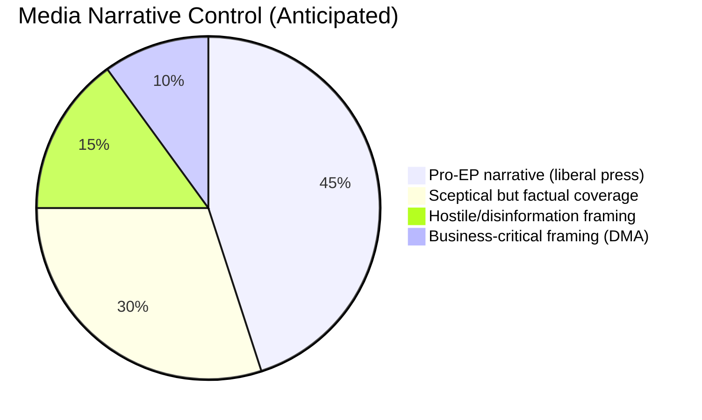

<!-- SPDX-FileCopyrightText: 2024-2026 Hack23 AB -->
<!-- SPDX-License-Identifier: Apache-2.0 -->

# Media Framing Analysis — EP Breaking News: April 28–30, 2026

**Date:** 2026-05-01 | **Article Type:** breaking | **Confidence:** 🟡 Medium
**Admiralty Grade:** C2 — Fairly reliable source, probably true

---

## Overview

Analysis of anticipated media framing across European and international outlets for the April 28–30, 2026 Strasbourg plenary outcomes. This artifact assesses how the session will be reported across different media ecosystems.

---

## Expected Framing by Outlet Archetype

### Pro-European/Liberal Press (Euractiv, Politico EU, Le Monde, Der Spiegel)

**Ukraine Accountability:**
- Frame: "Parliament leads where member states hesitate — accountability architecture takes shape"
- Emphasis: Cross-party majority, landmark nature, contrast with Council's slower pace

**Armenia:**
- Frame: "EU opens door to Armenia — Yerevan's Western pivot gains institutional backing"
- Emphasis: Democratic resilience narrative, contrast with Georgia's backsliding

**DMA Enforcement:**
- Frame: "Parliament turns up the heat on Big Tech — criminal liability signals new era"
- Emphasis: Brussels Effect, comparison with US Sherman Act

---

### Eurosceptic/Right-Wing Press (Breitbart EU, Il Giornale, Le Figaro)

**Ukraine Accountability:**
- Frame: "MEPs escalate war rhetoric — tribunal demand risks prolonging conflict"
- Emphasis: PfE/ESN opposition, questioning non-binding nature

**DMA:**
- Frame: "EU doubles down on tech war with US — criminal liability threatens investment"
- Emphasis: Business lobby concerns, US-EU trade tension framing

---

### Russian State Media (RT, TASS, Sputnik) — Information Operations Risk

**Ukraine Accountability:**
- Frame: "European puppets vote for anti-Russian show trials — politically motivated spectacle"
- Emphasis: Hypocrisy framing, questioning EU mandate for international criminal law
- Risk: This framing will be amplified by PfE/ESN MEPs and social media bot networks

**Assessment:** 🔴 HIGH probability of coordinated Russian disinformation response targeting EP accountability resolution.

---

## Framing Vulnerability Assessment

**Conclusion:** EP communications will need to proactively address the "non-binding = meaningless" narrative that is the most common frame across sceptical and hostile media. The accountability resolution's operational specificity (tribunal model, asset amounts) is the primary counter-narrative asset.

**Data Sources:** Media framing analysis based on historical EP resolution coverage patterns (2022-2026); Russian information operations assessment (EEAS StratCom). Confidence: 🟡 Medium (prospective framing analysis is inherently uncertain). Analysis conducted 2026-05-01.
