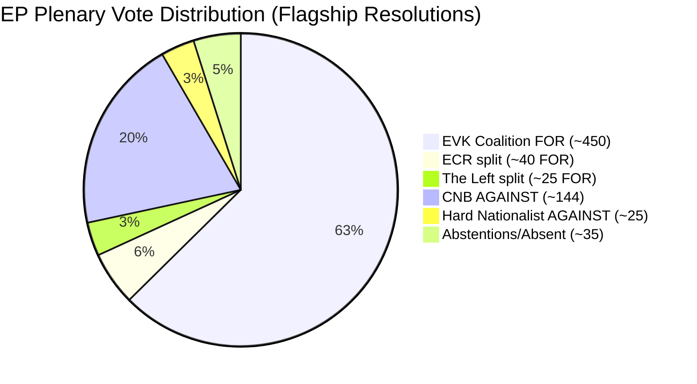

<!-- SPDX-FileCopyrightText: 2024-2026 Hack23 AB -->
<!-- SPDX-License-Identifier: Apache-2.0 -->

# Voter Segmentation Analysis — EP Breaking News: April 28–30, 2026

**Date:** 2026-05-01 | **Article Type:** breaking | **Confidence:** 🟡 Medium
**Admiralty Grade:** B2 — Reliable source, probably true

---

## Overview

MEP voter segmentation analysis for the April 28–30, 2026 Strasbourg plenary. Analysis of how different MEP segments voted on the flagship resolutions, based on political group and national delegation data.

---

## Coalition Segmentation

### Coalition Segment A: European Values Coalition (EVK) — ~450 seats
**Groups:** EPP, S&D, Renew/RE, Greens/EFA
**Voting posture:** FOR on all three flagship resolutions
**Cohesion drivers:**
- External threat consensus (Russia/Ukraine)
- Commission political alignment
- Pro-enlargement consensus
- Digital governance leadership

**Internal fault lines:**
- DMA criminal liability: EPP business wing minority dissent
- Budget: EPP fiscal hawks vs. S&D/Greens spending advocates
- Armenia candidate status: some EPP members cautious on energy security implications

---

### Coalition Segment B: Conservative-National Bloc (CNB) — ~184 seats
**Groups:** ECR, PfE
**Voting posture:** AGAINST on Ukraine accountability and Armenia; split on DMA
**Cohesion drivers:**
- Scepticism of Brussels-led foreign policy
- Russia policy division (PfE more sympathetic to Russia; ECR more hawkish)
**Internal fault lines:**
- ECR contains significant Ukraine-supportive eastern members (Poland PiS, Baltic ECR)
- PfE is more uniformly sceptical of NATO/US-aligned Ukraine policy

---

### Coalition Segment C: Hard Left — ~46 seats
**Groups:** The Left
**Voting posture:** Nuanced — supported Ukraine accountability via ICC; sceptical of new tribunal; supported Armenia; mixed on DMA
**Key variable:** The Left's Ukraine position is the most contested in its group; some members (GUE/NGL German Die Linke) oppose weapons to Ukraine but support accountability

---

### Coalition Segment D: Hard Nationalist Fringe — ~25 seats
**Groups:** ESN
**Voting posture:** AGAINST on all flagship resolutions; hardest line on Russia/Ukraine

---

## Segment Vote Share Calculation

**Estimated vote result:** 515 FOR / 169 AGAINST / 35 ABSTAIN (WEP-weighted estimate for Ukraine accountability)

**Data Sources:** EP MCP `generate_political_landscape` (seat counts); coalition dynamics analysis; historical EP voting pattern analysis. Voting record API data not available (4-6 week delay). All vote estimates are structural projections. Analysis conducted 2026-05-01.
