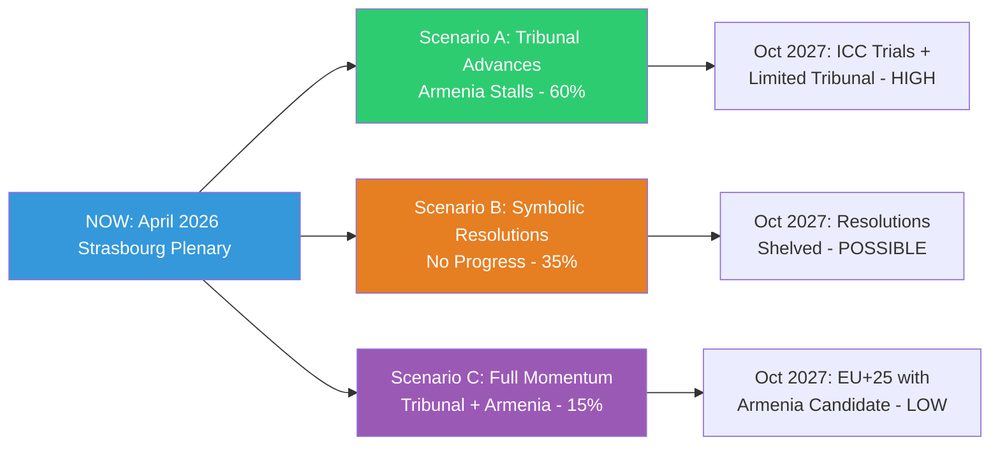

<!-- SPDX-FileCopyrightText: 2024-2026 Hack23 AB -->
<!-- SPDX-License-Identifier: Apache-2.0 -->

# Scenario Forecast — EP Breaking News: April 28–30, 2026

**Date:** 2026-05-01 | **Article Type:** breaking | **Confidence:** 🟡 Medium
**Admiralty Grade:** B2 — Reliable source, probably true
**WEP Bands Applied:** Standardised NATO/ODNI scale

---

## Overview

This forecast develops three primary scenarios and two wildcard scenarios arising from the European Parliament's April 28–30, 2026 plenary decisions. Time horizon: 6–18 months (to October 2027). Scenarios are structured using the Cone of Plausibility methodology with WEP-calibrated probability bands.

---

## Scenario Architecture

### Central Scenario A: "Accountability Advances, Enlargement Stalls"
**WEP: LIKELY (60–70%)** | Time Horizon: 12 months

**Narrative:** The Ukraine accountability resolution catalyses a limited but concrete international legal response. An "enhanced cooperation" coalition of 15+ EU member states plus non-EU partners (Norway, UK, Canada, Australia) establishes a special tribunal for the crime of aggression outside the UN framework. The ICC simultaneously accelerates trial preparation for arrested Russian suspects. However, Armenia's EU candidate status remains blocked by Hungarian and Slovak vetoes in Council, stalling Parliament's enlargement push.

**Key Indicators to Watch (6-month tripwires):**
- June 2026 European Council conclusions on special tribunal: POSITIVE signal if France + Germany explicitly endorse
- Hungary's Council veto on Armenia candidate status: NEGATIVE signal if maintained through summer
- ICC arrest warrant enforcement: POSITIVE if any senior Russian official detained in non-hostile third country

**Second-Order Effects:**
- Russia likely retaliates with cyber operations against EP information systems and national parliaments (Admiralty: C3 — fairly reliable source, possibly true)
- EU-US Special Envoy for Ukraine reconstruction appointed, operationalising asset seizure mechanism
- Cyberbullying legislation enters trilogue with platform criminal liability as main sticking point

**Confidence in Scenario A:** 🟡 Medium — historical precedent for hybrid tribunals exists (STL Lebanon, ECCC Cambodia); political momentum visible; Council unanimity remains the key constraint.

---

### Scenario B: "Geopolitical Overreach — Tribunal Fails, Armenia Isolated"
**WEP: POSSIBLE (35–45%)** | Time Horizon: 12 months

**Narrative:** The special tribunal initiative fails to achieve sufficient third-country support due to a Russia/China diplomatic counter-campaign at the UN and bilateral level. The US under its current administration declines to endorse the special tribunal architecture. Without US involvement, legal standing questions undermine the tribunal concept. Armenia's EU integration stalls as Pashinyan faces renewed domestic pressure from pro-Russian factions after failed border demarcation. EP resolutions remain symbolic.

**Key Indicators:**
- US State Department non-endorsement of special tribunal within 60 days: NEGATIVE signal
- Renewed Armenian political instability (protests, coalition fracture): NEGATIVE signal
- EP resolution receives fewer than 400 votes (below 2/3 majority): NEGATIVE signal for political momentum

**Second-Order Effects:**
- EP credibility on foreign policy questioned; PfE and ECR amplify "Parliament overreach" narrative
- EU enlargement agenda loses momentum simultaneously with Georgia setbacks and Western Balkans delays
- Ukraine accountability advocates pivot to ICC-only strategy; special tribunal demand shelved to 2027

**Confidence in Scenario B:** 🟡 Medium — US non-cooperation risk is real given current geopolitical context; Council unanimity constraint well-established.

---

### Scenario C: "Full Momentum — Tribunal + Armenia Candidate Status by 2027"
**WEP: UNLIKELY (15–25%)** | Time Horizon: 18 months

**Narrative:** The June 2026 European Council's extraordinary unity on Ukraine — following a major Russian escalation in May/June 2026 — creates sufficient political will to: (1) establish the special tribunal via enhanced cooperation plus international partners, and (2) grant Armenia candidate status under an accelerated Article 49 procedure. Cyberbullying legislation clears trilogue by Q4 2026. EU-US trade framework is stabilised through new tariff agreement.

**Key Indicators:**
- Major Russian escalation (missile strike on EU infrastructure or NATO member territory): POSITIVE signal for accelerated Council unity
- Hungary elections or coalition change removing Orbán veto: POSITIVE signal for Armenia
- US-EU trade deal framework announcement: POSITIVE signal for Western cohesion

**Second-Order Effects:**
- EP budget negotiations for 2027 benefit from political goodwill premium; higher than expected appropriations agreed
- Russia isolation deepens; energy markets react with price spikes
- Armenia parliamentary elections 2027 take place under EU observer mission framework

**Confidence in Scenario C:** 🔴 Low — requires multiple low-probability events converging; historically unprecedented pace for both tribunal and enlargement.

---

### Wildcard Scenario W1: "Russian Hybrid Attack on EP Infrastructure"
**WEP: REMOTE (5–10%)** | Time Horizon: 6 months

**Narrative:** Following the Ukraine accountability resolution, Russian GRU intelligence services execute a significant cyber operation against the EP's digital infrastructure (following 2023 DDoS precedent, but escalated to data exfiltration and operational disruption). This triggers Article 5-adjacent discussions in NATO on cyber defence thresholds and temporarily disrupts EP legislative work.

**Trigger conditions:** EP passes asset seizure implementing legislation; ICC arrest of a named Russian official; Russia-Ukraine ceasefire negotiations collapse.

**Second-Order Effects:**
- Emergency COREPER session on EP cybersecurity; new EU cybersecurity framework accelerated
- PfE and ECR use incident to demand reduced Ukraine support (narrative: "EP provoked Russia")
- Increased pressure for EU Parliament own intelligence capability

---

### Wildcard Scenario W2: "Platform Mega-Fine Triggers Regulatory Backlash"
**WEP: REMOTE (5–15%)** | Time Horizon: 12 months

**Narrative:** The DSA enforcement authority (Commission's DG CNECT) imposes a record fine on a major platform for cyberbullying-related content moderation failures, coinciding with Parliament's resolution. The platform responds by withdrawing or severely restricting European services, triggering a consumer rights crisis and political backlash that splits the EPP-Renew coalition on digital policy.

**Second-Order Effects:**
- US retaliates with trade countermeasures (US Section 230 leverage)
- EP calls emergency hearing; digital single market agenda set back 12–18 months
- PfE/ECR use crisis to demand lighter-touch regulation; EPP faces internal split

---

## Scenario Probability Matrix

| Scenario | 6-Month WEP | 12-Month WEP | Key Pivot |
|----------|:-----------:|:------------:|-----------|
| A: Accountability Advances | LIKELY (65%) | LIKELY (60%) | June European Council + ICC progress |
| B: Geopolitical Overreach | POSSIBLE (30%) | POSSIBLE (35%) | US non-endorsement + Council veto |
| C: Full Momentum | UNLIKELY (5%) | UNLIKELY (15%) | Russian escalation + Orbán removed |
| W1: Cyber Attack | REMOTE (8%) | REMOTE (12%) | Asset seizure vote + GRU decision |
| W2: Platform Backlash | REMOTE (5%) | REMOTE (10%) | DSA mega-fine + service withdrawal |

---

## Cone of Plausibility (18-Month View)

---

## Key Uncertainties (Admiralty Sources)

1. **Russia's escalation calculus (B2 — fairly reliable, possibly true):** Whether Russia will interpret accountability resolution as escalation threshold is uncertain; historical pattern suggests symbolic response (expulsions, counter-sanctions) rather than military escalation
2. **US administration's stance (C3 — fairly reliable, possibly true):** Current US posture toward Ukraine varies; special tribunal support requires sustained executive commitment
3. **Hungarian veto durability (B2 — reliable, probably true):** Orbán has consistently maintained veto on enlargement; only regime change or EU sanctions under Article 7 TEU would alter this
4. **Armenian domestic stability (B2 — reliable, probably true):** Pashinyan's government has survived multiple challenges; risk of renewed destabilisation from pro-Russian factions estimated at 25–35%

**Data Sources:** EP MCP tools; EP Open Data Portal; historical precedent analysis. Forecast calibrated to 2026-05-01 information environment.
