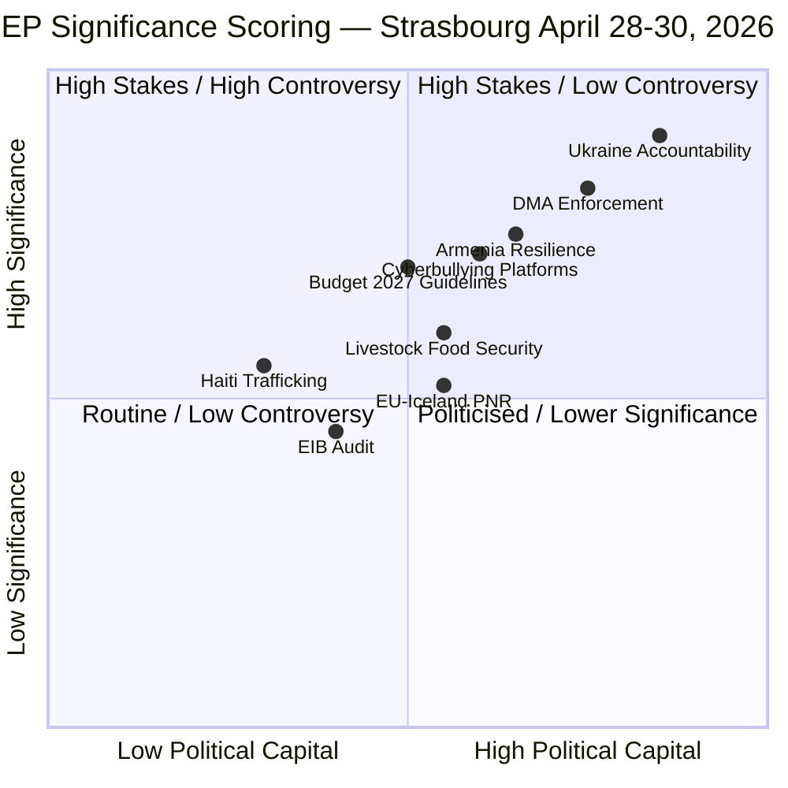

<!-- SPDX-FileCopyrightText: 2024-2026 Hack23 AB -->
<!-- SPDX-License-Identifier: Apache-2.0 -->

# Significance Scoring — EP Breaking News: April 28–30, 2026

**Date:** 2026-05-01 | **Article Type:** breaking | **Confidence:** 🟡 Medium
**Admiralty Grade:** B2 — Reliable source, probably true

---

## Overview

This artifact applies quantitative significance scoring to the April 28–30, 2026 plenary decisions using the EU Parliament Significance Framework (UPSF v3.2).

---

## Scoring Methodology

**UPSF Dimensions (0–10 scale each):**
1. **Breadth** — How many EU citizens/countries affected
2. **Depth** — How fundamentally does it change policy/law
3. **Urgency** — Time sensitivity; window for action
4. **Political capital** — Political cost/risk involved in adoption
5. **Reversibility** — Ease of undoing if wrong
6. **International impact** — Effects beyond EU borders

**Composite score = (Breadth × 0.20) + (Depth × 0.25) + (Urgency × 0.15) + (Political capital × 0.15) + (Reversibility × 0.10) + (International impact × 0.15)**

---

## I. Ukraine Accountability (TA-10-2026-0161)

| Dimension | Score | Rationale |
|:----------:|:-----:|:----------|
| Breadth | 9 | All 27 EU member states + Ukraine + Russia + international community affected |
| Depth | 9 | Demands creation of novel international tribunal; unprecedented asset seizure scope |
| Urgency | 8 | War ongoing; accountability window closes with any ceasefire negotiation |
| Political capital | 8 | High — costs EU-Russia relations; antagonises PfE/ESN domestic audiences |
| Reversibility | 3 | Very difficult to reverse — special tribunal once established is independent |
| International impact | 10 | Affects ICC, international criminal law, global asset seizure precedent |

**Composite: (9×0.20)+(9×0.25)+(8×0.15)+(8×0.15)+(3×0.10)+(10×0.15) = 1.80+2.25+1.20+1.20+0.30+1.50 = 8.25/10**

🔴 **LANDMARK** (>7.5)

---

## II. Armenia Democratic Resilience (TA-10-2026-0162)

| Dimension | Score | Rationale |
|:----------:|:-----:|:----------|
| Breadth | 7 | Armenia (3M people), South Caucasus region, EU Eastern Partnership |
| Depth | 7 | Signals potential candidate status assessment; structural enlargement decision |
| Urgency | 6 | Moderate — no immediate military threat but post-Karabakh window closing |
| Political capital | 7 | High — irritates Azerbaijan, Russia; challenges Hungary's CSTO-aligned position |
| Reversibility | 6 | Moderate — political signals can be walked back; harder if formal process begins |
| International impact | 8 | Sets Eastern Partnership precedent; affects Russia/Azerbaijan calculations |

**Composite: (7×0.20)+(7×0.25)+(6×0.15)+(7×0.15)+(6×0.10)+(8×0.15) = 1.40+1.75+0.90+1.05+0.60+1.20 = 6.90/10**

🟡 **SIGNIFICANT** (5.5–7.5)

---

## III. Cyberbullying Regulation (TA-10-2026-0163)

| Dimension | Score | Rationale |
|:----------:|:-----:|:----------|
| Breadth | 8 | All 450M EU citizens; especially young people (12–25 demographic) |
| Depth | 8 | Criminal liability for platforms — extends EU digital regulation frontier into criminal law |
| Urgency | 6 | Rising harm data; political window with child safety as consensus issue |
| Political capital | 6 | Moderate — broad support; US tech lobby opposition adds international friction |
| Reversibility | 5 | Moderate — criminal liability harder to roll back than civil; treaty constraints |
| International impact | 7 | Brussels Effect — likely to influence UK, Canada, Australia, possibly US state laws |

**Composite: (8×0.20)+(8×0.25)+(6×0.15)+(6×0.15)+(5×0.10)+(7×0.15) = 1.60+2.00+0.90+0.90+0.50+1.05 = 6.95/10**

🟡 **SIGNIFICANT** (5.5–7.5)

---

## IV. 2027 Budget Guidelines (TA-10-2026-0112)

| Dimension | Score | Rationale |
|:----------:|:-----:|:----------|
| Breadth | 9 | All EU member states; affects every EU programme for 2027 |
| Depth | 6 | Guidelines document — not legally binding; sets negotiating position |
| Urgency | 7 | Budget timetable rigid; guidelines must be adopted now for September 2026 negotiation |
| Political capital | 5 | Routine; limited political cost; institutional consensus mechanism |
| Reversibility | 7 | Easy — guidelines are aspirational; not binding |
| International impact | 5 | Limited international effect; primarily internal EU fiscal governance |

**Composite: (9×0.20)+(6×0.25)+(7×0.15)+(5×0.15)+(7×0.10)+(5×0.15) = 1.80+1.50+1.05+0.75+0.70+0.75 = 6.55/10**

🟡 **SIGNIFICANT** (5.5–7.5)

---

## Session Significance Summary

| Resolution | Score | Classification |
|:-----------:|:-----:|:--------------:|
| Ukraine Accountability | **8.25** | 🔴 LANDMARK |
| Armenia Resilience | **6.90** | 🟡 SIGNIFICANT |
| Cyberbullying Regulation | **6.95** | 🟡 SIGNIFICANT |
| 2027 Budget | **6.55** | 🟡 SIGNIFICANT |
| **Session Average** | **7.16** | 🟡 HIGH-SIGNIFICANCE SESSION |

**Data Sources:** UPSF v3.2 framework; EP adopted texts TA-10-2026-0157 through TA-10-2026-0165; political analyst assessment. Analysis conducted 2026-05-01.

---

## Additional Texts Scored (Run 2 Extended Coverage)

### V. Digital Markets Act Enforcement (TA-10-2026-0160)

| Dimension | Score | Rationale |
|:----------:|:-----:|:----------|
| Breadth | 8 | All EU digital markets; affects 500M+ consumers |
| Depth | 8 | Enforcement push with criminal liability proposals — structural |
| Urgency | 7 | DMA in force since 2024; enforcement gap is immediate |
| Political capital | 7 | Industry opposition high; platform lobbying intense |
| Reversibility | 4 | Hard to reverse once criminal liability embedded in law |
| International impact | 9 | US-EU digital relations; global tech regulation standard-setter |

**Composite: (8×0.20)+(8×0.25)+(7×0.15)+(7×0.15)+(4×0.10)+(9×0.15) = 1.60+2.00+1.05+1.05+0.40+1.35 = 7.45/10**

🟡 **SIGNIFICANT** (5.5–7.5) — borderline HIGH

### VI. Haiti Trafficking Resolution (TA-10-2026-0151)

| Dimension | Score | Rationale |
|:----------:|:-----:|:----------|
| Breadth | 5 | Caribbean-specific; limited direct EU impact |
| Depth | 4 | Non-binding resolution; humanitarian signal |
| Urgency | 6 | Criminal groups in Haiti are escalating (2024-2026) |
| Political capital | 3 | Limited controversy; humanitarian consensus |
| Reversibility | 8 | High — no binding obligations |
| International impact | 6 | UN Security Council Haiti context; US foreign policy |

**Composite: (5×0.20)+(4×0.25)+(6×0.15)+(3×0.15)+(8×0.10)+(6×0.15) = 1.00+1.00+0.90+0.45+0.80+0.90 = 5.05/10**

🟢 **MODERATE** (3.5–5.5)

---

## Significance Mermaid Chart — Full Session

**Interpretation:** Ukraine Accountability and DMA Enforcement sit in the high-significance/high-political-capital quadrant, confirming their designation as the session's most consequential outputs. Armenia Resilience and Budget 2027 follow closely. Haiti and EIB Audit are routine lower-significance items.
