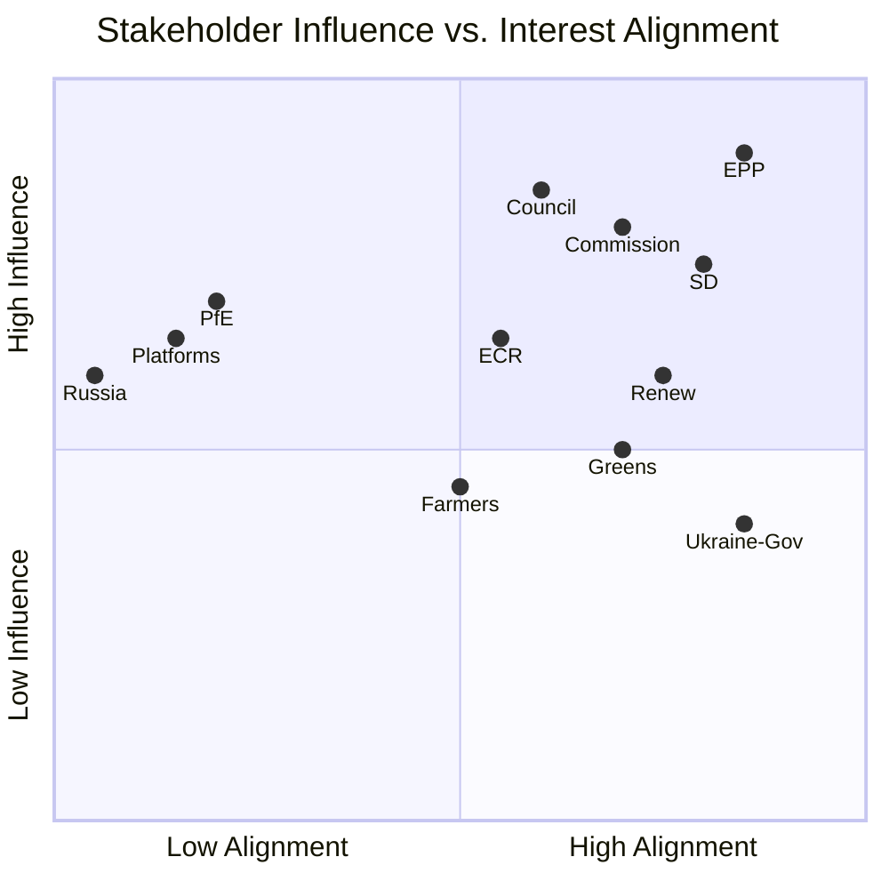

<!-- SPDX-FileCopyrightText: 2024-2026 Hack23 AB -->
<!-- SPDX-License-Identifier: Apache-2.0 -->

# Stakeholder Map — EP Breaking News: April 28–30, 2026

**Date:** 2026-05-01 | **Article Type:** breaking | **Confidence:** 🟢 High
**Admiralty Grade:** B2 — Reliable source, probably true

---

## Overview

This stakeholder map identifies and analyses the key actors involved in or affected by the European Parliament's April 28–30, 2026 Strasbourg plenary decisions. Primary focus on the Ukraine accountability resolution, Armenia democratic resilience package, cyberbullying legislation, and 2027 budget framework.

---

## Actor Roster

### Tier 1 — Primary Legislative Actors

**European People's Party (EPP) — 185 seats / 25.73%**
- **Role:** Dominant coalition anchor; principal sponsor of Ukraine accountability resolution
- **Interests:** Maintain Western security consensus, ensure rule-of-law conditionality in all EP actions, shape MFF 2027 framework to favour economic modernisation over welfare transfers
- **Power:** Floor majority anchor; Committee chair dominance (AFET, BUDG, ECON); President Metsola (EPP)
- **Position (Ukraine):** Strongly pro-accountability, supports ICC and special tribunal; demands continued military aid
- **Position (Armenia):** Supports candidate status assessment with Copenhagen criteria conditions
- **Position (Budget 2027):** Seeks defence flexibility and strategic investment increases
- **Vulnerability:** Internal tensions between fiscal hawks (Germany, Netherlands MEPs) and spenders (Southern/Eastern Europe MEPs)
- **WEP:** HIGHLY LIKELY (85%) to continue leading Ukraine accountability agenda in June European Council

**Progressive Alliance of Socialists and Democrats (S&D) — 135 seats / 18.78%**
- **Role:** Second pillar of pro-Ukraine majority; social policy agenda champion
- **Interests:** Labour rights in reconstruction contracts, humanitarian accountability, platform regulation for consumer protection
- **Power:** Co-defines simple majority with EPP; strong LIBE committee presence
- **Position (Ukraine):** Co-sponsors accountability text; emphasises civilian protection and ICC jurisdiction
- **Position (Armenia):** Supports democratic resilience but attaches human rights conditions
- **Position (Cyberbullying):** Key sponsor; demands criminal liability for platforms
- **Vulnerability:** Internal divisions on asset seizure legality between legal pragmatists and hawks
- **WEP:** LIKELY (65%) to push for stronger platform criminal liability in trilogues

**Renew Europe — 77 seats / 10.71%**
- **Role:** Liberal anchor; essential for qualified majority
- **Interests:** Rule of law, digital single market, pro-enlargement, transatlantic trade normalisation
- **Power:** Balancing force between EPP and S&D; liberal veto player on judicial independence
- **Position (Ukraine):** Strongly supports accountability; champion of asset seizure legal mechanism
- **Position (Armenia):** Most enthusiastic for candidate status; Renew MEPs lead Armenia advocacy
- **Position (Digital):** Cautious on criminal liability; prefers regulatory fines
- **Vulnerability:** Declining electoral support in France and Germany reduces negotiating leverage
- **WEP:** LIKELY (60%) to negotiate compromise on platform criminal vs. civil liability

**Greens/EFA — 53 seats / 7.37%**
- **Role:** Environmental and civil liberties conscience; progressive wing of pro-Ukraine majority
- **Interests:** Climate conditionality in reconstruction; Green Deal protection; digital rights
- **Power:** Decisive in close votes; provides progressive framing for EPP positions
- **Position (Ukraine):** Supports accountability; demands environmental war crimes recognition
- **Position (Livestock):** Opposes rollback of Green Deal livestock timelines; seeks scientific transition plan
- **Position (Digital):** Supports cyberbullying legislation with strong privacy safeguards
- **Vulnerability:** Post-2024 election decline reduced group from 72 to 53 seats; risk of further attrition
- **WEP:** POSSIBLE (45%) to block livestock resolution if environmental provisions are stripped

**Patriots for Europe (PfE) — 85 seats / 11.82%**
- **Role:** Right-wing nationalist opposition; largest eurosceptic group
- **Interests:** National sovereignty, anti-migration, sceptical of Ukraine aid scale
- **Power:** 85 seats gives blocking minority on specific procedural votes; can delay in committees
- **Position (Ukraine):** Divided; Hungarian faction opposes accountability text; Italian and French factions abstain/split
- **Position (Armenia):** Sceptical; sees enlargement as EU overreach
- **Position (Budget):** Demands agricultural spending protection at expense of structural funds
- **Vulnerability:** Internal divisions between Viktor Orbán-aligned members and other nationals
- **WEP:** LIKELY (65%) to vote against Ukraine tribunal demand; POSSIBLE (40%) to fragment on Armenia

**European Conservatives and Reformists (ECR) — 81 seats / 11.27%**
- **Role:** Conservative-eurosceptic second opposition pillar
- **Interests:** NATO-aligned defence (unlike PfE); anti-federalism; strong on Ukraine in foreign policy
- **Power:** Paradoxically more pro-Ukraine than PfE; potential swing vote on security issues
- **Position (Ukraine):** Strongly pro-accountability; ECR MEPs from Poland and Baltic states are vocal Ukraine advocates
- **Position (Armenia):** Cautious; sceptical of enlargement without strict criteria
- **Position (Digital):** Light-touch regulation preferred; opposes criminal liability for platforms
- **Vulnerability:** Ideological tension between NATO hawks and social conservatives on digital/AI rights
- **WEP:** HIGHLY LIKELY (80%) to support Ukraine accountability; LIKELY (65%) to oppose platform criminal liability

**The Left (GUE/NGL) — 46 seats / 6.40%**
- **Role:** Anti-war, but different from PfE; critical of NATO militarism, pro-civilian accountability
- **Interests:** Anti-militarism, social rights, digital rights, anti-austerity
- **Power:** Provides progressive framing alternative; decisive in close social votes
- **Position (Ukraine):** Supports civilian accountability and ICC; opposes asset seizure as "economic warfare"
- **Position (Armenia):** Cautious; historically closer to Russia on Caucasus
- **Position (Digital):** Supports cyberbullying provisions with strong privacy rider
- **Vulnerability:** Internally divided between Moscow-critical (Nordic Left) and more ambivalent factions
- **WEP:** POSSIBLE (45%) to abstain on Ukraine asset seizure; LIKELY (65%) to support cyberbullying

---

### Tier 2 — Institutional Actors

**European Commission (EC)**
- **Role:** Policy proposer and executor; positioned between Parliament's demands and Council's constraints
- **Interests:** MFF 2027 negotiations; Ukraine facility continuation; digital regulation coherence
- **Position:** EC supports special tribunal concept but prefers negotiated UN-framework approach; backs cyberbullying regulatory approach
- **Power:** Sole legislative initiative in most policy areas; controls information flow on budget
- **WEP:** LIKELY (60%) to propose special tribunal treaty within 6 months of resolution

**Council of the EU (Member State Governments)**
- **Role:** Co-legislator; ultimate decision-maker on treaty-basis actions
- **Interests:** Unanimous consent required for foreign policy; agriculture policy through qualified majority
- **Position (Ukraine):** Divided — frontline states (Poland, Baltics, Finland) strongly support tribunal; Hungary, Austria, Slovakia resistance
- **Position (Armenia):** Council consensus on resilience; enlargement requires unanimity (major obstacle)
- **Power:** Veto on treaty change; qualified majority blocks Agriculture legislation
- **WEP:** POSSIBLE (40%) to advance special tribunal by end 2026; UNLIKELY (20%) to grant Armenia candidate status in 2026

**President Roberta Metsola (EPP, Malta)**
- **Role:** Parliament's institutional voice; facilitator of cross-party consensus
- **Interests:** EP institutional authority, rule of law, EP-US relations
- **Position:** Active personal advocate for Ukraine accountability; hosted Ukrainian officials multiple times in 2026
- **Power:** Sets plenary agenda; chairs Conference of Presidents; represents EP externally
- **WEP:** HIGHLY LIKELY (85%) to pursue Ukraine accountability at June G7 and European Council

---

### Tier 3 — External Stakeholders

**Ukraine (Zelensky Government)**
- **Interests:** Political validation of accountability demands; continued military and financial support; reconstruction framework
- **Reception of Resolution:** EP resolution seen as politically essential; Ukraine has been lobbying for special tribunal since 2022
- **Expected Response:** Presidential statement welcoming EP decision; diplomatic pressure on Council to follow

**Armenia (Pashinyan Government)**
- **Interests:** EU candidate status; security guarantees post-CSTO; normalization with Azerbaijan under EU mediation
- **Reception:** Yerevan will use EP resolution in domestic political discourse; strengthens Pashinyan's reform narrative
- **Expected Response:** Formal note of appreciation; request for accelerated Association Agreement upgrading

**Russian Federation**
- **Interests:** Counter EP's accountability narrative; exploit EU divisions; pressure Hungary and Slovakia
- **Reception:** Official denial of all EP allegations; escalatory information operations expected
- **Expected Response:** Threats of reciprocal asset seizure; diplomatic expulsions in member states; cyber operations against EP institutions (intelligence assessment)

**Digital Platforms (Meta, TikTok, Google/YouTube, X)**
- **Interests:** Limit criminal liability expansion; maintain algorithmic transparency carve-outs; US Section 230 leverage
- **Reception:** Cyberbullying resolution seen as escalation of DSA framework
- **Expected Response:** Intensive lobbying in trilogue process; legal challenges if criminal liability provisions advance; possible compliance pledges to deflect legislation

**EU Farming Organisations (Copa-Cogeca, Farmers' Associations)**
- **Interests:** Agricultural subsidies protection, Green Deal flexibility, ASF/HPAI containment funding
- **Reception:** Mixed; livestock resolution seen as partial victory but demands go further than Commission proposals
- **Expected Response:** Mobilisation for October CAP/MFF review negotiations; continued farm protest threat

---

## Influence Matrix

---

## Alliance Structure

**Core Pro-Ukraine Accountability Alliance:**
EPP + S&D + Renew + ECR (Baltic/Polish wing) = ~450 seats
→ Geopolitical coalition; stable for Ukraine votes; fragile on budget

**Progressive Social Coalition:**
S&D + Greens/EFA + The Left = ~234 seats
→ Leads cyberbullying and digital rights; below majority threshold alone

**Eurosceptic Opposition Bloc:**
PfE + ECR (Southern wing) + ESN + NI = ~195 seats
→ Can obstruct non-binding resolutions; cannot block legislative acts
→ Agricultural interests create tactical overlap with EPP rural MEPs

---

## Power Broker Identification

1. **EPP** — The indispensable actor across all four major breaking topics
2. **Council of the EU (Hungary + Slovakia)** — Blocking minority threat on Ukraine tribunal and Armenia enlargement
3. **European Commission** — Controls pace of legal proposal development for tribunal and cyberbullying
4. **Renew Europe** — Swing vote on cyberbullying criminal liability; decisive on Armenia candidate status

---

## Information Environment Assessment

**Strategic Communications Dynamics:**
- Russia conducting active disinformation campaign around EP Ukraine accountability debate
- Digital platforms deploying lobbyists targeting Renew and ECR MEPs on cyberbullying criminal liability
- Armenian government information operation in Brussels amplifying EP resolution across European media
- Agricultural lobby (Copa-Cogeca) deploying framing of "food security emergency" to moderate Green Deal livestock provisions

**Narrative Competition:**
- Ukraine: "Accountability = deterrence" (EP dominant frame) vs. "Negotiations first" (minority PfE/The Left frame)
- Digital: "Platforms as publishers" (S&D/Greens) vs. "Platforms as conduits" (PfE/ECR/platforms themselves)
- Agriculture: "Green Deal vs. food security" (livestock sector) vs. "Just transition" (Greens/EFA)

**Data Sources:** EP MCP `generate_political_landscape`, `analyze_coalition_dynamics`, `early_warning_system`; EP Open Data Portal MEP and group data. Analysis 2026-05-01.
