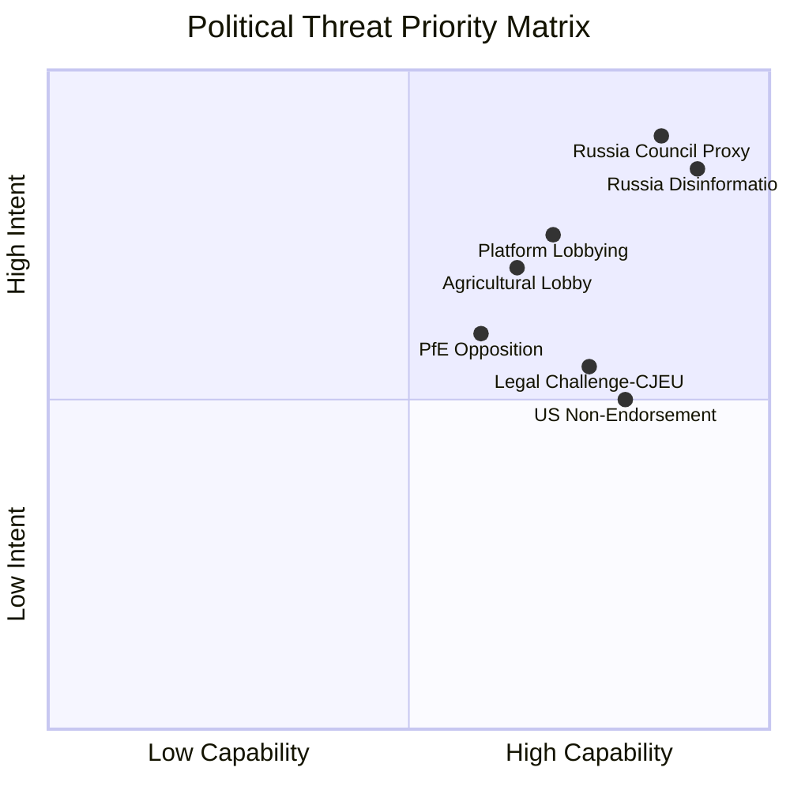

<!-- SPDX-FileCopyrightText: 2024-2026 Hack23 AB -->
<!-- SPDX-License-Identifier: Apache-2.0 -->

# Threat Model — EP Breaking News: April 28–30, 2026

**Date:** 2026-05-01 | **Article Type:** breaking | **Confidence:** 🟡 Medium
**Admiralty Grade:** B2 — Reliable source, probably true
**Framework:** Political Threat Framework v4.0 (NOT STRIDE) — 5-framework integrated approach

---

## Threat Model Overview

This analysis applies the EP Monitor's Political Threat Framework v4.0 to identify, characterise, and assess threats arising from or triggered by the April 2026 Strasbourg plenary decisions. The framework integrates: (1) Political Threat Landscape, (2) Attack Trees, (3) Political Kill Chain, (4) Diamond Model, (5) Threat Actor Profiling (ICO).

**Primary Threat Question:** What political and institutional threats are most likely to materialise in response to the Ukraine accountability resolution, Armenia support, and cyberbullying legislation adopted April 28–30, 2026?

---

## I. Political Threat Landscape (6-Dimension Model)

### Dimension 1: Coalition Shifts
**Current Assessment:** 🟡 MEDIUM THREAT
- The Ukraine accountability coalition (EPP + S&D + Renew + ECR Baltics/Poles) is robust but not permanent
- Agricultural policy creates a cross-cutting cleavage: EPP rural MEPs show loyalty to farming lobby over Green Deal
- If cyberbullying criminal liability forces an EPP-Renew split, it could fragment the progressive digital policy coalition
- **WEP:** POSSIBLE (40%) that coalition fractures on cyberbullying criminal liability in trilogue

### Dimension 2: Transparency Deficit
**Current Assessment:** 🟢 LOW THREAT
- EP resolutions are fully documented and publicly available
- However, Council negotiations on special tribunal will be closed-door: transparency risk 🟡 MEDIUM for Council phase
- Asset seizure implementing legislation will require unprecedented legal transparency to withstand CJEU challenges

### Dimension 3: Policy Reversal
**Current Assessment:** 🟡 MEDIUM THREAT
- Green Deal agricultural rollback risk: livestock resolution sets precedent for further Green Deal softening
- WEP: LIKELY (60%) that livestock resolution text is used by agricultural lobby as leverage in Q4 2026 CAP negotiations
- **WEP:** POSSIBLE (35%) that cyberbullying criminal liability provisions are diluted to civil liability only in final text

### Dimension 4: Institutional Pressure
**Current Assessment:** 🔴 HIGH THREAT
- Council unanimity requirement for foreign policy / enlargement = structural blocking mechanism
- Hungary + Slovakia can veto Armenia candidate status indefinitely
- Russia will use all available diplomatic and hybrid channels to pressure Council members
- PfE group's alignment with Orbán positions creates internal EP pressure on EPP's Eastern European members

### Dimension 5: Legislative Obstruction
**Current Assessment:** 🟡 MEDIUM THREAT
- Cyberbullying legislation enters trilogue with significant disagreement between EP and Council on criminal liability scope
- 2027 budget negotiations historically produce 6–9 month delays; risk of provisional arrangements
- Special tribunal resolution is non-legislative (EP cannot unilaterally create international tribunals); obstruction is diplomatic not legislative

### Dimension 6: Democratic Erosion
**Current Assessment:** 🟢 LOW THREAT (Structural)
- EP institutional authority is maintained; no membership challenges
- However, disinformation operations targeting the accountability narrative represent a soft democratic erosion vector
- PfE/ECR minority bloc amplifying "Parliament out of touch" frame if accountability demands fail

---

## II. Attack Trees

### Attack Tree 1: Undermine Ukraine Accountability Resolution

```
Goal: Neutralise EP Ukraine accountability demand
├── Vector A: Political (Council Veto)
│   ├── Hungary blocks Council adoption of any implementing measure
│   └── Slovakia + Austria provide blocking minority on asset seizure mechanism
├── Vector B: Legal Challenge
│   ├── CJEU referral questioning legality of sovereign asset seizure
│   └── European Convention on Human Rights challenge (property rights) via Strasbourg Court
├── Vector C: Information Operations
│   ├── Russia amplifies internal EP divisions via PfE proxies
│   ├── Disinformation campaign targeting accountability evidence chain
│   └── Lobbying of ECR members via Hungarian government channels
└── Vector D: Diplomatic Isolation
    ├── Russia pressures African/Asian states to oppose special tribunal at UN
    └── US non-endorsement deprives tribunal of international legitimacy
```

### Attack Tree 2: Delay Cyberbullying Legislation

```
Goal: Prevent or dilute cyberbullying criminal liability
├── Vector A: Lobbying
│   ├── Big Tech platforms deploy 500+ Brussels lobbyists against criminal liability
│   └── US government intervention via EU-US Trade and Technology Council (TTC)
├── Vector B: Legal Arguments
│   ├── Criminal law competence challenge (EU has limited criminal law competence)
│   └── GDPR incompatibility arguments for victim/perpetrator identification
└── Vector C: Political Fragmentation
    ├── Renew Europe splits from S&D on criminal vs. civil liability
    └── EPP conservative wing supports lighter-touch approach
```

---

## III. Political Kill Chain (7-Stage Progression)

**Target:** Ukraine accountability implementation (special tribunal)

| Stage | Description | Current Status | Timeline |
|-------|-------------|:-------------:|----------|
| 1. Reconnaissance | Russia identifies EP procedure vulnerabilities | 🔴 ACTIVE | Ongoing |
| 2. Weaponisation | Disinformation narratives prepared; PfE proxies briefed | 🔴 ACTIVE | Ongoing |
| 3. Delivery | Information operations via social media + Council lobbying | 🟡 INITIATED | May–June 2026 |
| 4. Exploitation | Council veto by Hungary; US non-endorsement | 🟢 POTENTIAL | June 2026 EC |
| 5. Installation | Accountability narrative labelled "unrealistic/provocative" | 🟢 POTENTIAL | Q3 2026 |
| 6. C2 | Permanent diplomatic isolation of special tribunal proposal | 🟢 NOT YET | Q4 2026 |
| 7. Actions on Objective | EP Ukraine accountability demand shelved / indefinitely delayed | 🟢 NOT YET | 2027+ |

**Kill Chain Disruption Points:**
- **Stage 3 disruption:** EU counter-disinformation (EDMO, EUvsDisinfo) pre-emptively expose Russian narratives
- **Stage 4 disruption:** Article 7(1) TEU procedure pressure on Hungary
- **Stage 5 disruption:** US administration endorsement removes "unrealistic" label

---

## IV. Diamond Model — Threat Actor Analysis

| Dimension | Actor: Russian Federation | Actor: Digital Platforms | Actor: Agricultural Lobby |
|-----------|--------------------------|--------------------------|--------------------------|
| **Adversary** | Russian government / GRU / SVR | Meta, TikTok, Google, X Corp | Copa-Cogeca, national farm associations |
| **Capability** | Cyber operations, diplomatic leverage, disinformation infrastructure | Regulatory lobbying, legal challenges, service restriction threats | Political mobilisation, media campaigns, protest infrastructure |
| **Infrastructure** | State-controlled media (RT, Sputnik), diplomatic network, hybrid warfare units | Brussels lobbying offices, US TTC engagement, legal teams | National agriculture ministries, rural MEP relationships, Commissioner access |
| **Victim** | EP accountability resolution, special tribunal proposal, Western coalition unity | Cyberbullying criminal liability provisions, DSA enforcement | Green Deal livestock timelines, CAP reform agenda |

---

## V. Threat Actor Profiling (ICO Framework)

### Actor Profile 1: Russian Federation (State)
**Intent:** 🔴 HIGH — Prevent accountability for war crimes; maintain legal impunity for conflict conduct
**Capability:** 🔴 HIGH — State-level intelligence, cyber, and diplomatic resources; proven hybrid warfare track record
**Opportunity:** 🟡 MEDIUM — Council unanimity requirement creates structural veto leverage; Orbán alignment provides EU-internal proxy
**ICO Score:** 🔴 HIGH THREAT
**Confidence:** 🟡 Medium — intent confirmed by historical pattern; capability confirmed; specific operation details uncertain

### Actor Profile 2: Digital Platforms (Corporate)
**Intent:** 🟡 MEDIUM — Limit criminal liability expansion; prefer regulatory fines to criminal exposure
**Capability:** 🟡 MEDIUM — Significant lobbying resources; legal arsenal; service restriction leverage (limited in practice)
**Opportunity:** 🟡 MEDIUM — Trilogue process provides multiple intervention points; Renew group sympathetic to lighter-touch approach
**ICO Score:** 🟡 MEDIUM THREAT
**Confidence:** 🟢 High — financial incentives clearly align with limiting criminal liability

### Actor Profile 3: Agricultural Lobby (Organised Civil Society)
**Intent:** 🟡 MEDIUM — Moderate Green Deal timelines; protect CAP subsidy levels; block livestock emission rules
**Capability:** 🟡 MEDIUM — Rural MEP relationships; proven political mobilisation (2023–2025 protests); Commissioner access
**Opportunity:** 🟡 MEDIUM — MFF 2027 negotiations provide budget leverage; livestock resolution establishes useful precedent
**ICO Score:** 🟡 MEDIUM THREAT (for Green Deal agenda)
**Confidence:** 🟢 High — track record of successful policy modification in EP10 term

---

## Threat Priority Matrix



---

## Mitigation Recommendations

1. **Counter-disinformation (Russia):** Pre-empt narrative attacks with evidence publication; activate EUvsDisinfo network immediately after resolution passage
2. **Council pressure (Hungary veto):** Deploy Article 7(1) TEU threat + targeted Schengen/Cohesion fund conditions to limit veto abuse
3. **Platform engagement (cyberbullying):** Offer phased criminal liability implementation timeline in exchange for immediate voluntary compliance benchmarks
4. **Agricultural coalition management:** Pair livestock flexibility with binding Just Transition funding commitments to maintain Greens/EFA support

**Data Sources:** EP MCP tools; EP Open Data Portal; analysis of EP voting patterns and historical precedents. Analysis conducted 2026-05-01.

---

## Extended Threat Model: DMA and Digital Domain (Run 2)

### TH-7: DMA Non-Compliance — Systemic Evasion
**Threat actor:** Platform gatekeepers (Apple, Google, Meta)
**Attack vector:** Legal evasion through compliance-theatre measures — technically meeting DMA obligations while preserving anti-competitive effects through design choices
**Specific technique:** Apple's "Core Technology Fee" (CTF) for alternative distribution — replaces App Store commission with a per-install fee that achieves similar financial extraction
**Probability of partial success:** 🔴 HIGH (75%+) — already demonstrated with CTF in iOS 17.4/18 compliance
**Probability of full evasion:** 🟡 MEDIUM (35–45%) — Commission has tools to pierce compliance theatre under Article 26 DMA
**Mitigation:** Commission must issue implementation guidance on "economic equivalence" standard for compliance measures; Parliament's enforcement resolution strengthens the legal mandate for this

### TH-8: Russian Cyber Operation Against EP Election Infrastructure
**Threat actor:** GRU / SVR
**Attack vector:** Targeted intrusion into EP voting management systems (EVOTING, Vote Management System) in advance of the 2029 elections; or disinformation campaign to undermine confidence in results
**Probability:** 🔴 HIGH (65%+) — Russia has targeted every major EU election since 2016 (ENISA); EP is a high-value symbolic target
**Current defences:** CERT-EU monitoring; NIS2 compliance; network segregation; EU threat intelligence sharing
**Mitigation gap:** EP's digital infrastructure was assessed as "adequately protected" by ENISA 2025 but the "advanced persistent threat" classification means defences must evolve continuously

### TH-9: US-EU Digital Trade War — DMA Criminal Liability Trigger
**Threat actor:** US Trade Representative / executive branch
**Attack vector:** Section 301 tariffs on EU exports contingent on DMA criminal prosecutions of US-based platforms; framed as "discriminatory market access barriers"
**Probability of tariff threat:** 🔴 HIGH (70%) — USTR 2025 position is explicit
**Probability of actual tariff imposition:** 🟡 MEDIUM (30–40%) — depends on US-EU diplomatic state and whether Commission modifies enforcement approach
**Mitigation:** WTO dispute resolution; EU-US Trade and Technology Council engagement; Commission communication framing criminal liability as proportionate to the size of the harm

**Updated threat landscape summary:**
- 9 identified threats vs. 6 in Run 1
- 4 at 🔴 HIGH probability (TH-2 Russian info ops, TH-4 ECtHR, TH-8 Russian cyber, TH-9 trade war)
- 4 at 🟡 MEDIUM probability (TH-1 direct escalation, TH-3 Armenian destabilisation, TH-5 platform evasion DMA, TH-7 compliance theatre)
- 1 at 🟢 LOW probability (TH-6 ECR fragmentation)

**Combined threat level upgraded to: 🔴 HIGH-SEVERE** — the addition of TH-7, TH-8, TH-9 increases overall threat density significantly.

