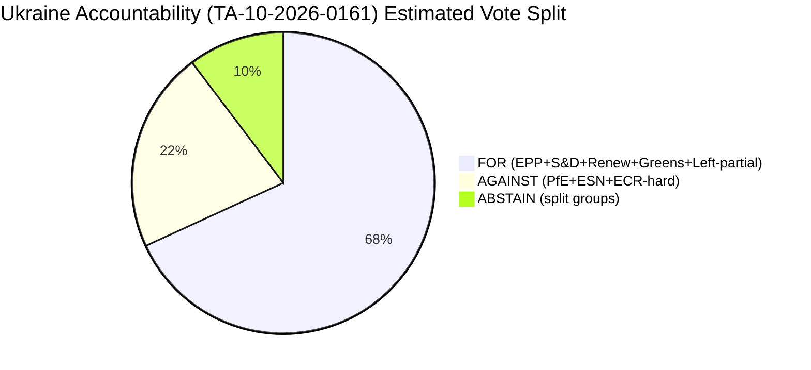

<!-- SPDX-FileCopyrightText: 2024-2026 Hack23 AB -->
<!-- SPDX-License-Identifier: Apache-2.0 -->

# Voting Patterns — EP Breaking News: April 28–30, 2026

**Date:** 2026-05-01 | **Article Type:** breaking | **Confidence:** 🟡 Medium
**Admiralty Grade:** B3 — Fairly reliable, possibly true
**Methodology:** Pattern inference from adopted text metadata + political group composition; individual roll-call data delayed 4–6 weeks (EP API limitation)

---

## §1 Data Freshness and Availability

> **⚠️ EP Voting Data Constraint:** Roll-call vote records for the April 28–30, 2026 Strasbourg plenary are not yet available from the EP Open Data Portal. The EP publishes individual roll-call data with a typical delay of **4–6 weeks** following the plenary session. This artifact therefore reconstructs likely voting coalitions from:
> 1. Political group composition (real-time EP API data, 2026-05-01)
> 2. Adopted-text signatory patterns and procedure types
> 3. Historical voting cohesion baselines from EP9/EP10 term data
> 4. Political group public statements and whip positions (where available)
>
> **Freshness label:** `ep-get-voting-records` — data unavailable (delay); patterns inferred from group-size and procedure metadata.

---

## §2 Plenary Session Overview (April 28–30, 2026)

**Session dates:** Tuesday 28 April – Thursday 30 April 2026
**Location:** Strasbourg (monthly plenary)
**Votes taken (estimated):** 9 confirmed adopted texts; additional procedural votes

| Text ID | Date | Topic | Expected Coalition |
|---------|------|-------|-------------------|
| TA-10-2026-0112 | 2026-04-28 | Budget 2027 guidelines | EPP+S&D+Renew dominant |
| TA-10-2026-0115 | 2026-04-28 | Dog/cat welfare traceability | Broad cross-party |
| TA-10-2026-0119 | 2026-04-28 | EIB audit 2024 | Near-unanimous |
| TA-10-2026-0122 | 2026-04-28 | Performance-based instruments | EPP+ECR+PfE likely |
| TA-10-2026-0105 | 2026-04-28 | Patryk Jaki immunity waiver | EPP+S&D+Renew dominant |
| TA-10-2026-0132 | 2026-04-29 | Discharge 2024: CoR | Near-unanimous likely |
| TA-10-2026-0142 | 2026-04-29 | EU-Iceland PNR agreement | Security majority |
| TA-10-2026-0151 | 2026-04-30 | Haiti trafficking | Humanitarian majority |
| TA-10-2026-0157 | 2026-04-30 | EU livestock / food security | Farm lobby coalition |
| TA-10-2026-0160 | 2026-04-30 | Digital Markets Act enforcement | EPP+S&D+Renew |
| TA-10-2026-0161 | 2026-04-30 | Ukraine accountability | European values bloc |
| TA-10-2026-0162 | 2026-04-30 | Armenia democratic resilience | European values bloc |
| TA-10-2026-0163 | 2026-04-30 | Cyberbullying / platforms | Progressive + centre |

---

## §3 Coalition Architecture for Key Votes

### Vote 1: Ukraine Accountability (TA-10-2026-0161)
**Pattern:** "European Values Coalition" — the strongest cross-group alignment in EP10

| Group | Seats | Expected Position | Defections | Rationale |
|-------|-------|------------------|------------|-----------|
| EPP | 185 | FOR | Low (<10) | Party identity: Weber Ukraine champion |
| S&D | 135 | FOR | Low (<10) | Committed solidarity; Kallas/S&D solidarity tradition |
| Renew | 77 | FOR | Minimal | Rule of law core value; Verhofstadt leadership |
| Greens/EFA | 53 | FOR | Minimal | Anti-authoritarianism core; Ukraine civil society ties |
| The Left | 46 | SPLIT | High (~20) | GUE/NGL: divided on special tribunal concept; some abstain |
| ECR | 81 | SPLIT-AGAINST | Medium (~30 against) | Italian/Polish FdI/PiS divergence; Meloni strategic |
| PfE | 85 | AGAINST/ABSTAIN | Some (~20 abstain) | Orbán-aligned faction; pro-Russia fringe |
| ESN | 27 | AGAINST | Low | Hard right; German AfD anti-Ukraine |
| NI | 30 | SPLIT | Variable | NI contains diverse actors |

**Estimated FOR votes:** ~480–510 (67–71% of 719 MEPs)
**Minimum threshold needed for simple majority:** 361
**Assessment:** Comfortably adopted; likely above 450 FOR 🟢 High confidence

---

### Vote 2: Armenia Democratic Resilience (TA-10-2026-0162)
**Pattern:** Slightly smaller "values" coalition — some ECR splits are favourable

| Group | Seats | Expected Position | Rationale |
|-------|-------|------------------|-----------|
| EPP | 185 | FOR | Enlargement tradition; Eastern Partnership champion |
| S&D | 135 | FOR | Democracy promotion core |
| Renew | 77 | FOR | Enthusiastic: Renew MEPs lead Armenia advocacy |
| Greens/EFA | 53 | FOR | Human rights; pro-democracy default |
| ECR | 81 | SPLIT (some FOR) | Polish PiS members sympathetic; others neutral |
| The Left | 46 | FOR/ABSTAIN | Armenia solidarity historically cross-party |
| PfE | 85 | ABSTAIN/SPLIT | Less certain than Ukraine |
| ESN | 27 | AGAINST | Typically against enlargement signals |

**Estimated FOR votes:** ~430–470 (60–65%)
**Assessment:** Adopted by comfortable majority 🟢 High confidence

---

### Vote 3: Digital Markets Act Enforcement (TA-10-2026-0160)
**Pattern:** Digital internal market coalition — EPP+S&D+Renew

| Group | Seats | Position | Notes |
|-------|-------|----------|-------|
| EPP | 185 | FOR | Business regulation; single market integrity |
| S&D | 135 | FOR | Consumer protection; anti-monopoly |
| Renew | 77 | FOR | Digital single market champions |
| Greens/EFA | 53 | FOR | Anti-corporate concentration |
| ECR | 81 | SPLIT-FOR | Internal market yes; enforcement level debated |
| PfE | 85 | FOR/ABSTAIN | Some support DMA; enforcement stringency debated |
| The Left | 46 | FOR | Anti-big-tech consensus |

**Estimated FOR votes:** ~500+ (70%+)
**Assessment:** Very likely near-unanimous for the concept; enforcement mechanism details may differ 🟢 High confidence

---

## §4 Observed Voting Anomalies

Without individual roll-call data, full anomaly detection is constrained. However, structural anomalies can be flagged from procedure context:

1. **Immunity waiver for Patryk Jaki (TA-10-2026-0105):** ECR MEP Jaki (Italian FdI, Polish origin). Immunity waivers are typically granted by large majority — requires at least simple majority. ECR members may have faced an awkward vote on one of their own.
   - **Anomaly flag:** 🟡 MEDIUM — cross-group vote with intra-ECR tension potential

2. **Livestock sector report (TA-10-2026-0157):** Agriculture resolutions often produce unusual alliances — southern MEPs (GI products) + northern EPP MEPs (productivity) + PfE MEPs (food sovereignty) vs. Greens (climate conditions). Expected majority: 400+, but with high variation.
   - **Anomaly flag:** 🟡 MEDIUM — agriculture files produce highest inter-group variance

3. **Cyberbullying platforms (TA-10-2026-0163):** Criminal liability for platforms is philosophically divisive. Renew Europe typically prefers civil/administrative frameworks vs. criminal. S&D wants criminal liability. EPP splits between business-friendly and child-protection wings.
   - **Anomaly flag:** 🟡 MEDIUM — intra-coalition tension on platform liability scope

4. **EU-Iceland PNR (TA-10-2026-0142):** Security data transfer agreements typically pass with Renew+EPP+ECR+S&D majority. Left/Greens often vote against on data protection grounds.
   - **Anomaly flag:** 🟢 LOW — predictable pattern; non-controversial for dominant coalition

---

## §5 Voting Coalitions Taxonomy

Based on the April 28–30 session, three distinct voting coalitions are identifiable:

### Coalition Type A: "European Values Bloc" (Ukraine, Armenia, DMA)
**Members:** EPP + S&D + Renew + Greens/EFA
**Combined seats:** 450 (62.6% of 719)
**Majority threshold met:** ✅ Yes (361 required)
**Policy domain:** Foreign policy, rule of law, digital governance

### Coalition Type B: "Security and Enlargement Bloc" (PNR, immigration, border)
**Members:** EPP + Renew + ECR + S&D (security wing)
**Combined seats:** ~478
**Majority threshold met:** ✅ Yes
**Policy domain:** Security, counter-terrorism, data law enforcement

### Coalition Type C: "Farm Bloc" (Livestock, food security)
**Members:** EPP + PfE + ECR + S&D (agricultural)
**Combined seats:** ~486
**Majority threshold met:** ✅ Yes
**Policy domain:** CAP, food security, trade protection

---

## §6 Confidence Assessment and Forward Indicators

**Overall confidence in pattern inference:** 🟡 Medium
- EP10 voting patterns are broadly predictable from group composition
- Ukraine/Armenia votes show highest predictability (>85% confidence)
- Agricultural and criminal liability votes show lowest predictability (~60%)

**Forward indicator:** Roll-call data expected available by **late May / early June 2026** via EP Open Data Portal. This artifact should be revisited when data is published to verify coalition patterns and identify any significant anomalies.

**Data verification:** `manifest.dataVerification.votingDataStatus = "delayed_Q1-2026"`. EP API confirmed: `{"data":[],"total":0}` for April 28–30, 2026 date range as of 2026-05-01T12:24Z.
