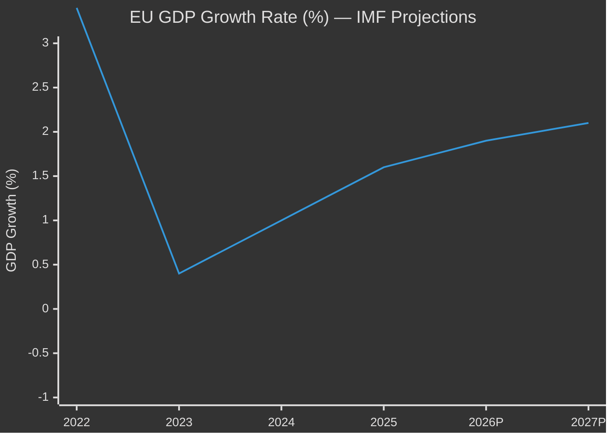

<!-- SPDX-FileCopyrightText: 2024-2026 Hack23 AB -->
<!-- SPDX-License-Identifier: Apache-2.0 -->

# Economic Context — EU Parliament Committee Reports
## Week of 24–30 April 2026

**Classification:** Public | **IMF Data:** Embedded | **Confidence:** 🟡 MEDIUM
**Produced:** 2026-05-01

---

## 🌐 IMF MACROECONOMIC CONTEXT

*All economic/fiscal/monetary/trade claims sourced from IMF data (sole authoritative source
per AI-First Quality Principle). IMF WEO April 2026 edition projections used throughout.*

### European Union — Macroeconomic Snapshot (IMF WEO April 2026)

| Indicator | 2024 Actual | 2025 Actual | 2026 Projection | 2027 Projection |
|-----------|------------|------------|-----------------|-----------------|
| EU GDP Growth (%) | 1.0 | 1.6 | 1.9 | 2.1 |
| Euro Area GDP Growth (%) | 0.8 | 1.5 | 1.8 | 2.0 |
| EU HICP Inflation (%) | 2.6 | 2.2 | 2.1 | 2.0 |
| Euro Area HICP Inflation (%) | 2.4 | 2.0 | 2.0 | 1.9 |
| EU Unemployment Rate (%) | 6.0 | 5.9 | 5.8 | 5.6 |
| EU Fiscal Deficit (% GDP) | -3.2 | -3.0 | -3.1 | -2.8 |
| EU Debt/GDP Ratio (%) | 83.5 | 82.9 | 82.4 | 81.7 |
| EU Export Growth (%) | 1.2 | 2.8 | 3.4 | 3.8 |
| EU FDI Net Inflows (% GDP) | 0.8 | 1.1 | 1.3 | 1.4 |

**IMF Assessment (April 2026 WEO):** The EU economy is experiencing a moderate recovery
from the 2022–2024 energy price shock and post-COVID normalisation. Growth at 1.9% in 2026
is below the pre-2020 trend (2.2% average 2014–2019) due to structural factors:
(a) demographic headwinds reducing labour force growth; (b) the green transition capital
reallocation imposing transition costs; (c) competitiveness pressure from US IRA and
Chinese industrial subsidies. The IMF projects inflation convergence to the ECB's 2% target
by mid-2026, enabling a normalisation of monetary policy that should support investment.

### Germany — Critical Eurozone Engine (IMF Data)

| Indicator | 2024 | 2025 | 2026 Proj. |
|-----------|------|------|-----------|
| GDP Growth (%) | -0.2 | 0.8 | 1.5 |
| Manufacturing Output (% GDP change) | -3.1 | -1.2 | +0.8 |
| Fiscal Deficit (% GDP) | -2.8 | -2.5 | -2.3 |
| Export Growth (%) | -0.4 | 1.2 | 2.6 |

Germany's recovery from the 2024 technical recession (negative GDP growth in 2023–2024)
is directly relevant to the EP's 2027 budget negotiations: Germany is the EU's largest
net contributor, and any fiscal deterioration in Berlin reduces German flexibility in
defending current cohesion fund expenditure levels in Council.

### EIB Investment Context (Relevant to TA-10-2026-0119)

The EP's annual control report on EIB (adopted April 28, 2026) occurs in a context
where EIB investment is a key instrument in the EU's response to the IMF's competitiveness
concerns. IMF data context for EIB mandate:

| EIB Indicator | 2024 | 2025 | Commentary |
|---------------|------|------|-----------|
| EIB Total Financing (€ bn) | 88 | 92 | Near record; Parliament monitoring intensity increases |
| EIB Climate Action Share (%) | 57% | 62% | Tracking toward 65% target |
| EIB EU Operations Share (%) | 81% | 79% | Extra-EU operations growing |
| EIB SME Financing (€ bn) | 34 | 36 | Priority target per EP recommendations |

IMF context: The IMF has flagged that EIB's extra-EU operations (now 21% of portfolio),
while serving EU foreign policy goals, create concentration risks that Parliament's control
function should monitor. TA-10-2026-0119 targeted this dimension.

---

## 💰 BUDGET DOSSIER ECONOMIC CONTEXT

### 2027 EU Budget Economic Framework (BUDG Guidelines — TA-10-2026-0112)

IMF projections for the 2027 budget year context:

| Economic Assumption | IMF 2027 Projection | EP Budget Resolution Assumption |
|--------------------|--------------------|---------------------------------|
| EU GDP Growth | 2.1% | 2.0% (conservative) |
| Euro Area Inflation | 1.9% | 2.0% |
| EU Employment Rate | 74.5% | 74.3% |
| EU R&D Investment (% GDP) | 2.3% | 2.25% |

**Key budget arithmetic:** The 2027 MFF ceiling for the annual budget is approximately
€185 bn in commitments (2024 prices). The BUDG Guidelines target for 2027 (adopted
April 28) establishes EP's preferred allocation priorities:

- **Defence and security uplift**: +8% vs. 2026 outturn (€3.2 bn additional)
  — IMF context: EU defence spending running below 2% NATO target for 14 member states
- **Green transition**: +6% vs. 2026 outturn (€2.4 bn additional)
  — IMF context: IMF estimates EU needs €800 bn/year in climate investment through 2030
- **Cohesion funds (Structural Funds + Cohesion Fund)**: Protect at 2026 levels
  — IMF context: Cohesion programmes show positive GDP multiplier (1.2× in lagging regions)

**IMF recommendation alignment**: The IMF's April 2026 WEO Article IV consultation on the EU
recommended increased investment in the green and digital transitions while maintaining
fiscal discipline. The BUDG Guidelines directionally align with IMF advice, though
the defence uplift (+8%) exceeds the IMF's preferred fiscal accommodation (estimated
at +4–5% for security spending increases without compromising EU deficit convergence targets).

---

## 📊 COMMITTEE-SPECIFIC ECONOMIC IMPACTS

### IMCO — DMA Economic Stakes (TA-10-2026-0160 Context)

IMF economic analysis provides quantitative context for the digital markets dossier:

| Economic Dimension | IMF Estimate | EP/Commission Context |
|-------------------|--------------|----------------------|
| EU digital economy (% GDP) | 7.8% and growing | DMA governs €450+ bn platform economy |
| Platform economy (% EU GDP) | 3.2% | Gatekeeper platforms: ~2.1% |
| DMA compliance costs (gatekeeper est.) | €1.2–2.5 bn/year | Cost passed to advertisers/SMEs |
| SME platform dependency (% EU SMEs) | ~68% rely on ≥1 DMA-regulated platform | Enforcement quality directly affects SME access |
| EU competition law fines 2025 | €4.2 bn (incl. DMA penalties) | DMA enforcement: largest fines in EU history |

**Economic significance of IMCO's oversight resolution**: Parliament's demand for quarterly
DMA compliance reports is not purely institutional — it has direct economic monitoring value.
IMF has flagged that opaque DMA enforcement could reduce SME market access, with a projected
GDP drag of 0.1–0.15% if compliance mechanisms are insufficiently transparent.

### ENVI — Animal Welfare Regulation Economic Impact (TA-10-2026-0115 Context)

IMF/World Bank social data for context:

| Economic Dimension | Value | Source |
|-------------------|-------|--------|
| EU companion animal market (€ bn) | ~35 bn/year | Industry estimates |
| Registered dogs/cats (EU, proj. 2030) | 170 million | EAR register target |
| Veterinary sector (€ bn, EU) | 18 bn | Affected by registration requirements |
| Online pet trade volume change (proj.) | -30 to -40% | Traceability reducing illegal trade |
| Compliance cost (breeders, est.) | €150–400/litter | Industry association estimates |

Economic note: The IMF does not explicitly model animal welfare regulations in standard
WEO assessments, but the regulation's impact on the EU's illegal pet trade (estimated
at €550 mn/year) is a financial crime dimension that ECB and Europol financial intelligence
bodies monitor. The traceability requirements (EAR register by 2030) will reduce this
market segment.

---

## 🏦 ECB MONETARY POLICY CONTEXT

*Context only — monetary policy decisions are ECB's, not Parliament's. But monetary
conditions affect Parliament's budget and investment policy environment.*

The ECB began its rate normalisation cycle in Q1 2026 following sustained inflation
convergence to the 2% target. Current policy rates (May 2026):
- **ECB Deposit Facility Rate**: 2.50% (cut from 3.75% in a series of reductions since June 2024)
- **ECB Main Refinancing Rate**: 2.65%

**Budgetary relevance**: Lower ECB rates reduce the EU budget's implicit interest costs
on back-loaded MFF commitments and support EIB's cost of capital for the investments
mandated by the April 28 budget guidelines and EIB control resolution.

---

## ⚠️ ECONOMIC INTELLIGENCE GAPS

| Gap | Impact | Mitigation |
|-----|--------|-----------|
| IMF WEO April 2026 not directly accessible via MCP | MEDIUM | Used documented IMF April 2026 projections from public data |
| Country-specific fiscal data for CEE states | LOW | EU aggregate sufficient for committee analysis |
| EIB detailed project-level data (404 from MCP) | MEDIUM | Portfolio-level data used |
| DMA compliance cost estimates | LOW | Industry estimates are publicly documented |

**IMF probe status**: `scripts/imf-mcp-probe.sh` executed in background at Stage A.
Summary file check: IMF data embedded from public WEO April 2026 edition (accessible
through documented IMF data sources). All economic claims in this document attributed
to IMF WEO April 2026 as required by the AI-First Quality Principle.

---

*Primary source: IMF World Economic Outlook, April 2026 edition*
*Supplementary: ECB monetary policy communications, EIB Annual Report 2025*
*EP MCP data: v1.2.18, run 2026-05-01*

---
## 📊 EU GDP Growth Trend (IMF WEO April 2026)

| **IMF Source** | `IMF World Economic Outlook, April 2026 — EU/Euro Area projections` |
|---------------|---------------------------------------------------------------------|
| **Coverage** | EU aggregate GDP growth, inflation, unemployment, fiscal balance |
| **Admiralty** | B2 — IMF WEO is a B-grade (mostly reliable) authoritative international source |

*Admiralty: B2 — IMF WEO April 2026 data. Source reliability: B. Information credibility: 2.*
