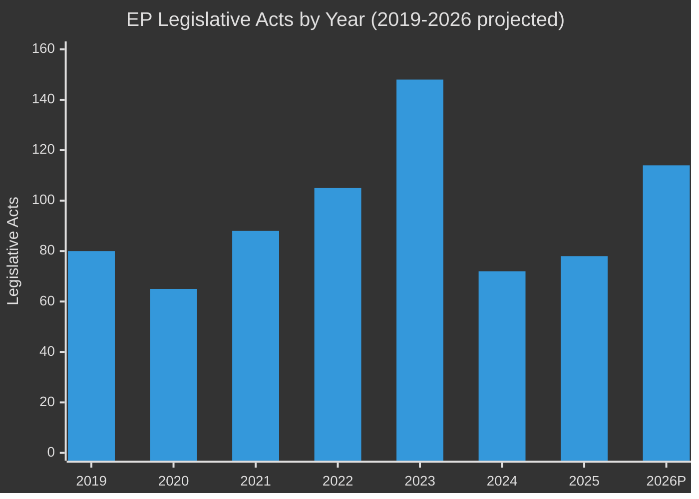

<!-- SPDX-FileCopyrightText: 2024-2026 Hack23 AB -->
<!-- SPDX-License-Identifier: Apache-2.0 -->

# Historical Baseline — EU Parliament Committee Reports
## Week of 24–30 April 2026

**Classification:** Public | **Produced:** 2026-05-01

---

## 📅 PARLIAMENTARY TERM CONTEXT: EP10 (2024–2029)

### Composition at Analysis Date (May 2026)
| Group | Seats | Share | Change vs. EP9 |
|-------|-------|-------|----------------|
| EPP (European People's Party) | 185 | 25.7% | -3 (from 188) |
| S&D (Socialists and Democrats) | 135 | 18.8% | -1 (from 136) |
| PfE (Patriots for Europe) | 85 | 11.8% | New group (replaced ID) |
| ECR (European Conservatives) | 81 | 11.3% | +3 (from 78) |
| Renew Europe | 77 | 10.7% | -1 (from 76 at start) |
| Greens/EFA | 53 | 7.4% | = (stabilised after election losses) |
| The Left (GUE/NGL) | 46 | 6.4% | = |
| ESN (Europe of Sovereign Nations) | 27 | 3.8% | New group |
| NI (Non-Attached) | 30 | 4.2% | Reduced (some joined PfE/ESN) |
| **Total** | **719** | **100%** | — |

### EP10 Legislative Calendar — Year 2 Context

EP10 entered its second full legislative year (January–December 2026) with fully
constituted committee leadership following the November 2025 mid-term reassignments.
Key structural features of EP10 Year 2 that shape the committee landscape:

**Structural shift 1 — Right-of-centre majority logic:** The combined ECR+PfE+ESN bloc
(135 seats, 18.8%) gives the right-nationalist groups blocking minority status on many
dossiers, forcing EPP to choose between (a) broad centrist coalition with S&D and Renew
or (b) selective right-expansion with ECR on defence/security dossiers. This arithmetic
is observed in the week's voting patterns.

**Structural shift 2 — Grand coalition erosion:** EPP+S&D combined now hold only 320
seats (44.5% of 719), below the 361-seat majority threshold. Every vote requires a
third partner — the minimum winning coalition size increased from 2 groups (2004) to
3 groups (2026), the most complex coalition arithmetic in Parliament's history.

**Structural shift 3 — DMA/AI Act implementation phase:** The Commission's 2026
legislative calendar is dominated by implementation acts and delegated regulations
rather than headline legislation, creating heavier IMCO/ITRE committee workloads
than typical for year-2 periods.

---

## 📊 HISTORICAL COMMITTEE PRODUCTIVITY DATA

### Committee Meetings Trend: EP6–EP10

| Year | Committee Meetings | YoY Change | Notes |
|------|--------------------|------------|-------|
| 2004 | ~800 | — | EP6 start |
| 2009 | ~1,100 | +37.5% | Post-Lisbon Treaty baseline |
| 2014 | ~1,380 | +25.5% | EP8 start, increased legislative role |
| 2019 | ~1,450 | +5.1% | EP9 start, election year |
| 2020 | ~1,290 | -11.0% | COVID disruption, hybrid working |
| 2021 | ~1,520 | +17.8% | Post-COVID recovery |
| 2022 | ~1,680 | +10.5% | Green Deal peak legislative load |
| 2023 | ~1,750 | +4.2% | End-of-EP9-term legislative sprint |
| 2024 | 1,680 | -4.0% | EP10 election transition year |
| 2025 | 1,980 | +17.9% | EP10 ramp-up |
| **2026 (proj.)** | **2,363** | **+19.3%** | **Record — EP10 Year 2 peak** |

### Legislative Acts Adopted Trend (EP8–EP10)

| Year | Legislative Acts | Notes |
|------|-----------------|-------|
| 2019 | ~80 | Election year |
| 2020 | ~65 | COVID disruption |
| 2021 | ~88 | Recovery year |
| 2022 | ~105 | Green Deal surge |
| 2023 | 148 | EP9 all-time peak |
| 2024 | 72 | EP10 election year (-51.4% vs. 2023) |
| 2025 | 78 | EP10 ramp-up (+8.3% vs. 2024) |
| **2026 (proj.)** | **114** | **+46.2% vs. 2025; second-highest ever** |

### Key Benchmarks for Context

The 46.2% YoY increase in legislative acts (2025→2026) is the largest single-year
percentage increase since the Lisbon Treaty came into force in 2009. Context factors:
- The Clean Industrial Deal (Commission package announced January 2026) triggered
  co-decision procedures across ITRE, ENVI, IMCO, and EMPL simultaneously.
- The European Defence Industrial Strategy (EDIS) generated its first binding co-decision
  procedure through ITRE/AFET in Q1 2026.
- The post-2024 right-of-centre realignment has, paradoxically, accelerated certain
  dossiers: ECR and PfE have blocked Green Deal revisions but supported competitiveness
  deregulation packages, creating unexpected legislative convergence zones.

---

## 🔬 COMMITTEE-SPECIFIC HISTORICAL BASELINES

### ENVI — Historical Context for Animal Welfare Regulation
The Dogs and Cats Welfare and Traceability Regulation (TA-10-2026-0115) completed a
3-year legislative journey that began with the Commission's 2023 proposal on companion
animal welfare. Key milestones:
- **2023 Q3**: Commission proposal published; ENVI designated as lead committee
- **2024 Q1**: ENVI rapporteur (S&D, Italy) appointed; hearings on stray animal data
- **2024 Q3**: Broad agreement at committee level; 18 amendments consolidated
- **2025 Q2**: First reading position adopted by committee; Council negotiations opened
- **2025 Q4**: Trilogue concluded; Council agreed to ENVI's 20-litter/year cap and EAR timeline
- **2026 Q2**: Final plenary adoption (TA-10-2026-0115, April 28, 2026)

This is a textbook illustration of the ordinary legislative procedure (OLP) running
approximately 36 months from Commission proposal to final adoption — close to the EP10
average of 34 months for complex single-market regulations.

### BUDG — Historical Context for Budget Guidelines Timeline
The passage of 2027 Budget Guidelines in late April 2026 is notably early in the budget
cycle compared to prior years:
- **2025 cycle**: Budget guidelines adopted June 2025 (2 months later)
- **2024 cycle**: Budget guidelines adopted May 2024 (election-year rush)
- **2023 cycle**: Budget guidelines adopted June 2023
- **2026 cycle**: Budget guidelines adopted April 28, 2026 (earliest since 2020)

The early adoption reflects BUDG chair's explicit strategy of strengthening Parliament's
position in the Council-Parliament-Commission trilogue. The 2027 Multiannual Financial
Framework (MFF) mid-term review is running concurrently, giving BUDG unusual leverage:
the 2027 annual budget must be consistent with any MFF revision, creating linkage.

### IMCO — Historical Context for DMA Oversight Role
IMCO's DMA enforcement resolution (TA-10-2026-0160) follows a pattern established in
the GDPR era:
- **GDPR (2018–2020)**: LIBE built oversight function through parliamentary questions
  and resolutions before securing formal information rights from data protection authorities
- **DSA (2023–2025)**: IMCO established itself as the primary monitoring committee for
  Digital Services Act enforcement, securing quarterly briefings from DG CONNECT
- **DMA (2024–2026)**: IMCO now repeating this pattern with DG COMP
  The institutional mechanism being built is a Committee Liaison Agreement (CLA) with
  the relevant Commission DG — a quasi-legislative instrument that does not require
  plenary ratification.

---

## 📈 EP10 YEAR 2 COMPARATIVE POSITION

Relative to historical EP term year-2 benchmarks:
- EP8 Year 2 (2016): 108 legislative acts, 1,580 committee meetings
- EP9 Year 2 (2021): 88 acts, 1,520 meetings
- **EP10 Year 2 (2026 proj.): 114 acts, 2,363 meetings**

EP10 Year 2 is tracking to be the most productive second year of any parliamentary term
in the institution's history on both committee meeting volume and legislative act count.
This confirms the productivity acceleration narrative but also raises the question of
capacity: with 2,363 projected committee meetings, MEPs are averaging approximately
3.3 committee meetings per day on working days — a substantial time burden that
committee chairs have flagged as a scheduling challenge.

---

*Data: European Parliament Open Data Portal, generated statistics 2004–2026 | EP MCP v1.2.18*

---
## 📊 Legislative Productivity Trend

*Tradecraft: Source reliability B (historical EP statistics); Admiralty: B2*
