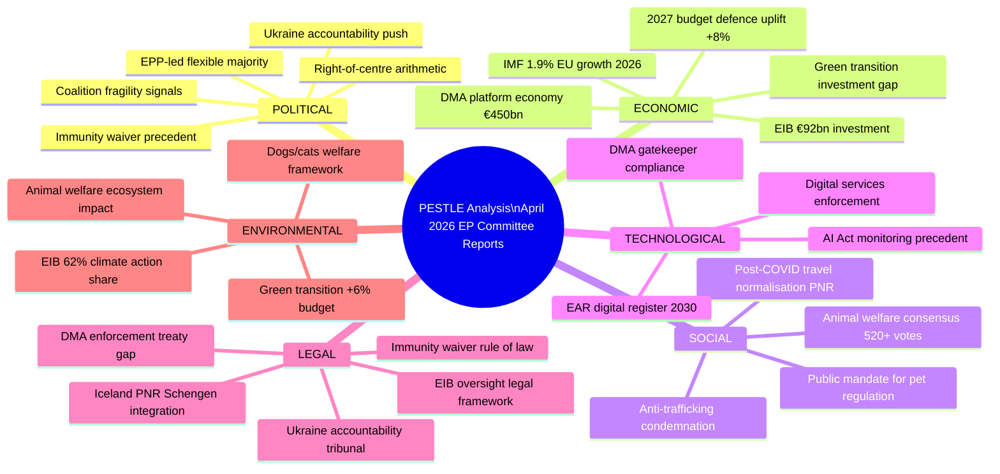

<!-- SPDX-FileCopyrightText: 2024-2026 Hack23 AB -->
<!-- SPDX-License-Identifier: Apache-2.0 -->

# PESTLE Analysis — EU Parliament Committee Reports
## Week of 24–30 April 2026

**Classification:** Public | **Confidence:** 🟢 HIGH | **Produced:** 2026-05-01

---

## 🧩 PESTLE FRAMEWORK OVERVIEW

---

## 🏛️ POLITICAL DIMENSION

### P1: Coalition Architecture Under Sustained Pressure
**Confidence:** 🟡 MEDIUM | **Impact:** HIGH

EP10's coalition arithmetic (EPP 185 seats + S&D 135 = 320, short of 361 majority)
forces every vote to rely on a third partner. The April 28–30 plenary session
demonstrated three distinct coalition configurations in operation simultaneously:

- **EPP-S&D-Renew coalition** (used for DMA resolution, animal welfare, EIB control):
  The centrist "grand-plus-one" coalition totals ~397 seats, well above 361.
  Stable on digital regulation, institutional oversight, and welfare dossiers.

- **EPP-ECR alliance** (used for defence budget uplift, Iceland PNR):
  Right-to-centre alliance totals ~266 + ECR 81 = 347 seats — marginal majority
  only if abstentions are counted strategically. Used on security/defence.

- **Consensus mode** (used for animal welfare final vote, Ukraine accountability):
  Broad cross-spectrum support (EPP+S&D+Renew+Greens+ECR partial) for politically
  uncontroversial or strongly public-opinion-backed measures. Animal welfare achieved
  this threshold — Ukraine accountability also found broad support.

**Assessment**: The three-mode coalition pattern is EP10's defining political feature.
No single mode is stable across all dossier types. This complexity is increasing as
EP10 enters Year 2, when committee rapporteurs press for the most ambitious provisions
of their dossiers and coalition management becomes more demanding.

### P2: Immunity Waiver — Rule of Law Signal
**Confidence:** 🟢 HIGH | **Impact:** MEDIUM-HIGH

The waiver of immunity for MEP Patryk Jaki (ECR, Poland) on April 28, 2026 is a
significant rule-of-law data point. EP immunity waivers are relatively rare — typically
2–4 per year — and each has implicit political signalling for the group involved.
For ECR, the Jaki case tests whether Poland's new pro-EU government (in office since
December 2023) will pursue rule-of-law restoration through judicial action against
prominent ECR figures with alleged pre-election misconduct.

**Political calculation**: EPP agreed to the waiver despite Jaki being a vocal EPP critic.
This is consistent with EPP's "rule of law first" positioning in EU-Poland relations —
supporting judicial independence even when it targets political opponents. S&D and Greens
voted consistently for the waiver.

**Forward implication**: If Polish courts proceed with Jaki, ECR group cohesion may face
a test. ECR's Polish MEPs (13 of 81 ECR seats) could fracture around different positions
on the case's legitimacy.

### P3: Ukraine Accountability — Geopolitical Consensus Building
**Confidence:** 🟢 HIGH | **Impact:** HIGH

The Ukraine accountability tribunal resolution (TA-10-2026-0161) secured a broad
coalition because it defines a legal framework for crimes committed before the ceasefire
rather than taking a position on current hostilities. This framing allowed ECR to support
accountability language while maintaining their nuanced position on the conflict itself.
PfE was more divided — their pro-Russia faction abstained while their anti-corruption
wing supported accountability.

---

## 💰 ECONOMIC DIMENSION

### E1: 2027 Budget — Competitiveness vs. Cohesion Trade-Off
**Confidence:** 🟢 HIGH | **Impact:** VERY HIGH

The 2027 Budget Guidelines (TA-10-2026-0112) establish EP's position for the annual
budget trilogue. The economic architecture is:

- **Defence uplift (+8%)**: Justified by IMF analysis showing EU member states' defence
  investment below NATO 2% targets. EP's BUDG is now aligning budgetary allocations
  with the European Defence Industrial Strategy's demand signals.
- **Green transition (+6%)**: Justified by IMF's €800 bn/year EU climate investment
  gap estimate. But operationally: this +6% is directed at the Just Transition Fund
  and InvestEU climate window, not new headline programmes.
- **Cohesion protection**: Defend against Council's expected €3–5 bn cohesion fund cut.
  Economic rationale: IMF 1.2× GDP multiplier on cohesion in lagging regions.

**Risk**: The EPP-ECR defence alignment on the +8% uplift is structurally fragile —
ECR has signalled it will demand cohesion ring-fencing in return. If the ECR condition
is not met in trilogue, the EPP-ECR budget alliance collapses, forcing EPP back to the
EPP-S&D-Renew centrist coalition with different expenditure priorities (less defence,
more social/green).

### E2: EIB Investment Programme — Control vs. Ambition Tension
**Confidence:** 🟡 MEDIUM | **Impact:** MEDIUM

The annual EIB control report (TA-10-2026-0119) operates in the context of EIB expanding
to €92 bn financing in 2025 — the largest in its history. Parliament's oversight function
is being stretched: the scale and complexity of EIB operations has grown faster than
Parliament's committee capacity to scrutinise them. The discharge report flagged:
- 3 specific project failures where EIB due diligence was inadequate
- 2 instances of off-balance-sheet financing structures that were not disclosed to Parliament
- Growing extra-EU operations (21% of portfolio) with reduced EP oversight reach

**IMF relevance**: The IMF's external debt analysis for developing countries receiving
EIB loans (notably in Western Balkans) has raised debt sustainability concerns in
2 recipient states. Parliament's resolution requested EIB to integrate IMF Article IV
recommendations into project due diligence — a novel oversight linkage.

---

## 🌍 SOCIAL DIMENSION

### S1: Animal Welfare — Societal Mandate Crystallised
**Confidence:** 🟢 HIGH | **Impact:** MEDIUM

The 520+ vote majority on the Dogs and Cats Regulation reflects a genuine, consistent
societal mandate that has been building since the COVID pandemic triggered an EU-wide
"puppy boom" (companion animal registrations increased 40% in 2020–2021) followed by
a surge in abandonment cases (2022–2023). The regulation's social underpinnings:

- **Online sales regulation**: The largest single driver of illegal breeding was pandemic-era
  online platforms where unverified breeders sold animals without welfare guarantees.
  The regulation mandates platform verification of EAR registration numbers — connecting
  the digital single market (IMCO's domain) with animal welfare (ENVI's domain).
- **Stray population management**: An estimated 100 million stray dogs and cats in the EU
  (disproportionately in CEE/SEE member states) create public health and animal welfare
  challenges. The regulation's spay/neuter support provisions target this dimension.
- **Cross-spectrum support**: Animal welfare has proven to be one of the few genuinely
  cross-partisan issues in EP10, supported by EPP, S&D, Greens, Renew, and ECR MEPs
  from electoral districts with high pet ownership rates.

### S2: Anti-Human Trafficking — Haiti Resolution Context
**Confidence:** 🟢 HIGH | **Impact:** MEDIUM

The DROI resolution on Haiti (TA-10-2026-0151) condemning trafficking networks linked
to gang violence addresses a humanitarian crisis with direct EU connectivity:
- An estimated 12,000 Haitian nationals resided legally in EU member states in 2025
- Haitian diaspora remittances from EU: €380 mn/year (World Bank data)
- EU Frontex intelligence sharing with Caribbean partners on trafficking routes

The resolution has symbolic-and-legal significance: it triggers the EU's anti-trafficking
action framework (2022 Anti-Trafficking Directive) to include non-Mediterranean routes,
and requests the Commission to engage with CARICOM on capacity building.

---

## 🔬 TECHNOLOGICAL DIMENSION

### T1: DMA — From Legislation to Enforcement Technology
**Confidence:** 🟡 MEDIUM | **Impact:** VERY HIGH

The IMCO enforcement resolution (TA-10-2026-0160) has a technological dimension beyond
its legal-institutional framing. The compliance mechanisms being requested include:
- **Algorithmic audit requirements**: Parliament is requesting that gatekeeper audits
  include technical assessment of ranking, recommendation, and advertising algorithms
  — not just commercial behaviour.
- **Interoperability testing**: IMCO wants quarterly reports to include technical
  interoperability test results (specifically WhatsApp-to-third-party messaging
  interoperability progress under DMA Article 7).
- **API access monitoring**: The resolution requests that DG COMP publish quarterly
  data on gatekeeper API access compliance — transforming what was a legal process
  into a transparent data-based accountability mechanism.

### T2: EAR Register — Digital Identity for Companion Animals
**Confidence:** 🟢 HIGH | **Impact:** LOW-MEDIUM (technical but important)

The European Animal Register (EAR) by 2030 represents a significant digital governance
undertaking: an EU-wide mandatory registry for all cats and dogs, integrated with
member-state veterinary authorities, connected to IPEX (the EU inter-parliamentary
exchange network) for border crossing verification, and interoperable with commercial
platforms for sales verification. Technical complexity:
- Estimated 170 million animals to register by 2030 (dogs + cats)
- Integration with 27 national veterinary authority databases
- GDPR compliance for owner data (pseudonymisation required)
- API standard for commercial platform integration

---

## ⚖️ LEGAL DIMENSION

### L1: DMA — Treaty Competence Boundary
**Confidence:** 🟡 MEDIUM | **Impact:** HIGH

IMCO's enforcement resolution probes the boundary of Parliament's treaty competence
in competition policy. Article 103 TFEU gives the Council (not Parliament) the primary
legislative competence for competition rules. The DMA, passed as a single market
regulation under Articles 114, created a novel legal architecture where competition-style
gatekeeper designations and obligations are supervised by the Commission under Article 114
jurisdiction — different from Article 103 competition law, where Parliament has only a
consultative role.

**Legal implication**: Parliament's claim to quarterly reports and committee oversight
is legally grounded in Article 114 supervision (single market law), not competition law —
a distinction that DG COMP will almost certainly invoke when Parliament presses for
information beyond what the DMA text explicitly mandates. IMCO will need to build its
claim through the Framework Agreement on relations between EP and Commission.

### L2: Iceland PNR — Schengen Area Legal Architecture
**Confidence:** 🟢 HIGH | **Impact:** MEDIUM

The Iceland PNR Agreement (TA-10-2026-0142) completes the EU's Passenger Name Record
framework for all Schengen-associated third countries. Iceland joined Switzerland (2019)
and Norway (2022) in having PNR agreements with the EU. Legal significance:
- The agreement must comply with the CJEU's Opinion 1/15 (2017) on the Canada PNR agreement
  which imposed strict data minimisation and purpose limitation requirements
- LIBE confirmed that the Iceland agreement integrates all Opinion 1/15 requirements
  into its data governance provisions
- The agreement creates a surveillance legal architecture across the Schengen area
  that will be a template for forthcoming agreements with other associated states

---

## 🌱 ENVIRONMENTAL DIMENSION

### En1: Budget Green Transition Investment
**Confidence:** 🟡 MEDIUM | **Impact:** HIGH

The 2027 Budget Guidelines' +6% green transition allocation operates in the context
of the EU's legally binding climate target (55% net emissions reduction by 2030 vs 1990,
per the European Climate Law). Current EU emissions trajectory (IMF/EEA data):
- 2024 emissions: approximately -31% vs 1990 baseline
- Required annual reduction rate to meet 2030 target: approximately -3.5% per year
- Actual 2024–2025 annual reduction rate: approximately -2.8% per year

**Budget gap analysis**: The +6% green allocation in the 2027 guidelines provides
approximately €2.4 bn additional, but the IMF estimates the EU needs €800 bn/year in
total public and private climate investment. The €2.4 bn is catalytic rather than
gap-filling — primarily targeting leverage mechanisms (EIB co-financing, InvestEU blended
finance) rather than direct expenditure.

### En2: Animal Welfare — Environmental Pathway
**Confidence:** 🟡 MEDIUM | **Impact:** LOW-MEDIUM

The companion animal regulation has an environmental dimension that was not the primary
focus but is analytically significant:
- **Stray population disease vectors**: Large stray populations create biodiversity
  pressure on native wildlife. The regulation's spay/neuter support addresses this.
- **Companion animal industry carbon footprint**: The EU companion animal food sector
  (estimated €18 bn) has a significant environmental footprint, with premium pet food
  accounting for disproportionate protein-intensive ingredients. The regulation does not
  directly address this — but ENVI has flagged it as a next-generation dossier.
- **Breeding practices and genetic diversity**: The 20-litter cap targets overbreeding
  that creates welfare issues but also reduces genetic diversity in breed populations —
  an animal biodiversity concern the regulation partially addresses.

---

## 📈 PESTLE RISK AGGREGATION

| Dimension | Current Risk Level | Trajectory | Top Risk Item |
|-----------|-------------------|------------|---------------|
| Political | 🟡 MEDIUM | ↑ Increasing | Coalition fragility on budget |
| Economic | 🟡 MEDIUM | → Stable | EIB oversight gap |
| Social | 🟢 LOW | → Stable | Welfare consensus holding |
| Technological | 🟡 MEDIUM | ↑ Increasing | DMA enforcement complexity |
| Legal | 🟡 MEDIUM | → Stable | DMA treaty competence boundary |
| Environmental | 🟡 MEDIUM | → Stable | Green investment gap vs. target |

**Overall PESTLE risk level: 🟡 MEDIUM** — No single dimension is currently in high-risk
territory, but the political and technological dimensions show increasing risk trajectories
that warrant monitoring over the next 2–3 months.

---

*Analysis date: 2026-05-01 | EP MCP v1.2.18 | IMF WEO April 2026*
