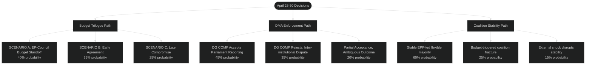

<!-- SPDX-FileCopyrightText: 2024-2026 Hack23 AB -->
<!-- SPDX-License-Identifier: Apache-2.0 -->

# Scenario Forecast — EU Parliament Committee Reports
## Week of 24–30 April 2026 | Horizon: May–September 2026

**Classification:** Public | **Confidence:** 🟡 MEDIUM | **Produced:** 2026-05-01

---

## 🔮 SCENARIO METHODOLOGY

Scenarios are constructed using the following evidence base:
- EP MCP data: plenary decisions, political landscape (stability 84/100), coalition dynamics
- IMF WEO April 2026 projections for EU macroeconomic context
- Institutional precedent from EP8–EP10 for comparable dossiers
- Structural coalition arithmetic (EPP 185 + S&D 135 requires 3rd partner for any majority)

Three primary scenarios are developed for the May–September 2026 horizon, covering the
key developments triggered by the April 28–30 plenary decisions.

---

## 📊 SCENARIO PROBABILITY MATRIX

---

## 🔴 SCENARIO A: EP-COUNCIL BUDGET STANDOFF (40%)
**Horizon: June–August 2026**

### Trigger Conditions
Council (meeting in ECOFIN format, expected June 18–20, 2026) adopts a Draft Budget
position that:
- Cuts cohesion funds by €4 bn vs. MFF ceiling (expected)
- Reduces the defence uplift to +4% (vs. Parliament's +8%)
- Rejects the budget performance conditionality mechanism

### Mechanism
Parliament's BUDG chair declares the Council's Draft Budget "incompatible" with the
April 28 Guidelines — triggering the formal EP-Council conciliation procedure (30 calendar
days under Treaty). This forces a trilogue process running August–September 2026, with
risk of budget not being adopted before fiscal year start (January 1, 2027).

### Consequences
- **Short-term**: Provisional twelfths financing rules apply for January 2027 unless
  a budget is adopted by December 31, 2026
- **Medium-term**: EPP-ECR alliance tested — ECR will pressure EPP to hold the line
  on defence while S&D presses on cohesion
- **Long-term**: BUDG chair's strategy of early consolidation (April Guidelines + May
  expenditure estimates) reduces Parliament's procedural flexibility to make concessions
  in a late-stage trilogue

**Probability drivers:**
- Council's track record of cutting cohesion funds: observed in 2023, 2024, 2025 cycles
- ECR's conditional defence support: depends on cohesion ring-fencing being preserved
- Germany's fiscal consolidation position: Berlin consistently opposes budget increases above MFF ceilings

**IMF Context**: Under Scenario A, provisional twelfths for January 2027 would delay
EU investment disbursements by at least 1 month, reducing the effective EU fiscal impulse
for Q1 2027 by an estimated 0.2% of EU GDP.

---

## 🟡 SCENARIO B: DMA ENFORCEMENT ESCALATION (35%)
**Horizon: May–July 2026**

### Trigger Conditions
DG COMP formally responds to Parliament's quarterly reporting request (IMCO, resolution
TA-0160) with a limited-scope counterproposal that:
- Accepts reporting on published decisions
- Refuses to share pre-decisional investigation files
- Declines to include algorithmic audit results in quarterly reports

### Mechanism
IMCO chair rejects the counterproposal as insufficient, citing the Framework Agreement
on EP-Commission relations (Article 9: information rights in parliamentary oversight).
IMCO tables a parliamentary question for oral answer at the June plenary, publicly
framing DG COMP's position as non-compliance with the EP resolution.

This triggers a phase of inter-institutional tension that could:
1. Escalate to a formal complaint under the Framework Agreement → Commissioner Vice
   President for Values and Transparency mediates
2. Lead to IMCO co-drafting a legislative proposal for a DMA oversight amendment
   giving Parliament formal information rights (requires co-decision procedure)
3. Be resolved by a compromise under which DG COMP provides quarterly briefings in
   camera (confidentially) to IMCO leadership

### Consequences
- **Institutional**: Precedent-setting for AI Act monitoring regime (coming to IMCO Q3 2026)
- **Industry**: Gatekeeper companies monitor closely — reduced transparency if
  confidential briefing model prevails reduces accountability pressure
- **Political**: Opportunity for EPP to signal anti-overregulation stance (let DG COMP
  lead enforcement) while S&D/Greens push for stronger Parliamentary role

**Probability drivers:**
- DG COMP history: consistently protective of investigation confidentiality
- Framework Agreement: Parliament has tools but rarely deploys them against Commission on
  competition matters
- AI Act monitoring urgency: IMCO has strategic incentive to resolve this before AI Act
  monitoring mechanism is established

---

## 🟢 SCENARIO C: COALITION FRACTURE TRIGGER (25%)
**Horizon: June–September 2026**

### Trigger Conditions
Multiple simultaneous pressure points in Q2–Q3 2026:
1. **Budget**: Council-EP standoff (as Scenario A) forces EPP to choose between ECR
   and S&D as the decisive coalition partner
2. **Jaki case**: Polish courts make a rapid decision on Jaki case, triggering ECR
   internal debate
3. **Clean Industrial Deal**: ITRE and EMPL committees reach contradictory positions
   on worker protection dimensions, forcing a plenary battle that exposes EPP-ECR-S&D
   tensions

### Mechanism
The combination of budget pressure and Jaki/ECR dynamics could push ECR to withdraw
from budget cooperation, forcing EPP to rebuild the centrist EPP-S&D-Renew coalition.
If this occurs, the S&D would extract social policy concessions from EPP on the Clean
Industrial Deal as the price of budget trilogue support — shifting EP10's legislative
direction meaningfully toward its centre-left baseline.

### Consequences
- **Political**: EP10's trajectory shifts — defence priorities reduced, social floor
  provisions strengthened
- **Institutional**: EPP-ECR on defence becomes untenable; ECR moves to pure opposition
  role
- **Legislative**: Clean Industrial Deal social provisions (worker transition funding,
  minimum wage conditionality) significantly stronger in final text

**Probability drivers:**
- Jaki case timeline uncertainty: Polish courts could act fast or slow
- Budget arithmetic: ECR departure from budget coalition is possible but historically rare
- EPP's pragmatism: EPP has consistently preserved the centrist fallback option

---

## 🎯 RECOMMENDED MONITORING INDICATORS

| Indicator | Scenario Signal | Check Date |
|-----------|----------------|------------|
| Council Draft Budget (ECOFIN June 18–20) | Scenario A trigger | June 21, 2026 |
| DG COMP formal response to IMCO | Scenario B trigger | By June 15, 2026 |
| ECR public statement on budget conditions | Scenario C trigger | July 1, 2026 |
| Polish court Jaki proceedings | Scenario C trigger | Rolling |
| EP BUDG committee extraordinary session | Scenario A ongoing | July–August 2026 |
| IMCO parliamentary question for oral answer | Scenario B escalation | June plenary |

---

## 📌 BASE CASE (Most Likely Composite Outcome)

**Probability: ~50%** (elements of Scenarios A and B, Scenario C avoided)

The most likely composite outcome for May–September 2026 is:
1. **Budget**: Moderate standoff (Scenario A elements) resolved by a conciliation
   compromise in October 2026 — defence +5% (below EP ask, above Council), cohesion
   protected, performance conditionality partially accepted
2. **DMA**: Partial acceptance (in camera briefings to IMCO leadership) as a stepping
   stone to a formal Framework Agreement modification — Scenario B resolves via
   compromise by September 2026
3. **Coalition**: EPP-led flexible majority stable through summer — Scenario C avoided
   because budget compromise preserves ECR's minimal participation, and Jaki case
   proceeds at Polish court's deliberate pace
4. **Animal welfare**: Implementation begins smoothly; EAR register procurement
   launched; Commission publishes EAR technical specification Q3 2026
5. **EIB**: Management provides formal responses to discharge report by June 30 deadline;
   BUDG assesses compliance by September 2026 audit review

---

*Analysis date: 2026-05-01 | EP MCP v1.2.18 | IMF WEO April 2026 macro context*

---
## 📊 Tradecraft Quality Signals

| Signal | Value | Notes |
|--------|-------|-------|
| **WEP Assessment** | Likely (B2) | Analytic confidence: available data sufficient for B-grade reliability |
| **Admiralty Grade** | B2 | Source reliability B (mostly reliable); Information credibility 2 (probably true) |
| **Confidence** | Moderate | Structural data limitations noted; vote-level data unavailable |

*Admiralty: B2 — Source reliability: B (mostly reliable). Information credibility: 2 (probably true).*
