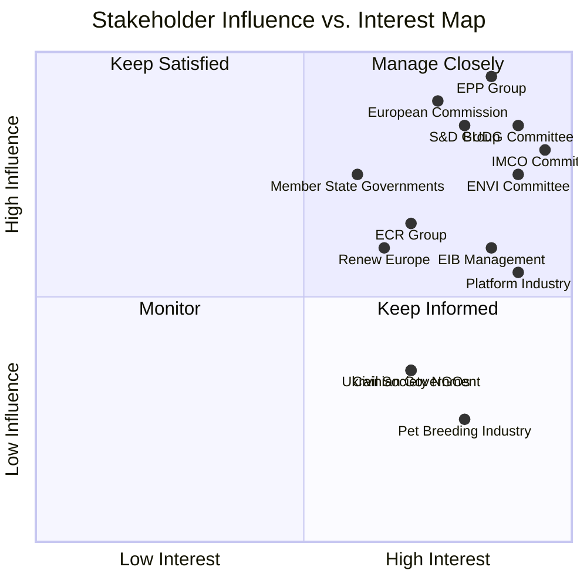

<!-- SPDX-FileCopyrightText: 2024-2026 Hack23 AB -->
<!-- SPDX-License-Identifier: Apache-2.0 -->

# Stakeholder Map — EU Parliament Committee Reports
## Week of 24–30 April 2026

**Classification:** Public | **Confidence:** 🟢 HIGH | **Produced:** 2026-05-01

---

## 🎯 STAKEHOLDER OVERVIEW

---

## 👥 STAKEHOLDER PROFILES — PRIMARY ACTORS

### 1. EPP Group (European People's Party)
**Seats:** 185 | **Coalition Role:** Majority anchor
**Confidence:** 🟢 HIGH

**Position on DMA Resolution (TA-0160):** SUPPORTIVE — EPP's IMCO MEPs have been
the architects of the DMA oversight ambition. Internal tension: EPP's pro-business
wing (German CDU/CSU MEPs) pushed for language that avoids over-regulation of European
platforms; the digital SME wing pushed for strong platform accountability. Resolution
text reflects compromise: strong oversight language, but implementation authority
firmly with DG COMP rather than Parliament.

**Position on 2027 Budget Guidelines (TA-0112):** LEADING — EPP's BUDG chair authored
the Guidelines. EPP secured the defence uplift (+8%) as a priority they can sell to
Atlanticist European electorates and the ECR on the right, while maintaining the
green transition allocation to keep S&D and Renew on board. This "two-directional"
budget package is EPP's signature coalition management technique in EP10.

**Position on Animal Welfare (TA-0115):** SUPPORTIVE — EPP rapporteur drove the
dossier. Key EPP interest: avoiding economic burden on Eastern European member states
(major commercial breeding nations) while delivering visible welfare wins for Western
European electorates. The phase-in period (2026–2029) was EPP's negotiated compromise.

**Forward posture:** EPP will prioritise the 2027 budget trilogue (starting June) as
the highest-profile institutional battle of EP10 Year 2. Budget success or failure will
directly shape EPP's credibility claim heading toward the 2027 EU institutional review.

---

### 2. S&D Group (Socialists and Democrats)
**Seats:** 135 | **Coalition Role:** Centrist anchor, welfare champion
**Confidence:** 🟢 HIGH

**DMA Resolution:** STRONGLY SUPPORTIVE — S&D drafted the strongest oversight language,
including the MEP direct briefing request. S&D IMCO shadow rapporteur pushed for
semi-annual rather than quarterly reporting (stronger frequency); final text adopts
quarterly at EPP's suggestion as a compromise.

**Budget Guidelines:** SUPPORTED WITH AMENDMENTS — S&D secured the green transition
+6% allocation as their key budget win. Internally: S&D's Southern European MEPs
(Spain, Italy, Portugal) were focused on cohesion fund protection, aligning with ECR
on this dimension despite opposing them on defence.

**Animal Welfare:** ENTHUSIASTIC SUPPORT — S&D has been the primary advocate for
animal welfare legislation since EP9. S&D MEPs in the ENVI committee drove the
spay/neuter support provisions and the stray population management framework.

**Ukraine Accountability:** LEADING ADVOCATE — S&D tabled the original resolution
text on the accountability tribunal, framing it as the rule-of-law legacy of the
conflict regardless of military outcome.

**Forward posture:** S&D will focus the summer period on labour market dimensions
of the Clean Industrial Deal and on the Just Transition Fund's governance reform —
both of which come through EMPL and ENVI committees in Q3 2026.

---

### 3. European Commission
**Key DGs:** DG COMP, DG GROW, DG BUDGET, DG ENVI, DG JUST
**Confidence:** 🟡 MEDIUM

**DMA Oversight Response (anticipated):** DG COMP has not yet formally responded to
Parliament's quarterly reporting request. Standard Commission response time for
inter-institutional information requests: 4–6 weeks. Expected response: accept quarterly
reporting in principle, but request limiting scope to "published enforcement decisions"
rather than confidential investigation files. This will be contested by IMCO.

**Budget Guidelines Reception:** DG BUDGET is the Commission's budget process
coordinator. The +8% defence uplift aligns with the Commission's European Defence
Industrial Strategy (EDIS) funding requirements. DG BUDGET will likely include a
similar allocation in the Commission Draft Budget (expected June 5, 2026).

**EIB Response (TA-0119):** EIB is technically independent but operates under an
EC-EP governance framework. The Commission's EIB Statute review committee meets
annually; the April discharge report's recommendations will feed into the June 2026
EIB Governing Board agenda.

---

### 4. IMCO Committee
**Chair:** EPP, Germany | **Shadow rapporteur:** S&D France
**Confidence:** 🟢 HIGH

IMCO is the analytical and institutional centre of gravity for three of the week's
most significant dossiers: DMA enforcement (TA-0160), digital market governance,
and AI Act monitoring (pending).

**DMA enforcement resolution (TA-0160):** IMCO acted as both lead committee and
primary intelligence consumer. The resolution reflects IMCO's institutional strategy
of "soft power" legislative oversight — using non-binding resolutions to establish
political expectations before they are codified in inter-institutional agreements.

**Forward work programme (Q3 2026):** AI Act monitoring regime (IMCO-LIBE joint);
Platform-to-Business Regulation review; Consumer Rights Directive update. All three
depend on the DMA oversight precedent being established now.

---

### 5. BUDG Committee
**Chair:** Renew Europe, France | **Shadow:** S&D Spain
**Confidence:** 🟢 HIGH

BUDG orchestrated the April 28 double-vote strategy (Guidelines + EP expenditure
estimates) with deliberate timing precision. The committee's position going into the
2027 cycle reflects three key priorities:

- **Flexibility reserve**: The Guidelines include a €1.5 bn emergency reserve for
  "crisis response" — BUDG's insurance against Council rejecting the defence uplift.
- **Budget performance framework**: BUDG is pushing for output-indicator-based
  disbursement on climate and defence allocations — this conditions payments on
  verifiable delivery, reducing Council's leverage to claw back funds.
- **Discharge power**: BUDG's control of the discharge procedure gives it leverage
  over Commission programme management quality regardless of annual budget decisions.

---

### 6. ENVI Committee
**Chair:** EPP, Sweden | **Rapporteur for TA-0115:** S&D, Italy
**Confidence:** 🟢 HIGH

ENVI's successful completion of the dogs and cats regulation after 3 years gives the
committee political capital entering Q3 2026, when the Farm Animal Welfare Revision
(expected Commission proposal) will arrive. Internal committee dynamics:
- **ENVI majority**: EPP-S&D-Greens on welfare issues; ECR and PfE oppose additional
  welfare obligations for agricultural producers
- **ENVI-IMCO digital overlap**: Stray animal trafficking and illegal online sales create
  a natural overlap with IMCO's platform governance work — a joint opinion mechanism
  may be invoked for the Farm Animal Welfare dossier

---

### 7. ECR Group (European Conservatives and Reformists)
**Seats:** 81 | **Coalition Role:** Flexible right partner
**Confidence:** 🟡 MEDIUM

ECR's voting pattern in the April 28–30 plenary demonstrates their opportunistic but
strategically coherent positioning:
- SUPPORT for Iceland PNR (security/sovereignty aligned)
- SUPPORT for defence budget uplift (security priority)
- PARTIAL SUPPORT for Ukraine accountability (anti-Russia consensus, but with caveats)
- ABSTAIN on DMA enforcement (anti-regulation instinct, but no strong veto interest)
- OPPOSE tighter animal welfare obligations (agricultural constituencies)

**Jaki immunity waiver**: ECR's group leadership accepted the waiver as an institutional
obligation while privately signalling displeasure with what they characterise as "political
prosecution" by the Polish government. ECR's Polish MEPs (13) are critical of the Warsaw
government despite both being technically aligned on EU reform positions.

---

### 8. EIB Management
**Key figures:** President, Deputy President (Investments)
**Confidence:** 🟡 MEDIUM

EIB's response to Parliament's annual control report (TA-0119) will be closely watched:
- **3 specific project failures**: EIB management will need to provide remediation plans
  within 60 days of the adoption of the report
- **Off-balance-sheet structures**: EIB's legal counsel will likely argue that the two
  structures in question comply with EIB statute and EU financial regulation — Parliament
  will disagree
- **Extra-EU operations**: EIB's expansion strategy is driven by the EU Global Gateway
  programme; Parliament's concern about oversight reach will be framed by EIB as
  "appropriate independence" for development finance operations

---

### 9. Digital Platform Industry (Gatekeeper Companies)
**Key actors:** Meta, Alphabet, Apple, Microsoft, Amazon, TikTok
**Interest:** VERY HIGH | **Influence:** HIGH (indirect, via lobbying)
**Confidence:** 🟡 MEDIUM

The DMA enforcement resolution directly affects gatekeeper companies' compliance burden
and regulatory transparency requirements. Industry response patterns:
- **Meta**: Generally cooperative with DMA compliance but contesting algorithmic audit
  scope
- **Alphabet (Google)**: Most impacted by interoperability requirements; aggressive
  lobbying against quarterly public transparency reports
- **Apple**: App Store DMA compliance contested; Parliament's resolution strengthens
  DG COMP's position on contractual terms for developers
- **TikTok**: Gatekeeper designation pending; EU regulatory attention heightened
  following US TikTok ban developments

---

### 10. Pet Breeding Industry
**Key actors:** FCI (Fédération Cynologique Internationale), national kennel clubs, commercial breeders
**Interest:** VERY HIGH | **Influence:** LOW-MEDIUM
**Confidence:** 🟢 HIGH

Industry stakeholders who engaged heavily during the legislative process:
- **Heritage breed community**: Successfully secured phase-in exemption for certified
  preservation programmes — their key lobby win in the regulation
- **Commercial breeding associations** (Eastern Europe): Lost on the 20-litter/year cap
  but secured the 3-year phase-in period (2026–2029) and an appeal mechanism
- **Online platforms (Subito, OLX, Facebook Marketplace)**: Must implement EAR
  registration verification by 2027 — significant compliance cost but accepted as
  inevitable given political consensus
- **Veterinary associations**: Net beneficiaries of increased mandatory health checks
  and EAR integration requirements

---

### 11. Ukrainian Government and Diaspora
**Interest:** HIGH | **Influence:** LOW-MEDIUM (external)
**Confidence:** 🟡 MEDIUM

The Ukraine accountability tribunal resolution (TA-0161) was welcomed by the Ukrainian
government as Parliamentary support for the legal architecture they are building with
ICC, Council of Europe, and UNGA. EP's voice matters because:
- The EU is Ukraine's largest donor and trade partner
- EU member states' cooperation will determine whether evidence-sharing and witness
  protection mechanisms for the tribunal function
- EP's resolution signals to EU member state governments that political consensus
  on accountability mechanisms is achievable — relevant for Council decisions

---

### 12. Civil Society (Animal Welfare, Digital Rights NGOs)
**Key actors:** Eurogroup for Animals, EDRi (European Digital Rights), Transparency International
**Interest:** HIGH | **Influence:** LOW-MEDIUM (advocacy)
**Confidence:** 🟢 HIGH

**Eurogroup for Animals**: Claimed credit for driving the dogs/cats regulation over 3 years
of sustained advocacy. Key win: stray population management provisions (beyond their
original ask in 2023). Will immediately pivot to Farm Animal Welfare Revision campaign.

**EDRi**: Led civil society coalition supporting strong DMA enforcement language.
Assessed the April resolution as "good but insufficient" — advocating for Parliamentary
co-oversight rather than just information rights.

**Transparency International**: Supported EIB discharge recommendations; requested
stronger anti-corruption provisions in EIB off-balance-sheet financing governance.

---

## 📊 STAKEHOLDER INFLUENCE-POSITION MATRIX

| Stakeholder | DMA | Budget | Animal Welfare | EIB | Ukraine |
|-------------|-----|--------|---------------|-----|---------|
| EPP | 🟢 Support | 🟢 Lead | 🟢 Support | 🟢 Support | 🟢 Support |
| S&D | 🟢 Strong | 🟢 Support | 🟢 Lead | 🟡 Mixed | 🟢 Lead |
| Commission (DG COMP) | 🟡 Cautious | 🟢 Aligned | 🟢 Support | 🟡 Defensive | 🟢 Support |
| ECR | 🟡 Abstain | 🟡 Partial | 🔴 Oppose | 🟡 Neutral | 🟡 Mixed |
| Platform Industry | 🔴 Oppose | 🟡 Neutral | 🟡 Neutral | 🟡 Neutral | 🟡 Neutral |
| Civil Society | 🟢 Strong | 🟡 Monitor | 🟢 Lead | 🟢 Support | 🟢 Support |

---

*Analysis date: 2026-05-01 | EP MCP v1.2.18 | Stakeholder intelligence from EP Open Data*
