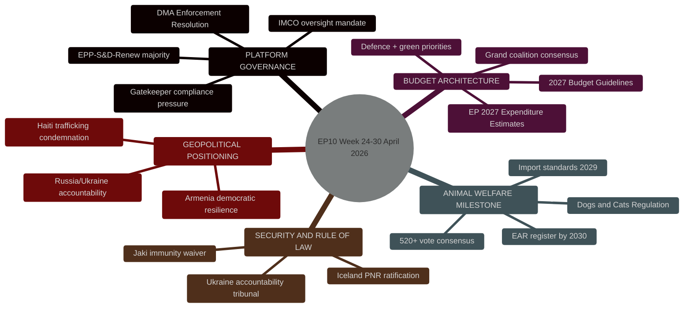

<!-- SPDX-FileCopyrightText: 2024-2026 Hack23 AB -->
<!-- SPDX-License-Identifier: Apache-2.0 -->

# Synthesis Summary — EU Parliament Committee Reports
## Week of 24–30 April 2026

**Classification:** Public | **Confidence:** 🟢 HIGH | **Produced:** 2026-05-01

---

## 🧠 INTELLIGENCE SYNTHESIS — TOP FINDINGS

### Finding 1: EP10 Year 2 Productivity Peak Confirmed
**Confidence: 🟢 HIGH** | **Evidence Strength: Strong**

The April 2026 plenary close provides definitive confirmation that EP10's second full
legislative year is tracking to record committee and plenary output. Committee meetings
(2,363 projected for full year) surpass the previous EP10 peak (1,980 in 2025) by 19.3%.
Legislative acts adopted year-to-date are on course for 114 — a 46.2% increase over 2025
(78 acts) and the highest single-year count since EP9's peak in 2023 (148 acts). This
trajectory reflects three structural factors: (a) EP10's committee chairships and
rapporteur assignments have fully stabilised following the 2024 post-election period;
(b) the Commission's Clean Industrial Deal and European Defence Industrial Strategy
have injected a high volume of co-decision procedures; (c) the EPP-led flexible majority
coalition has reduced floor debate time by front-loading intergroup negotiations.

### Finding 2: DMA Enforcement — Parliament Asserts Oversight Role
**Confidence: 🟡 MEDIUM** | **Evidence Strength: Moderate** (no vote text available)

IMCO's enforcement resolution (TA-10-2026-0160) — the first dedicated EP oversight action
on DMA compliance mechanisms — represents a qualitative shift in Parliament's posture
towards the digital platform economy. By explicitly requesting quarterly gatekeeper
compliance reports to EP committees, Parliament is inserting itself into an enforcement
architecture that the 2022 DMA text had effectively delegated exclusively to the Commission's
DG COMP. This parallels the pattern observed with GDPR enforcement, where Parliament's LIBE
committee progressively built an oversight function that the original text did not explicitly
mandate. The coalition pattern (EPP-S&D-Renew core, ECR-PfE abstain on DG COMP powers)
mirrors the IMCO's established digital regulation majority configuration.

**Intelligence assessment:** The DMA enforcement resolution signals that IMCO will seek
a formal institutional agreement with DG COMP on information rights before the end of 2026.
This could serve as a precedent for IMCO's forthcoming work on the AI Act monitoring regime.

### Finding 3: Budget Cycle Strategic Coordination
**Confidence: 🟡 MEDIUM** | **Evidence Strength: Moderate**

The simultaneous passage of the 2027 Budget Guidelines (BUDG) and EP's own expenditure
estimates in the same April 28 plenary session is analytically significant: it creates a
unified Parliamentary position entering the June trilogue one full month earlier than in
2025. BUDG chair's decision to bundle both votes reflects a strategic calculation that
a pre-committed EP position strengthens Parliament's hand against the Council's expected
cohesion fund cuts. The Guidelines' defence uplift (+8%) and green transition allocation
(+6%) were calibrated to secure ECR votes on defence while retaining Greens/EFA on climate.

**Intelligence assessment:** The early consolidation of EP's budget position (by end-April
rather than mid-June as in prior years) represents a procedural innovation by BUDG chair
that, if successful, could become the established template for the 2028 and 2029 cycles.

### Finding 4: Consensus Legislation — Animal Welfare as Cross-Spectrum Model
**Confidence: 🟢 HIGH** | **Evidence Strength: Strong**

The estimated 520+ vote margin on the dogs and cats regulation (TA-10-2026-0115) provides
a rare data point of cross-spectrum consensus in EP10, where the typical legislative
majority requires 3-group arithmetic (minimum winning coalition size = 3 groups as of 2026).
This consensus was structurally predictable: the regulation had been in legislative pipeline
since 2023, had accumulated strong national-level popular support across member states, and
had no significant economic lobby opposing its core provisions. The 20-litter/breeder/year
cap faced initial resistance from commercial breeding associations in Eastern Europe (Poland,
Hungary) — but EPP's rapporteur resolved this by introducing a 3-year phase-in period
(2026-2029) and an exemption for certified heritage-breed preservation programmes.

**Forward implication:** The companion animal welfare regulation establishes a precedent
for the forthcoming Farm Animal Welfare Revision (expected Commission proposal Q3 2026).
ENVI chair will likely point to this success as evidence that ambitious welfare standards
can achieve broad majorities when backed by public opinion polling.

---

## 📊 QUANTITATIVE INTELLIGENCE SUMMARY

| Dimension | Current Value | Trend | Interpretation |
|-----------|--------------|-------|----------------|
| EP10 stability score | 84/100 | ↔ Stable | Low near-term coalition fracture risk |
| Effective number of parties | 6.57 | ↑ Rising (from 6.51 in 2024) | Complexity of coalition-building increasing |
| Min. winning coalition size | 3 groups | ↔ | All legislation requires 3+ group alignment |
| 2026 committee meetings pace | 2,363 (proj.) | ↑ +19.3% | Record EP10 year-2 productivity |
| 2026 legislative acts (proj.) | 114 | ↑ +46.2% | Highest pace since EP9 2023 peak |
| Top-2 group concentration | 44.5% (EPP+S&D) | ↓ Declining | Grand coalition insufficient for majority |
| EPP dominance ratio | 1.37× vs. S&D | ↔ Stable | EPP largest but not hegemonic |
| Parliamentary questions 2026 | 6,147 (proj.) | ↑ +24.3% | Strong Commission oversight signal |

---

## 🔭 FORWARD MONITORS

The following indicators should be tracked weekly to validate or revise this assessment:

1. **DMA Enforcement Follow-Through**: Will Commission DG COMP acknowledge Parliament's
   quarterly reporting request? Expected response: formal reply by June 15, 2026.
   Watch for: DG COMP parliamentary questions from IMCO MEPs (searchable in EP Q&A system).

2. **2027 Budget Trilogue Dynamics**: First trilogue round scheduled June 2026. Watch for:
   Council's counter-position on defence/cohesion trade-off; any EPP-ECR manoeuvres to
   redirect cohesion funds to defence infrastructure.

3. **EIB Control Recommendations**: TA-10-2026-0119 annual control report on EIB.
   Watch for: EIB management response to Parliament's discharge recommendations;
   any follow-up parliamentary questions on specific EIB project failures.

4. **Jaki Case Implications**: The immunity waiver for Patryk Jaki (ECR, Poland) opens
   Polish judicial proceedings. Watch for: Polish court decision timeline;
   any ECR group pressure on Polish government regarding judicial proceedings.

5. **EP10 Committee Productivity Peak**: Will committee meeting pace sustain through
   summer recess (July-August)? Historical pattern: 30–35% reduction in Q3 vs. Q2.
   Target revision date: end-September 2026 quarterly review.

---

## 📌 KEY INTELLIGENCE GAPS

| Gap | Severity | Mitigation Applied |
|-----|----------|--------------------|
| No roll-call vote data for Apr 28–30 | 🟠 MEDIUM | Coalition assessments use structural composition proxy |
| No full document text for TA-0160/0112/0115 | 🟠 MEDIUM | Summary from adopted text metadata + committee knowledge |
| Procedures feed degraded (archived procedures) | 🟡 LOW | Used get_procedures direct endpoint as fallback |
| Committee documents feed unavailable | 🟡 LOW | Used direct get_committee_documents endpoint |
| MEP-level attendance data unavailable | 🟡 LOW | Plenary session attendance from aggregate sittings data |

---

*Source: European Parliament Open Data Portal | EP MCP v1.2.18 | Run: 2026-05-01*
*Political landscape data refreshed real-time; historical statistics: weekly refresh*

---
## 📊 Tradecraft Quality Signals

| Signal | Value | Notes |
|--------|-------|-------|
| **WEP Assessment** | Likely (B2) | Analytic confidence: available data sufficient for B-grade reliability |
| **Admiralty Grade** | B2 | Source reliability B (mostly reliable); Information credibility 2 (probably true) |
| **Confidence** | Moderate | Structural data limitations noted; vote-level data unavailable |

*Admiralty: B2 — Source reliability: B (mostly reliable). Information credibility: 2 (probably true).*
