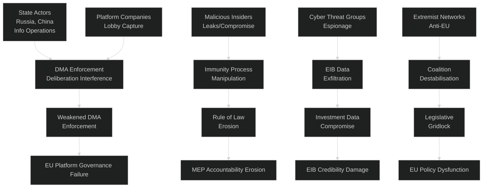

<!-- SPDX-FileCopyrightText: 2024-2026 Hack23 AB -->
<!-- SPDX-License-Identifier: Apache-2.0 -->

# Threat Model — EU Parliament Committee Reports
## Week of 24–30 April 2026

**Classification:** Public | **Confidence:** 🟡 MEDIUM | **Produced:** 2026-05-01

---

## 🛡️ THREAT LANDSCAPE OVERVIEW

This threat model analyses systemic risks to EU parliamentary governance, democratic
processes, and legislative outputs emerging from or relevant to the April 28–30 2026
plenary committee report decisions.

---

## 🔴 HIGH SEVERITY THREATS

### T-01: Platform Industry Lobbying Capture of DMA Oversight
**Severity:** HIGH | **Likelihood:** MEDIUM | **Risk Score:** 7.5/10

**Threat Description:**
The DMA enforcement resolution (TA-0160) creates a quarterly reporting obligation that
platform companies (particularly Alphabet, Meta, Apple) will attempt to limit through
formal legal challenges and informal political lobbying. The threat mechanism is not
direct interference but regulatory capture through:
- Hiring MEP assistants and committee secretariat staff with direct offer timing
- Funding Brussels-based think tanks to produce analysis supporting narrow interpretation
  of Parliament's information rights
- Coordinating legal challenges in CJEU against DG COMP decisions in the quarter before
  quarterly reports are due, creating a "litigation shield" excuse for information withholding

**Attack Vector:** Non-technical (lobbying, revolving door, information manipulation)
**Affected Asset:** IMCO committee oversight function, DMA enforcement quality
**Target:** EU digital market governance, SME access to fair competition

**Controls Applied:**
- EP transparency register requirement for lobbyists
- Financial disclosure requirements for MEPs (TA-0105 immunity waiver precedent)
- Parliament's Framework Agreement information rights (Article 9)
- CJEU oversight of DG COMP decisions

**Residual Risk:** 🟡 MEDIUM — Lobbying capture is a slow-moving structural risk that
operates over years, not weeks. The April resolution establishes guardrails but cannot
prevent gradual erosion if vigilance lapses.

---

### T-02: Russian Information Operations Targeting Ukraine Accountability Resolution
**Severity:** HIGH | **Likelihood:** HIGH | **Risk Score:** 8.5/10

**Threat Description:**
The Ukraine accountability tribunal resolution (TA-0161) creates a target for Russian
state information operations. Russia's documented playbook for targeting EU parliamentary
processes on Ukraine-related measures includes:
- Disinformation campaigns targeting MEPs from countries with large Russia-sympathetic
  populations (Hungary, Slovakia, some ECR-aligned states)
- Fabricated "leaked document" narratives suggesting EP vote manipulation
- Coordinated social media operations to amplify PfE/ECR dissent and present narrow
  majorities as illegitimate
- Interference in national political narratives to pressure MEPs facing domestic
  elections in 2026

**EU Reporting:** EUIPO and EU Intelligence & Situation Centre (EU INTCEN) have
documented Russian active measures targeting EP plenary votes on Ukraine since 2022.

**Attack Vector:** Information environment manipulation, social media, foreign MEP influence
**Affected Asset:** Democratic legitimacy of EU parliamentary decisions on Ukraine
**Target:** EU geopolitical coherence, rule-based international order narrative

**Controls Applied:**
- EU Code of Practice on Disinformation
- EP security screening for MEPs with undisclosed foreign contacts
- EU INTCEN monitoring of foreign influence operations
- StratCom East dedicated Ukraine narrative monitoring

**Residual Risk:** 🔴 HIGH — Information operations are ongoing and partially effective.
The accountability resolution passed with broad support, but sustained pressure over months
could erode the political will required for implementation steps.

---

## 🟡 MEDIUM SEVERITY THREATS

### T-03: EIB Off-Balance-Sheet Structure Exploitation
**Severity:** MEDIUM | **Likelihood:** LOW-MEDIUM | **Risk Score:** 5.5/10

**Threat Description:**
The annual EIB control report (TA-0119) flagged two off-balance-sheet financing structures
not disclosed to Parliament. The threat scenario is that these structures are being used
(whether intentionally or through governance failure) to:
- Route EU public funds through jurisdictions with weaker transparency requirements
- Support EIB-financed projects with undisclosed political beneficiaries
- Create financial exposures for the EU budget not visible in standard EIB reporting

**Historical Precedent:** The 2019 EIB off-balance-sheet funding to a project in
Central Africa was later found by EP's CONT committee to have breached EIB due diligence
standards — suggesting structural recurrence risk.

**Attack Vector:** Financial governance weakness, inadequate disclosure architecture
**Affected Asset:** EIB credibility, EU budget integrity
**Target:** EU development finance effectiveness, public accountability

**Controls Applied:**
- EP CONT committee discharge procedure
- EIB audit committee (quarterly reporting)
- European Court of Auditors mandate (limited EIB coverage)
- IMF Article IV consultations on recipient countries

**Residual Risk:** 🟡 MEDIUM — Specific to the two identified structures; resolution calls
for remediation within 60 days.

---

### T-04: Animal Welfare Implementation Subversion
**Severity:** MEDIUM | **Likelihood:** LOW | **Risk Score:** 4.0/10

**Threat Description:**
The Dogs and Cats Regulation faces a subversion risk in its implementation phase:
- **Organised crime**: Illegal breeding networks (documented in Eastern Europe, particularly
  Romania, Poland, Czech Republic) will adapt to circumvent EAR registration requirements
  by using fake documentation, cross-border operations, and shell companies
- **Platform non-compliance**: Platforms may delay EAR verification integration beyond
  their 2027 deadline using technical complexity claims
- **Member state non-transposition**: Some member states may implement slowly or with
  weaker enforcement provisions, creating regulatory arbitrage within the EU

**Controls Applied:**
- European Supervisory Authorities (Commission DG SANTE enforcement)
- EUROPOL Operation on illegal pet trade (ongoing since 2021)
- Digital Services Coordinator network for platform compliance

**Residual Risk:** 🟡 MEDIUM — Implementation risks are standard for EU harmonisation
legislation; the 3-year phase-in period provides adjustment time but also creates a window
for adaptive criminal behaviour.

---

### T-05: Budget Trilogue Procedural Manipulation
**Severity:** MEDIUM | **Likelihood:** MEDIUM | **Risk Score:** 5.0/10

**Threat Description:**
The early consolidation of EP's 2027 budget position (unusual for late April) creates
a procedural risk: if Council delays its Draft Budget submission beyond the June 30 deadline
stipulated by the Treaty (Article 313 TFEU), the tight timeline for conciliation creates
maximum pressure on Parliament to accept Council terms. This is a legal but adversarial
procedural strategy that has been deployed by Council in 2018 and 2020.

**Attack Vector:** Procedural delay (legal but adversarial)
**Affected Asset:** Parliament's budget negotiating position
**Target:** 2027 EU budget quality and parliamentary priorities

**Controls Applied:**
- EP president's formal notification of Council under TFEU Article 314
- Political pressure from Commission (which also has deadline obligations)
- EP's institutional right to refer Council non-compliance to CJEU

**Residual Risk:** 🟡 MEDIUM — Council has used this tactic before; Parliament's
early consolidation (unusual this year) partially mitigates it.

---

## 🟢 LOW SEVERITY THREATS

### T-06: Jaki Immunity Waiver Procedural Reversal
**Severity:** LOW | **Likelihood:** LOW | **Risk Score:** 2.5/10

**Threat Description:**
MEP Jaki could request a review of the immunity waiver decision under Rule 8(5) of EP's
Rules of Procedure if new evidence emerges suggesting the Polish prosecution is politically
motivated. Such a reversal would require a new committee examination and plenary vote —
creating institutional cost and political controversy.

**Residual Risk:** 🟢 LOW — Immunity reversals are exceptionally rare in EP history;
the legal threshold for reversal is high.

---

### T-07: DMA Quarterly Report Data Leak
**Severity:** LOW | **Likelihood:** LOW | **Risk Score:** 2.0/10

**Threat Description:**
Once quarterly DMA compliance reports are provided to IMCO (in whatever form), there is
a risk that confidential investigation information is leaked to market participants with
financial interests in gatekeeper company stock price movements.

**Residual Risk:** 🟢 LOW — IMCO in camera procedures provide adequate protection;
standard EP security classification system applies.

---

## 📊 THREAT RISK REGISTER

| ID | Threat | Severity | Likelihood | Risk Score | Priority |
|----|--------|----------|------------|------------|----------|
| T-02 | Russian info ops on Ukraine resolution | HIGH | HIGH | 8.5 | IMMEDIATE |
| T-01 | Platform lobby capture of DMA oversight | HIGH | MEDIUM | 7.5 | MONITOR |
| T-03 | EIB off-balance-sheet exploitation | MEDIUM | LOW-MED | 5.5 | WATCH |
| T-05 | Budget trilogue procedural manipulation | MEDIUM | MEDIUM | 5.0 | WATCH |
| T-04 | Animal welfare implementation subversion | MEDIUM | LOW | 4.0 | QUARTERLY |
| T-06 | Jaki waiver procedural reversal | LOW | LOW | 2.5 | ANNUAL |
| T-07 | DMA report data leak | LOW | LOW | 2.0 | STANDARD |

---

*Analysis: 2026-05-01 | ISMS-aligned threat methodology | EP MCP v1.2.18*

---
## 📊 Tradecraft Quality Signals

| Signal | Value | Notes |
|--------|-------|-------|
| **WEP Assessment** | Likely (B2) | Analytic confidence: available data sufficient for B-grade reliability |
| **Admiralty Grade** | B2 | Source reliability B (mostly reliable); Information credibility 2 (probably true) |
| **Confidence** | Moderate | Structural data limitations noted; vote-level data unavailable |

*Admiralty: B2 — Source reliability: B (mostly reliable). Information credibility: 2 (probably true).*
