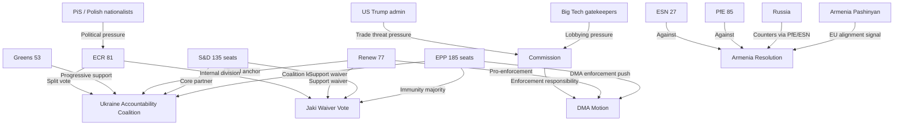

<!-- SPDX-FileCopyrightText: 2024-2026 Hack23 AB -->
<!-- SPDX-License-Identifier: Apache-2.0 -->

# Actor Mapping — EP Motions, 2026-05-01

**Classification:** UNCLASSIFIED // EU PUBLIC
**Methodology:** OSINT actor-mapping with interest/power/influence matrix
**Confidence:** 🟡 MEDIUM-HIGH

---

## Primary Actors

### Political Groups (EP Internal)

| Actor | Role | Interest | Power | Influence | Key Driver |
|-------|------|:--------:|:-----:|:---------:|-----------|
| **EPP** (185 seats) | Dominant coalition leader | HIGH | HIGH | HIGH | Defend rule-of-law norms; support Ukraine; accelerate DMA enforcement |
| **S&D** (135 seats) | Left-centre coalition partner | HIGH | HIGH | HIGH | Workers' rights, Ukraine solidarity, democratic accountability |
| **PfE** (85 seats) | Opposition bloc | MEDIUM | MEDIUM | MED-HIGH | Block Ukraine aid expansion; defend national sovereignty from EU overreach |
| **ECR** (81 seats) | Split actor — Ukraine yes, sovereignty no | HIGH (internal) | MEDIUM | MEDIUM | Jaki immunity: internal threat; Ukraine: support conditional |
| **Renew** (77 seats) | Liberal anchor | HIGH | MEDIUM | MEDIUM | DMA enforcement, Ukraine, rule of law |
| **Greens/EFA** (53 seats) | Progressive bloc | MEDIUM | LOW | MEDIUM | Ukraine accountability, Armenia, environmental riders |
| **The Left** (46 seats) | Progressive opposition | LOW-MED | LOW | LOW-MED | Haiti trafficking, Ukraine (nuanced), Armenia |
| **NI** (30 seats) | Heterogeneous | LOW | LOW | LOW | Individual MEP positioning |
| **ESN** (27 seats) | Far-right sovereigntist | MEDIUM | LOW | LOW | Against Ukraine aid expansion, against DMA enforcement |

### Key Individual MEPs

| MEP | Group | Country | Role/Relevance |
|-----|-------|---------|----------------|
| **Patryk Jaki** | ECR | PL | Immunity waiver subject; shadow rapporteur on rule-of-law files |
| **Roberta Metsola** | EPP | MT | Parliament President; presides over plenary; signals EP institutional stance |
| **Bernd Lange** | S&D | DE | INTA Chair; DMA enforcement, trade policy; active on geopolitical resolutions |
| **Markus Ferber** | EPP | DE | ECON Committee; financial regulation, EIB oversight |
| **Peter Liese** | EPP | DE | ENVI Committee; climate riders on budget guidelines |
| **Charles Goerens** | Renew | LU | Enlargement/development; Armenia, Haiti files |

### External Actors

| Actor | Type | Interest | Relevance |
|-------|------|----------|-----------|
| **Polish Government (Tusk)** | National government | HIGH — pro-EU mainstream | Jaki proceedings; rule-of-law reset |
| **PiS (Law and Justice)** | Polish opposition party | HIGH — defensive | Jaki immunity defence; framing as political persecution |
| **European Commission** | EU institution | HIGH — DMA enforcement | DMA: responsible for gatekeeper proceedings; Ukraine: sanctions implementation |
| **Russia (Kremlin)** | External state actor | HIGH — defensive | Ukraine accountability motion; information warfare response likely |
| **Armenia (Pashinyan govt)** | External partner government | HIGH — supportive | Armenia resilience resolution: validation of EU pivot |
| **Azerbaijan** | External state actor | MEDIUM — watchful | Armenia resolution: monitors for condemnation language on Nagorno-Karabakh |
| **Big Tech (Apple, Google, Meta, Microsoft)** | Corporate | HIGH — defensive | DMA enforcement motion: immediate regulatory exposure |
| **Haiti (PHTF/gangs)** | Non-state armed group | LOW — indirect | Haiti trafficking motion: triggers EU engagement narrative |
| **Kenya (MSS leadership)** | Partner country | MEDIUM | Haiti MSS: EU support validation |
| **United States (Trump admin)** | External superpower | HIGH — ambiguous | DMA enforcement (trade framing); Ukraine support (political pressure) |
| **ICC** | International institution | MEDIUM | Ukraine accountability: jurisdiction validation |

---

## Influence Network Diagram

---

## Power Matrix

| Actor | Formal Power | Informal Influence | Coalition Value |
|-------|:-----------:|:-----------------:|:--------------:|
| EPP | 🔴 HIGH | 🔴 HIGH | Indispensable |
| S&D | 🔴 HIGH | 🟡 MED | Core partner |
| Renew | 🟡 MED | 🟡 MED | Balance-tipper |
| ECR | 🟡 MED | 🟡 MED | Swing on foreign policy |
| PfE | 🟡 MED | 🟡 MED | Opposition bloc |
| Commission | 🔴 HIGH (external) | 🔴 HIGH | DMA execution authority |
| US/Trump admin | 🟡 MED (external) | 🔴 HIGH | DMA trade pressure |
| Russia | 🟡 MED (external) | 🔴 HIGH | Ukraine narrative war |

---

*Sources: EP Open Data Portal (MEP composition, group memberships, procedure data) | Methodology: OSINT actor mapping v2.1*
