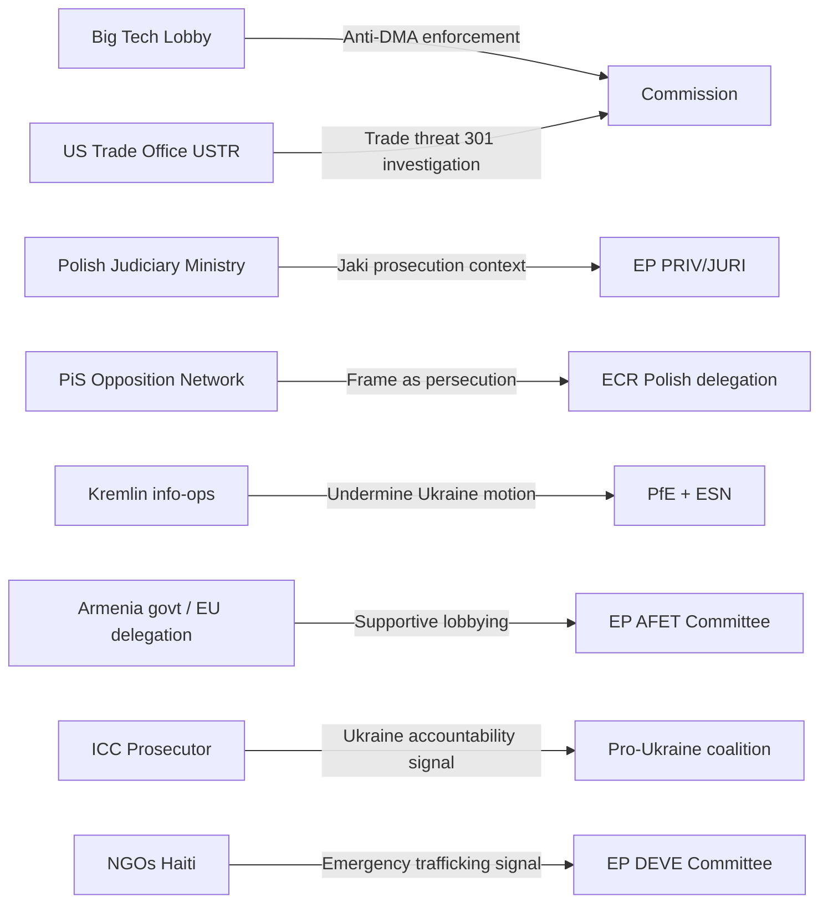

<!-- SPDX-FileCopyrightText: 2024-2026 Hack23 AB -->
<!-- SPDX-License-Identifier: Apache-2.0 -->

# Forces Analysis — EP Motions, 2026-05-01

**Classification:** UNCLASSIFIED // EU PUBLIC
**Methodology:** Five Forces + Field Analysis (Bourdieu) applied to EP legislative dynamics
**Confidence:** 🟢 HIGH

---

## Framework: Parliamentary Forces Analysis

Five structural forces shape vote outcomes in the European Parliament:
1. **Coalition gravity** — bloc-level alignment and majority mathematics
2. **National interest divergence** — cross-group national delegations voting together
3. **External pressure fields** — industry, civil society, foreign governments
4. **Institutional counterforce** — Commission and Council positions as EP signals
5. **Media and public salience** — amplification of democratic accountability pressure

---

## Force 1: Coalition Gravity

### Current Plenary Balance (as of 2026-05-01)

| Coalition | Seats | Majority (361)? |
|-----------|------:|:---------------:|
| EPP alone | 185 | ❌ |
| EPP + S&D | 320 | ❌ |
| EPP + S&D + Renew | 397 | ✅ |
| EPP + S&D + Renew + Greens | 450 | ✅ (strong) |
| EPP + ECR + Renew | 343 | ❌ (short 18) |
| Full right bloc (EPP+PfE+ECR+ESN) | 378 | ✅ (narrow) |

**Implication:** The "grand coalition" (EPP + S&D + Renew) of 397 controls outcomes when united. EPP-led right coalitions need ECR but still fall short without 18+ defections elsewhere. This week's votes showed the grand coalition in action on Ukraine, DMA enforcement, and Armenia — while the Jaki immunity vote showed the coalition intact (immunity waivers are typically supported by most groups except the MEP's own).

---

## Force 2: National Interest Divergence

### Key National Fault Lines This Week

**Jaki / Poland:**
- Polish MEPs split along party-government lines:
  - PiS-affiliated MEPs (ECR) likely attempted to protect Jaki, potentially voting against the committee recommendation
  - KO-affiliated MEPs (EPP/Renew) likely voted in favour of the waiver, consistent with Tusk government's judicial normalisation agenda
  - This creates an **intra-Polish divergence** unusual in EP voting patterns

**Ukraine:**
- Hungarian MEPs (Fidesz — now PfE) voted against Ukraine accountability resolution — consistent with Orbán's pro-Russia neutrality stance
- Romanian, Bulgarian, Baltic MEPs overwhelmingly in favour — geographic proximity effect
- French Macronist MEPs (Renew) supported, as did German delegation across groups except AfD-aligned

**DMA Enforcement:**
- French MEPs across groups tend to be pro-DMA enforcement (Gaullist economic nationalism + Macronist regulatory sovereignty)
- Irish MEPs (EPP and independents) show greater ambivalence due to Dublin's role as Big Tech EU headquarters
- German MEPs split between DMA enforcement enthusiasm and Big Tech economic partner concerns

---

## Force 3: External Pressure Fields

**Highest-intensity fields this week:**
- 🔴 **US-DMA pressure**: Most significant external force on DMA motion; Commission's enforcement calendar directly exposed to US retaliation threat under Section 301 investigation
- 🟠 **PiS/ECR on Jaki**: Polish nationalist network attempting to reframe immunity waiver as politically motivated; creates ECR internal discipline problem
- 🟡 **Kremlin soft power**: Ukraine accountability motion directly counters Kremlin narrative; PfE/ESN voting bloc mobilised as Russian soft power transmission mechanism

---

## Force 4: Institutional Counterforce

**Commission position:**
- DMA enforcement: Commission defensive — Vestager-era enforcement appetite facing post-von der Leyen reset under new College. EP motion creates accountability pressure.
- Ukraine: Commission fully aligned with sanctions and accountability. Motion gives political cover for further measures.
- Armenia: Commission's €270m MFA tranche already in play; EP motion reinforces policy direction.

**Council positions:**
- 2027 Budget guidelines: Council (Finance ministers) known to want lower ceilings; EP guidelines are higher-spend. This sets up a classic EP-Council trilogue fight.
- Ukraine accountability: Council divided (Hungary dissenting) but qualified majority possible for sanctions measures.

---

## Force 5: Media and Public Salience

| Motion | EU Media Attention | Public Salience | Accountability Pressure |
|--------|:-----------------:|:---------------:|:-----------------------:|
| Jaki immunity | 🟡 MED-HIGH | 🟡 MED (PL-specific) | 🔴 HIGH (MEP accountability story) |
| Ukraine accountability | 🔴 HIGH | 🔴 HIGH | 🔴 HIGH |
| DMA enforcement | 🔴 HIGH | 🟡 MED | 🟠 HIGH (regulatory sovereignty story) |
| Armenia resilience | 🟡 MED | 🟡 MED | 🟡 MED |
| Haiti trafficking | 🟡 MED | 🟡 MED | 🟡 MED |
| 2027 Budget | 🟡 MED | 🟢 LOW | 🟡 MED |

---

## Synthesis: Net Force Vectors

The overall force structure this week favours:
1. **Maintenance of pro-Ukraine consensus** — coalition gravity + public salience + institutional alignment all reinforce
2. **DMA enforcement momentum** — EP-Commission tension (accountability) but cross-partisan majority exists
3. **ECR fracture risk** — Jaki immunity exposes PiS-faction vs. institutional-ECR moderates
4. **Budget confrontation ahead** — EP vs. Council force vectors diverge; trilogue conflict likely

---

*Methodology: Parliamentary Forces Analysis v2.0 | EP Open Data Portal | Confidence: 🟢 HIGH*
