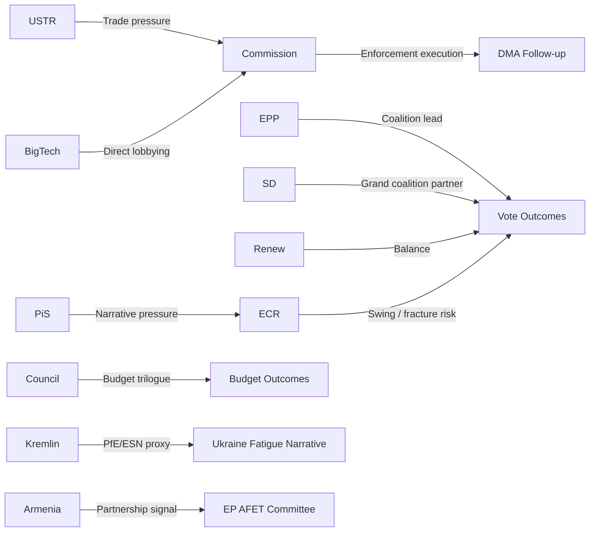

<!-- SPDX-FileCopyrightText: 2024-2026 Hack23 AB -->
<!-- SPDX-License-Identifier: Apache-2.0 -->

# Stakeholder Map — EP Motions, 2026-05-01

**Classification:** UNCLASSIFIED // EU PUBLIC
**Methodology:** Stakeholder mapping with interest/influence matrix and engagement strategy
**Confidence:** 🟡 MEDIUM-HIGH (motions-mandatory artifact)

---

## Stakeholder Universe

### Tier 1: Direct Political Actors (High Power + High Interest)

#### EPP Group (185 MEPs)
**Power:** 🔴 HIGH — largest group, determines coalition direction  
**Interest:** 🔴 HIGH — all six motions touch EPP core agenda  
**Position:** Pro-Jaki waiver (rule-of-law); pro-Ukraine; pro-DMA enforcement; pro-budget higher ceiling; pro-Armenia  
**Key spokespeople:** Roberta Metsola (EP President), Manfred Weber (group leader)  
**Engagement strategy:** Monitor EPP floor speeches for signals on ECR relationship post-Jaki; track budget negotiation position papers

#### S&D Group (135 MEPs)
**Power:** 🔴 HIGH — essential for grand coalition  
**Interest:** 🔴 HIGH — all motions align with S&D priorities  
**Position:** Aligned with EPP on Ukraine and rule of law; more hawkish on DMA enforcement (stronger Big Tech accountability); pro-Haiti development engagement  
**Key concern:** S&D may demand more specificity on Ukraine accountability funding (EU budget line for ICC)  
**Engagement strategy:** Track S&D shadow rapporteur statements on DMA, budget; monitor DEVE committee on Haiti

#### ECR Group (81 MEPs)
**Power:** 🟡 MEDIUM — swing bloc on specific files  
**Interest:** 🔴 HIGH (internal crisis) — Jaki is an ECR MEP  
**Position:** SPLIT: institutional ECR (Baltic/Nordic/FdI Italian moderates) support immunity process; PiS-Polish delegation likely abstained or voted against  
**Internal fault line:** ECR has 20 Polish MEPs out of 81 total; if the 20 Polish MEPs become systematically unreliable, ECR loses its value as EPP coalition partner  
**Engagement strategy:** Track ECR official group response to Jaki waiver (issued/not issued); monitor next plenary votes for Polish ECR attendance pattern

#### PfE Group (85 MEPs)
**Power:** 🟠 MEDIUM-HIGH — large enough to bloc oppose  
**Interest:** 🔴 HIGH — Ukraine motion, Armenia resolution directly opposed to PfE positions  
**Position:** Opposed to Ukraine accountability expansion, Armenia pro-EU signal, DMA enforcement (aligned with US Big Tech narrative)  
**Key spokespeople:** Viktor Orbán proxies; Italian Lega MEPs; Marine Le Pen's national delegation  
**Risk:** PfE's Council connections (Hungary PM, Italian Meloni despite FdI's ECR affiliation) create complex institutional dynamics

#### Renew Group (77 MEPs)
**Power:** 🟡 MEDIUM — balance-tipper  
**Interest:** 🟠 HIGH — DMA, Ukraine, rule of law are core Renew themes  
**Position:** Pro all six motions; most vocally pro-DMA enforcement (digital sovereignty = Macronist priority)  
**Key concern:** Internal Renew tension between French dirigisme and German ordoliberalism on DMA enforcement approach

---

### Tier 2: Institutional Actors (High Power + Variable Interest)

#### European Commission (DG COMP, DG TRADE, DG NEAR)
**Power:** 🔴 HIGH — holds enforcement and diplomatic execution authority  
**Interest:** Variable: DG COMP high (DMA); DG TRADE high (US 301 risk); DG NEAR high (Armenia)  
**Position:** Commission is target of accountability pressure from DMA motion; must balance EP accountability vs. US trade relationship  
**Key tension:** Post-von der Leyen Commission's appetite for Big Tech confrontation is uncertain; EP motion is a democratic mandate but not legally binding  
**Engagement:** Track Commission response timeline (3 months under EP Rules); monitor Vice-President for Digital Economy statements

#### Council (ECOFIN, Foreign Affairs Council, PSC)
**Power:** 🔴 HIGH — legislative co-author, budget final authority  
**Interest:** Variable: ECOFIN high (budget); FAC high (Ukraine, Armenia, DMA); PSC high (Armenia, Haiti)  
**Position:** Council likely to reject EP's higher budget ceiling; Council aligned on Ukraine but Hungary dissenting; Council supportive of Armenia partnership  
**Key risk:** Hungary using Council voting on sanctions to extract concessions (Cohesion Funds, rule of law conditionality)

#### European Parliament Committees (JURI, IMCO, AFET, DEVE, BUDG)
**Power:** 🟡 MEDIUM — committee-level agenda-setting  
**Interest:** 🔴 HIGH (Jaki/JURI, DMA/IMCO, Ukraine-Armenia/AFET, Haiti/DEVE, Budget/BUDG)  
**Role:** Post-plenary follow-through and accountability; rapporteurs will monitor Commission responses

---

### Tier 3: External State Actors

#### Polish Government (Tusk administration)
**Power:** 🟡 MEDIUM (national, not EP) | **Interest:** 🔴 HIGH (Jaki proceedings)  
**Position:** Supportive of waiver; judicial proceedings expected to proceed  
**Engagement:** Track Polish government communication on Jaki case; monitor whether Tusk government fast-tracks or slow-plays proceedings

#### Russian Federation
**Power:** 🟠 HIGH (external threat actor) | **Interest:** 🔴 HIGH (Ukraine motion)  
**Position:** Hostile to EP Ukraine motion; will amplify minority EP opposition narrative  
**Engagement:** Monitor RT/Kremlin-adjacent media for narrative response; track EP cyber incident reports post-vote

#### US Trump Administration / USTR
**Power:** 🔴 HIGH (trade retaliation) | **Interest:** 🔴 HIGH (DMA motion)  
**Position:** Hostile to DMA enforcement; may use 301 process as leverage  
**Engagement:** Track USTR Federal Register for 301 notices; monitor White House trade statements

#### Armenia Government (Pashinyan)
**Power:** 🟢 LOW (bilateral) | **Interest:** 🔴 HIGH (Armenia resolution)  
**Position:** Supportive; validation of EU pivot strategy  
**Engagement:** Track Armenian foreign ministry response; monitor CEPA implementation calendar

---

### Tier 4: Civil Society and Private Sector

#### Big Tech (Apple, Google, Meta, Microsoft)
**Power:** 🟠 HIGH (economic, legal) | **Interest:** 🔴 HIGH (DMA motion)  
**Position:** Opposed to enforcement acceleration; lobbying Commission for delays  
**Engagement:** Monitor EU Transparency Register for new lobbyist registrations; track Commission consultation submissions

#### Ukrainian civil society and government
**Power:** 🟢 LOW (EP-facing) | **Interest:** 🔴 HIGH (Ukraine motion)  
**Position:** Supportive; seeks stronger EU action  
**Engagement:** Track Ukrainian government official responses to EP vote

#### Haiti (PHTF, gangs, civil society)
**Power:** 🟢 LOW | **Interest:** 🟡 MEDIUM  
**Position:** Mixed: civil society supports EU engagement; MSS operation has mixed local reception

---

## Stakeholder Influence Map

---

## Engagement Priority Matrix

| Stakeholder | Priority | Action Required |
|-------------|:--------:|-----------------|
| Commission (DG COMP) | 🔴 P1 | Monitor DMA response (3-month window) |
| ECR Group | 🔴 P1 | Track Jaki episode impact on coalition reliability |
| USTR / US admin | 🔴 P1 | Monitor for 301 investigation signals |
| Council (ECOFIN) | 🟠 P2 | Track budget position response to EP guidelines |
| PfE Group | 🟠 P2 | Monitor Ukraine narrative evolution |
| Polish Government | 🟡 P3 | Track Jaki proceedings calendar |
| Big Tech | 🟡 P3 | Monitor EU Transparency Register |
| Armenia | 🟢 P4 | Track CEPA implementation |

---

*Methodology: Stakeholder mapping with interest/power matrix — mandatory artifact for motions type | Sources: EP Open Data Portal, EU Transparency Register (qualitative)*
