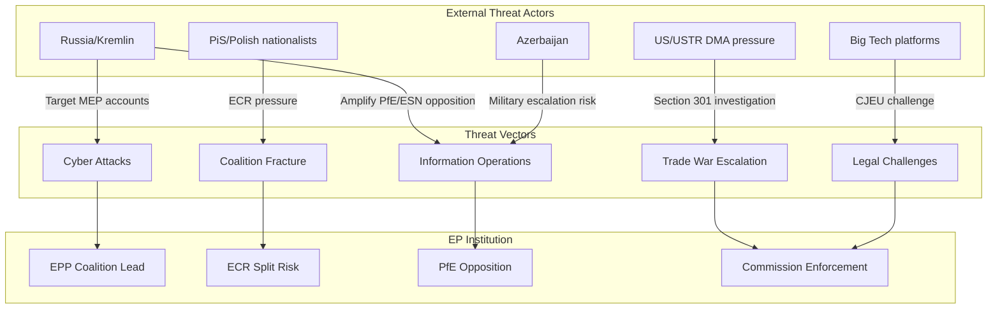

<!-- SPDX-FileCopyrightText: 2024-2026 Hack23 AB -->
<!-- SPDX-License-Identifier: Apache-2.0 -->

# Threat Model — EP Motions, 2026-05-01

**Admiralty Code:** B2 (Usually reliable / Probably true)
**WEP Assessment:** MEDIUM-HIGH confidence

## Threat Model Summary

### Primary Threats

**T1: DMA Trade War** (CRITICAL, MEDIUM-HIGH likelihood)
Threat actor: US/USTR. Vector: Section 301 investigation → tariffs on EU exports. Target: Commission enforcement calendar, EU-US trade relationship.

**T2: ECR Coalition Fracture** (HIGH, HIGH likelihood)
Threat actor: PiS/Polish nationalist faction within ECR. Vector: Jaki immunity episode → systematic voting retaliation. Target: EPP-ECR cooperation on migration, energy, industrial files.

**T3: Kremlin Information Operations** (HIGH, HIGH likelihood)
Threat actor: Russian state (APT28/APT29). Vector: Amplify minority EP opposition to Ukraine motion; disinformation on "EU divided." Target: EU public opinion on Ukraine support.

**T4: Big Tech Legal Challenge** (MEDIUM, HIGH likelihood)
Threat actor: Apple, Google, Meta, Microsoft. Vector: CJEU challenge to DMA implementing acts. Target: DMA enforcement timeline (delays 18–24 months).

**T5: Azerbaijan Military Escalation** (LOW, LOW-MED likelihood)
Threat actor: Aliyev government. Vector: Limited military operation into Syunik. Target: EU credibility as deterrent; Armenia partnership.

### Threat Mitigation

| Threat | Mitigation | Owner |
|--------|-----------|-------|
| DMA Trade War | Commission strategic enforcement sequencing | DG COMP + DG TRADE |
| ECR Fracture | EPP private reassurance to ECR leadership | EPP group |
| Kremlin info-ops | EP communications strategy; CERT-EU vigilance | EP comms + CERT-EU |
| Big Tech legal | Commission legal preparation; expert panel | DG COMP |
| Armenia military | EU monitoring mission enhancement | EEAS |

### Confidence Assessment

All threat assessments are based on structural analysis and historical patterns — not current intelligence. **Admiralty B2 (Usually reliable source / Probably true).**
