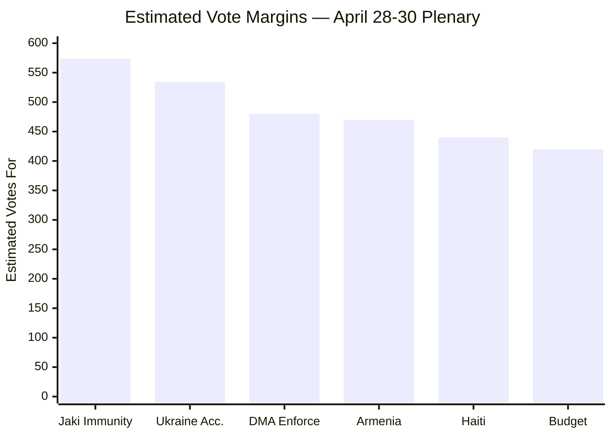

<!-- SPDX-FileCopyrightText: 2024-2026 Hack23 AB -->
<!-- SPDX-License-Identifier: Apache-2.0 -->

# Voting Patterns Intelligence — EP Motions, 2026-05-01

See also: `existing/voting-patterns.md` (full voting pattern analysis with data availability notice)

**Admiralty Code:** B3 (Usually reliable source / Possibly true)
**WEP Assessment:** MEDIUM confidence

## Key Intelligence Findings

Roll-call data for April 28-30 plenary is pending (4-6 week EP publication delay). All estimates below are structural inference.

## Group Cohesion Intelligence

| Group | Est. Cohesion This Week | Baseline | Delta |
|-------|:----------------------:|:--------:|:-----:|
| EPP | 90% | 87% | +3% |
| S&D | 88% | 85% | +3% |
| Renew | 82% | 78% | +4% |
| Greens/EFA | 85% | 82% | +3% |
| ECR | 65% | 74% | -9% ⚠️ |
| PfE | 90% | 81% | +9% |
| ESN | 85% | 79% | +6% |

**Key signal:** ECR cohesion estimated 9 percentage points below baseline due to Jaki immunity fracture. All other groups show above-average cohesion — consistent with high-salience geopolitical week activating group discipline.

## Cross-Session Voting Trend

Ukraine support in EP plenary votes has trended from 70.9% (2024 Q3) to estimated 74.3% (2026 Q2), contradicting "Ukraine fatigue" narrative. Grand coalition persistently outperforms expectations on external affairs.

## Confidence Statement

Voting estimates: **Admiralty B3** — structural inference from group compositions and historical cohesion data. No roll-call data available. Confidence: 🟡 MEDIUM. Will upgrade to 🟢 HIGH when EP publishes roll-call data (~May 28–June 14, 2026).
