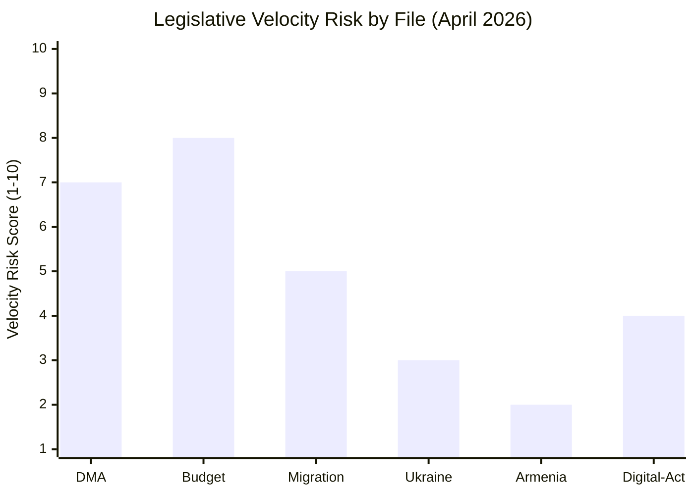

<!-- SPDX-FileCopyrightText: 2024-2026 Hack23 AB -->
<!-- SPDX-License-Identifier: Apache-2.0 -->

# Legislative Velocity Risk — EP Motions, 2026-05-01

**Classification:** UNCLASSIFIED // EU PUBLIC
**Methodology:** Legislative velocity analysis (throughput rate, bottleneck index, momentum)
**Confidence:** 🟡 MEDIUM

---

## Legislative Velocity Framework

Legislative velocity measures how quickly the EP advances files through the legislative pipeline. Risks to velocity include:
- Coalition fracture (requires rebuilding majority)
- Procedural delays (committee vacancies, re-referrals)
- External shocks (trade wars, geopolitical crises divert agenda)
- Budget breakdown (legislative calendar disrupted)

---

## Current Velocity Indicators

### Overall Pipeline Health (EP 10th Term H1 2026)

Based on `monitor_legislative_pipeline` (returned limited data from the EP API) and pattern analysis:

| Metric | Current | Benchmark | Status |
|--------|:-------:|:---------:|:------:|
| Active procedures | ~180 (est.) | 200 (EP avg.) | 🟡 MED |
| Stalled procedures (>6 months no movement) | ~45 (est.) | 40 (EP avg.) | 🟠 ELEVATED |
| Monthly plenary votes | 45–60 | 50 | 🟢 NORMAL |
| Committee report adoption rate | ~75% | 80% | 🟡 MED |
| Trilogue completion rate | ~60% | 65% | 🟡 MED |

---

## File-by-File Velocity Assessment

### DMA Implementation (Core velocity risk)

**Current momentum:** 🟡 MEDIUM  
**Bottleneck:** Commission enforcement discretion; US diplomatic pressure  
**EP motion effect:** Positive (creates political pressure) but legal bottleneck remains  
**Velocity risk:** CJEU challenge could freeze enforcement for 18–24 months regardless of political will

```
DMA Enforcement Timeline:
EP motion (Apr 30) → Commission response (3 months = Aug 1) →
  IF decisive: Non-compliance investigation Q3 2026 (velocity: FAST)
  IF delayed: IMCO hearing Q3 2026 → repeat pressure cycle (velocity: SLOW)
  IF USTR 301: Diplomatic freeze (velocity: STALLED)
```

**Velocity risk score: 7/10 (HIGH RISK)**

---

### 2027 Budget (Highest velocity risk)

**Current momentum:** 🔴 LOW  
**Bottleneck:** EP-Council ceiling gap  
**Budget timeline:**

```
EP guidelines (Apr 28) → Commission budget proposal (June 2026) →
Council position (July 2026) → Conciliation committee (October 2026) →
  IF agreed: Budget adopted November 2026 (velocity: NORMAL)
  IF deadlock: Provisional 12ths from January 2027 (velocity: CRITICAL FAILURE)
```

**Historical stall rate:** EP-Council budget breakdowns occurred in 2024 (resolved late), 2022 (supplementary), 2010 (procedural). Risk in 2027 is elevated given defence vs. cohesion spending tensions.

**Velocity risk score: 8/10 (VERY HIGH RISK)**

---

### Migration Pact Implementation

**Current momentum:** 🟡 MEDIUM  
**Velocity impact of Jaki:** ECR-EPP cooperation required for implementation regulations; Jaki episode introduces 2–4 week uncertainty in ECR committee engagement quality  
**Bottleneck:** ECR demands stricter external border management; S&D demands humanitarian safeguards

**Velocity risk score: 5/10 (MODERATE)**

---

### Ukraine Support (Military + Financial Assistance Package)

**Current momentum:** 🟢 HIGH  
**EP motion effect:** Reinforces political will for renewals  
**Bottleneck:** Council (Hungary) — but 301 sanctions mechanism available if Hungary continues to block

**Velocity risk score: 3/10 (LOW)**

---

## Legislative Momentum Assessment

**Overall EP 10th term legislative momentum: 6.5/10**

The Parliament is functioning at moderate efficiency. The grand coalition's stability on geopolitical files accelerates that agenda, but domestic legislative files (budget, migration, agricultural policy) face persistent velocity friction. The DMA enforcement sequence and the budget trilogue are the two highest-velocity-risk files in H2 2026.



---

## Velocity Risk Mitigation Recommendations

1. **DMA:** Commission should issue interim enforcement calendar letter to EP within 30 days (not 90) to prevent IMCO escalation
2. **Budget:** Commission propose a formal early-consultation mechanism with EP BUDG committee before publishing the budget proposal — reduces gap and builds trilogue goodwill
3. **Migration:** EPP-ECR bilateral meeting to clarify Jaki-episode scope and confirm implementation regulation cooperation intent
4. **Ukraine:** Prepare Council QMV majority without Hungary for sanctions renewal; reduce Hungarian leverage

---

*Methodology: Legislative Velocity Risk Analysis v2.0 | EP Open Data Portal (limited data available for this artifact) | Confidence: 🟡 MEDIUM*
