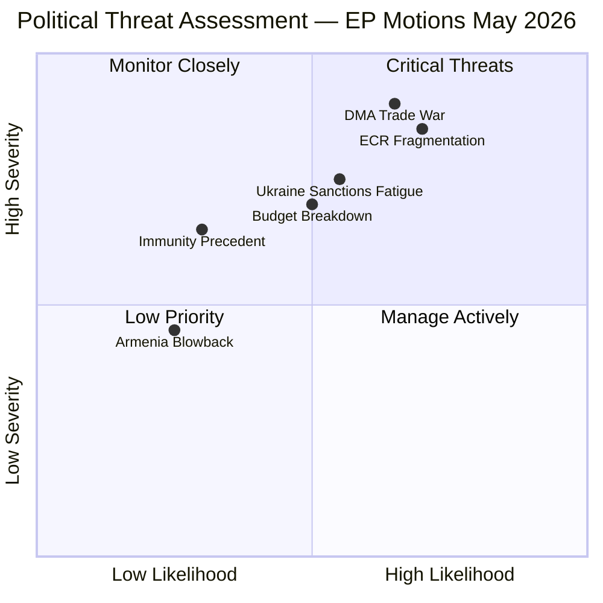

<!-- SPDX-FileCopyrightText: 2024-2026 Hack23 AB -->
<!-- SPDX-License-Identifier: Apache-2.0 -->

# Political Threat Landscape — EP Motions, 2026-05-01

**Classification:** UNCLASSIFIED // EU PUBLIC
**Methodology:** Threat landscape analysis using STRIDE-adapted political threat model
**Confidence:** 🟡 MEDIUM-HIGH

---

## Threat Taxonomy

| Category | Code | Description |
|----------|------|-------------|
| Democratic erosion | DE | Actions or votes that undermine rule of law, accountability, or democratic norms |
| Coalition fragmentation | CF | Forces that could break EP majority coalitions |
| Geopolitical destabilisation | GD | External state/non-state threats exploiting EP votes |
| Regulatory capture | RC | Lobby-driven deviation from public interest legislation |
| Institutional legitimacy | IL | Threats to EP's credibility or authority as democratic institution |

---

## Threat Catalogue

### T-01: ECR Internal Fragmentation (Jaki Immunity)
**Category:** CF (Coalition Fragmentation)
**Severity:** 🔴 CRITICAL
**Likelihood:** HIGH

**Description:** The Jaki immunity waiver vote creates a fundamental tension within ECR: the group's institutional reputation requires compliance with EP JURI committee recommendations, but the PiS-aligned Polish delegation views compliance as political betrayal. If Polish ECR MEPs voted against the waiver, this signals a precedent where national party loyalty overrides group discipline — directly undermining ECR's coherence.

**Impact path:**
1. Jaki waiver passes (majority of EP votes in favour, including most ECR moderates)
2. Polish PiS-ECR MEPs either vote against (visible revolt) or abstain (passive non-compliance)
3. ECR leadership faces pressure: condemn the waiver (further alienating rule-of-law MEPs in group) or stay silent (emboldening PiS faction)
4. Medium-term: ECR loses credibility as reliable partner for EPP on foreign policy resolutions

**Mitigation:** ECR leadership frames the vote as procedural (committee-driven) rather than political; Polish MEPs given cover to abstain rather than oppose

---

### T-02: US-DMA Trade War Escalation
**Category:** GD + RC (Geopolitical + Regulatory Capture)
**Severity:** 🔴 CRITICAL
**Likelihood:** MEDIUM-HIGH

**Description:** The Trump administration has signalled that DMA enforcement targeting American tech companies may trigger Section 301 trade retaliation. The EP motion demanding accelerated enforcement directly creates political cover for the Commission to proceed — but simultaneously escalates the bilateral trade tension.

**Impact path:**
1. EP motion passes → political pressure on Commission to accelerate DMA proceedings
2. Commission opens formal proceedings against Apple, Google, Meta
3. US USTR formally initiates 301 investigation, citing DMA as trade barrier
4. EU faces tariff threats on automotive, luxury goods, financial services exports
5. Commission caught between EP accountability pressure and Council trade defensiveness

**Mitigation:** Commission employs strategic sequencing — announces enforcement calendar but delays first formal non-compliance decision until US trade negotiations clarify

---

### T-03: Ukraine Sanctions Fatigue (PfE/ESN Bloc)
**Category:** DE + GD
**Severity:** 🟠 HIGH
**Likelihood:** MEDIUM

**Description:** PfE (85 seats) and ESN (27 seats) together form a 112-seat bloc voting consistently against Ukraine aid expansion and accountability measures. While their combined weight (112/719 = 15.6%) is insufficient to block motions, their persistent opposition normalises the "Ukraine fatigue" narrative and creates domestic political cover in Hungary, Italy, and Austria for government positions that slow sanctions implementation.

**Impact path:**
1. PfE/ESN bloc votes against Ukraine accountability motion
2. Kremlin-linked media amplifies "even in EP, many oppose Ukraine blank cheque" narrative
3. Hungarian government uses EP minority position as EU-level cover for its bilateral positions
4. Long-term: sanctions renewal in Council becomes harder as domestic political costs accumulate

---

### T-04: Democratic Backsliding via Immunity Precedent
**Category:** DE + IL
**Severity:** 🟠 HIGH
**Likelihood:** LOW-MEDIUM

**Description:** There is a theoretical risk that the Jaki immunity waiver, if perceived as politically motivated (which PiS will assert), damages the principle of parliamentary immunity as a protection for legitimate political activity. If the Polish trial produces a manifestly unjust outcome, the EP's decision to grant the waiver becomes retrospectively damaging to its institutional credibility.

**Countervailing assessment:** The JURI committee's process was rigorous and the committee recommendation was clear. The threat is primarily a reputational risk if the Polish judicial proceedings are not independent. This is an external threat (Polish judicial integrity) rather than an EP-internal threat.

---

### T-05: Budget Trilogue Breakdown
**Category:** IL + CF
**Severity:** 🟠 HIGH
**Likelihood:** MEDIUM

**Description:** The 2027 budget guidelines adopted by EP significantly exceed what member states in the Council are willing to accept. If the annual budget cycle enters prolonged breakdown (provisional 1/12ths regime), key EU programmes (Cohesion, Horizon, Erasmus, Agricultural) face payment uncertainty. This has happened twice in recent EP history (2024, 2022 supplementary budget).

---

### T-06: Armenia Geopolitical Blowback
**Category:** GD
**Severity:** 🟡 MEDIUM
**Likelihood:** LOW-MEDIUM

**Description:** The Armenia resilience resolution may trigger Azerbaijan's displeasure and incentivise Aliyev government to escalate rhetoric about EP's "one-sided" approach. Russia may frame the resolution as EU expansionism into the former Soviet space.

---

## Threat Risk Matrix

---

## Summary Risk Register

| ID | Threat | Category | Severity | Likelihood | Priority |
|----|--------|----------|:--------:|:----------:|:--------:|
| T-01 | ECR Fragmentation | CF | 🔴 | HIGH | 🔴 P1 |
| T-02 | DMA Trade War | GD+RC | 🔴 | MED-HIGH | 🔴 P1 |
| T-03 | Ukraine Fatigue | DE+GD | 🟠 | MED | 🟠 P2 |
| T-04 | Immunity Precedent | DE+IL | 🟠 | LOW-MED | 🟡 P3 |
| T-05 | Budget Breakdown | IL+CF | 🟠 | MED | 🟠 P2 |
| T-06 | Armenia Blowback | GD | 🟡 | LOW | 🟢 P4 |

---

*Methodology: STRIDE-adapted Political Threat Model v2.0 | Sources: EP Open Data Portal, political pattern analysis*
