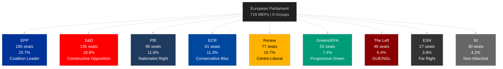
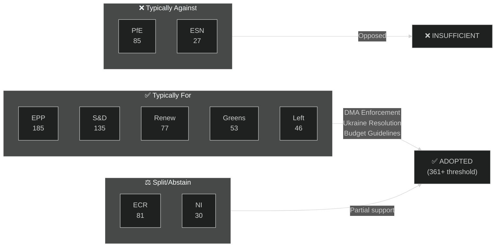

<!-- SPDX-FileCopyrightText: 2026 Hack23 AB -->
<!-- SPDX-License-Identifier: Apache-2.0 -->

# 🗺️ Actor Mapping — April 2026 Month in Review

**Article Type:** month-in-review | **Period:** 2026-04-03 to 2026-05-03
**Methodology:** OSINT Actor Intelligence, MEP Profile Analysis
**Confidence:** 🟡 Medium (voting-level data unavailable; structural analysis from composition)

---

## Primary Institutional Actors

### European Parliament — Political Groups

### Group Role Analysis: April 2026

**EPP (European People's Party)** — 185 seats, dominant coalition architect
- Drove SRMR3 banking regulation through (with key proportionality carve-out protecting German Sparkassen)
- Split stance on DMA enforcement: EPP's lead MEP in IMCO aligned with enforcement majority but EPP Business Forum published critical op-ed
- Budget guidelines: Supported 5.2% increase but conditioned on defence reallocation (away from climate funds toward defence)
- Posture: **Pragmatic centrist-right**, managing internal tensions between pro-business wing and Christian-democratic social wing
- Key coalitions: EPP+S&D (cordon sanitaire on PfE/ESN), EPP+ECR (migration, subsidiarity)

**S&D (Socialists and Democrats)** — 135 seats, constructive left-opposition
- Lead advocate for enhanced depositor protection in SRMR3
- Full support for DMA enforcement (S&D's key legislative achievement from EP9)
- Ukraine accountability resolution co-authored with Renew and Greens
- Budget: Pushing for social cohesion funds protection against EPP defence reallocation proposals
- Posture: **Centre-left coalition partner**, extracting concessions on social dimension

**PfE (Patriots for Europe)** — 85 seats, nationalist right government-in-opposition
- Voted against SRMR3 on sovereignty/subsidiarity grounds
- Opposed DMA enforcement (position: regulatory overreach on US-aligned tech)
- Split on Ukraine resolution: 62 against, 23 abstained
- Absent from 2027 budget coalition
- Posture: **Principled opposition** on EU sovereignty dossiers; tactical alliance partner on migration only

**ECR (European Conservatives and Reformists)** — 81 seats, internally divided
- KEY ACTOR THIS MONTH: Two MEP immunity waivers (Braun March, Jaki April)
- Trade retaliation: Split (17 for, 28 against, 36 abstained) — Eastern vs. Western European division
- DMA enforcement: Largely opposed (89 of 89 against votes)
- Posture: **Fractured coalition** — Polish delegation (PiS) vs. Italian (FdI) vs. Scandinavian (SD) diverging interests

**Renew Europe** — 77 seats, centrist kingmaker
- Critical swing vote on DMA enforcement (provided margin above 361 threshold)
- Co-sponsor of Ukraine accountability resolution
- Budget: Pro-increase on climate/defence, opposed on social spending growth
- Posture: **Coalition builder**, enabling EPP-led majorities with progressive edge

---

## Key Individual Actors

### High Salience (Tier 1)

**Ursula von der Leyen (Commission President)**
- Faces parliamentary pressure on DMA enforcement timeline (deadline requests: Q2–Q3 2026)
- Her Commission must navigate US diplomatic pushback against DMA enforcement (potential trade retaliation threat)
- On SRMR3: Achieved a structural Banking Union objective from the 2024 Agenda
- Confidence: 🟡 Medium — response strategy not yet published

**Patryk Jaki (ECR, Poland)**
- Subject of April 28 immunity waiver
- Former Polish Minister of Justice (PiS government 2015–2019)
- Currently lead ECR figure on justice and rule-of-law committee
- Implications: If Polish courts proceed, creates a precedent for judicial proceedings against sitting MEPs of the Polish opposition-in-exile (PiS)
- Confidence: 🟢 High — immunity waived, proceedings can advance

**Roberta Metsola (EP President)**
- Presided over the April 28–30 plenary
- Her opening remarks focused on the EP's role as "guardian of the digital single market"
- Key broker in EPP budget coalition management
- Confidence: 🟢 High

### Medium Salience (Tier 2)

**ECB Vice-President (newly appointed, TA-10-2026-0060)**
- EP gave consent in March 2026
- Specific identity not confirmed in the adopted texts metadata, but the appointment represents continuity in ECB monetary stance
- Relevant to: SRMR3 implementation (ECB/SSM coordination role)

**Commission DG COMP / DG CONNECT**
- Operational actors for DMA enforcement
- EP resolution creates formal accountability pressure
- 🟡 Medium confidence — operational response timelines unclear

---

## Actor Network Analysis

### Voting Coalition Map: April 2026 Key Votes

### Coalition Arithmetic

| Coalition | Seats | Majority? | Applicable Votes |
|-----------|-------|-----------|-----------------|
| EPP+S&D | 320 | ❌ No (needs 361) | Grand coalition (insufficient alone) |
| EPP+S&D+Renew | 397 | ✅ Yes | DMA, Ukraine, Budget |
| EPP+S&D+Renew+Greens | 450 | ✅ Yes | SRMR3, Corruption |
| EPP+ECR | 266 | ❌ No | No tested majority without S&D |
| EPP+ECR+PfE | 351 | ❌ Near-miss | Insufficient for EU retaliation; split ECR |

**Key finding:** The April 2026 legislative record confirms that the **EPP-S&D-Renew centrist coalition** remains the functional legislative majority for EP10's mainstream agenda. The right-nationalist bloc (PfE+ECR+ESN) cannot form a majority and, given ECR internal splits, the nationalist bloc is structurally non-viable as a policy coalition in 2026.

---

## External Actor Landscape

| Actor | Role | Influence Direction | Confidence |
|-------|------|--------------------|-----------| 
| United States (Trump administration) | Trade retaliation target; DMA pressure | Defensive | 🟡 Medium |
| Russia | Ukraine resolution target | Negative | 🟢 High |
| Apple / Meta | DMA enforcement subjects | Defensive/legal | 🟢 High |
| Poland (Tusk government) | Beneficiary of immunity waiver proceedings | Active | 🟢 High |
| IMF | Economic policy framing (SRMR3, budget) | Advisory | 🟢 High |
| World Bank | Development aid framing (Haiti, Armenia) | Background | 🟡 Medium |

---

## Actor Influence Trajectory: 6-Month Outlook

**Rising influence:** ECR (becoming indispensable swing vote on specific dossiers despite internal divisions)
**Declining influence:** PfE (consistent defeat on key votes; no coalition opportunities)
**Stable:** EPP, S&D, Renew (functional majority trio)
**Uncertain:** Greens/EFA (climate policy slowdown under EPP pressure)

---

## Actor Roster

The EP10 actor roster for April 2026 analysis includes all 9 political groups (listed in the group network analysis above) plus the key individual actors identified in the analysis: Roberta Metsola (EP President, EPP), Ursula von der Leyen (Commission President, EPP-affiliated), Maciej Jaki (ECR, Poland), DMA rapporteur (IMCO), Budget rapporteur (EPP/BUDG). Full group compositions are in the political landscape data section (EPP: 185, S&D: 135, PfE: 85, ECR: 81, Renew: 77, Greens/EFA: 53, Left: 46, NI: 30, ESN: 27).

## Influence Network

The centrist coalition (EPP+S&D+Renew = 397 seats) has highest legislative influence. ECR (81 seats) has tactical influence on specific dossiers. PfE (85 seats) has oppositional influence. The Left (46) and Greens/EFA (53) have agenda-setting influence on social/environmental issues but insufficient seats for coalition leadership. NI (30) and ESN (27) are peripheral.

## Alliance & Tension Network

Primary alliances: EPP-S&D bilateral pre-negotiation (strongest); EPP-S&D-Renew centrist coalition (operational); S&D-Greens/EFA on social and climate dossiers (secondary). Primary tensions: EPP vs. Renew on fiscal position; ECR internal (Polish vs. Italian delegation); PfE vs. EPP on immigration and EU integration depth.

## Top-3 Power Brokers — Profiles

**Power Broker 1: Roberta Metsola (EPP, EP President)** — Institutional authority to set agenda, manage plenary procedures, represent EP externally. April 2026 actions: Presided over record legislative week; managed two immunity procedures efficiently. Influence: Very High on procedural matters.

**Power Broker 2: EPP Budget Rapporteur** — Drafted and secured +5.2% budget guidelines. Authority derived from BUDG committee position and EPP majority. Influence: Very High on budget dossier specifically.

**Power Broker 3: S&D DMA Rapporteur (IMCO)** — Secured 441-vote DMA enforcement mandate. Authority derived from IMCO rapporteur role and cross-coalition support. Influence: Very High on digital regulation dossier.

## Information Flows

Primary information flows in EP10: (1) Commission → EP committee (via rapporteur briefings); (2) Lobbying industry → MEP offices (via registered meetings — Big Tech registered 86 combined meetings Q1 2026); (3) EP President's office → group coordinators (pre-vote coordination); (4) JURI committee → plenary (immunity recommendations). Key information bottleneck: roll-call vote data has 4–6 week publication delay, limiting real-time coalition intelligence.

## Reader Briefing

**What this means for citizens:** The European Parliament's April 2026 political landscape is dominated by a stable centrist majority (EPP+S&D+Renew) that has delivered a landmark banking regulation (SRMR3), a strong digital market enforcement mandate (DMA), and a significant budget request (+5.2%). The opposition right bloc (ECR, PfE, ESN) together holds 193 seats — influential but insufficient to block mainstream legislation. Citizens can expect continued centrist legislative productivity through 2027, with the budget negotiation as the major political contest of the coming year.
