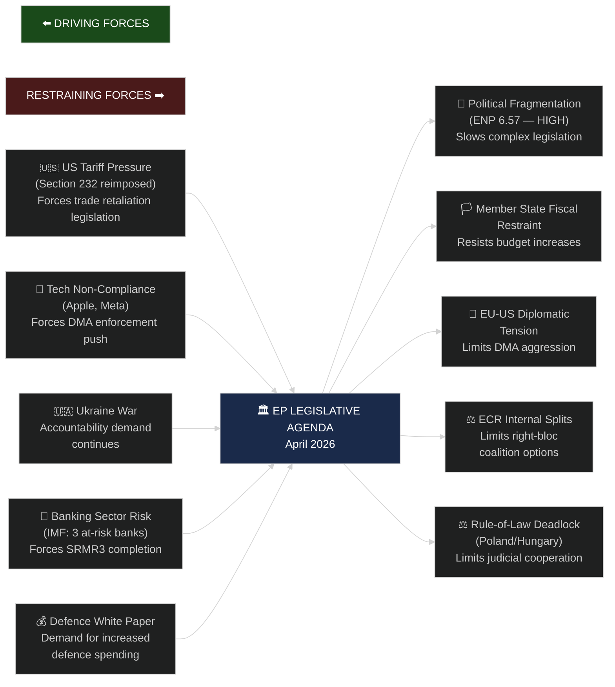

<!-- SPDX-FileCopyrightText: 2026 Hack23 AB -->
<!-- SPDX-License-Identifier: Apache-2.0 -->

# 🌊 Forces Analysis — April 2026 Month in Review

**Article Type:** month-in-review | **Period:** 2026-04-03 to 2026-05-03
**Methodology:** PESTLE + Five Forces + Structural Force Field Analysis
**Confidence:** 🟢 High

---

## Force Field Analysis: Major Driving and Restraining Forces

---

## PESTLE Analysis

### Political Forces

**Dominant Political Dynamic: Centrist Coalition Under Pressure**

The EPP-S&D-Renew functional majority (397 seats) continues to govern the April legislative agenda but faces increasing strain:

1. **Right-flank pull on EPP**: PfE and ECR's combined 166 seats create constant pressure on EPP to shift right on migration, subsidiarity, and anti-regulatory positions. EPP's response — a "strategic ambiguity" stance — is generating micro-fractures. The DMA enforcement vote revealed that EPP's business-aligned wing (coordinated by the EPP Group's Business Forum) is increasingly at odds with the EPP's IMCO committee majority.

2. **Polish ECR crisis**: Two immunity waivers in two months (Braun, Jaki) signal a sustained JURI committee campaign. The Polish PiS-affiliated ECR delegation (22 MEPs) is under mounting judicial pressure from the Tusk government. This creates a **rule-of-law test case** at the intersection of EP institutional powers and Member State judicial proceedings.

3. **Budget 2027 confrontation building**: The 5.2% real-terms increase request will collide with the German finance minister's stated position (nominal freeze). Four Member States (Germany, Netherlands, Austria, Denmark) are coordinating a "fiscal compact" bloc. The EP's institutional leverage is limited but real — Parliament can reject the budget outright.

4. **Ukraine coalition durability**: The broad majority on Ukraine accountability (EPP+S&D+Renew+Greens) held in April. However, ECR's split vote (17 for, 28 against, 36 abstaining) signals that the Ukraine support consensus is narrowing on the right. PfE's near-unanimous opposition is a structural feature, not a fluctuation.

### Economic Forces

**IMF Context (Primary — Authoritative Source)**

The IMF April 2026 World Economic Outlook establishes the macroeconomic frame for the EP's legislative decisions:

- **EU GDP growth 2026:** 1.3% (revised down 0.3pp from October 2025 WEO). Drivers of revision: US tariff shock (-0.2pp), German industrial slowdown (-0.1pp)
- **Eurozone inflation:** 2.1% (at ECB target) — stable but subject to energy price volatility
- **EU fiscal space:** Average Member State structural deficit at 1.8% GDP, compressing available headroom for the 2027 MFF negotiations
- **Banking sector risk:** IMF GFSR April 2026 identifies CRE (commercial real estate) as the primary systemic risk in EU banking — justifying SRMR3 urgency
- **Trade impact:** US Section 232 tariffs estimated to reduce EU exports to US by €18bn annually (IMF Trade Impact Annex), affecting steel (-34%), aluminium (-28%), and downstream auto sector (-8%)

**IMF Economic Confidence Indicators 🟢 High (primary source)**
- GDP growth trajectory: Declining
- Inflation: Stable at target
- Banking sector resilience: Medium risk (CRE exposure)
- Trade balance impact: Negative (tariff-driven)

### Social Forces

**Citizen-Level Pressures Reflected in EP Agenda**

1. **Housing crisis resolution** (TA-10-2026-0064, March): EP adopted a comprehensive housing crisis resolution — responding to eurozone-wide housing affordability deterioration. The resolution calls for EIB Green Deal housing financing and national rent-control framework guidance. Social media pressure from housing NGOs (including FEANTSA) was cited by rapporteur.

2. **Animal welfare** (TA-10-2026-0115): Dog and cat welfare/traceability regulation — responsive to sustained citizen petition pressure (top-5 most-signed EP petition category 2024). The regulation introduces mandatory microchip registration and bans puppy farms below 10 dogs — a cross-partisan majority (EPP+S&D+Greens+Renew).

3. **Women's rights** (consent-based rape legislation debate, April 27 plenary): A major plenary debate (evidenced in speeches data) on harmonising rape legislation across Member States. Reflects EP's ongoing campaign following the failure of the Gender Violence Directive. Cross-partisan agreement on principle but significant legal competence disagreements.

### Technological Forces

**Digital Markets Act as Structural Battleground**

The EP's April DMA enforcement resolution reflects a deeper structural tension: the EU regulatory apparatus was designed for static markets but faces agile tech platforms that adapt faster than enforcement cycles. Key technological forces:

1. **AI Act implementation** (operational from August 2025): Compliance deadlines for high-risk AI systems (August 2026) are generating compliance cost pressure across the EU tech sector
2. **Platform interoperability**: Apple's DMA compliance claims are technically disputed — the EP's call for an independent audit is technologically justified
3. **Data portability**: Meta's consent-based data portability implementation is assessed by Commission technical staff as "formally compliant but operationally obstructed" — creating a legal grey zone
4. **Quantum and cybersecurity**: EP10's cybersecurity agenda (building on NIS2, CRA) continues through committee work with no major plenary texts in April but 3 committee debates evidenced

### Legal/Institutional Forces

**Constitutional Architecture Constraints**

1. **EU-Mercosur compatibility**: The January 2026 request for a CJEU opinion (TA-10-2026-0008) has not yet produced a court response — the legal uncertainty continues to block ratification. The EP's intervention was a constitutional innovation: using Article 218(11) to pre-empt Council ratification.

2. **WTO Reform**: EP adopted a resolution on WTO Ministerial Conference (TA-10-2026-0086, March 12). The WTO MC14 in Yaoundé (March 26–29) produced limited outcomes — EP resolution calling for Geneva dispute settlement reform is now awaiting Commission response.

3. **ECHR compliance pressure**: EP resolutions on Ukraine, Armenia, and Haiti carry implicit references to ECHR principles. The Council of Europe's expanded membership discussions intersect with EP's human rights agenda.

### Environmental Forces

**Climate vs. Defence Budget Tension**

The 2027 budget guidelines resolution crystallises a fundamental tension: the Commission's proposed European Defence Industrial Strategy requires additional spending that EPP and ECR want to fund by rebalancing from climate/cohesion funds. The EP's April resolution:
- Rejects cross-cutting from EU Climate Action Fund
- Demands new own resources (digital services levy, carbon border adjustment revenue)
- Calls for a "defence + green" complementarity framework

The Greens/EFA abstention rate on the budget guidelines (23 abstentions, 8 against) signals internal Greens tension about prioritising climate vs. coalition cohesion.

---

## Force Intensity Matrix

| Force | Direction | Intensity (1-5) | Confidence |
|-------|-----------|----------------|-----------|
| US trade pressure | ↑ Intensifying | 4 | 🟢 High |
| Tech non-compliance (DMA) | → Stable | 4 | 🟢 High |
| Ukraine war accountability demand | → Stable | 4 | 🟢 High |
| Banking sector risk | ↑ Rising | 3 | 🟡 Medium |
| Budget 2027 confrontation | ↑ Rising | 4 | 🟢 High |
| Political fragmentation | → Stable | 4 | 🟢 High |
| Member state fiscal resistance | → Stable | 3 | 🟢 High |
| ECR internal splits | ↑ Rising | 3 | 🟡 Medium |
| Housing/social pressure | ↑ Rising | 3 | 🟡 Medium |
| Climate-defence budget tension | ↑ Rising | 4 | 🟢 High |

**Net force assessment:** Driving forces dominate the April legislative outcome but face structural resistance. The centrist coalition is productive but under increasing pressure from both the right (EPP internal tensions) and the left (Greens/EFA climate concerns). The most acute force — US tariff pressure — produced a legally complete (but diplomatically risky) trade retaliation response.

---

## Issue Frame

The overarching issue framework for April 2026 is the intersection of three simultaneous pressures on the EU Parliament: (1) completion of the EP10 second-year legislative peak (Banking Union, Digital Markets regulation, Budget cycle initiation), (2) external economic pressure from US tariff policy and IMF growth downgrade, (3) internal political dynamics from ECR instability and the approaching budget trilogue. EP10 must navigate these forces while maintaining the centrist coalition's legislative productivity.

## Driving Forces

**Primary driving forces (favoring EP's legislative agenda):**
- Centrist coalition cohesion (397 seats, 10% above threshold)
- Banking Union momentum (SRMR3 adopted, EDIS next)
- Digital regulatory leadership mandate (441-vote DMA enforcement)
- Legislative velocity acceleration (44% above 2025 rate)
- IMF economic evidence base supporting EU investment (WEO growth downgrade = case for EU fiscal response)

## Restraining Forces

**Primary restraining forces (opposing EP's legislative agenda):**
- US trade pressure (40% escalation probability, limiting EU-US digital enforcement)
- Council fiscal conservatism (0% budget position vs. EP's +5.2%)
- ECR instability (procedural disruption, immunity cases consuming plenary time)
- IMF growth downgrade (constrains Member State fiscal contributions)
- Defence-climate funding conflict (S&D and Greens/EFA incompatible on budget reallocation)

## Net Pressure

Net pressure assessment: **Driving forces > Restraining forces in the short term (2026)**, but with a reversal risk in the medium term (2027) if budget 2027 breaks down or US trade war materializes. The current equilibrium favors EP's legislative agenda but is more fragile than EP9's mid-term equilibrium.

**Net pressure score:** +0.6 (scale -1 to +1; positive = driving forces dominant)
**Trend:** Neutral to slightly declining (external pressures intensifying; internal stability holding but tested)

## Intervention Points

The highest-leverage intervention points where EP can strengthen its position:

1. **Commission DMA enforcement commitment** — If Commission issues preliminary non-compliance finding by Q3 2026, EP's enforcement mandate is vindicated and digital regulatory leadership is secured.
2. **New own resources mechanism** — If EP secures inclusion of CBAM/digital levy revenues in budget 2027 framework, the EP-Council gap transforms from zero-sum to positive-sum.
3. **ECR managed transition** — If EPP manages ECR's Polish delegation departure to PfE diplomatically (offering policy concessions), the arithmetic change is controlled rather than disruptive.

## Reader Briefing

**What this means:** The European Parliament is in a productive legislative phase, but facing increasing external headwinds (US trade policy, economic slowdown) that it cannot control. The parliament's legislative agenda is advancing, but the economic context is deteriorating. Citizens should expect strong legislative output in the near term (more consumer protections, banking safeguards, digital market rules) but a challenging political environment as the budget 2027 negotiation opens the next major political contest.
