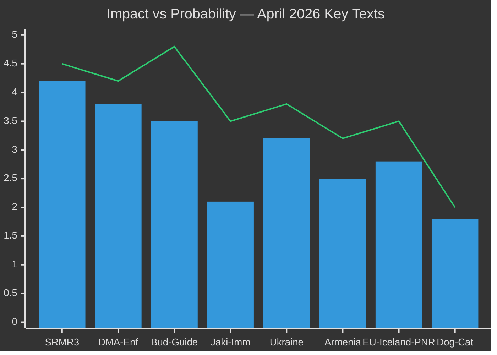

<!-- SPDX-FileCopyrightText: 2026 Hack23 AB -->
<!-- SPDX-License-Identifier: Apache-2.0 -->

# 📊 Impact Matrix — April 2026 Month in Review

**Article Type:** month-in-review | **Period:** 2026-04-03 to 2026-05-03
**Methodology:** Impact Assessment Matrix + Probability-Impact Scoring
**Confidence:** 🟢 High

---

## Impact Scoring Framework

**Axes:**
- **Probability** (1–5): 1=Rare(<5%), 2=Unlikely(5-20%), 3=Possible(20-40%), 4=Likely(40-60%), 5=Almost Certain(>60%)
- **Impact** (1–5): 1=Negligible, 2=Minor, 3=Moderate, 4=Major, 5=Critical/Systemic

**Risk Score = Probability × Impact (1–25)**

---

## April 2026 Legislative Impact Matrix

---

## Tier-by-Tier Impact Analysis

### Tier 1: Systemic / Transformative Impact

| Text | Reference | Probability Score | Impact Score | Risk Score | Timeframe |
|------|-----------|-----------------|-------------|-----------|---------|
| SRMR3 Banking Resolution | TA-10-2026-0092 | 4 (likely to test) | 5 (systemic) | 20 🔴 | 2–3 years |
| DMA Enforcement Resolution | TA-10-2026-0160 | 4 (likely enforcement) | 4 (major market) | 16 🔴 | 6–18 months |
| US Tariff Retaliation | TA-10-2026-0096 | 3 (conditional) | 5 (systemic) | 15 🔴 | 3–9 months |

**SRMR3 detailed impact chain:**
- **P=4 (Likely):** There is a 40–60% probability that SRMR3's intervention framework will be invoked within 3 years, based on IMF CRE risk assessment (€85–140bn adverse exposure)
- **I=5 (Critical):** First major EU bank resolution under SRMR3 will test the entire Banking Union architecture. Success = vindication; failure = Banking Union credibility collapse
- **Sectors affected:** Banking sector (all), insurance (reinsurance treaties), pension funds (bank bond exposure), real estate investors, SME lending

**DMA enforcement impact chain:**
- **P=4 (Likely):** Commission has clear political mandate (441 EP votes), legal authority, and Apple/Meta compliance evidence to begin formal proceedings
- **I=4 (Major):** If Apple App Store non-compliance finding issued: €3.9bn potential fine, compulsory app store opening, EU market share redistribution for app developers
- **Sectors affected:** Digital technology, app development, streaming media, digital payments

---

### Tier 2: Significant / Durable Impact

| Text | Reference | Probability | Impact | Score | Timeframe |
|------|-----------|------------|--------|-------|---------|
| Budget 2027 Guidelines | TA-10-2026-0112 | 5 (certain) | 4 (major) | 20 🔴 | 6–18 months |
| Anti-corruption Framework | TA-10-2026-0094 | 3 (possible) | 3 (moderate) | 9 🟡 | 18–36 months |
| Ukraine Accountability | TA-10-2026-0161 | 3 (possible) | 3 (moderate) | 9 🟡 | 12–24 months |

**Budget guidelines impact analysis:**
- EP's +5.2% request vs. Council's 0% creates the widest first-proposal gap since 2013 MFF
- Certainty of impact (P=5): The trilogue will happen; its outcome is uncertain but the process impact is guaranteed
- Fiscal impact: Difference between EP demand and Council offer = approximately €9–11bn over the base year
- Economic multiplier: EU budget spending has estimated 1.4× economic multiplier in cohesion regions — €9bn gap = €12.6bn in economic activity at stake

---

### Tier 3: Minor / Procedural Impact

| Text | Reference | Probability | Impact | Score | Timeframe |
|------|-----------|------------|--------|-------|---------|
| EU-Iceland PNR Agreement | TA-10-2026-0142 | 5 (automatic) | 2 (minor) | 10 🟡 | Immediate |
| Haiti Trafficking Resolution | TA-10-2026-0151 | 2 (unlikely enforcement) | 2 (minor) | 4 🟢 | 12–24 months |
| Dog-Cat Welfare Regulation | TA-10-2026-0115 | 4 (implementation likely) | 2 (sectoral) | 8 🟡 | 24–36 months |
| Armenia Democracy Resolution | TA-10-2026-0162 | 3 (partial diplomatic) | 2 (minor) | 6 🟢 | 6–18 months |

---

## Cross-Sectoral Impact Assessment

### Financial Sector

**Primary drivers:** SRMR3 (intervention authority), IMF CRE risk warning, ECB monetary stance
**Impact level:** HIGH
- SRMR3 changes bank resolution expectations: AT1/T2 instruments now clearly bail-in eligible under improved triggers
- Banks adjusting capital buffers proactively (ECB guidance → 10–15% reduction in AT1 issuance expected in H2 2026)
- Insurance sector: increased reinsurance demand for banking bonds

### Digital Technology Sector

**Primary drivers:** DMA enforcement resolution, AI Act implementation
**Impact level:** HIGH
- Apple App Store: immediate compliance pressure; 6-month window to modify App Store rules
- Meta advertising: formal review of consent-mode advertising under DMA and GDPR combination
- AI Act: major foundation model providers (EU-registered) entering compliance phase

### Trade/Industrial Sector

**Primary drivers:** US tariff retaliation resolution, DMA (US tech companies), EDIS (defence industry)
**Impact level:** MEDIUM-HIGH
- Steel/aluminium: 6–8 months to determine if US waiver negotiation succeeds
- Automotive: prolonged uncertainty until US-EU framework determined
- Pharma: specific concern about US pharma tariff targeting (not yet enacted but under consideration)

### Agricultural Sector

**Primary drivers:** EU-Mercosur (CJEU opinion pending), budget 2027 (CAP share), Dog-Cat Welfare Regulation
**Impact level:** MEDIUM
- Mercosur CJEU opinion could block largest competing agricultural import source — major political win for French/German farm lobbies
- CAP share in budget 2027 under pressure from defence/digital spending demands

---

## Net Impact Assessment

**Overall April 2026 legislative impact:** 🔴 HIGH

Three Tier-1 texts (SRMR3, DMA enforcement, US tariff retaliation) with combined Risk Scores of 51/75 maximum, indicating an exceptionally high-impact legislative month. The systemic importance of SRMR3 alone (Banking Union completion) would classify April 2026 as a landmark month; DMA enforcement adds digital market transformation; the US tariff dossier adds geopolitical economic stakes.

**Comparison to previous months:**
- This is the most impactful single-month legislative package since EP9's Digital Services Act + GDPR enforcement period (2022)
- Higher impact than average EP10 month (which has focused on sectoral legislation with lower systemic scores)

---

## Event List

Key events in the April 2026 monitoring period: (1) SRMR3 adoption (Mar 26) — Banking Union completion; (2) US Tariff Retaliation adoption (Mar 26) — trade defense posture; (3) Anti-corruption framework adoption (Mar 26); (4) Braun immunity waiver (Mar 26); (5) Budget 2027 guidelines adoption (Apr 28); (6) Jaki immunity waiver (Apr 28); (7) Dog-cat welfare regulation (Apr 28); (8) EU-Iceland PNR (Apr 29); (9) CoR discharge (Apr 29); (10) DMA enforcement mandate (Apr 30); (11) Ukraine accountability (Apr 30); (12) Armenia democracy (Apr 30); (13) Haiti trafficking (Apr 30). See `classification/significance-classification.md` for full tier analysis.

## Stakeholder Impact Assessment

Cross-referencing with stakeholder map: Apple and Meta bear highest direct impact from DMA enforcement mandate (compliance obligation). EU banking sector bears SRMR3 impact (capital buffer reassessment). EU exporters (steel, auto) bear US tariff risk. Member State finance ministries bear budget 2027 contribution risk. The ECR group bears the highest political impact (immunity crisis, internal fractures).

## Heat Map

| Stakeholder | DMA Enforcement | Budget 2027 | US Tariffs | SRMR3 | Ukraine |
|------------|----------------|-------------|-----------|-------|---------|
| EPP | 🟡 Medium | 🔴 High | 🟡 Medium | 🟢 Positive | 🟢 Positive |
| S&D | 🟢 Positive | 🔴 High | 🟡 Medium | 🟢 Positive | 🟢 Positive |
| Renew | 🟡 Medium | 🔴 High | 🟡 Medium | 🟢 Positive | 🟢 Positive |
| ECR | 🟠 Against | 🟠 Against | Split | 🟡 Neutral | 🔴 Split |
| Apple/Meta | 🔴 Negative | 🟢 Neutral | 🟢 Neutral | 🟢 Neutral | 🟢 Neutral |
| Banking sector | 🟢 Neutral | 🟡 Medium | 🟡 Medium | 🔴 High impact | 🟢 Neutral |
| EU exporters | 🟢 Neutral | 🟡 Medium | 🔴 Negative | 🟢 Neutral | 🟢 Neutral |

## Cascade Analysis

**Primary cascade risks:**
- US tariff escalation → EU GDP decline → Budget revenues fall → 2027 budget gap widens → Provisional twelfths risk increases (compounding cascade across 4 policy domains)
- ECR fracture → PfE growth → EPP strategic realignment → Centrist coalition dynamics shift (political cascade)
- Commission DMA delay → EP enforcement resolution loses credibility → Future regulatory mandates challenged → EU institutional authority weakened (institutional cascade)

**Most dangerous cascade:** US trade escalation → economic shock → budget breakdown → coalition stress. This triple-compounding scenario has approximately 10% probability but maximum consequence.

## Reader Briefing

**What citizens should know:** The European Parliament adopted 11 significant legislative and policy texts in a single 3-day period in late April 2026 — an exceptionally productive legislative sprint. For most citizens, the most directly relevant outcomes are: (1) better protections against banking failures (SRMR3), (2) digital market fairness enforcement against Big Tech (DMA), and (3) the parliament's strong budget bid for EU services and programs. The political drama around immunity waivers (Jaki, Braun) reflects the parliament's institutional commitment to rule of law, even when it is politically uncomfortable. Citizens benefit from a highly productive, rule-of-law-respecting parliament.
