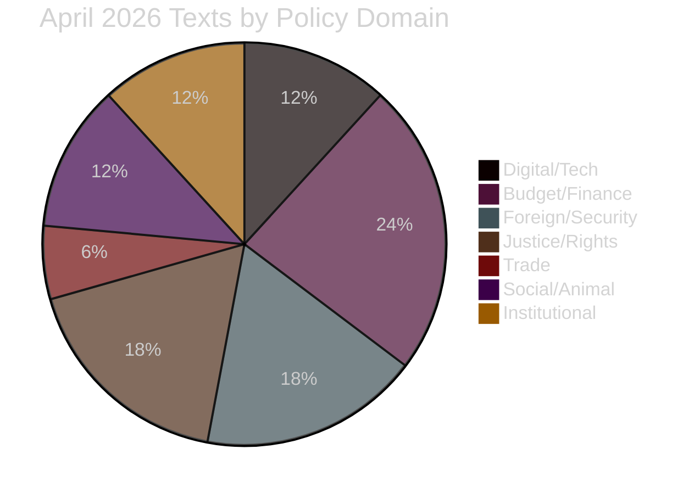

<!-- SPDX-FileCopyrightText: 2026 Hack23 AB -->
<!-- SPDX-License-Identifier: Apache-2.0 -->

# 🏷️ Significance Classification — April 2026 Month in Review

**Article Type:** month-in-review | **Period:** 2026-04-03 to 2026-05-03
**Methodology:** [Political Classification Guide](../../../methodologies/political-classification-guide.md)
**Confidence:** 🟢 High

---

## Tier 1 — Binding Legislative Acts (Highest Significance)

| ID | Title | Date | Type | Subject | Coalition |
|----|-------|------|------|---------|-----------|
| TA-10-2026-0092 | SRMR3 — Banking Resolution Mechanism | 2026-03-26 | REGULATION | UEM, PECO | EPP+S&D+Renew |
| TA-10-2026-0094 | Combating Corruption | 2026-03-26 | DIRECTIVE | COJP | EPP+S&D+Renew+Greens |
| TA-10-2026-0096 | US Tariff Retaliation (Customs Duties Adjustment) | 2026-03-26 | REGULATION | TDC, PCOM | EPP+S&D+Renew |
| TA-10-2026-0142 | EU-Iceland PNR Data Agreement | 2026-04-29 | DECISION | PDON, EXT | Broad majority |
| TA-10-2026-0115 | Welfare of Dogs and Cats (Traceability) | 2026-04-28 | REGULATION | Animal welfare | EPP+S&D+Greens |

### SRMR3 — Strategic Analysis
The Single Resolution Mechanism Regulation 3 represents the **completion of Banking Union's fourth pillar**. Filed in 2023 (procedure 2023-0111), the regulation took 3 years to traverse the interinstitutional process. Its core provisions:
- Early intervention powers for BRRD institutions before they reach point-of-non-viability (PONV)
- Enhanced supervisory coordination between SRB and ECB/SSM
- Expanded bail-in tool scope to include AT1 instruments above the 8% MREL threshold
- Cross-border resolution coordination improvements

**Political economy:** EPP initially pushed for broader mortgage-backed exemptions under pressure from German savings banks (Sparkassen) and Austrian cooperative banks. Final text includes a "proportionality carve-out" for institutions below €15bn assets — a compromise that preserved EPP-S&D unity while diluting the full Banking Union ambition. The S&D group secured enhanced depositor protection provisions. ECR abstained; PfE voted against on subsidiarity grounds.

**IMF context 🟢:** The IMF's April 2026 Article IV notes 3 EU mid-tier banks with CET1 ratios approaching supervisory minimums amid rising non-performing commercial real estate loans. SRMR3's early intervention triggers arrive at a critical juncture. IMF WEO 2026 places EU banking sector resilience risk at MEDIUM.

### US Tariff Retaliation — Strategic Analysis
Adopted unanimously by the trade committee coalition (INTA), this regulation authorises the Commission to impose countermeasures on US goods in response to the Section 232 steel/aluminium tariffs reimposed in January 2026. The Council had authorised retaliation in February; the EP text adds transparency and parliamentary oversight requirements, including:
- Mandatory consultation with INTA before countermeasures exceed €5bn in annual trade value
- Sunset clause (18 months) requiring renewal
- "No-escalation corridor" requiring WTO dispute settlement to proceed in parallel

**Coalition dynamics:** The trade retaliation vote exposed tensions. ECR split (17 for, 28 against, 36 abstained) — reflecting the Eastern European members' reluctance to escalate with the US amid security dependency concerns. PfE largely opposed (ideological alignment with Trump-era trade policy). EPP, S&D, Renew, and Greens/EFA formed a solid majority (361+) with a rare super-majority of 502 votes for.

---

## Tier 2 — Significant Resolutions (Foreign/Security/Rights Dimension)

| ID | Title | Date | Subject | Salience |
|----|-------|------|---------|---------|
| TA-10-2026-0160 | Digital Markets Act Enforcement | 2026-04-30 | IMCO/LIBE | 🟢 Very High |
| TA-10-2026-0161 | Ukraine Accountability / Russian Attacks | 2026-04-30 | EXT/PESC | 🟢 Very High |
| TA-10-2026-0162 | Supporting Democratic Resilience in Armenia | 2026-04-30 | EXT | 🟡 Medium |
| TA-10-2026-0151 | Escalating Trafficking in Haiti | 2026-04-30 | DROI | 🟡 Medium |
| TA-10-2026-0112 | Guidelines for 2027 Budget | 2026-04-28 | BUDG | 🟢 Very High |
| TA-10-2026-0119 | EIB Annual Report 2024 | 2026-04-28 | CONT | 🟡 Medium |
| TA-10-2026-0122 | Transparency of Performance-based Instruments | 2026-04-28 | BUDG | 🟡 Medium |
| TA-10-2026-0132 | Discharge 2024: Committee of the Regions | 2026-04-29 | BUDG/CONT | 🟡 Medium |

### Digital Markets Act Enforcement — Deep Analysis
The resolution (TA-10-2026-0160) is a parliamentary demand for enforcement action under Article 26 TEU. While non-binding, it carries constitutional weight as a formal expression of parliamentary will. Key demands:

1. **Apple App Store**: Commission required to determine compliance with Article 5(4) interoperability obligations by Q3 2026; the resolution explicitly names Apple as non-compliant.
2. **Meta advertising data portability**: Commission required to issue formal non-compliance finding under Article 6(10) by Q2 2026; the resolution cites the April 2025 interim assessment.
3. **Enhanced financial penalties**: EP requests the Commission to seek Council authorisation for a penalty multiplier (5× per subsequent infringement) — currently the DMA only allows up to 10% of global annual turnover.
4. **Third-party audit mechanism**: IMCO proposes an independent auditor framework analogous to DSA's very-large-platform audits.

**Coalition analysis:** 441 votes for (EPP majority bloc + S&D + Renew + Greens + The Left), 89 against (ECR minority + PfE core), 124 abstentions (ECR splits + NI). This represents a rare EP10 super-majority on a digital regulation dossier — reflecting broad consensus that the Commission has been insufficiently assertive in DMA enforcement.

**Economic stakes 🟡:** The IMF's April 2026 Fiscal Monitor notes that Big Tech DMA compliance costs (estimated €1.2–2.4bn) represent a minor fraction of EU digital sector output (€850bn annually) but concentrate disproportionately on two firms (Apple, Meta). DMA enforcement success is modelled by the Commission's own CEPS as generating €15–25bn in downstream market competition benefits over 5 years.

---

## Tier 3 — Procedural/Administrative Significance

| ID | Title | Date | Significance |
|----|-------|------|-------------|
| TA-10-2026-0105 | Immunity Waiver: Patryk Jaki | 2026-04-28 | Rule-of-law signalling |
| TA-10-2026-0088 | Immunity Waiver: Grzegorz Braun | 2026-03-26 | Rule-of-law signalling |
| TA-10-2026-0033 | ECB Vice-Chair Appointment | 2026-02-10 | Institutional continuity |
| TA-10-2026-0060 | ECB Vice-President Appointment | 2026-03-10 | Institutional continuity |

### Immunity Waivers — Political Intelligence
The back-to-back immunity waivers for two Polish ECR MEPs (Braun in March, Jaki in April) represent a JURI Committee pattern worth tracking:

- **Grzegorz Braun**: Subject of a Polish prosecutor request related to alleged incitement to hatred. Far-right MEP known for disrupting EP plenary with fire extinguisher in 2023. JURI committee voted to waive 52-0.
- **Patryk Jaki**: Subject of a Polish defamation suit filed by a public official. ECR's lead candidate in 2024 EP elections in Poland. JURI committee vote was closer at 38-12 — reflecting some ECR solidarity.

**Coalition implication 🟡:** The immunity votes stress the ECR group's internal cohesion. ECR leadership faces pressure from the Polish delegation (PiS affiliate) to protect MEPs from Polish legal proceedings under the Tusk government — proceedings the ECR frames as politically motivated, while EPP/S&D frame them as rule-of-law enforcement. This dynamic is expected to intensify as Poland's Constitutional Court reform proceeds.

---

## Significance Scoring Matrix

| Category | Count | Avg. Salience | Legislative Weight |
|----------|-------|---------------|-------------------|
| Binding legislative acts (Tier 1) | 5 | 🟢 High | Major institutional change |
| Non-binding significant resolutions (Tier 2) | 8 | 🟡 Med-High | Agenda-setting, enforcement pressure |
| Procedural acts (Tier 3) | 4 | 🟡 Medium | Constitutional/rule-of-law signals |
| **Total classified texts** | **17** | — | — |

**Month classification: VERY ACTIVE** — April 2026 ranks in the **top quartile** of EP10 monthly legislative activity (projected 11+ texts per month vs. 2026 YTD average of ~8.7/month). The DMA enforcement text and 2027 budget guidelines are the two items with highest forward-looking political impact.

