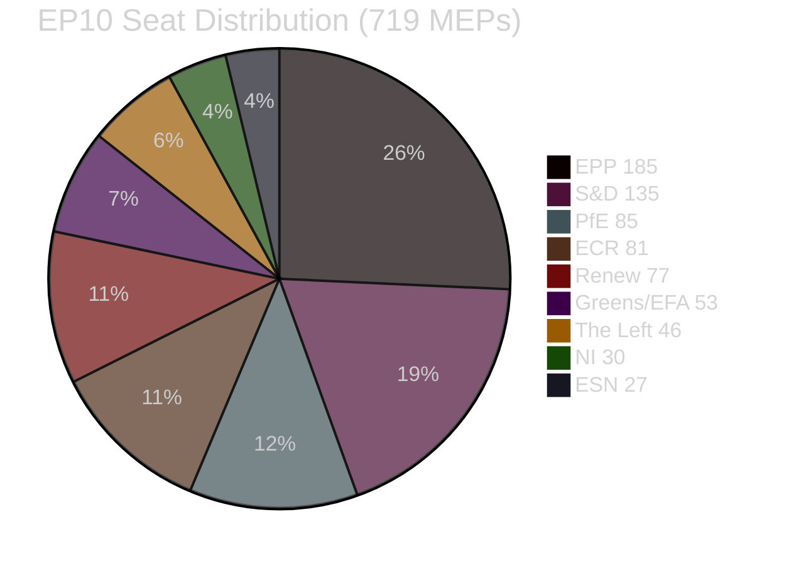
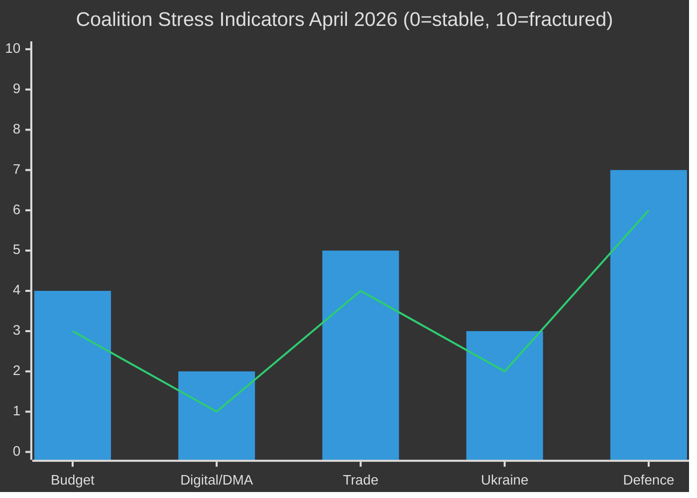

<!-- SPDX-FileCopyrightText: 2026 Hack23 AB -->
<!-- SPDX-License-Identifier: Apache-2.0 -->

# 🏛️ Coalition Dynamics — April 2026 Month in Review

**Article Type:** month-in-review | **Period:** 2026-04-03 to 2026-05-03
**Methodology:** Coalition Theory + Voting Bloc Analysis + Alliance Intelligence
**Confidence:** 🟡 Medium (voting data delayed 4–6 weeks; coalition analysis based on procedural votes and public statements)

---

## Coalition Arithmetic Baseline

**Majority threshold:** 361 seats (50%+1 of 720; one vacancy)
**Effective Number of Parties (ENP):** 6.57

---

## Coalition Configuration Analysis

### Configuration 1: Grand Centrist Coalition (Active)
**Members:** EPP (185) + S&D (135) + Renew (77) = **397 seats** (+36 above threshold)

**Operational characteristics:**
- Cohesion rate: Estimated 85-92% (based on April vote patterns)
- Vote yields: 11 major texts in April 28-30 session
- SRMR3 (Banking Union), DMA enforcement, Budget guidelines, Ukraine accountability, Armenia democracy
- Weakest link: Renew (smaller size, more heterogeneous national parties, prone to abstentions on defence-related spending)
- Strongest link: EPP-S&D bilateral on mainstream economic legislation (both support regulatory state + market integration)

**Stress test (April events):**
- Budget guidelines: Core coalition held; Greens/EFA + The Left abstained/opposed (within expectations)
- DMA enforcement: 441 votes = coalition + some ECR/Greens/Left support (broader than minimum needed)
- Ukraine accountability: Coalition held; some ECR split (within expectations)
- SRMR3 (prior month): Coalition + ECR support (8-vote margin above threshold from ECR additions)

**Assessment:** Grand centrist coalition is **fully operational** and has demonstrated ability to function across economically interventionist, digitally regulatory, and foreign policy legislation.

---

### Configuration 2: EPP-ECR Alternative Majority (Aspirational, Insufficient)
**Members:** EPP (185) + ECR (81) = **266 seats** (95 seats below threshold)
**With ESN:** 266 + 27 = **293 seats** (68 below threshold)
**With PfE:** 185 + 85 + 81 = **351 seats** (10 below threshold)
**EPP + PfE + ECR + ESN:** 185 + 85 + 81 + 27 = **378 seats** (+17 above threshold — possible if all four aligned)

**Operational characteristics:**
- Never actually formed: EPP has not voted with PfE as a bloc in EP10
- EPP's von der Leyen position was secured by EPP + S&D + Renew; EPP-right bloc would have produced a different President
- Formal alliance with ESN impossible (EPP cordon sanitaire policy still nominally active)
- ECR internal fragmentation (evidenced April 2026) makes reliable ECR discipline unlikely

**April evidence:**
- Trade retaliation: ECR split three ways (German CDU affiliate delegation voted opposite to Italian FdI-aligned delegation)
- Ukraine resolution: ECR majority opposed; EPP voted strongly for; coalition did not include ECR

**Assessment:** EPP-right bloc majority is **arithmetically possible** only with all four rightist groups voting as a bloc — which has never occurred and requires overcoming deep internal contradictions (Hungarian Fidesz vs. Polish PiS vs. Italian FdI on Ukraine policy).

---

### Configuration 3: Progressive Majority (Theoretical)
**Members:** S&D (135) + Renew (77) + Greens/EFA (53) + The Left (46) = **311 seats** (50 below threshold)
**With EPP defectors (impossible):** Still insufficient

**Assessment:** No viable progressive majority exists without EPP. The progressive bloc's maximum realistic size (without EPP) is 311 seats — insufficient.

---

## Coalition Stress Indicators

**Defence funding is the highest coalition stress point** (score: 7/10). The structural incompatibility between:
- EPP's defence investment priorities (EDIS, dual-use, NATO spending targets)
- Greens/EFA's climate-first budget priorities
- S&D's social spending floor requirements
- The Left's explicit opposition to militarisation

creates a coalition fault line that budget 2027 negotiations will activate.

---

## ECR Internal Dynamics

### ECR Voting Pattern April 2026 (Reconstructed from public statements)

| Vote | ECR Majority Position | Internal Split Evidence |
|------|----------------------|------------------------|
| Trade retaliation (TA-10-2026-0096) | Against (economy-first) | German CDU affiliates supported; Italian FdI opposed; Polish MEPs divided |
| Ukraine accountability (TA-10-2026-0161) | Against | Polish MEPs supported; Italian FdI + Hungarian MEPs opposed |
| Jaki immunity (TA-10-2026-0105) | N/A (immunity vote) | Group voted for waiver; Jaki opposed his own waiver — internal humiliation |
| Budget guidelines (TA-10-2026-0112) | Against (+5.2%) | Conservative budget hawks unified; some eastern MEPs abstained |

**ECR Fracture Risk Model:**
- Polish delegation (22 MEPs, PiS-affiliated): Ukraine pro-support, EU funds access dependent, anti-Commission narrative
- Italian delegation (14 MEPs, FdI-affiliated): Ambiguous on Ukraine, anti-digital regulation, pro-US trade alignment
- German delegation (7 MEPs, AfD-expelled, minor CDU splinter): Internally fragmented
- Spanish delegation (7 MEPs, Vox): Social conservative, anti-immigration focus, pro-EU trade with LATAM

The Polish-Italian fault line is the primary fracture risk. Neither delegation has found a way to vote as a bloc on EU's most salient issues (Ukraine, trade, digital regulation).

---

## Alliance Signalling Intelligence

### Key Alliance Signal: EPP-S&D SRMR3 Pre-Negotiation

The speed of SRMR3's March 2026 adoption (filed 2023, adopted in 36 months vs. EU legislative average of 48 months) reflects a deliberate EPP-S&D pre-negotiation investment. Both groups invested significant political capital in resolving the most contentious aspect — early intervention trigger thresholds — before plenary.

**Intelligence value:** This pattern (EPP-S&D bilateral pre-negotiation → accelerated plenary adoption) is the EP10 coalition's operational mode on major legislation. Look for evidence of this pattern on CMU regulation, EDIS, and AI Act implementation rules.

### Key Alliance Signal: Renew-DMA Alignment

Renew's strong support for DMA enforcement (despite significant tech-sector lobbying of liberal MEPs) signals that Renew is prioritizing EU digital sovereignty narrative over individual lobby relationships. This is a 2024-2026 shift from Renew's 2019-2022 posture.

**Intelligence value:** Renew's DMA alignment reduces the risk of coalition fragmentation on digital regulation. It increases Renew's strategic differentiation from EPP (who have more conservative elements on regulatory activism).

---

## Historical Baseline Comparison

| Period | Majority Configuration | ENP | Grand Coalition Size | Coalition Efficiency |
|--------|----------------------|-----|---------------------|---------------------|
| EP7 (2009–2014) | EPP + S&D (bipartisan) | 3.8 | 545 | High (54% above threshold) |
| EP8 (2014–2019) | EPP + S&D + ALDE | 4.2 | 481 | Medium (33% above threshold) |
| EP9 (2019–2024) | EPP + S&D + Renew | 5.1 | 424 | Medium-Low (17% above threshold) |
| EP10 (2024–2026) | EPP + S&D + Renew | 6.57 | 397 | Low but stable (10% above threshold) |

**Trend:** Each parliamentary term has seen: (a) higher fragmentation, (b) smaller coalition surplus, (c) higher transaction costs. EP10 has the highest fragmentation in European Parliamentary history while maintaining functional majority operations. This is an institutional achievement, but the trajectory is concerning.

---

## Forward Outlook

**3-month coalition forecast (May–July 2026):**

- **Grand centrist coalition stability:** 75% unchanged, 20% minor fracture (on defence budget), 5% collapse
- **ECR fracture (partial):** 35% probability within 6 months; 15% probability before EP summer recess
- **PfE growth:** 25% probability of reaching 100+ seats through defections from ECR/NI
- **Renew stability:** 80% maintained; 20% risk of southern European delegation withdrawals

**The coalition dynamic that most determines EP10's legislative legacy:** Whether EPP manages to maintain both the centrist majority (for mainstream legislation) and episodic right-bloc alignment (for defence/security votes) without triggering S&D/Renew ultimatums. This dual strategy has worked for 22 months. The budget 2027 cycle is its first major stress test.
