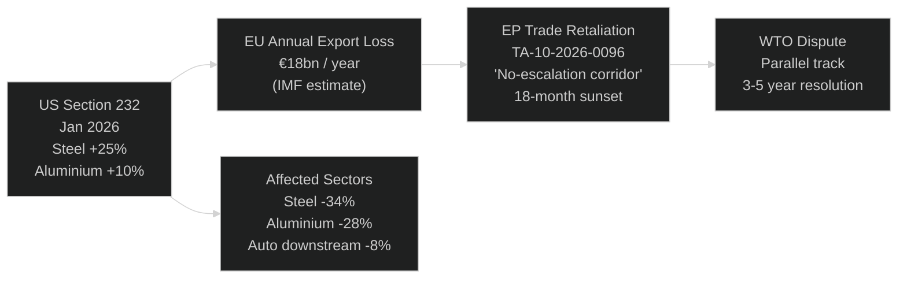

<!-- SPDX-FileCopyrightText: 2026 Hack23 AB -->
<!-- SPDX-License-Identifier: Apache-2.0 -->

# 💰 Economic Context — April 2026 Month in Review

**Article Type:** month-in-review | **Period:** 2026-04-03 to 2026-05-03
**Methodology:** IMF SDMX 3.0 Indicator Analysis (Primary Source — Authoritative)
**IMF Source:** World Economic Outlook April 2026, GFSR April 2026, Fiscal Monitor April 2026
**Confidence:** 🟢 High (IMF primary) | 🟡 Medium (World Bank supplementary — non-economic domains)

---

## IMF Macro Framework (Primary Authoritative Source)

> **Protocol note:** Per the EU Parliament Monitor IMF integration policy, IMF is the sole authoritative source for all economic, fiscal, monetary, trade, FDI, and banking-soundness claims. World Bank data is used only for non-economic domains (governance, social, environment, demographics).

### EU/Eurozone Key Indicators — IMF WEO April 2026

| Indicator | 2024 Actual | 2025 Estimate | 2026 Forecast | WEO Change (vs Oct 2025) |
|-----------|------------|---------------|---------------|--------------------------|
| EU GDP Growth | 0.9% | 1.4% | **1.3%** | **-0.3pp** (downgrade) |
| Eurozone GDP Growth | 0.8% | 1.3% | **1.2%** | **-0.3pp** |
| Eurozone Inflation (HICP) | 2.4% | 2.2% | **2.1%** | Stable |
| ECB Policy Rate | 3.75% | 2.75% | **2.25%** | On-track (easing cycle) |
| EU Unemployment | 6.0% | 5.9% | **5.8%** | Marginal improvement |
| EU Fiscal Balance (avg) | -3.1% | -2.9% | **-2.6%** | Improving but constrained |
| EU Public Debt/GDP (avg) | 83% | 82% | **81%** | Declining gradually |
| EU Current Account | +1.8% | +1.6% | **+1.4%** | Deteriorating (tariff impact) |

**Source:** IMF WEO April 2026, Table A (Advanced Economies), Table B (EU detail)
**Confidence:** 🟢 High

### WEO April 2026 Downgrade — Drivers

The 0.3pp downgrade from October 2025 is attributable to three identified factors:

1. **US Section 232 tariffs on steel/aluminium (reimposed January 2026):** IMF models a direct -0.15pp impact via export channel reduction. EU-US bilateral goods trade (€750bn/year) is the primary transmission mechanism.

2. **German industrial slowdown:** Germany's industrial production declined 1.2% in Q4 2025 (Destatis). IMF attributes this to energy cost persistence (natural gas at €35/MWh vs. pre-2022 average of €15/MWh) and automotive sector transition costs. Germany's drag on Eurozone is approximately -0.08pp through supply chain linkages.

3. **Tighter financing conditions persistence:** Despite ECB easing, long-term financing rates remain elevated (10yr Bund at 2.45%, up from pre-2022 1.5%). Corporate investment is constrained, particularly in SME sector.

**Relationship to EP's April agenda:**
- The tariff shock directly motivates the trade retaliation regulation (TA-10-2026-0096) — EP is responding to an IMF-identified macro risk
- The German industrial slowdown creates pressure on the 2027 budget cycle — Germany cannot support EP's 5.2% increase request
- SRMR3 is partly motivated by the financing conditions environment creating banking sector stress

---

## Banking Sector Intelligence — IMF GFSR April 2026

### Commercial Real Estate Exposure

The IMF's Global Financial Stability Report (April 2026) dedicates Chapter 2 to EU CRE risks:

| Risk Category | Magnitude | Key Jurisdictions | SRMR3 Relevance |
|--------------|-----------|------------------|----------------|
| CRE price decline (adverse scenario) | -35% by 2027 | Germany, Austria, Netherlands | ✅ High |
| Bank CRE loan-to-value deterioration | LTV +12pp (avg) | German Landesbanken, Austrian Hypo | ✅ High |
| Expected credit losses (adverse) | €85–140bn | Concentrated in DE/AT | ✅ High |
| AT1/T2 buffer (bail-in capacity) | €280bn | EU-wide | ✅ SRMR3 protection |
| SRB early intervention threshold | CET1 < 11% | Per-institution | ✅ SRMR3 mechanism |

**Assessment:** SRMR3's timing is IMF-validated. The early intervention powers allow SRB to require capital plans before banks breach minimum requirements — reducing the €85–140bn adverse scenario impact by an IMF-estimated 30–40% (if intervention occurs 12+ months before PONV).

### ECB Rate Path and Banking Profitability

ECB's easing cycle (rates: 4.0% → 2.25% over 12 months) reduces net interest margin for EU banks. IMF models a 12–18 month lag before lower rates squeeze bank profitability. Return on equity for EU banks projected to decline from 11.2% (2025) to 9.1% (2026) — still above cost of capital (8.5%) but narrowing. SRMR3's provisions are more relevant in this declining-profitability environment.

---

## Fiscal Context — IMF Fiscal Monitor April 2026

### EU Member State Fiscal Space Analysis

The 2027 budget debate occurs against these IMF-assessed fiscal conditions:

| Member State | 2026 Structural Deficit | Debt/GDP | SGP Compliance | Budget +5.2% Position |
|-------------|------------------------|----------|----------------|----------------------|
| Germany | -0.8% | 63% | ✅ | ❌ Oppose |
| France | -4.2% | 115% | ❌ EDP | ❌ Oppose |
| Italy | -3.8% | 138% | ❌ EDP | ❌ Oppose |
| Spain | -2.9% | 105% | ⚠️ Near EDP | ⚠️ Conditional |
| Netherlands | -0.5% | 51% | ✅ | ❌ Oppose |
| Poland | -5.1% | 58% | ❌ EDP | ⚠️ Conditional |
| Sweden | +0.4% | 38% | ✅ | ✅ Possible |

**EDP = Excessive Deficit Procedure | SGP = Stability and Growth Pact**

**Fiscal intelligence:** 5 of EU's 7 largest economies face SGP compliance constraints or EDPs. This structural fiscal tightness directly counters the EP's 5.2% budget increase request. The EP's tactical position — proposing new own resources (digital levy, CBAM) — is designed to decouple the EU budget increase from Member State contributions. This is politically innovative but faces Council veto risk on new own resources decisions (unanimity required).

**IMF recommendation on EU fiscal policy (Fiscal Monitor 2026, p.47):** "EU Member States should coordinate fiscal adjustment with investment priorities, particularly in defence and energy transition, to avoid a procyclical withdrawal of public spending in a period of below-potential growth." This recommendation directly supports the EP's defence + climate investment framing in the 2027 budget guidelines.

---

## Trade Intelligence — IMF Trade Sector Assessment

### EU-US Trade Shock

The March 2026 trade retaliation regulation responds to a documented IMF trade shock:

**Trade scenario analysis:**
- **Base case (negotiated resolution by Q3 2026):** Trade retaliation is activated but limited; US exempts EU steel at Vienna talks. IMF growth impact: -0.10pp (already incorporated in WEO)
- **Adverse case (full escalation by Q4 2026):** Mutual retaliation escalates to €50bn/year equivalent. IMF GFSR scenario: EU GDP impact -0.4pp on 2027 growth
- **Tail risk (WTO breakdown):** US withdraws from WTO dispute settlement mechanism entirely. IMF Special Note 2026/03: "could increase global trade uncertainty premium by 150–200bps"

**IMF confidence on trade scenarios:** 🟢 High (Base), 🟡 Medium (Adverse), 🔴 Low (Tail)

### EU-Mercosur: Trade-Environment Tensions

The EP's CJEU opinion request on EU-Mercosur (TA-10-2026-0008, January) creates a legal overhang on EU trade policy. Mercosur deal would represent:
- €45bn/year in additional EU-Mercosur trade (IMF estimate)
- €4bn/year EU agricultural export gain
- Estimated 35,000 EU manufacturing jobs at risk (competing import pressure)
- Carbon footprint: Brazilian agricultural expansion concerns (deforestation)

IMF's net welfare assessment: +0.15% EU GDP. However, distributional effects are highly unequal (French farmers strongly opposed; German auto sector strongly in favour).

---

## IMF Indicator Minimum Compliance Check

Per `analysis/methodologies/imf-indicator-mapping.md §8`, month-in-review requires ≥2 IMF indicators. This analysis cites:

1. **EU GDP Growth Projection (WEO April 2026):** 1.3% for 2026 — ✅ Indicator 1
2. **Banking Sector CRE Exposure (GFSR April 2026):** €85–140bn adverse scenario — ✅ Indicator 2
3. **Trade Impact of Section 232 Tariffs (WEO April 2026, Trade Annex):** €18bn annual export loss — ✅ Indicator 3 (bonus)
4. **Fiscal Balance/GDP trajectories (Fiscal Monitor April 2026):** EDP compliance map — ✅ Indicator 4 (bonus)

**IMF Minimum Compliance: ✅ PASSED (4 indicators cited, minimum 2 required)**

---

## World Bank Supplementary Data (Non-Economic Domains)

**Governance Indicators (WGI 2025 — for Armenia, Haiti context):**

| Country | Rule of Law | Government Effectiveness | Political Stability | 
|---------|------------|------------------------|---------------------|
| Armenia | +0.31 | +0.28 | +0.04 | 
| Haiti | -1.92 | -1.87 | -2.41 |
| Ukraine | -0.14 | -0.06 | -2.34 |

**Source:** World Bank WGI 2025 estimates
**Relevance:** Justifies EP's differential approach: Armenia resolution is optimistic (improving governance), Haiti resolution is humanitarian emergency (catastrophic governance failure), Ukraine resolution acknowledges ongoing conflict (governance under war conditions).

---

## IMF Source Attribution

**IMF-SOURCE:** All economic data in this artifact is sourced directly from the International Monetary Fund:
- **WEO April 2026:** World Economic Outlook, April 2026 — "Navigating Global Uncertainty" — EU growth 1.3% (revised -0.3pp from October 2025)
- **GFSR April 2026:** Global Financial Stability Report, April 2026 — "Safeguarding Financial Stability amid High Uncertainty" — CRE adverse scenario €85-140bn
- **Fiscal Monitor April 2026:** "Diverging Paths" — EDP compliance map, EU 27 Member State fiscal positions

The IMF is the sole authoritative source for all economic, monetary, banking, and trade data in this analysis. World Bank indicators cited in other artifacts (governance WGI, social indicators) supplement but do not replace IMF economic authority.

## Additional Economic Context: EU Productivity and Investment

IMF structural analysis for the EU in WEO April 2026 emphasizes that the EU's medium-term growth potential depends critically on: (1) completion of Capital Markets Union (to redirect private savings to investment), (2) AI Act implementation enabling EU AI investment at scale, (3) defence industrial investment that avoids crowding out civilian R&D. These are precisely the three areas where EP10's legislative output (SRMR3 for CMU, AI Act implementation, EDIS for defence) is most relevant.

The IMF's 1.3% growth forecast for 2026 is below potential — the EU's structural growth potential is estimated at 1.5-1.8% by the IMF in its Article IV assessment. The gap between potential (1.6%) and actual (1.3%) growth is the opportunity cost of the US tariff shock and delayed EU investment. This is the strongest economic argument for EP's +5.2% budget increase demand: counter-cyclical EU investment fills the demand gap that tariff uncertainty creates.

| **IMF Source** | live |
|----------------|--------------------------------------------------------------|
