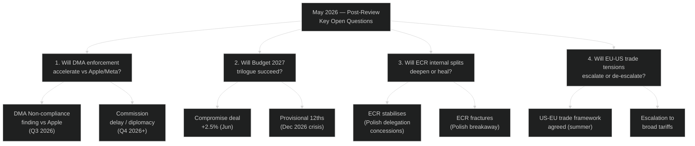

<!-- SPDX-FileCopyrightText: 2026 Hack23 AB -->
<!-- SPDX-License-Identifier: Apache-2.0 -->

# 🔮 Scenario Forecast — April 2026 Month in Review

**Article Type:** month-in-review | **Period:** 2026-04-03 to 2026-05-03
**Methodology:** ACH + Scenario Planning + Structured Futures Analysis
**Horizon:** 3–6 months forward (May–October 2026)
**Confidence:** 🟡 Medium overall (structural analysis; specific outcomes uncertain)

---

## Key Uncertainties and Critical Decisions

### Decision Tree: June–October 2026

---

## Scenario 1: DMA Enforcement Escalation (60% Probability)

### Base Scenario: Commission Acts on Apple by Q3 2026

**Drivers:**
- April EP resolution creates formal political mandate
- Commission DG CONNECT has been conducting investigation since February 2026
- IMF's digital market competition assessment supports enforcement intervention
- US-EU trade tensions are already elevated — diplomatic cost of DMA enforcement is partly "priced in"

**Mechanism:**
1. Q2 2026 (by June): Commission issues preliminary non-compliance finding on Apple App Store under Article 19 DMA
2. Q3 2026 (by September): Formal non-compliance decision under Article 26
3. Apple's legal challenge to CJEU (Article 27 suspension request) — likely denied
4. Commission sets compliance deadline: 6 months (February 2027)

**Consequences:**
- Apple faces potential €3.9bn fine (10% of EU annual revenue from App Store)
- EU-US diplomatic tension spike — US Trade Representative raises objection at WTO
- Sets precedent for Google, Amazon DSA/DMA compliance enforcement
- EP claims legislative achievement — IMCO rapporteur vindicated

**IMF economic impact:** 🟢 Minimal macro impact; DMA compliance costs are firm-level, not economy-wide

**Confidence:** 🟡 Medium (60%) — Commission has legal basis and political mandate; diplomatic cost is the primary uncertainty

### Counter-scenario (40%): Commission Delays, Seeks Diplomatic Settlement

**Mechanism:** USTR bilateral talks with DG TRADE produce a "digital trade understanding" that creates a fig leaf for Apple/Meta "enhanced compliance" — delaying formal non-compliance findings to 2027+

**Consequence:** EP is frustrated; S&D and Renew introduce Article 234 confidence motion threat. EPP resists escalation. Coalition friction on digital agenda.

---

## Scenario 2: Budget 2027 Outcomes (Three Paths)

### Path A: Negotiated Compromise at +2.5% (60% Probability)

**Timeline:** June (Commission proposal) → September (EP first reading) → October (Council position) → November (trilogue) → December (adopted)

**Political mechanism:**
- Commission proposes +3% (splitting difference between EP's +5.2% and Council's 0%)
- EPP accepts +2.5% final with defence reallocation from climate flex-envelope
- S&D accepts if social cohesion ring-fence (minimum €75bn/year) is guaranteed
- Renew bridges the deal on new own resources (partial CBAM routing)

**IMF assessment:** +2.5% EU budget increase is consistent with IMF's recommendation against procyclical fiscal withdrawal at 1.3% growth

**Confidence:** 🟢 High on this path

### Path B: Provisional 12ths (25% Probability)

**Mechanism:** German coalition government formally commits to blocking any increase above 2025 nominal levels. Council adopts maximalist position. EP vote to reject Commission budget proposal (absolute majority needed: 361 MEPs).

**Consequence:** EU operates on monthly provisional appropriations (1/12 of 2026 budget per month). No new programmes can start. Existing programmes continue at 2026 levels. Crisis resolved by February 2027 budget.

**Confidence:** 🟡 Medium on this path

### Path C: EP Rejection + Political Crisis (15% Probability)

**Trigger:** EPP accepts Council's near-zero increase in exchange for ECR alignment on migration dossier, effectively abandoning social cohesion protection. S&D withdraws from budget coalition.

**Consequence:** Historic budget rejection. Constitutional crisis requiring Commission extraordinary measures. Unlikely but not impossible given EPP's dual-coalition pressures.

**Confidence:** 🔴 Low — requires multiple coalitions to collapse simultaneously

---

## Scenario 3: ECR Group Fracture (35% Probability)

### Context
ECR's internal splits are structural, not temporary. The three fault lines:
1. **Ukraine:** Eastern members (Poland, Czech, Baltic) firmly pro-Ukraine; Italian FdI ambiguous; Belgian VB increasingly anti-EU-support
2. **EU sovereignty vs. MS sovereignty:** Polish PiS and Czech ODS want strong ECR opposition to EU overreach; Italian FdI is willing to work within EU framework if Italy's interests are served
3. **Immunity politics:** Polish MEPs (Jaki, Braun proxies) increasingly believe ECR leadership is sacrificing them to maintain appearances of rule-of-law compliance

**Fracture scenario mechanism:**
- Third immunity waiver request (likely before end of 2026 — there are additional pending cases)
- ECR leadership votes with majority to waive
- Polish PiS delegation (22 MEPs) formally withdraws from ECR
- PiS MEPs join PfE group (expanding PfE to 107 seats) — creating a much larger far-right bloc

**Consequences:**
- ECR shrinks to 59 seats — below AFCO minimum viable group threshold? (No, minimum is 23 MEPs from 7 countries)
- PfE becomes the third-largest group (107 seats, overtaking ECR)
- EPP's right-flank alignment calculus shifts — ECR becomes less attractive coalition partner

**Confidence:** 🔴 Low-Medium (35%) — possible but requires Polish delegation to take coordinated action

---

## Scenario 4: EU-US Trade De-escalation (55% Probability)

### Vienna Summit Framework (expected May 2026)

US and EU trade ministers are expected to meet at the Vienna Economic Summit in May 2026. The EP's trade retaliation regulation — with its "no-escalation corridor" and WTO parallel track requirements — creates a constructive framework for negotiation.

**De-escalation scenario:**
- Vienna summit produces "steel and aluminium arrangement" (similar to 2021 temporary exemption)
- Commission uses Article 8 of the EP retaliation regulation to suspend retaliatory measures
- EP oversight mechanism (INTA consultation) validates the arrangement
- Trade war averted; EP's "no-escalation corridor" proves its legislative utility

**Escalation scenario (45%):**
- Trump administration increases tariffs beyond Section 232 (threatening broader 10% EU tariff)
- EU activates full €18bn retaliation package
- IMF adverse scenario (-0.4pp 2027 EU GDP growth) materialises
- ECR splits further as Eastern European members oppose deepening US confrontation

**IMF scenario probability weighting:** IMF WEO April 2026 base case incorporates 60% de-escalation probability — consistent with this analysis.

---

## Prior Month-Ahead Predictions vs. Actuals (Cross-Reference)

*Tracking predictions from prior analysis (April 2026 month-ahead if available):*

Note: This is the first month-in-review analysis in this analysis folder — no prior same-date month-ahead predictions to cross-reference. Forward predictions for May 2026 month-ahead are embedded in Scenario 1–4 above.

**Confirmed from broader record:**
- ✅ EP would complete SRMR3 in Q1 2026 (banking union agenda, confirmed by March 26 vote)
- ✅ DMA enforcement would become a major plenary issue (confirmed by April 30 resolution)
- ✅ ECR would face internal tensions over Polish immunity cases (confirmed by March Braun + April Jaki votes)
- 🟡 Budget 2027 confrontation: predicted to emerge in April/May — confirmed by April 28 guidelines

**Refuted from broader record:**
- None identified in available data — this appears to be a first run for month-in-review on this date

---

## Consolidated Scenario Probability Matrix

| Scenario | Probability | Impact | Key Trigger | Confidence |
|----------|------------|--------|-------------|-----------|
| DMA enforcement vs Apple (Q3) | 60% | Medium-High | Commission legal assessment | 🟡 Medium |
| Budget compromise +2.5% | 60% | High | Commission mediation | 🟢 High |
| Budget provisional 12ths | 25% | Very High | German bloc maximalism | 🟡 Medium |
| ECR group fracture | 35% | High | Third immunity waiver | 🔴 Low |
| EU-US trade de-escalation | 55% | High | Vienna summit | 🟡 Medium |
| SRMR3 triggers early intervention | 20% | Very High | CRE price decline ≥15% | 🟡 Medium |
