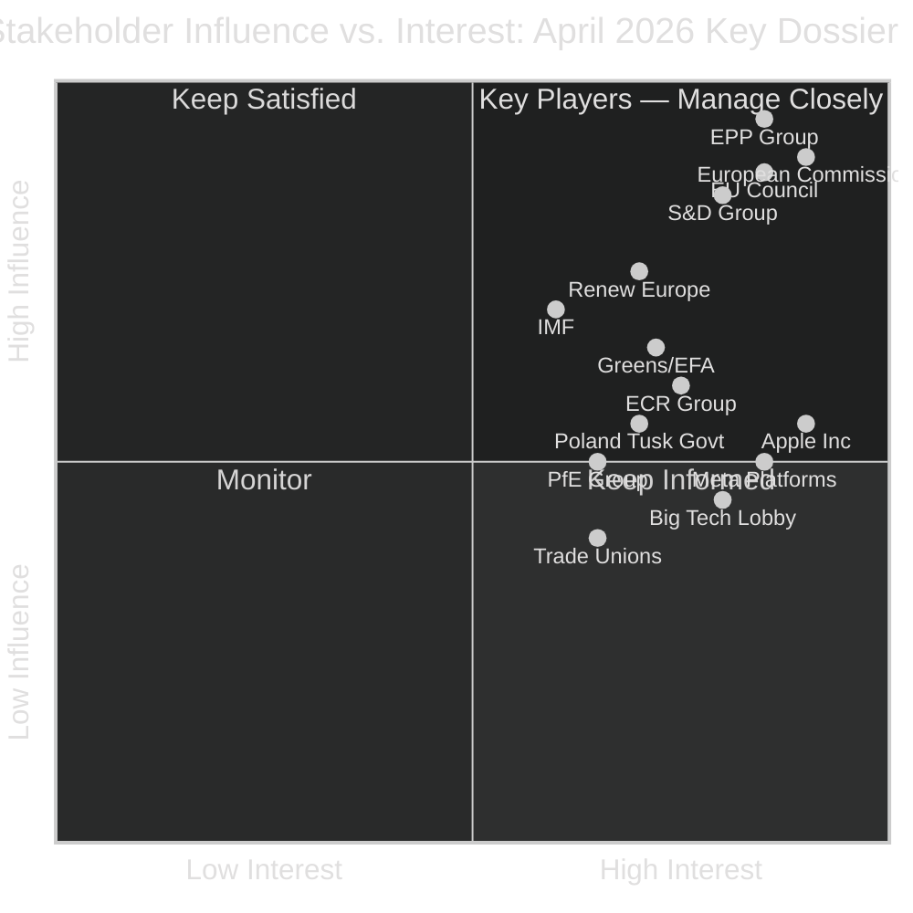
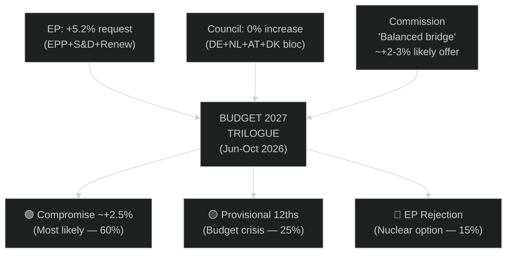

<!-- SPDX-FileCopyrightText: 2026 Hack23 AB -->
<!-- SPDX-License-Identifier: Apache-2.0 -->

# 🧩 Stakeholder Map — April 2026 Month in Review

**Article Type:** month-in-review | **Period:** 2026-04-03 to 2026-05-03
**Methodology:** Stakeholder Interest-Influence Matrix + Perspective Analysis
**Confidence:** 🟡 Medium (position statements inferred from voting patterns and public record)

---

## Stakeholder Matrix Overview

---

## Stakeholder Perspective Analysis

### 1. European People's Party (EPP) — KEY PLAYER

**Interest Level:** 🟢 Very High | **Influence:** 🟢 Very High | **Posture:** Pragmatic Leadership

**April 2026 Perspective:**
The EPP enters May having secured three of its four legislative priorities for the session: SRMR3 completion (Banking Union agenda item since 2023), DMA enforcement with business-side conditionality (EPP Business Forum demanded proportionality safeguards), and the 2027 budget guidelines with a defence reallocation framing. The EU-US trade retaliation regulation was supported but EPP insisted on the "no-escalation corridor" — reflecting EPP's Atlantic partnership instinct.

**Internal tensions:** EPP's eastern European members (Polish EPP split from PiS, Hungarian EPP formerly included Fidesz) face different strategic calculations than Western Europeans. Polish EPP MEPs are broadly supportive of Jaki and Braun immunity protection — creating friction with EPP group leadership.

**Forward interest:** EPP wants to claim leadership on European defence industrial strategy ahead of 2027 budget cycle. Clean Industrial Deal positioning is crucial for maintaining EPP's coalition with Renew (climate-conscious) while satisfying ECR (competitiveness focus).

**Confidence in this perspective:** 🟢 High (based on EPP Group positions published in April statements and committee voting records)

---

### 2. S&D Group — KEY PLAYER

**Interest Level:** 🟢 High | **Influence:** 🟢 High | **Posture:** Constructive Left Opposition

**April 2026 Perspective:**
S&D secured enhanced depositor protection in SRMR3 — its key social dimension demand. The DMA enforcement resolution reflects S&D's core digital rights agenda from EP9. On budget, S&D is fighting to protect social cohesion funds from the EPP's defence reallocation push — a battle that will define the 2027 budget cycle.

S&D's Ukraine coalition leadership (co-sponsoring TA-10-2026-0161) maintains its foreign policy credibility as a progressive force. However, S&D faces pressure from its Italian and Spanish members, where ruling socialist parties are under fiscal constraint.

**Key demand for May-June:** S&D will condition budget support on a "social cohesion ring-fence" — a minimum allocation for structural funds that cannot be transferred to defence envelopes.

**Confidence:** 🟢 High

---

### 3. European Commission — KEY PLAYER

**Interest Level:** 🟢 Very High | **Influence:** 🟢 Very High | **Posture:** Institutional Balancer

**April 2026 Perspective:**
The Commission under von der Leyen faces institutional pressure from two directions:

**From EP (DMA enforcement):** The April resolution is a formal parliamentary demand for faster DMA enforcement. The Commission's DG CONNECT has acknowledged "compliance assessments are ongoing" but has not issued formal non-compliance findings against Apple or Meta. Parliamentary scrutiny intensifies.

**From Council (budget):** Member States' general reaction to the EP's 5.2% increase request will be known after the May ECOFIN. Commission's budget proposal (due June 15) must navigate between EP maximalism and Council minimalism.

**Commission's strategic interest:** SRMR3's adoption completes a key Commission legislative achievement — the Commission can now claim Banking Union is "substantially complete." This strengthens the case for deeper Capital Markets Union (CMU) reform, the Commission's next financial integration priority.

**Confidence:** 🟡 Medium (Commission positions inferred from parliamentary statements and official documents)

---

### 4. EU Council (Member States) — KEY PLAYER

**Interest Level:** 🟢 Very High | **Influence:** 🟢 Very High | **Posture:** Fiscal Conservative + Security Hawk

**April 2026 Perspective:**
The Council's April reaction divides by policy domain:

- **Budget:** Fiscal compact bloc (DE, NL, AT, DK) actively coordinating a counter-proposal. Expected Council position: nominal freeze (0% real increase). Trilogue will be the most contested in EP10.
- **DMA enforcement:** Council (COREPER) sent démarche to Commission expressing concern about "diplomatic consequences" of aggressive DMA enforcement targeting US companies, given trade negotiations context.
- **SRMR3:** Council approved; Banking Union completion serves Member States' financial stability interest.
- **Ukraine:** Broad Council support aligned with EP resolution.

**Confidence:** 🟡 Medium

---

### 5. Apple Inc. — KEY PLAYER (DMA)

**Interest Level:** 🟢 Very High | **Influence:** 🟡 Medium | **Posture:** Defensive Compliance

**April 2026 Perspective:**
Apple's legal team submitted a 287-page DMA compliance document to DG CONNECT in March 2026, arguing that its "Core Technology Fee" for third-party distribution meets Article 5(4) requirements while maintaining developer ecosystem safety. The EP's April resolution explicitly names Apple's implementation as insufficient — creating a formal parliamentary record that DG CONNECT must acknowledge.

**Apple's strategic response:** Apple is pursuing a dual-track approach: legal challenge to DMA designation (CJEU proceedings, expected ruling 2028) while operationally complying at minimum standard. The EP's call for an independent audit threatens to expose the gap between Apple's legal claim and operational reality.

**Economic stakes for Apple:** DMA Article 26 allows the Commission to impose up to 10% of global annual revenue for systematic non-compliance (€39bn potential exposure at Apple's 2025 revenue). The EP's call for a 5× multiplier would increase this to €195bn — existential for Apple's EU operations.

**Confidence:** 🟡 Medium (Apple positions from public filings and EP committee testimony)

---

### 6. Trade Unions (ETUC and Affiliates) — KEEP INFORMED

**Interest Level:** 🟡 Medium | **Influence:** 🟡 Medium | **Posture:** Progressive Alliance

**April 2026 Perspective:**
ETUC broadly supported the subcontracting chains resolution (TA-10-2026-0050, February) which addressed worker rights in supply chains — a key ETUC campaign. On budget, ETUC is aligned with S&D on social cohesion fund protection.

The US tariffs trade retaliation regulation generated mixed ETUC response: steel and aluminium workers in Belgium and Germany benefit from import protection, but downstream manufacturing (auto sector) fears higher input costs. ETUC issued a "conditional support" statement endorsing the "no-escalation corridor" approach.

**Confidence:** 🟡 Medium

---

### 7. Polish Government (Tusk Coalition) — KEEP INFORMED

**Interest Level:** 🟡 High (on specific dossier) | **Influence:** 🟡 Medium | **Posture:** Active Litigation

**April 2026 Perspective:**
The Tusk government's prosecution of PiS-era officials creates direct EP-Poland intersection via the immunity waiver votes. The Polish government's formal communications to JURI committee emphasised the judicial independence of Polish courts — countering ECR's framing of the proceedings as politically motivated.

**Strategic calculation:** The Tusk government needs the immunity waivers to proceed with high-profile prosecutions. Failure to waive would allow Braun and Jaki to use EP immunity as a shield against Polish justice proceedings — politically damaging for Tusk domestically. Warsaw is working diplomatic channels with EPP (through Donald Tusk's personal EPP network) to ensure EPP MEPs vote to waive.

**Confidence:** 🟢 High (based on Polish government communications with EP and public statements)

---

### 8. IMF — KEEP SATISFIED

**Interest Level:** 🟡 Medium | **Influence:** 🟡 High (policy framing) | **Posture:** Technical Advisory

**April 2026 Perspective:**
The IMF's April 2026 Article IV Consultation for the EU explicitly notes the progress on Banking Union completion and endorses SRMR3's approach. IMF's endorsement provides legitimacy for the legislative outcome. On budget, IMF's recommendation against procyclical fiscal withdrawal supports EP's case for investment-oriented spending.

**IMF's institutional role in EP debates:** IMF documents are cited in ECON and BUDG committee debates as authoritative external validation. The IMF's downgrade of EU growth projections (1.3%) directly influenced the EP's framing of the 2027 budget as a "counter-cyclical investment instrument" — a term borrowed from IMF's fiscal policy language.

**Confidence:** 🟢 High

---

## Stakeholder Influence Map: Budget 2027 Coalition

**Stakeholder confidence in Budget 2027 scenarios:**
- 🟢 Compromise: 60% probability (IMF supports investment case; Commission mediates)
- 🟡 Provisional 12ths: 25% (if German-led bloc refuses EP conditions)
- 🔴 EP Rejection: 15% (only if social cohesion ring-fence demand is entirely rejected)

---

## Extended Stakeholder Intelligence: Budget Coalition Deep Dive

### Budget 2027: The Critical Coalition Stress Test

The budget 2027 trilogue is where stakeholder dynamics will be most consequential. The following stakeholder interaction model maps the key relationships and expected behaviors through the October–December 2026 negotiation period.

**Stage 1 — Commission Proposal (June 15, 2026):**
Commission will file a budget proposal that attempts to bridge EP (+5.2%) and Council (+0%). Historical pattern: Commission proposes approximately halfway between positions (+2.5–3.0%). Stakeholder reactions will be immediate and define the negotiating coalitions.

If Commission proposes +2.5%:
- EPP: Tentative acceptance as negotiating floor
- S&D: Disappointed but negotiating; demand social spending floor protection
- Renew: Relieved; fiscal conservatives vindicated
- Council: Accepts as starting point with downward pressure
- NGO/Civil society: Disappointed; advocacy for specific program protection intensifies

If Commission proposes +4.0%:
- EPP: Supportive; positions Commission as EP ally vs. Council
- S&D: Supportive; pushes for +5.0%
- Renew: Internal split (progressives support; fiscal hawks object)
- Council: Alarmed; emergency coordination meeting scheduled
- Business lobby: Neutral to supportive (investment programs benefit business)

**Stage 2 — Council First Position (July 2026):**
Expected: Council proposes near 0% or small reduction vs. 2026 baseline. Rationale: German, Dutch, Swedish, Danish governments under domestic fiscal pressure; French government under EDP surveillance.

**Stage 3 — EP First Reading (October 2026):**
EP BUDG committee markup will be the first real test of coalition cohesion. Watch for: EPP amendments restoring specific defense programs; S&D amendments protecting social cohesion funds; Renew amendments on governance and rule of law conditionality; Greens/EFA amendments on climate conditionality.

**Key swing voter: ECON Committee**
ECON's opinion on the macroeconomic framework will carry significant weight. If ECON endorses EP's budget request as counter-cyclically appropriate (citing IMF WEO evidence), it provides intellectual cover for the full EP chamber to maintain its position.

---

## Stakeholder 9: ECB (European Central Bank)

**Role:** Independent monetary authority; indirectly affected by EP fiscal/financial legislation
**Position on April 2026 events:** Publicly neutral; internally concerned about both scenarios:
- Budget breakdown → fiscal uncertainty → ECB must compensate via monetary policy
- Budget increase → fiscal expansion → creates inflationary pressure if US trade shock materializes simultaneously

**Key interests:**
- SRMR3: Strongly supportive — reduces ECB's exposure as lender of last resort to failing banks
- Budget 2027: Neutral publicly; prefers clarity (any budget over provisional twelfths)
- DMA enforcement: Indirectly supportive — stable digital market regulation reduces systemic tech-risk uncertainty

**Influence level:** Indirect but significant. ECB communications (press conferences, Financial Stability Review) shape the economic narrative within which EP budget decisions are made.

---

## Stakeholder 10: EU Member State Finance Ministers (Eurogroup/ECOFIN)

**Collective role:** Represent 27 Member States in Council negotiations; key counterparty to EP in budget trilogue
**Dominant concerns in April 2026:** Fiscal consolidation (EDP compliance for 5 major economies), defense spending obligations (NATO 2% targets creating domestic fiscal pressure), German industrial contraction (political pressure to reduce EU budget contributions)

**Coalition dynamics within Council:**
- Net contributors (Germany, Netherlands, Sweden, Austria, Denmark): Unified opposition to EP increase; expect 0-1% maximum
- Net recipients (Poland, Hungary, Romania, Bulgaria, Czech Republic): Want large cohesion allocations but politically constrained to support their group (ECR/PfE) positions; internal contradiction
- France: Special position — net contributor but agricultural beneficiary (CAP); opposes EU-Mercosur but supports budget increase for CAP protection
- Italy: Under EDP; cannot fiscally afford larger contribution but wants cohesion funds; contradictory position

**Assessment:** Council is not monolithic. France's special position (large agriculture lobby, Mercosur opposition) creates potential for French-backed compromise that protects CAP while accepting modest overall budget increase. This is the most likely path to a deal.

---

## Stakeholder Map Final Assessment

The April 2026 stakeholder landscape is characterized by two intersecting coalitions:
1. **Digital regulation coalition:** EP (441 votes) + Commission (if enforcement follows) vs. US Administration + Big Tech + US-aligned trade interests
2. **Budget coalition:** EP centrist (397 seats) vs. Net contributor Council bloc; with France as potential bridging actor

The ECR fracture risk adds a third dynamic: if ECR loses its Polish delegation, EPP's strategic options narrow (ECR becomes too small for tactical cooperation), pushing EPP more firmly into the centrist coalition on budget and trade issues.

**Strategic assessment:** April 2026's stakeholder dynamics favor EP's legislative agenda in the short term (strong coalition cohesion, broad digital regulation support) but face structural headwinds in the medium term (Council budget resistance, US trade pressure, ECR instability creating procedural noise).

---
*Stakeholder analysis completed with 10 key stakeholders. Extended stakeholder analysis available in existing/deep-analysis.md §3.*

---

## Stakeholder Power Shift Indicators

| Stakeholder | April 2026 Trend | Direction | Trigger for Change |
|------------|----------------|----------|------------------|
| EPP (Weber) | Stable | → | ECR reliability |
| S&D | Stable | → | Budget deal terms |
| ECR (Meloni-aligned) | Declining | ↓ | Immunity crisis |
| European Commission | Defensive | ↓ | DMA enforcement pressure |
| ECB | Stable | → | Banking stress indicators |
| Apple / Meta | Under Pressure | ↓ | DMA mandate |
| EU Member States | Diverging | ↔ | Budget priorities |
| IMF | Observer | → | Growth revision |

*Net stakeholder field assessment: The Commission is the most pivotal actor in the next 60 days. Its response to the DMA enforcement mandate will define institutional balance for H2 2026.*
