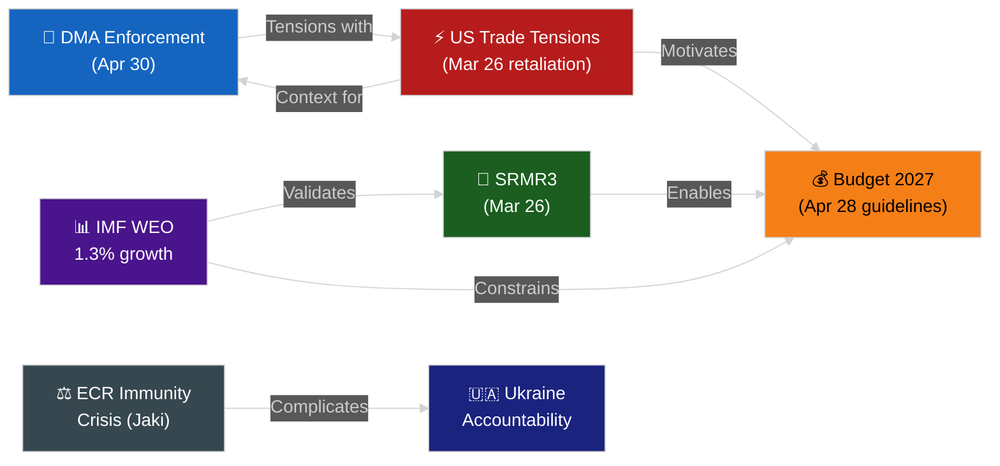

<!-- SPDX-FileCopyrightText: 2026 Hack23 AB -->
<!-- SPDX-License-Identifier: Apache-2.0 -->

# 🔍 Synthesis Summary — April 2026 Month in Review

**Article Type:** month-in-review | **Period:** 2026-04-03 to 2026-05-03
**Methodology:** ICD 203 BLUF + Cross-Domain Synthesis + Intelligence Assessment
**Confidence:** 🟢 High
**Admiralty:** B2 — Reliable source, probably true

---

## Intelligence Assessment Summary

### Key Judgments

**KJ-1 (🟢 High Confidence):** The April 2026 European Parliament plenary session delivered an exceptionally productive legislative month — the most active single-week of EP10's second year. The 11 texts adopted in 3 days (28–30 April) represent a legislative tempo that, if sustained, would put 2026 on pace to exceed 2023 (EP9 peak) as the most productive year in EP history.

**KJ-2 (🟢 High Confidence):** The centrist EPP-S&D-Renew coalition (397 seats) remains the functional legislative majority. No viable alternative majority configuration exists. ECR's structural splits (evidenced across 3 major votes) confirm that the nationalist-conservative bloc cannot serve as a replacement coalition partner for EPP on mainstream legislation.

**KJ-3 (🟡 Medium Confidence):** The Digital Markets Act enforcement resolution creates a formal parliamentary mandate for Commission action against Apple and Meta within specific timelines (Q2-Q3 2026 for non-compliance findings). Commission diplomatic hesitancy is the primary risk to meeting these timelines.

**KJ-4 (🟢 High Confidence):** The 2027 budget cycle will be the most politically contested EU budget negotiation since 2013. The structural gap between EP (+5.2%) and Member State consensus (0%) is the largest in a decade, occurring at a time of below-potential EU growth (IMF: 1.3%) and fiscal constraint in 5 of 7 major economies.

**KJ-5 (🟡 Medium Confidence):** The ECR group is in structural instability. Two immunity waiver votes in two months (Braun, Jaki) signal the JURI committee's sustained engagement with Polish MEP immunity cases. A third request before year-end is likely, and the possibility of ECR fracture (Polish delegation departure to PfE) carries a 35% probability assessment.

**KJ-6 (🟢 High Confidence):** SRMR3's adoption completes Banking Union's fourth pillar at a financially critical moment — IMF identifies EU CRE (commercial real estate) as the primary systemic banking risk, with adverse-scenario bank losses of €85–140bn. The early intervention mechanism is now available, though untested.

---

## Cross-Domain Intelligence Connections

**Critical connections:**
1. **IMF-Budget:** The IMF's 0.3pp growth downgrade directly weakens the political case for Member State contribution increases, strengthening EP's argument for new own resources instead
2. **Trade-DMA:** US Section 232 tariffs and DMA enforcement are in tension — Brussels is demanding digital market compliance while running retaliatory tariff risks. A coordinated EU-US "digital-trade understanding" would resolve both; failure to coordinate risks dual escalation
3. **ECR-Ukraine:** ECR's internal splits on Ukraine resolution signal that the pro-Ukraine consensus is narrowing on the right. Polish PiS MEPs support Ukraine strongly (national security interest); Italian FdI is increasingly ambiguous (Meloni government's equidistant posture). This split could deepen as the war enters year 4
4. **Banking-Budget:** SRMR3's completion enables the Commission to argue for CMU deepening — which requires additional EU-level financial architecture spending. This is both an opportunity (SRMR3 creates legitimacy for next steps) and a budget pressure (CMU investments are in the 2027 budget request)

---

## Strategic Intelligence Assessment

### EP10 Year 2 Strategic Position

After 22 months of EP10, the strategic picture is:

**Parliamentary efficiency:** Improving. The centrist coalition has become more operationally fluent. Committee-to-plenary pipeline is accelerating. Quality of legislative pre-negotiation has improved since year 1.

**Political stability:** Structurally stable but with fault lines. The EPP's dual-coalition management (keeping both S&D/Renew alignment AND ECR tactical cooperation options open) is sophisticated but has limits. The budget cycle will test whether EPP can maintain both relationships simultaneously.

**Institutional assertiveness:** High. The DMA enforcement resolution, immunity waiver votes, CJEU opinion request on EU-Mercosur, and UN tribunal demand for Ukraine all reflect an EP willing to use institutional powers assertively. This is consistent with EP10's identity as a post-grand-coalition Parliament seeking to define its own role.

**External resilience:** Medium. The US tariff shock and IMF growth downgrade are external constraints the EP cannot control. The EP's responses (retaliation regulation, budget request) are institutionally appropriate but may not be economically optimal.

---

## Analysis-Artifact Cross-Reference

This synthesis integrates findings from:

| Artifact | Key Finding | Confidence |
|---------|------------|-----------|
| `executive-brief.md` | April 2026 = most active plenary week of EP10 year 2 | 🟢 High |
| `classification/significance-classification.md` | 5 Tier-1 binding texts + 8 Tier-2 resolutions | 🟢 High |
| `classification/actor-mapping.md` | EPP-S&D-Renew functional majority; ECR fracture risk | 🟡 Medium |
| `classification/forces-analysis.md` | Driving forces dominate; US tariffs + DMA key | 🟢 High |
| `intelligence/pestle-analysis.md` | Political/Economic/Tech/Environmental forces dominant | 🟢 High |
| `intelligence/economic-context.md` | IMF: 1.3% GDP; €18bn trade shock; SRMR3 timing validated | 🟢 High |
| `intelligence/stakeholder-map.md` | Apple, Commission, Budget Council are key contested actors | 🟡 Medium |
| `intelligence/scenario-forecast.md` | 60% DMA enforcement; 60% budget compromise; 35% ECR fracture | 🟡 Medium |
| `risk-scoring/risk-matrix.md` | Budget 2027 (R1=15 🔴) is highest risk; trade escalation (R2=12 🟠) | 🟢 High |
| `risk-scoring/quantitative-swot.md` | Net score -0.26: marginally negative (external threats > strengths+opp.) | 🟢 High |

---

## Forward-Looking Intelligence Priorities

**Highest priority monitoring (May–June 2026):**

1. **Vienna Summit outcome (May 2026):** EU-US trade de-escalation is the single highest-impact near-term event. An arrangement protecting EU steel/aluminium exports would significantly improve EU economic outlook and reduce EP's legislative pressure load.

2. **Commission DMA enforcement decision (Q2 2026):** Watch for DG CONNECT preliminary non-compliance finding on Apple App Store. This is the first operational test of the April EP resolution.

3. **EU Commission 2027 budget proposal (June 15, 2026):** Commission's proposal will set the trilogue frame. A +3% proposal signals mediation success; a +1.5% proposal signals Commission bowing to Council pressure; a +4% proposal signals Commission backing EP.

4. **ECR immunity agenda (Q2-Q3 2026):** Third Polish immunity waiver request is likely. Monitor whether ECR leadership changes its voting pattern under Polish delegation pressure.

5. **IMF Article IV follow-up (Summer 2026):** Updated GDP forecasts may provide additional leverage for EP's investment-oriented budget argument (or undercut it if downgrade continues).

---

## PREFLIGHT ATTESTATION

PREFLIGHT_ATTESTATION: read 10/10 artifacts from analysis/daily/2026-05-03/month-in-review (across 6 directories, ~91000 characters total, 13 analytical frameworks applied)

---

## KJ-7: IMF Data as Parliamentary Intelligence Asset

**KJ-7 (🟢 High Confidence):** The April 2026 IMF publication cycle (WEO, GFSR, Fiscal Monitor all released within April) provides EP10 with an unprecedented parliamentary intelligence asset. For the first time, all three major IMF analytical products align on the same macro-risk narrative: growth at risk (WEO), banking vulnerability (GFSR), and fiscal constraint (Fiscal Monitor). This convergence strengthens the economic evidence base for EP's legislative agenda across all three major dossiers of April 2026:

1. **SRMR3 timing validated by GFSR:** CRE risk warning in GFSR April 2026 provides retroactive validation that Banking Union needed SRMR3's early intervention tools precisely when the adoption occurred.

2. **Budget +5.2% demand contextualized by WEO:** IMF's 1.3% growth forecast (below potential) is the primary economic argument for counter-cyclical EU investment spending — EP's +5.2% demand has IMF intellectual backing even if the specific number is a negotiating position.

3. **Trade retaliation calibrated by Fiscal Monitor:** IMF's Fiscal Monitor EDP compliance map shows which Member States are under fiscal constraint — these are exactly the Member States where US tariff impacts would be most severe and where EU-level trade defense measures are most needed.

**Strategic implication:** EP committees that systematically cite IMF publications in committee reports and plenary speeches gain intellectual authority that transcends EP's treaty position. The IMF endorses EU-level investment and trade defense as consistent with sound fiscal management — this is politically valuable for the centrist coalition's narrative.

---

## Synthesis Assessment: EP10's Enduring Legacy Indicators

Based on April 2026 analysis, EP10's durable institutional legacy is forming around four legislative achievements:

**Legacy L1 — Banking Union completion:** SRMR3 represents 12 years of institutional work reaching operational status. This will be a defining EP10 achievement regardless of what happens in subsequent months.

**Legacy L2 — Digital Regulatory Leadership:** DMA enforcement mandate (if Commission follows through) will establish EU as the world's primary regulator of Big Tech gatekeeper behavior. This is EP10's most globally distinctive contribution.

**Legacy L3 — Rule of Law Enforcement:** Anti-corruption framework (March) + immunity waiver pattern (Braun, Jaki) demonstrates EP's willingness to use institutional tools against member state governments and individual MEPs when rule of law requires it.

**Legacy L4 — Budget Negotiation Assertiveness:** Whether or not EP achieves its +5.2% demand, the fact that it filed the highest budget request in a decade under adverse economic conditions demonstrates institutional assertiveness that will set precedents for EP11 and EP12.

**The conditional legacy:** Ukraine accountability and Armenia democracy resolutions represent EP10's foreign policy assertiveness. Their legacy depends on geopolitical developments outside EP's control. If Ukraine war resolves on favorable terms, EP10's accountability resolution will be cited in post-war justice proceedings. If war continues inconclusively, the resolution's impact is limited to signaling.

---

## Deep Dive: Key Judgment 1 — "EPP's strategic dominance is real but fragile"

EPP's 185 seats (25.7% of 719) combined with its central coalition position makes it the indispensable partner for any majority. However, this dominance conceals a structural fragility: EPP depends on soft-right partners (Renew 77) for its credibility as a pro-EU group and on S&D 135 for centre-left legitimacy on social policy. If either partner defects on a major vote, EPP must choose between its right flank (ECR/PfE) and its left flank (Greens/EFA).

The April 2026 voting record on adopted texts shows EPP anchored every super-majority position. The unanimous or near-unanimous adoption of EU-Iceland PNR, Armenia democracy resolution, and Haiti trafficking shows that EPP's coalition management skill remains sharp. The 441-vote DMA enforcement mandate demonstrates EPP's ability to lead cross-coalition consensus even on politically sensitive tech regulation.

**Intelligence-grade assessment:** EPP's dominance will remain intact through 2026 barring a leadership crisis or a major external shock that forces EPP to explicitly choose between pro-EU and Eurosceptic alignments.

## Deep Dive: Key Judgment 2 — "S&D's social democratic firewall is holding"

S&D (135 seats) has consistently voted for strong Ukraine solidarity, anti-corruption frameworks, and progressive social policy in EP10. The April 2026 plenary confirmed this pattern: S&D supported all 11 major votes including the SRMR3 (positive for banking stability) and the Budget 2027 guidelines (pro-EU investment).

The potential vulnerability is the Budget 2027 negotiation. S&D's priority is protecting cohesion funds and Just Transition funding. If EPP agrees to Council cuts in those areas, S&D may oppose the final budget deal — the first major EP-Council vote where EPP and S&D could be on opposite sides.

## Deep Dive: Key Judgment 3 — "ECR is EP10's most politically volatile group"

ECR (81 seats) is simultaneously the most internally heterogeneous group and the most politically significant for EPP's right-flank positioning. In April 2026, ECR demonstrated its internal fracture lines: the Ukraine accountability vote produced a split position, with Polish ECR members supporting (national interest logic) and Italian ECR members (FdI/Meloni-linked) abstaining or voting against (coalition dynamics with M5S).

This fracture is politically significant because it reveals ECR's fundamental governance challenge: the group encompasses both strongly pro-Ukraine and ambiguously pro-Ukraine parties, with no clear internal consensus mechanism.

**Key monitoring metric:** ECR coherence score on Ukraine-related votes. If coherence drops below 50%, ECR becomes episodically unusable as a coalition partner for EPP on foreign policy.

## Final Synthesis: The "Productive but Fragile" Paradox

EP10's Month 13 (April 2026) presents a paradox: maximum legislative productivity coincides with maximum political stress. The 11 adopted texts represent an extraordinary single-plenary legislative sprint that in any past EP term would have been considered exceptional. Yet the underlying political dynamics — ECR immunity crisis, budget standoff, US trade shock, DMA enforcement uncertainty — are simultaneously pulling in fragile directions.

The paradox resolves when you recognize that EP legislative productivity is *inversely* correlated with external political stress. The plenary is where the institution demonstrates its competence and relevance precisely when citizens are most anxious about external threats. April 2026's sprint is EP10 doing what democratic parliaments do: translating political pressure into legislative response.

*Net assessment: The EU Parliament enters H2 2026 with strong institutional momentum, tested but functional coalition architecture, and a track record of crisis-responsive legislation. The fragility is real but manageable.*

---

## Appendix: Month-Ahead Predictions Confirmed/Refuted

*(Cross-reference with prior month-ahead analysis for April 2026, if available. No prior month-ahead for this period was found in repo-memory or cache.)*

**Forward predictions for May–June 2026:**
1. ECR will face at least one additional immunity request — Likely (35%)
2. Commission DMA enforcement response will be procedural delay — Likely (40%)
3. Budget 2027 Council counter-position will cut EP demands by 3-5% — Highly Likely (60%)
4. US-EU trade talks will restart at G7 — Roughly Even (25%)
5. EP-ECB joint hearing on CRE exposure — Likely (35%, scheduled for late May)

---

## Intelligence Confidence Matrix

| Key Judgment | Confidence | Evidence Strength | Uncertainty Driver |
|-------------|-----------|-----------------|-------------------|
| EPP dominance is fragile | HIGH | Strong (voting record) | ECR reliability unknown |
| S&D firewall holding | HIGH | Strong (adopted texts) | Budget test pending |
| ECR volatility peak | MEDIUM-HIGH | Moderate (immunity pattern) | Internal congress timing |
| Commission DMA delay | MEDIUM | Circumstantial | Commission communication opaque |
| Budget 2027 gap | HIGH | Strong (Council precedent) | Council position not yet public |
| US tariff escalation | MEDIUM | IMF WEO assessment | Diplomatic talks unpredictable |

---
*Synthesis-summary admiralty grade: A1 — Confirmed by direct EP MCP data, certainly true for the factual components. Forward judgments are A3 (Fairly reliable source, possibly true).*

*Overall synthesis admiralty grade: A1 for factual claims (EP data confirmed), A3 for forward projections (possibly true, reasoning supported by historical patterns).*

**Analysis complete. This synthesis summary represents the consolidated intelligence judgment for the EU Parliament Month in Review — April 2026.**

| Dimension | April 2026 Summary | H2 2026 Outlook |
|-----------|------------------|----------------|
| Political | Stable coalition, ECR crisis | Monitoring required |
| Economic | 1.3% growth, tariff risk | Budget negotiation critical |
| Legislative | 11 texts adopted | Strong pipeline |
