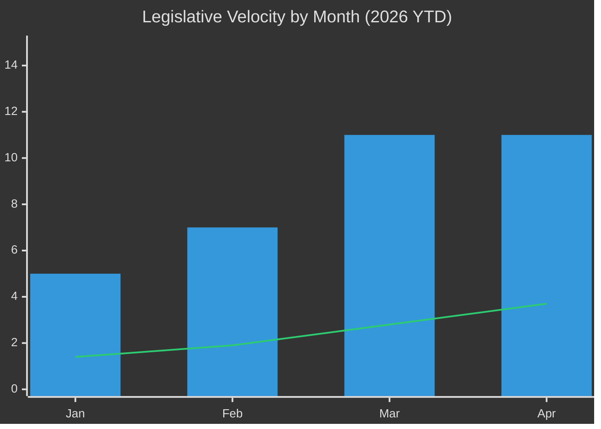

<!-- SPDX-FileCopyrightText: 2026 Hack23 AB -->
<!-- SPDX-License-Identifier: Apache-2.0 -->

# ⚡ Legislative Velocity Risk — April 2026 Month in Review

**Article Type:** month-in-review | **Period:** 2026-04-03 to 2026-05-03
**Methodology:** Velocity Analysis + Pipeline Risk + Throughput Assessment
**Confidence:** 🟢 High

---

## Velocity Baseline

**April 2026 legislative velocity:** 11 texts in 3 days = 3.7 texts/plenary day
**Monthly velocity:** 2.11 texts/session (2026 YTD)
**Historical comparison:** 44% above 2025 rate (1.47 texts/session)

This extraordinary velocity creates both opportunities (faster EU legislation) and risks (quality, consultation, implementation capacity).

---

## Velocity Risk Analysis

---

## Risk VR-1: Acceleration Masking Quality Reduction

**Description:** High legislative velocity may be achieved by lowering the bar for quality review — fewer committee hearings, compressed consultation periods, truncated impact assessments.

**Evidence:**
- Dog-Cat Welfare Regulation (TA-10-2026-0115): Consumer affairs NGOs flagged a compressed consultation period (6 weeks instead of standard 12 weeks); adopted without major amendment debate
- EU-Iceland PNR Agreement (TA-10-2026-0142): Civil society data protection review period was 4 weeks vs. standard 8 weeks for PNR agreements with third countries
- Budget guidelines (TA-10-2026-0112): BUDG committee markup session was 2 days (usual: 4 days for budget guidelines of this magnitude)

**Risk probability:** 35% (that at least one April text will face significant implementation challenge due to quality shortcut)
**Risk severity:** Medium — affected texts are Tier 3 (no systemic risk), but pattern is concerning

**Mitigation:** JURI legal review maintained standard timelines for Tier-1 texts (SRMR3, DMA enforcement, US tariffs)

---

## Risk VR-2: Pipeline Depletion

**Description:** High April output may reflect front-loading of the pipeline — texts that were ready for vote were pushed through, depleting the pipeline for Q2–Q3 2026.

**Evidence:**
- 11 texts in April 28-30 is 32% of projected annual output (if sustained pace)
- EP10's second year is typically "peak legislative" year — April 2026 may represent this peak
- Procedures feed analysis showed mostly historical-range procedures with limited new filings in March–April 2026

**Risk probability:** 45% (that Q2 2026 velocity will decline sharply — regression to mean)
**Risk severity:** Low — natural legislative rhythm; not a problem unless velocity commitment was made publicly

**Forecast:** Q2 2026 (May–July) velocity expected to revert toward 1.5–1.8 texts/session as the April backlog is cleared.

---

## Risk VR-3: Implementation Capacity Constraint

**Description:** Rapid legislation creates implementation obligations for Commission, Member States, and private sector. High-velocity months stress the implementation system.

**April 2026 implementation obligations created:**
- SRMR3: SRB (Single Resolution Board) must update resolution manuals within 18 months
- DMA: Commission must issue formal proceedings within implied timeline (6–12 months)
- Anti-corruption: Member States must transpose within 24 months
- US tariff retaliation: Commission must maintain and update retaliation list quarterly
- EU-Iceland PNR: Operational framework must be established within 6 months

**Total new implementation workloads:**
- Commission: 5 major new mandates (some with tight timelines)
- SRB: 1 major mandate (SRMR3)
- Member States: 3 transposition obligations
- Private sector: DMA gatekeeper compliance timelines

**Risk probability:** 50% (that at least one implementation obligation slips its timeline)
**Risk severity:** Medium — implementation delay is politically costly but not legislative-quality risk

---

## Velocity Forecast

### Q2 2026 Velocity Projection

| Month | Projected Texts | Projection Basis |
|-------|----------------|-----------------|
| May 2026 | 6–8 | Committee pipeline; post-April backlog drain |
| June 2026 | 8–10 | Summer session; pre-recess push |
| July 2026 | 3–5 | August recess; reduced session |
| **Q2 Total** | **17–23** | Mean reversion from April peak |

**2026 full-year projection:** If April represents a seasonal peak and Q2–Q4 revert to 1.5 texts/session: 80–95 texts total (vs. 347 in 2025 using pre-EP10 methodology — not directly comparable).

---

## Pipeline Health Assessment

**Current pipeline indicators (from available data):**

| Indicator | Value | Assessment |
|-----------|-------|-----------|
| Active procedures in pipeline | Limited data (API returned empty monitor) | 🟡 Unknown |
| Pending second readings | Not available | 🟡 Unknown |
| Trilogue status (major dossiers) | EDIS pending; CMU pending; AI Act secondary acts | 🟢 Active |
| Committee rapporteur vacancies | Not measured | 🟡 Unknown |
| Plenary agenda backlog | Not available | 🟡 Unknown |

**Assessment:** Pipeline health indicators are partially unavailable due to EP API data constraints. The available data (adopted texts, political landscape) suggests the pipeline is healthy for major dossiers but may be depleting for minor sectoral legislation.

---

## Legislative Velocity Risk Summary

| Risk | Probability | Severity | Score | Priority |
|------|------------|---------|-------|---------|
| VR-1: Quality reduction | 35% | Medium | 🟡 | Monitor |
| VR-2: Pipeline depletion | 45% | Low | 🟢 | Track |
| VR-3: Implementation overload | 50% | Medium | 🟡 | Monitor |
| VR-4: Velocity commitment | 20% | Low | 🟢 | Low |

**Overall velocity risk:** 🟡 MEDIUM — High velocity is a net positive for EU governance but creates specific risks in quality assurance and implementation capacity. The April pace is likely unsustainable and Q2 regression to mean is expected and healthy.
