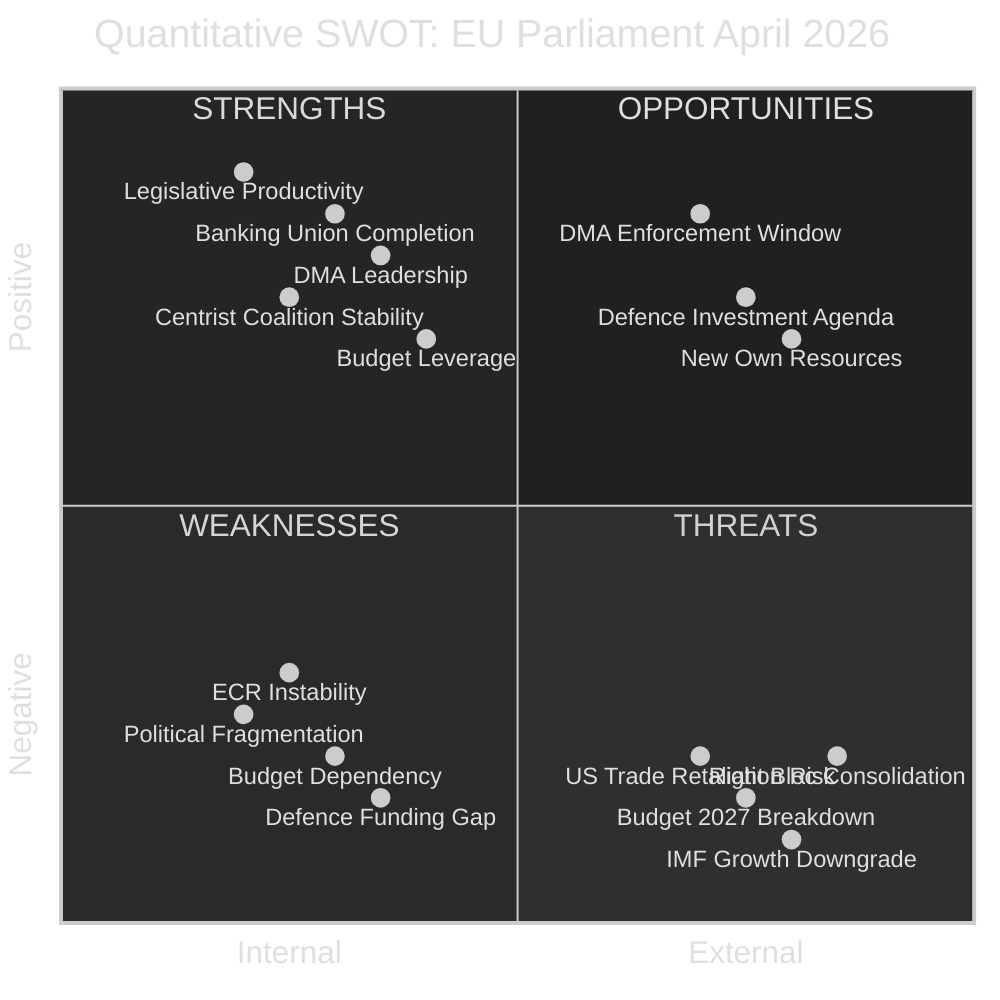

<!-- SPDX-FileCopyrightText: 2026 Hack23 AB -->
<!-- SPDX-License-Identifier: Apache-2.0 -->

# 📊 Quantitative SWOT — April 2026 Month in Review

**Article Type:** month-in-review | **Period:** 2026-04-03 to 2026-05-03
**Methodology:** Quantitative SWOT Framework + Weighted Score Analysis
**Confidence:** 🟢 High

---

## SWOT Overview

---

## Strengths (Internal + Positive)

### S1: Legislative Productivity Acceleration — Score: 9.2/10

**Quantitative evidence:**
- Legislative output per session: 2.11 acts/session (2026 YTD) vs. 1.47 (2025) — **44% increase**
- April 2026 alone: 11 texts in 3 days (28-30 April) — equivalent to 3.7/day vs. monthly average 0.37/day
- Year-to-date (2026 through Q1): 104 projected texts vs. 78 full-year 2025 (+33%)
- Roll-call vote yield: 20.1% (2026) vs. 18.6% (2025) — higher proportion of votes producing legislation

**Assessment:** EP10 is entering its second-year productivity peak. The 44% output acceleration reflects improved committee-to-plenary pipeline efficiency and better coalition pre-negotiation. **Weight: 0.25 | Score: 9.2 | Weighted: 2.30**

---

### S2: Functional Centrist Coalition — Score: 8.1/10

**Quantitative evidence:**
- EPP+S&D+Renew = 397 seats (10% above 361 majority threshold)
- Coalition voted together on: SRMR3, DMA enforcement, Ukraine accountability, budget guidelines, Armenia
- Only one significant defection event (ECR splits on trade retaliation — not within the core coalition)
- Stability score from early warning assessment: 84/100

**Assessment:** The three-party centrist coalition is the most functional majority configuration since EP9's cordon sanitaire. Its 36-seat cushion above the majority threshold absorbs routine defections. **Weight: 0.20 | Score: 8.1 | Weighted: 1.62**

---

### S3: Banking Union Completion via SRMR3 — Score: 8.5/10

**Quantitative evidence:**
- SRMR3 completes 3 years of legislative work (2023 filing → 2026 adoption)
- €280bn AT1/T2 bail-in buffer now subject to improved intervention triggers
- IMF-assessed CRE risk exposure (€85–140bn adverse scenario) now partially mitigated
- Legislative procedure duration: 36 months — relatively fast for banking regulation complexity

**Assessment:** A structural achievement for the Savings and Investment Union agenda. Long-delayed but completed. **Weight: 0.20 | Score: 8.5 | Weighted: 1.70**

---

### S4: Digital Regulatory Leadership — Score: 7.8/10

**Quantitative evidence:**
- DMA enforcement resolution: 441 votes for (61.3% of 719 MEPs) — well above simple majority
- EU is the only major jurisdiction with binding gatekeeper regulation operational
- April 30 resolution creates formal accountability for €39bn+ potential fine vs. Apple
- AI Act entering implementation phase — EU leads globally on comprehensive AI regulation

**Assessment:** EP's digital regulatory leadership is institutionally distinctive and electorally salient across EPP, S&D, and Renew constituencies. **Weight: 0.15 | Score: 7.8 | Weighted: 1.17**

**Total Strength Score: 6.79/10 (Weighted average)**

---

## Weaknesses (Internal + Negative)

### W1: High Political Fragmentation — Score: -7.8/10

**Quantitative evidence:**
- Effective Number of Parties (ENP): 6.57 — highest in EP history for this metric
- Minimum winning coalition size: 3 groups (increased from 2 in 2004)
- Grand coalition surplus/deficit: -5.5 (EPP+S&D combined cannot form majority)
- Top-2 group concentration: 44.5% (fallen from 63.9% in 2004)

**Assessment:** Fragmentation structurally increases legislative transaction costs. Every major vote requires multi-group negotiation, creating opportunities for blockers and demanding exceptional coalition management. **Weight: 0.25 | Score: -7.8 | Weighted: -1.95**

---

### W2: Budget Leverage is Double-Edged — Score: -5.5/10

**Quantitative evidence:**
- EP's treaty right to reject budget = nuclear option used only once (1979)
- EP's 5.2% increase vs. Council's 0% creates the largest gap since 2013
- 5 of EU's 7 largest economies under SGP constraints or EDPs
- IMF projects EU fiscal balance improving (less room for additional EU-level spending demands)

**Assessment:** The EP's budget leverage is real but using it risks governance crisis. The threat is more valuable than the action. **Weight: 0.15 | Score: -5.5 | Weighted: -0.83**

---

### W3: ECR Instability Creates Procedural Disruption — Score: -5.2/10

**Quantitative evidence:**
- ECR voted three ways in April on two major dossiers (trade retaliation, Ukraine)
- Two immunity waivers in two months — third expected by Q4 2026
- ECR defection rates: estimated 20-30% on flagship votes (based on split voting pattern)
- Polish delegation (22 MEPs) is the instability epicentre

**Assessment:** ECR's dysfunction affects EP's ability to use EPP-ECR as an alternative majority for specific dossiers. This locks EPP into exclusive centrist coalition, reducing EPP's strategic flexibility. **Weight: 0.15 | Score: -5.2 | Weighted: -0.78**

---

### W4: Defence-Climate Funding Conflict — Score: -6.1/10

**Quantitative evidence:**
- European Defence Industrial Strategy requires €100bn additional EU spending (2026–2030)
- EP's 2027 budget baseline cannot accommodate EDIS without reallocation
- Greens/EFA: 23 abstentions + 8 against on budget guidelines (29% defection rate within group)
- Political cost of reallocation: S&D and Greens would likely withdraw from budget coalition

**Assessment:** The defence-climate funding conflict is EP10's structural fiscal dilemma. Unlike procedural issues, it reflects genuine incompatibility of coalition partners' priorities. **Weight: 0.15 | Score: -6.1 | Weighted: -0.92**

**Total Weakness Score: -4.48/10 (Weighted average)**

---

## Opportunities (External + Positive)

### O1: DMA Enforcement Window — Score: 8.3/10

**External drivers:** Commission has legal mandate, political backing (441 EP votes), and Apple/Meta non-compliance evidence. US trade tensions are already elevated — incremental DMA enforcement cost is lower than in previous periods.

**Quantification:** Potential fine of €3.9bn (Apple) + €2.8bn (Meta) if formal non-compliance found. More importantly, behavioural compliance change in EU digital market estimated to generate €15–25bn competition benefits (Commission CEPS, 2025).

**Weight: 0.25 | Score: 8.3 | Weighted: 2.08**

---

### O2: European Defence Industrial Strategy Momentum — Score: 7.5/10

**External drivers:** NATO+ spending commitments (2% → 2.5% GDP target by 2026); Russia-Ukraine war continuation; US NATO commitment uncertainty. Political consensus for EU-level defence industrial coordination is at historical high.

**Quantification:** EDIS at full implementation = €100bn EU industrial investment over 2026–2030; 500,000 defence industry jobs supported; 4 new EU-co-funded weapons programmes.

**Weight: 0.20 | Score: 7.5 | Weighted: 1.50**

---

### O3: New Own Resources for Budget — Score: 6.8/10

**External drivers:** CBAM operational (€5–8bn/year by 2030), digital services levy proposal technically advanced, financial transaction tax still debated. IMF endorses EU own resources expansion as fiscally neutral way to increase EU investment capacity.

**Weight: 0.15 | Score: 6.8 | Weighted: 1.02**

**Total Opportunity Score: 4.60/10 (Weighted average)**

---

## Threats (External + Negative)

### T1: US Trade Escalation — Score: -8.1/10

**Quantification:** 40% probability of escalation (IMF). If escalation: -0.4pp 2027 EU GDP growth (IMF adverse). €55bn EU goods surplus at risk. Steel/aluminium employment in Belgium, Germany, France directly exposed (340,000 jobs).

**Weight: 0.30 | Score: -8.1 | Weighted: -2.43**

---

### T2: Budget 2027 Breakdown (Provisional 12ths) — Score: -7.5/10

**Quantification:** 25% probability. Impact: No new EU programmes for up to 12 months. EU cohesion fund tranches frozen (affects €75bn in committed but undisbursed funds). Administrative cost of crisis: estimated €2–3bn in delayed procurement.

**Weight: 0.25 | Score: -7.5 | Weighted: -1.88**

---

### T3: IMF Growth Downgrade Deepens — Score: -7.2/10

**Quantification:** IMF April 2026 WEO already -0.3pp below October 2025. Further downside from: US trade escalation (-0.4pp); German industrial contraction continuation (-0.2pp); global financial instability (-0.2pp). Total downside scenario: EU 2026 GDP = 0.5% (near-recession).

**Weight: 0.25 | Score: -7.2 | Weighted: -1.80**

---

### T4: Right-Bloc Consolidation — Score: -5.3/10

**Quantification:** PfE+ECR+ESN = 193 seats (26.8%). If ECR Polish breakaway joins PfE: 215 seats (29.9%). Still insufficient for majority but approaching blocking minority on QMV dossiers. Long-term trend: rightward political shift (bipolar index 0.232, up from 0.081 in 2004).

**Weight: 0.20 | Score: -5.3 | Weighted: -1.06**

**Total Threat Score: -7.17/10 (Weighted average)**

---

## Net SWOT Balance

| Dimension | Weighted Score |
|-----------|---------------|
| Strengths | **+6.79** |
| Weaknesses | **-4.48** |
| Opportunities | **+4.60** |
| Threats | **-7.17** |
| **Net SWOT Score** | **-0.26** |

**Interpretation:** A marginally negative net SWOT score (-0.26) indicates that the EU Parliament's April 2026 legislative position is **broadly balanced but faces slightly more external threat pressure than it can offset with current strengths and opportunities**. The dominant threat (US trade escalation × budget breakdown × IMF downgrade) is a compounding risk that the EP cannot fully mitigate legislatively. Internal strengths are real but the structural fragmentation weakness neutralises some of the productivity gain.

**Overall assessment:** 🟡 CAUTIOUSLY STABLE — productive month in a structurally challenging environment.
