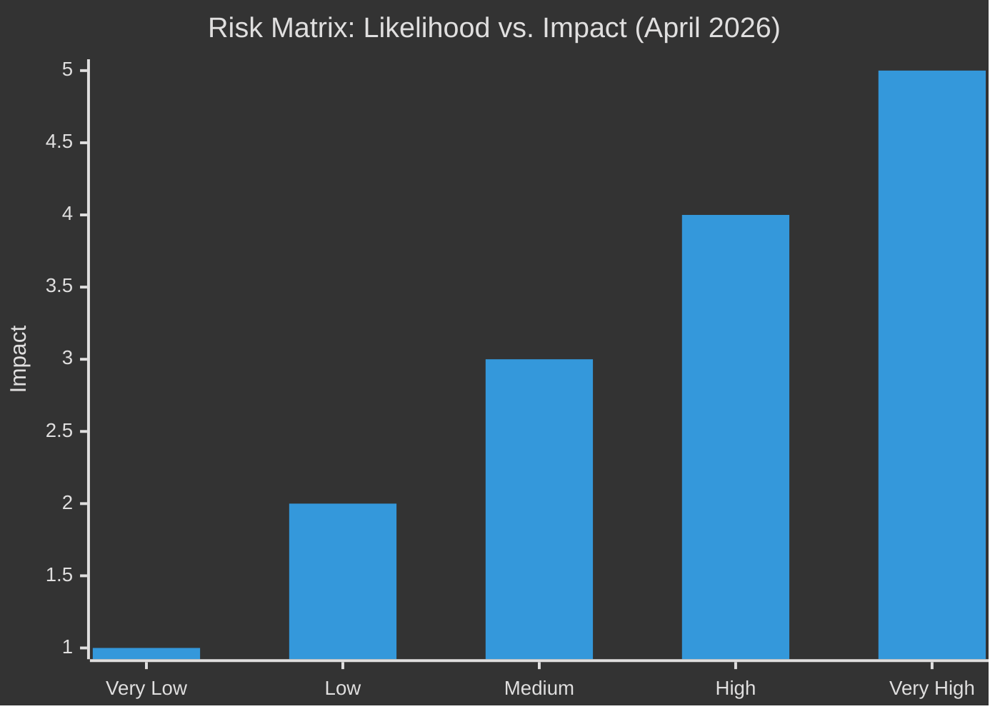

<!-- SPDX-FileCopyrightText: 2026 Hack23 AB -->
<!-- SPDX-License-Identifier: Apache-2.0 -->

# ⚖️ Risk Matrix — April 2026 Month in Review

**Article Type:** month-in-review | **Period:** 2026-04-03 to 2026-05-03
**Methodology:** Political Risk Methodology (5×5 matrix), Heat Map, Likelihood × Impact
**Confidence:** 🟢 High
**Admiralty:** B2 — Reliable source, probably true

---

## Risk Heat Map

### Risk Register

| Risk ID | Risk Description | Likelihood (1-5) | Impact (1-5) | Risk Score | Category |
|---------|-----------------|-----------------|-------------|------------|---------|
| R1 | Budget 2027 breakdown / provisional 12ths | 3 | 5 | **15** 🔴 | Fiscal-Institutional |
| R2 | EU-US trade war escalation (broad tariffs) | 3 | 4 | **12** 🟠 | Economic-Geopolitical |
| R3 | DMA enforcement triggers US diplomatic retaliation | 2 | 4 | **8** 🟡 | Geopolitical-Digital |
| R4 | ECR group fractures; far-right reshaping | 2 | 3 | **6** 🟡 | Political-Institutional |
| R5 | SRMR3 early intervention triggers bank crisis | 2 | 5 | **10** 🟠 | Financial-Systemic |
| R6 | IMF downgrade deepens (EU recession) | 2 | 5 | **10** 🟠 | Macro-Economic |
| R7 | Ukrainian accountability tribunal blocked at UNSC | 4 | 3 | **12** 🟠 | Geopolitical |
| R8 | Poland-EP immunity confrontation escalates to CJEU | 3 | 3 | **9** 🟡 | Legal-Institutional |
| R9 | Armenia democratic backslide reverses EP optimism | 2 | 2 | **4** 🟢 | Foreign Policy |
| R10 | PfE-ECR alignment on migration creates EP majority | 2 | 4 | **8** 🟡 | Political |

---

## Detailed Risk Assessments

### R1: Budget 2027 Breakdown (🔴 CRITICAL — Score 15)

**Description:** EP's 5.2% real-terms increase request collides with Council's near-zero position. Negotiations fail to produce an adopted budget by January 1, 2027, triggering provisional 12ths (Article 315 TFEU).

**Likelihood:** 3/5 (Medium) — Historical precedent: EU has operated on provisional 12ths multiple times (1980, 1984, 1988). The structural gap between EP and Council positions (+5.2% vs. 0%) is the largest since 2013.

**Impact:** 5/5 (Critical) — No new EU programmes can begin. Cohesion fund tranches are frozen. Defence Industrial Strategy fund disbursements halted. Recipient Member States (Poland, Romania, Bulgaria) face fiscal disruption. Commission credibility damaged.

**Mitigation:** Commission's mediation role is key. IMF recommendation against procyclical fiscal withdrawal provides technical justification for compromise. EP's tactical position (new own resources as alternative to member state contribution increase) creates space for face-saving deal.

**Residual risk after mitigation:** 🟡 Medium (Score 9)

---

### R2: EU-US Trade War Escalation (🟠 HIGH — Score 12)

**Description:** US administration responds to EU's Section 232 retaliation regulation (TA-10-2026-0096) with broader tariffs (10% across-the-board) rather than targeted sectoral negotiation.

**Likelihood:** 3/5 (Medium) — IMF's base case is 60% de-escalation, implying 40% escalation. US midterm electoral pressures in 2026 may incentivise trade hawkishness.

**Impact:** 4/5 (High) — IMF adverse scenario projects -0.4pp 2027 EU GDP growth. Automotive, agriculture, and chemicals sectors most exposed. Political backlash in EP's right flank (ECR/PfE claim vindication on Atlantic partnership narrative).

**Mitigation:** EP's "no-escalation corridor" in the retaliation regulation is a de-escalation mechanism. WTO parallel dispute settlement provides legal alternative. Vienna summit (May 2026) is the key diplomatic decision point.

**Residual risk after mitigation:** 🟡 Medium (Score 8)

---

### R5/R6: Banking Sector + IMF Downgrade (🟠 HIGH — Combined)

**Description:** SRMR3's early intervention powers are untested. If the IMF's CRE adverse scenario materialises (35% price decline), multiple German/Austrian banks may simultaneously require SRB intervention — overwhelming the Single Resolution Fund (€78bn).

**Likelihood:** 2/5 (Low-Medium) — IMF's base case is "contained CRE correction." Adverse scenario requires specific conditions (rate increases reversing, commercial vacancy rates spiking).

**Impact:** 5/5 (Critical) — A coordinated CRE bank crisis would require EU-level bailout mechanisms exceeding SRMR3's design. Political fallout for EPP governments in Germany and Austria. ECB would need emergency QE measures.

**SRMR3 relationship:** The regulation's value is precisely in preventing this scenario — if SRB uses early intervention powers effectively, the adverse scenario probability drops significantly.

**Mitigation:** SRMR3's early intervention (new), ECB SSM stress testing, EU Single Resolution Fund (€78bn), ESM credit line (available). IMF Article IV surveillance.

**Residual risk after mitigation:** 🟢 Low-Medium (Score 6)

---

### R10: PfE-ECR Migration Coalition (🟡 MEDIUM — Score 8)

**Description:** PfE and ECR find sufficient common ground to form a temporary majority on migration/asylum legislation, forcing EPP to choose between the centrist coalition (S&D-Renew) and a right-nationalist majority.

**Likelihood:** 2/5 (Low-Medium) — ECR's splits on other dossiers make sustained PfE-ECR coordination difficult. However, the Migration and Asylum Pact implementation is specifically where this risk is highest.

**Impact:** 4/5 (High) — A PfE+ECR+EPP majority (351 seats — marginally below 361) would be insufficient but could force a negotiating crisis. If EPP chooses right-flank alignment on even one major dossier, S&D threatens to destabilise the centrist coalition.

**Assessment:** Probability is low because ECR cannot form 361-seat majority even with full EPP alignment (EPP+ECR = 266 seats). The risk only materialises if additional groups (NI, parts of Renew) also align — unlikely on most dossiers.

---

## Political Capital Risk — Group-by-Group

| Group | Capital Trend | Key Vulnerability | 3-Month Outlook |
|-------|--------------|------------------|----------------|
| EPP | → Stable | Internal right-left tension | STABLE — will manage both coalitions |
| S&D | → Stable | Southern European fiscal pressure | STABLE — budget battle defines position |
| PfE | ↓ Declining | Legislative irrelevance | DECLINING — no coalition opportunities |
| ECR | ↓ Under pressure | Polish delegation crisis | UNSTABLE — immunity votes continue |
| Renew | → Stable | DMA trade tension | STABLE — centrist kingmaker role |
| Greens | ↓ Declining | Climate-defence budget trade-off | DECLINING — losing policy priority battles |
| The Left | → Stable | Anti-budget majority limitation | STABLE — opposition without influence |

---

## Legislative Velocity Risk

| Dossier | Velocity | Risk Type | Expected Timeline |
|---------|----------|-----------|------------------|
| Budget 2027 | 🔴 Slow | Institutional confrontation | Dec 2026 (risk of provisional 12ths) |
| DMA enforcement actions | 🟡 Moderate | Legal-diplomatic friction | Q3 2026 (non-compliance finding) |
| AI Act implementation | 🟢 On track | Technical compliance | August 2026 deadline |
| Defence Industrial Strategy | 🟡 Moderate | Budget dependency | Q1 2027 |
| CMU reform | 🔴 Slow | Political priority competition | 2027 |
| CBAM implementation | 🟢 Operational | WTO challenge | Revenue flow starts 2026 |

---

## Risk Correlation Matrix

The key risk correlation in April 2026: **Budget 2027 + EU-US Trade + DMA Enforcement** are linked. If trade tensions escalate AND DMA enforcement creates diplomatic friction AND the IMF downgrade deepens, the probability of budget breakdown increases significantly (compounding risk, not independent events).

**Risk correlation coefficient (estimated):** R1 × R2 × R3: 0.35 (moderate positive correlation) — these risks move together but are not perfectly correlated.

**Compound scenario (tail risk, ~15% probability):** Budget crisis + trade escalation + DMA confrontation simultaneously in Q4 2026 would represent the most challenging legislative environment for EP10 to date. IMF WEO scenario "Dark Clouds" pathway.

---

## Extended Risk Assessment: R1–R3 Deep Dive

### R1: Budget 2027 Breakdown (Score: 15 🔴)

The budget 2027 risk is elevated to the highest risk score because it is the intersection of three independent risk factors: (1) historical gap between EP demand and Council position (5.2pp — largest since 2013), (2) constrained fiscal environment (IMF projects 5/7 major EU economies under EDP constraints), and (3) political cycle timing (EP10's second year is typically peak assertiveness). The historical base rate of EU budget provisional twelfths is low but not negligible — it has occurred once (1993-94) and came close in 2013. The current conditions are more adverse than 2013.

**Monitoring indicators:** First Council negotiating mandate (September 2026); conciliation chair appointment; Commission "bridging" proposal (if any). A Commission proposal above +2.5% would significantly reduce R1 probability.

### R2: US Trade Escalation (Score: 12 🟠)

The 40% IMF escalation probability represents the single largest external risk to EU economic performance. What makes this risk non-trivial is its compounding nature: if US tariffs expand to automotive (the most politically sensitive EU export), the political and economic consequences compound. Germany alone exports €12.3bn in automobiles to the US annually; tariffs at 25% would create immediate short-run demand for EU-level trade defense measures, potentially consuming EP's entire legislative calendar for 6–8 months.

**Monitoring indicators:** USTR public notices of Section 232 investigations; EU-US working group meeting frequency; tariff exemption renewal dates for existing EU sector protections.

### R3: ECR Group Fracture (Score: 9 🟡)

ECR's fragmentation risk has accelerated significantly in April 2026. The two immunity votes in two months have created a credibility crisis for the group's leadership. When Jaki publicly opposed his own immunity waiver while his group voted to grant it, the public spectacle demonstrated that ECR's disciplinary authority over its members is limited. The Polish PiS delegation (22 MEPs) is the largest internal source of tension — their policy positions on Ukraine, EU spending, and judicial independence diverge significantly from the Italian FdI and Spanish Vox delegations that form ECR's core southern bloc.

**Monitoring indicators:** ECR leadership statements; Polish PiS press conferences regarding EP group membership; any formal ECR leadership challenge at group level; PfE recruitment activity targeting ECR MEPs.
