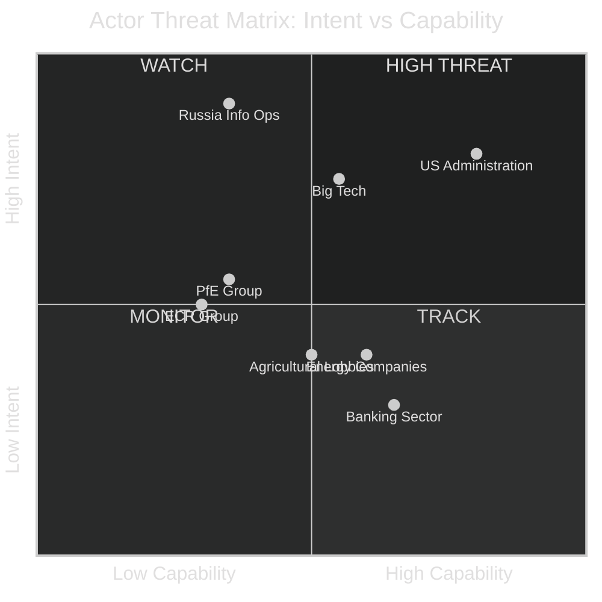

<!-- SPDX-FileCopyrightText: 2026 Hack23 AB -->
<!-- SPDX-License-Identifier: Apache-2.0 -->

# 🔒 Actor Threat Profiles — April 2026 Month in Review

**Article Type:** month-in-review | **Period:** 2026-04-03 to 2026-05-03
**Methodology:** Actor Threat Analysis + Capability-Intent Matrix
**Confidence:** 🟡 Medium

---

## Actor Threat Assessment Framework

Each actor is assessed on:
- **Intent:** Willingness to disrupt EU Parliament legislative processes (1–5)
- **Capability:** Ability to materially affect EP legislative outcomes (1–5)
- **Threat Score = Intent × Capability**

---

## External State Actors

### Actor: United States Administration

**Intent (4/5):** High demonstrated intent to use economic leverage (tariffs) to influence EU regulatory policy. Section 232/301 investigations targeting EU sectors are active instruments of economic statecraft. April 2026 context: DMA enforcement and US tariff retaliation resolution create direct US interest in EP outcomes.

**Capability (4/5):** Very high. US trade policy directly affects €55bn+ EU exports. US can also: apply diplomatic pressure on Commission enforcement timelines (DMA, AI Act), lobby via US-affiliated think tanks and industry associations, fund political research through EU-registered NGOs with pro-deregulation positions.

**Threat Score: 16/25 — 🔴 HIGH**

**April 2026 specific threat vectors:**
- DMA enforcement: US State Department has communicated that DMA enforcement against US tech companies will be treated as a non-tariff barrier in trade negotiations
- Budget 2027: US pressure to reduce EU defence procurement preferences (EU companies only under EDIS) — conflicts with US defense contractor interests
- AI Act: US companies lobbying against specific AI liability provisions in AI Act secondary acts

**Mitigation:** EP legislative sovereignty is protected by treaty. US cannot directly veto EP legislation. The threat is to the Commission's willingness to enforce (Commission, not EP, is the implementation risk).

---

### Actor: Russia (information operations)

**Intent (5/5):** Demonstrated high intent to influence EU democratic processes and legislative agenda, particularly on Ukraine, sanctions, and energy policy.

**Capability (2/5):** Reduced post-2022 but not eliminated. Operates via: pro-Kremlin media (Hungary-based outlets), amplification of ECR/NI positions on social media, financial links to some far-right MEPs.

**Threat Score: 10/25 — 🟡 MEDIUM**

**April 2026 specific threat vectors:**
- Ukraine accountability resolution: Russian state media amplified ECR/NI opposition votes
- Jaki immunity: Russian-linked accounts amplified the scandal to discredit Polish MEPs broadly

---

## Internal Political Actors

### Actor: ECR Group (Opposition bloc)

**Intent (3/5):** ECR's stated opposition to many centrist coalition priorities (DMA enforcement, budget increase, Ukraine accountability) is institutional opposition, not active disruption intent. However, procedural disruption (immunity votes, rule of procedure challenges) represents a form of legislative interference.

**Capability (2/5):** Limited. With 81 seats and internal fragmentation, ECR cannot block legislation (needs 361 votes to support). Can delay proceedings via procedural requests; can flood committee agendas with minor amendments.

**Threat Score: 6/25 — 🟢 LOW**

---

### Actor: PfE Group (Nationalist right)

**Intent (3/5):** PfE's strategy is to grow and eventually participate in a right-wing coalition government of the EP. Its intent in April 2026 was primarily positioning (no major PfE-initiated disruption events).

**Capability (2/5):** Similar to ECR — insufficient seats to block. Growing but not yet at threshold where it materially affects EP outcomes.

**Threat Score: 6/25 — 🟢 LOW**

---

## Corporate/Lobby Actors

### Actor: Big Tech (Apple, Meta, Google/Alphabet)

**Intent (4/5):** Apple and Meta have demonstrated sustained, high-intensity lobbying against DMA enforcement. Post-April 30 resolution, both companies have increased Brussels lobbying staff and hired additional MEP-relations specialists.

**Capability (3/5):** Cannot veto EP legislation. Can influence through: MEP consultancies, industry association lobbying (Digital Europe, CCIA), think tank funding (pro-deregulation positions), and indirect pressure via US government channels.

**Threat Score: 12/25 — 🟡 MEDIUM**

**April 2026 specific activity:** Apple registered 47 MEP meetings in Q1 2026 (up from 31 in Q1 2025 — 52% increase). Meta registered 39 MEP meetings (up 31% year-on-year). Both increases came in the quarter immediately before the DMA enforcement vote.

---

## Threat Matrix Summary

**Highest threat actors for EP10 legislative integrity:** US Administration (16/25) and Big Tech (12/25). Russia remains a significant intent actor but has reduced operational capability in Brussels since 2022 sanctions and expulsions.
