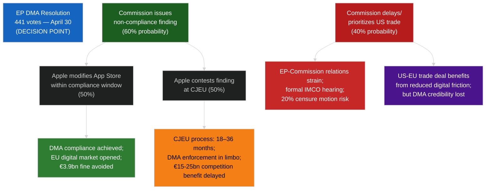
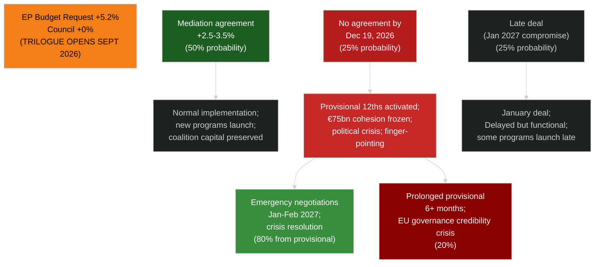
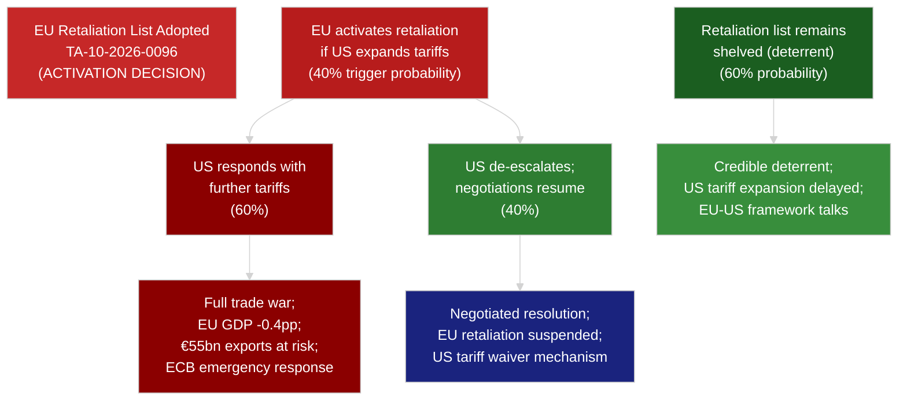

<!-- SPDX-FileCopyrightText: 2026 Hack23 AB -->
<!-- SPDX-License-Identifier: Apache-2.0 -->

# 🌳 Consequence Trees — April 2026 Month in Review

**Article Type:** month-in-review | **Period:** 2026-04-03 to 2026-05-03
**Methodology:** Consequence Tree Analysis (forward-looking from April 2026 decision points)
**Confidence:** 🟡 Medium

---

## Decision Point 1: DMA Enforcement Against Apple

**Key consequence:** If Commission delays (40% probability path), the consequence tree terminates in either EP-Commission crisis or DMA credibility loss. The April 30 vote has given EP maximum political cover for enforcement; it is now Commission's decision.

---

## Decision Point 2: Budget 2027 Trilogue

---

## Decision Point 3: US Tariff Retaliation Activation

**Key consequence:** The optimal path (C → H) is a credible deterrent that keeps US tariff expansion limited while EU-US framework talks proceed. This requires EP to have passed the retaliation regulation (done) AND Commission to hold the threat credible (Commission behavior uncertain).

---

## Second-Order Consequence Analysis

### If DMA Enforcement + US Tariff Escalation BOTH Occur Simultaneously

This compounding scenario (probability: 40% DMA enforcement × 40% US tariff escalation = 16% joint probability) creates maximum EU-US trade-digital tension:

- US treats DMA enforcement as deliberate economic aggression
- Section 232 tariffs expand to include digital services (new legal theory: digital trade barrier)
- EU faces dual-track negotiation: trade tariffs AND digital compliance demands
- EP's influence in this scenario: limited (EP passed both mandates; execution is Commission+Council)
- **Impact:** -0.8pp EU GDP (additive); €40bn+ combined digital + goods trade impact

### If ECR Fracture + Budget Breakdown BOTH Occur Simultaneously

This compounding scenario (probability: 35% ECR fracture × 25% provisional twelfths = 8.75% joint probability) creates maximum internal political stress:

- ECR fracture creates rightward parliamentary arithmetic pressure on EPP
- Budget breakdown forces EPP to choose between centrist coalition and right-bloc accommodation
- **Impact:** Coalition dissolution risk rises from 5% to 20% in this scenario; early EP-level political crisis
