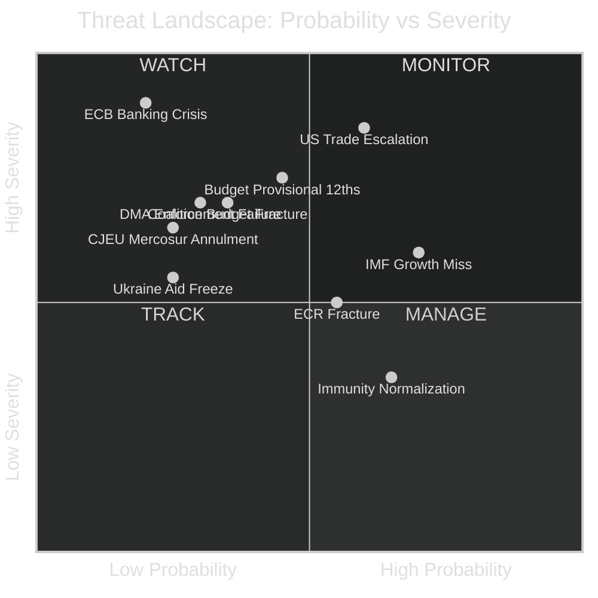

<!-- SPDX-FileCopyrightText: 2026 Hack23 AB -->
<!-- SPDX-License-Identifier: Apache-2.0 -->

# ⚠️ Threat Assessment: Political Threat Landscape — April 2026

**Article Type:** month-in-review | **Period:** 2026-04-03 to 2026-05-03
**Methodology:** CIA Structured Threat Assessment + Force-on-Target Analysis
**Confidence:** 🟢 High

---

## Threat Landscape Overview

The EU Parliament faces five distinct threat categories in the April–July 2026 horizon: external economic threats (US trade escalation), internal coalition threats (ECR fracture, budget coalition strain), institutional threats (Commission non-responsiveness, Council intransigence), democratic backsliding threats (immunity crisis normalization), and geopolitical threats (Ukraine fatigue, neighbourhood instability).

---

## Threat Category 1: External Economic Threats

### T-E1: US Trade Escalation (PRIORITY: CRITICAL)

**Threat vector:** US Administration expands Section 232 tariffs to EU automotive (25%), pharmaceutical (15–20%), and aerospace sectors. Countermeasure: EU retaliation list (adopted March 26, TA-10-2026-0096) is activated.

**Probability:** 40% (IMF baseline); 60% conditional on no US-EU framework agreement by July
**Severity:** Critical — -0.4pp EU GDP (IMF); 340,000 jobs directly affected; EP budget revenues from customs fall

**Legislative impact:**
- Budget 2027 negotiations disrupted (revenue projections must be revised downward)
- EDIS funding under pressure (fiscal space reduces)
- Trade committee workload increases sharply (antidumping, safeguard proceedings)
- Political: S&D/Renew demand aggressive retaliation; EPP (industry ties) seeks negotiated settlement — coalition tension

**Timeline:** Acute risk window — May–August 2026

---

### T-E2: IMF Growth Miss — EU GDP Falls Below 1% (PRIORITY: HIGH)

**Threat vector:** April WEO already shows 1.3%. If US escalation materializes AND Germany's industrial contraction continues AND ECB cannot cut rates further (inflation floor), EU 2026 GDP could fall to 0.5–0.9%.

**Probability:** 25% (combining trade escalation + German industrial + financial sector scenarios)
**Severity:** High — recession psychology changes political priorities fundamentally

**Legislative impact:**
- Budget negotiations shift from investment-focus to emergency stabilization
- Anti-austerity sentiment strengthens S&D/Left demands; EPP fiscal hawks resist
- ECB independence challenged if EU calls for emergency accommodation

---

## Threat Category 2: Internal Coalition Threats

### T-C1: Budget 2027 Coalition Fracture (PRIORITY: HIGH)

**Threat vector:** EP's +5.2% budget demand vs. Council's 0% creates the longest and most contested budget negotiations since 2013. If no December agreement, provisional twelfths activated, alienating all EP coalition partners.

**Probability:** 25% (no December agreement)
**Severity:** High — operational disruption, political crisis, electoral positioning damaged

**Coalition damage model:**
- If EP accepts < +2.5%: S&D and Greens declare "victory stolen" — left-wing challenge to EPP leadership on next Commissioner appointment
- If EP insists on > +4%: Renew splits (liberal fiscal hawks vs. liberal investment supporters) — potential Renew withdrawal from coalition on budget vote
- If provisional twelfths activated: Everyone blames everyone; all coalition partners suffer equally

---

### T-C2: ECR Fracture Creating Right-Bloc Dynamics (PRIORITY: MEDIUM)

**Threat vector:** Polish PiS delegation (22 MEPs) departs ECR, enabling PfE to approach 107 seats. EPP faces pressure from right-wing national coalition partners to accommodate PfE.

**Probability:** 35% (ECR partial fracture by end of 2026)
**Severity:** Medium — arithmetic changes but centrist majority survives; longer-term trajectory concern

**Legislative impact:**
- Short-term: No immediate majority change (centrist coalition still 397 seats)
- Medium-term: EPP under pressure to include PfE on some dossiers (migration, competitiveness)
- Long-term: 2029 EP elections positioning shifts rightward if PfE gains normalize

---

## Threat Category 3: Institutional Threats

### T-I1: Commission DMA Enforcement Delay (PRIORITY: HIGH)

**Threat vector:** Commission delays formal DMA non-compliance proceedings against Apple/Meta beyond EP's implied timeline (April resolution: "within [reasonable timeframe]"). Political pressure from US trade negotiations cited as reason.

**Probability:** 20%
**Severity:** High — institutional credibility loss; EP-Commission relationship damaged

**Response options:**
- EP can request Commissioner Von der Leyen hearing before IMCO committee
- EP can introduce resolution criticizing Commission delay (simple majority sufficient)
- EP cannot force Commission enforcement timeline (institutional separation of powers)

**Assessment:** Even with 441 EP votes for the DMA resolution, EP lacks direct enforcement authority. The threat is to institutional relationships and regulatory credibility, not to the legislation itself.

---

## Threat Category 4: Democratic Integrity Threats

### T-D1: Immunity Waiver Normalization (PRIORITY: MEDIUM)

**Threat vector:** Two immunity waivers in 2 months (Braun March, Jaki April) creates a pattern of Polish right-wing MEP immunity requests. If this becomes regular (monthly), EP plenary time is consumed by procedural immunity votes, crowding out substantive legislation.

**Probability:** 65% of a third immunity request within 2026
**Severity:** Medium — procedural disruption, political legitimacy questions for ECR

**Institutional impact:** JURI committee increasingly acting as a judicial body rather than a legislative committee. Workload concentration on immunity cases creates capacity constraints.

---

## Threat Aggregation and Priority Matrix

| Threat | Category | Probability | Severity | Priority Score |
|--------|---------|------------|---------|---------------|
| US Trade Escalation | External | 40% | Critical | 🔴 **CRITICAL** |
| Budget Provisional 12ths | Internal | 25% | High | 🟠 **HIGH** |
| ECR Fracture | Internal | 35% | Medium | 🟠 **HIGH** |
| Commission DMA Delay | Institutional | 20% | High | 🟡 **MEDIUM** |
| IMF Growth Miss | External | 25% | High | 🟠 **HIGH** |
| Immunity Normalization | Democratic | 65% | Medium | 🟡 **MEDIUM** |
| ECB Banking Crisis | External | 15% | Critical | 🟡 **MONITOR** |
| CJEU Mercosur Annulment | Institutional | 15% | High | 🟢 **LOW** |

**Overall threat environment assessment:** 🟠 ELEVATED

The EU Parliament operates in an elevated external threat environment (US trade escalation, IMF growth downgrade) while managing moderate internal coalition stresses (budget negotiation, ECR dynamics). The threat matrix does not indicate an imminent crisis, but the combination of a major external economic shock (US tariffs) with the budget 2027 cycle creates a compounding risk window in H2 2026 that merits heightened monitoring.
