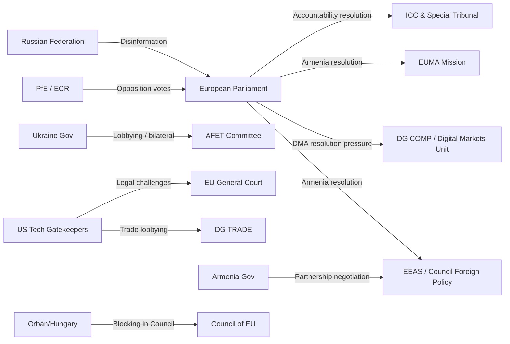

<!-- SPDX-FileCopyrightText: 2026 Hack23 AB -->
<!-- SPDX-License-Identifier: Apache-2.0 -->

# Actor Mapping — EP Breaking News | 2026-05-04

**Subject:** Key Actors in April 28-30, 2026 EP Legislative Package  
**Framework:** Actor Mapping + Interest/Influence Matrix  
**Confidence:** 🟡 Medium (structural inference; speech text not available via API)

---

## Primary Parliamentary Actors

### Roberta Metsola — EP President (EPP, Malta)
**Role:** EP President, presiding over plenary sessions  
**Influence:** 🟢 HIGH — Sets agenda, chairs votes, represents EP externally  
**Position:** Strongly pro-Ukraine (consistent since 2022); strong on rule of law; pragmatic on digital regulation  
**Relevance to April 28-30 package:** Presided over plenary sessions; the Ukraine accountability and Armenia resolutions reflect her stated political priorities  
**IMF/Economic context:** Metsola has been vocal on EU competitiveness and housing affordability — both relevant to MFF 2028-34 debate

### BUDG Committee Chair (name not confirmed via API)
**Role:** Budget Committee Chair guiding MFF 2028-2034 interim report  
**Influence:** 🟢 HIGH — Owns the budget dossier and interim report text  
**Relevance:** The April 28 MFF debate is structured around BUDG committee work  
**Note:** Chair identity not confirmed through available API data; requires supplemental verification

### JURI Committee (Immunity Cases)
**Role:** Committee on Legal Affairs — processes immunity waiver requests  
**Influence:** 🟢 HIGH on immunity decisions  
**Relevance:** Processed both Braun (March) and Jaki (April) immunity waiver requests; outputs adopted by plenary

### IMCO Committee (DMA Enforcement)
**Role:** Internal Market and Consumer Protection Committee  
**Influence:** 🟢 HIGH on digital market regulation  
**Relevance:** DMA enforcement resolution (TA-10-2026-0160) likely originated or was endorsed through IMCO; the committee has been the primary parliamentary oversight body for DMA implementation since 2024

### AFET Committee (Foreign Affairs)
**Role:** Committee on Foreign Affairs  
**Influence:** 🟢 HIGH on Ukraine, Armenia, Middle East resolutions  
**Relevance:** All geopolitical resolutions (Ukraine, Armenia, Lebanon, Haiti) typically pass through or involve AFET committee work  
**Note:** AFET chair and key rapporteurs for these resolutions not confirmed via available API data

---

## Key MEPs in Debates (April 28-30) — Identified via Speeches Feed

*Speaker IDs obtained from EP speeches feed; full names not available via API (API returns person/ID format)*

| Speaker ID | Debate | Role/Context |
|------------|--------|-------------|
| person/256985 | MFF 2028-2034 debate (Apr 28) | EPP or S&D senior budget rapporteur (inferred) |
| person/96812 | MFF 2028-2034 debate (Apr 28) | Senior MEP on budget committee |
| person/256811 | Ukraine accountability debate (Apr 28) | AFET-aligned MEP |
| person/257037 | Ukraine accountability debate (Apr 28) | AFET-aligned MEP |
| person/37656 | Middle East energy debate (Apr 29) | Senior MEP, possibly INTA or AFET |
| person/220896 | Haiti trafficking debate (Apr 29) | DEVE or AFET committee member |
| person/192254 | Electoral Act proxy voting (Apr 29) | AFCON-related, rapporteur for Electoral Act amendment |
| person/118859 | Discharge 2024 Court of Justice (Apr 29) | CONT committee member |
| person/197841 | Russia normalisation debate (Apr 29) | Hawkish pro-Ukraine MEP |

---

## External Actors — Influence Map

---

## Interest-Power Matrix

| Actor | Interest in Resolutions | Power to Shape Outcomes |
|-------|------------------------|------------------------|
| EPP | HIGH (Ukraine + digital) | 🔴 VERY HIGH (185 seats) |
| S&D | HIGH (all resolutions) | 🟠 HIGH (135 seats) |
| Renew | HIGH (all resolutions) | 🟠 HIGH (77 seats — swing pivot) |
| Greens/EFA | HIGH | 🟡 MEDIUM (53 seats) |
| PfE | HIGH (against) | 🟡 MEDIUM (85 seats opposition) |
| ECR | HIGH (against DMA + mixed Ukraine) | 🟡 MEDIUM (81 seats) |
| Ukraine government | VERY HIGH | LOW (external) |
| Armenia government | HIGH | LOW (external) |
| US tech companies | HIGH (DMA) | MEDIUM (legal + lobbying channels) |
| Commission DG COMP | HIGH (DMA) | HIGH (enforcement discretion) |
| ICC / Special Tribunal | HIGH (accountability) | LOW-MEDIUM (legal authority) |

---

## Actor Alignment Forecast

**For Ukraine accountability resolution:**
- **Aligned:** EPP, S&D, Renew, Greens/EFA, The Left, pro-Ukraine NI members (~450-460 seats predicted)
- **Opposed:** ESN, hard-right PfE members, some ECR (~100-120 seats predicted)
- **Ambiguous:** Some PfE (French RN peace narrative), some NI (~50-80 seats predicted)

**For DMA enforcement resolution:**
- **Aligned:** S&D, Renew, Greens/EFA, The Left, moderate EPP (~480-500 seats predicted)  
- **Opposed:** PfE, ECR, ESN, some EPP free-marketeers (~180-200 seats predicted)

**For Armenia resilience resolution:**
- **Aligned:** EPP, S&D, Renew, Greens/EFA, The Left (~450-470 seats predicted)
- **Opposed:** ESN, parts of PfE (Russia-adjacent groups) (~80-110 seats predicted)
- **Ambiguous:** Some ECR, some NI (~60-80 seats)

---

## Patryk Jaki Immunity Waiver — Actor Detail

**Patryk Jaki (ECR, Poland)**
- Former Polish government official
- Current ECR MEP
- Immunity waived April 28, 2026 (TA-10-2026-0105) — second Polish MEP immunity waiver in consecutive months
- Polish prosecution context: connected to judicial/prosecutorial activities under the prior PiS government
- ECR's formal position: likely voted against the waiver; framing as political persecution by PO government
- JURI committee determination: immunity does not cover acts committed in professional capacity related to political role when immunity protection does not apply

**Grzegorz Braun (context: prior immunity waiver)**
- Polish MEP (NI/non-attached), extreme nationalist
- Immunity waived March 26, 2026 (TA-10-2026-0088) — fire extinguisher Hanukkah incident context
- Different case from Jaki but establishes pattern of Polish immunity proceedings reaching EP

The two cases are legally distinct but politically conjoined in EP discourse — both involve Polish national political conflicts playing out in EU parliamentary immunity proceedings.
