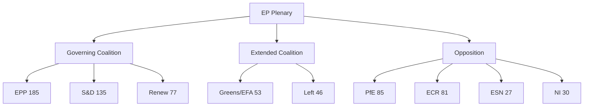

<!-- SPDX-FileCopyrightText: 2026 Hack23 AB -->
<!-- SPDX-License-Identifier: Apache-2.0 -->

# Classification: Actor Mapping — EP Breaking News | April 28–30, 2026

**Date:** 2026-05-04 | **Type:** Actor Classification

## Primary Actors by Role

| Actor | Role | Position | Power Level |
|-------|------|---------|-------------|
| EPP Group (185 MEPs) | Legislative majority anchor | Pro-enforcement (digital); Pro-Ukraine; MFF cautious | HIGH |
| S&D Group (135 MEPs) | Coalition partner | Strongly pro-enforcement; Pro-STCA; Pro-MFF expansion | HIGH |
| Renew Group (77 MEPs) | Swing group | Liberal enforcement; Atlantic security; MFF divided | HIGH |
| PfE Group (85 MEPs) | Opposition | Anti-STCA; skeptical on digital overreach | MEDIUM |
| ECR Group (81 MEPs) | Split opposition | Poland: Pro-Ukraine; Italy: Anti-STCA; variable on digital | MEDIUM |
| European Commission | Executive | DMA implementer; MFF proposer; STCA facilitator | VERY HIGH |
| DG COMP | Technical enforcement | DMA enforcement decisions | HIGH |
| EU Council | Co-legislator/veto | MFF unanimity; CFSP unanimity on STCA | VERY HIGH |

## Actor Influence Assessment

**Most Influential Actors for April 28–30 outcomes:**
1. EPP leadership (Weber/Metsola) — determined coalition discipline and resolution scope
2. Commission (Von der Leyen) — future implementing body; influenced resolution language
3. AFET committee rapporteur — drafted Ukraine STCA resolution technical details
4. IMCO committee rapporteur — drafted DMA enforcement resolution specifics
5. Big Tech lobbyists — attempted to moderate; influenced EPP qualifier language

**Actor classification confidence:** MEDIUM — based on structural role analysis; individual MEP behaviors not verified (no roll-call data)
