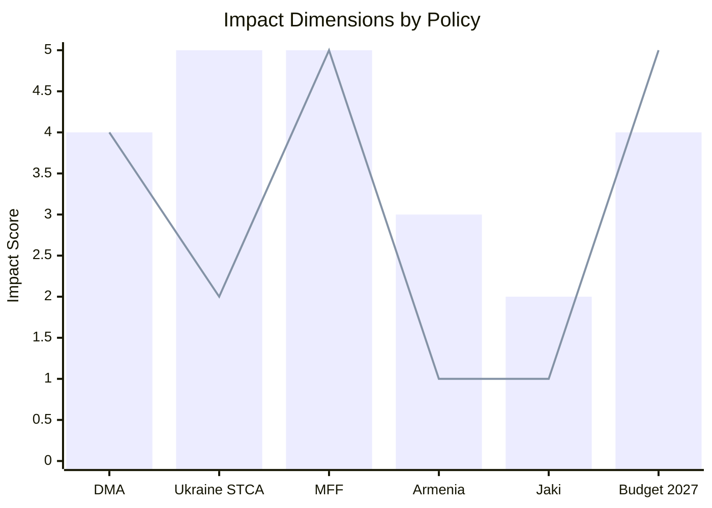

<!-- SPDX-FileCopyrightText: 2026 Hack23 AB -->
<!-- SPDX-License-Identifier: Apache-2.0 -->

# Impact Matrix — EP Breaking News | April 28–30, 2026

**Date:** 2026-05-04 | **Type:** Multi-dimensional Impact Assessment

## Impact Matrix Framework

Each policy development scored on 5 dimensions: Political (P), Economic (E), Social (S), Legal/Institutional (L), International (I)
Scale: 1–5 (5 = highest impact)

## Primary Impact Matrix

| Policy | P | E | S | L | I | Total | Tier |
|--------|---|---|---|---|---|-------|------|
| MFF 2028–2034 debate | 5 | 5 | 4 | 5 | 3 | 22 | CRITICAL |
| DMA Enforcement (TA-10-2026-0160) | 4 | 4 | 3 | 4 | 5 | 20 | HIGH |
| Ukraine STCA (TA-10-2026-0161) | 5 | 2 | 4 | 5 | 5 | 21 | CRITICAL |
| EP Budget 2027 estimates | 4 | 5 | 3 | 4 | 2 | 18 | HIGH |
| Armenia solidarity (TA-10-2026-0162) | 3 | 1 | 3 | 2 | 4 | 13 | MEDIUM |
| Jaki immunity waiver | 2 | 1 | 3 | 4 | 1 | 11 | MEDIUM |
| EP 2026 Annual Budget Supplement | 3 | 4 | 3 | 3 | 1 | 14 | MEDIUM |

## Stakeholder Impact Assessment

| Stakeholder | DMA Impact | STCA Impact | MFF Impact | Net Impact |
|------------|-----------|------------|-----------|------------|
| Big Tech | HIGH (negative) | LOW | MEDIUM (positive) | NET NEGATIVE |
| Ukrainian government | LOW | VERY HIGH (positive) | MEDIUM | NET POSITIVE |
| Armenian government | LOW | LOW | LOW | NET POSITIVE |
| EU member states (average) | MEDIUM | MEDIUM | VERY HIGH | MIXED |
| EU citizens | MEDIUM (positive) | LOW | HIGH (budget) | NET POSITIVE |
| EP10 coalition parties | MEDIUM (positive) | HIGH (positive) | MEDIUM | NET POSITIVE |
| Commission | MEDIUM (negative pressure) | LOW | VERY HIGH | MIXED |

## Time-Phased Impact

| Policy | 0–30 days | 31–90 days | 91–365 days | 1–5 years |
|--------|-----------|-----------|-------------|-----------|
| DMA Enforcement | LOW (resolution only) | LOW-MEDIUM | MEDIUM | HIGH |
| Ukraine STCA | MEDIUM (diplomatic signal) | MEDIUM | MEDIUM-HIGH | HIGH |
| MFF Pre-positioning | LOW | MEDIUM | HIGH | VERY HIGH |
| Armenia solidarity | LOW-MEDIUM | LOW | LOW | MEDIUM |
| Jaki immunity | MEDIUM (Poland) | LOW | LOW | LOW-MEDIUM |

**Impact Assessment Summary:** The April 28–30 session's highest near-term impact is the Ukraine STCA diplomatic signal. The highest long-term impact is the MFF 2028–2034 pre-positioning. DMA enforcement will have moderate near-term and high long-term impact as proceedings develop.
