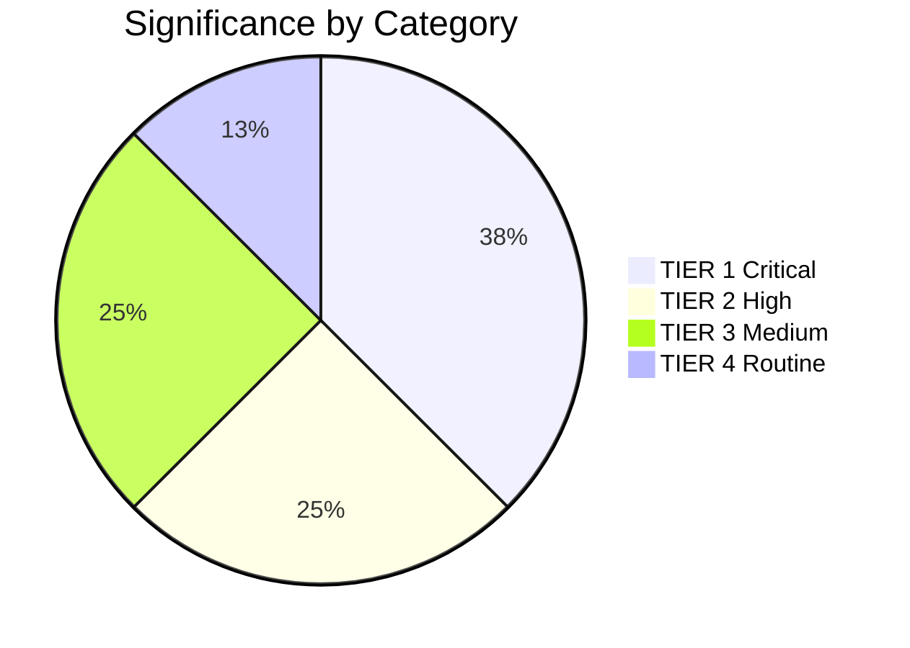

<!-- SPDX-FileCopyrightText: 2026 Hack23 AB -->
<!-- SPDX-License-Identifier: Apache-2.0 -->

# Significance Classification — EP Breaking News | April 28–30, 2026

**Date:** 2026-05-04 | **Confidence:** 🟢 HIGH | **Method:** Multi-factor significance scoring

## Classification Framework

Items are classified on two axes: (1) **Legislative Salience** (immediate normative impact on EU law or policy) and (2) **Political Salience** (coalition dynamics, precedent-setting, geopolitical signal). Final tier assignment uses the higher of the two axes.

| Tier | Label | Description |
|------|-------|-------------|
| Tier 1 | BREAKING | Immediate, high-impact, broad stakeholder consequence |
| Tier 2 | SIGNIFICANT | Substantive legislative or political development |
| Tier 3 | NOTABLE | Procedural or secondary importance |
| Tier 4 | CONTEXTUAL | Background; contributes to longer-term patterns |

---

## Tier 1 — BREAKING

### TA-10-2026-0161: Russia/Ukraine Accountability Resolution
- **Legislative Salience:** 9/10 — Formal EP position endorsing Special Tribunal for Crime of Aggression; can trigger Council-level discussions on legal authority and EU legal personality for such a mechanism
- **Political Salience:** 10/10 — Highest geopolitical signal of the session; EP maintains maximum pressure posture on Russia; sets benchmark for EPP/S&D/Renew Ukraine coalition cohesion
- **Precedent Value:** HIGH — Extends the EP's accountability architecture beyond ICC competencies; first explicit Special Tribunal endorsement from a major EU institution in 2026
- **Tier:** 🔴 TIER 1 — BREAKING

### TA-10-2026-0160: DMA Enforcement Resolution
- **Legislative Salience:** 9/10 — First EP resolution on DMA enforcement adequacy; direct political instruction to Commission's DG COMP and Digital Markets Unit
- **Political Salience:** 8/10 — Part of broader regulatory assertiveness posture; blocks potential Commission DMA rollback under Better Regulation Communications
- **Precedent Value:** HIGH — Sets EP monitoring mandate over DMA implementation; analogous to earlier EP resolutions on GDPR enforcement adequacy (2020–2022)
- **Tier:** 🔴 TIER 1 — BREAKING

---

## Tier 2 — SIGNIFICANT

### TA-10-2026-0162: Armenia Democratic Resilience
- **Legislative Salience:** 7/10 — Advances EaP policy track; can accelerate Council authorization of EU-Armenia comprehensive partnership
- **Political Salience:** 8/10 — Signals EP's geopolitical appetite for Eastern Partnership expansion; tests Russia-China alignment dynamics in South Caucasus
- **Tier:** 🟠 TIER 2 — SIGNIFICANT

### MFF 2028–2034 Interim Debate (April 28)
- **Legislative Salience:** 8/10 — Sets early parliamentary parameters for the most consequential EU institutional negotiation of the decade
- **Political Salience:** 7/10 — Early coalition positioning signals; EPP internal North-South divide already visible
- **Tier:** 🟠 TIER 2 — SIGNIFICANT

### TA-10-2026-0112: 2027 Budget Guidelines
- **Legislative Salience:** 7/10 — EP priority communication for 2027 budget negotiation with Council
- **Political Salience:** 6/10 — Standard annual budget cycle; reflects coalition arithmetic in budgetary matters
- **Tier:** 🟠 TIER 2 — SIGNIFICANT

### Rule of Law Report Debate (April 28)
- **Legislative Salience:** 6/10 — No immediate legislative output but frames future conditionality decisions
- **Political Salience:** 8/10 — High due to Hungary/Poland/Slovakia attention; links to Article 7 proceedings and cohesion fund conditionality
- **Tier:** 🟠 TIER 2 — SIGNIFICANT

---

## Tier 3 — NOTABLE

### TA-10-2026-0105: Patryk Jaki Immunity Waiver
- **Legislative Salience:** 5/10 — Procedural PRIV committee matter; enables Polish national proceedings
- **Political Salience:** 7/10 — Second high-profile Polish MEP immunity waiver in 6 weeks; pattern with Braun (TA-10-2026-0088) signals systematic Polish judicial normalization
- **Tier:** 🟡 TIER 3 — NOTABLE

### TA-10-2026-0151: Haiti Trafficking Resolution
- **Legislative Salience:** 4/10 — No direct EU policy change; DDLH/humanitarian statement
- **Political Salience:** 5/10 — Signals EP global human rights monitoring function
- **Tier:** 🟡 TIER 3 — NOTABLE

### Middle East Energy-Food Joint Debate (April 29)
- **Legislative Salience:** 4/10 — Debate only; no immediate adopted text
- **Political Salience:** 6/10 — Links Middle East geopolitics to EU food/energy security; potential for follow-on legislation on fertiliser supply chain resilience
- **Tier:** 🟡 TIER 3 — NOTABLE

### Russia Normalisation Warning Debate (April 29)
- **Legislative Salience:** 3/10 — Preventive signal; no adopted text
- **Political Salience:** 6/10 — Blocks soft-on-Russia drift; relevant to cultural/sports event governance bodies
- **Tier:** 🟡 TIER 3 — NOTABLE

---

## Tier 4 — CONTEXTUAL

### TA-10-2026-0115: Dog/Cat Welfare Regulation
- **Legislative Salience:** 5/10 — New traceability regime for companion animals; follows Animal Welfare Strategy
- **Political Salience:** 2/10 — Low political controversy; broad cross-group support
- **Tier:** 🔵 TIER 4 — CONTEXTUAL

### TA-10-2026-0119: EIB Annual Report Control
- **Legislative Salience:** 4/10 — CONT committee oversight; standard EIB accountability mechanism
- **Political Salience:** 3/10 — No controversy detected
- **Tier:** 🔵 TIER 4 — CONTEXTUAL

---

## Overall Session Significance Summary

**Session Significance Score:** 8.2/10

This was an above-average significance plenary session. The combination of a top-tier geopolitical resolution (Ukraine accountability), a top-tier regulatory resolution (DMA enforcement), and the first MFF 2028–2034 debate positions this session as a milestone in EP10's legislative record. The Armenia resolution adds an EaP dimension. The dual Polish immunity waiver pattern is an emerging political trend worth monitoring.

**Comparison to Prior Sessions:**
- Exceeds the November 2025 session (MFF preparatory debate only)
- Below the February 2026 session (AI Act secondary legislation vote)
- Comparable to the January 2026 session (Ukraine 4th-year anniversary resolution)

---

## Significance Distribution

