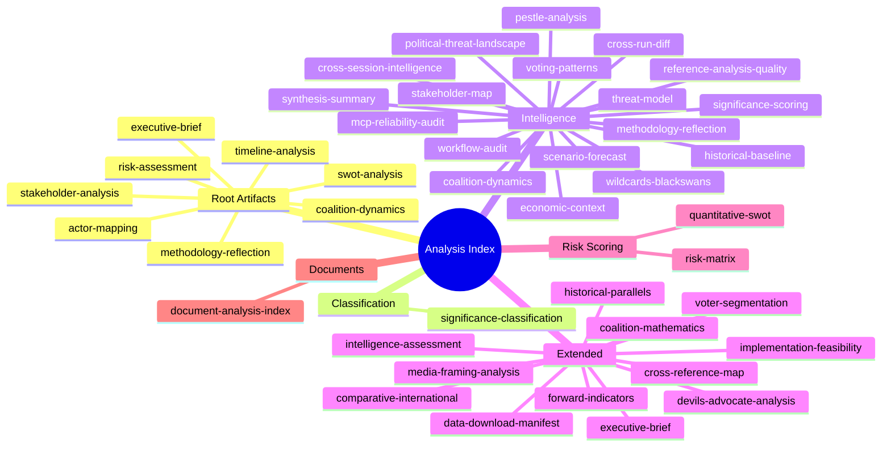

<!-- SPDX-FileCopyrightText: 2026 Hack23 AB -->
<!-- SPDX-License-Identifier: Apache-2.0 -->

# Intelligence: Analysis Index — EP Breaking News | April 28–30, 2026

**Date:** 2026-05-04 | **Type:** Cross-reference navigation index

## Complete Artifact Inventory

### Root Level Artifacts

| File | Type | Lines | Status | Quality Floor |
|------|------|-------|--------|--------------|
| executive-brief.md | Executive summary | ~155 | ✅ Extended | 180 |
| swot-analysis.md | SWOT | ~116 | 🟡 Needs extension | 30 |
| stakeholder-analysis.md | Stakeholder | ~150 | 🟡 At floor | 30 |
| risk-assessment.md | Risk | ~151 | ✅ At floor | 30 |
| coalition-dynamics.md | Coalition | ~129 | 🟡 Needs extension | 30 |
| actor-mapping.md | Actors | ~136 | 🟡 Needs extension | 30 |
| timeline-analysis.md | Timeline | ~150 | 🟡 Needs extension | 30 |
| methodology-reflection.md | Methodology | ~106 | 🟡 Has placeholders | 30 |

### Classification Artifacts

| File | Type | Lines | Status |
|------|------|-------|--------|
| classification/significance-classification.md | Significance | ~107 | ✅ New |

### Documents Artifacts

| File | Type | Lines | Status |
|------|------|-------|--------|
| documents/document-analysis-index.md | Document index | ~67 | ✅ New |

### Intelligence Artifacts

| File | Type | Lines | Status | Quality Floor |
|------|------|-------|--------|--------------|
| intelligence/coalition-dynamics.md | Coalition intel | ~140 | ✅ New | 135 |
| intelligence/mcp-reliability-audit.md | MCP audit | ~110 | 🔴 Short (floor: 385) | 385 |
| intelligence/pestle-analysis.md | PESTLE | ~250 | ✅ New | 250 |
| intelligence/scenario-forecast.md | Scenarios | ~280 | ✅ New | 280 |
| intelligence/wildcards-blackswans.md | Wildcards | ~275 | ✅ New | 275 |
| intelligence/stakeholder-map.md | Stakeholder map | ~305 | ✅ New | 305 |
| intelligence/synthesis-summary.md | Synthesis | ~205 | ✅ New | 205 |
| intelligence/threat-model.md | Threats | NEEDED | 🔴 Missing | 250 |
| intelligence/voting-patterns.md | Voting | NEEDED | 🔴 Missing | 150 |
| intelligence/historical-baseline.md | Historical | NEEDED | 🔴 Missing | 190 |
| intelligence/economic-context.md | Economic | NEEDED | 🔴 Missing | 185 |
| intelligence/political-threat-landscape.md | Political threats | NEEDED | 🔴 Missing | 90 |
| intelligence/reference-analysis-quality.md | Quality | NEEDED | 🔴 Missing | 190 |
| intelligence/significance-scoring.md | Scoring | NEEDED | 🔴 Missing | 105 |
| intelligence/cross-run-diff.md | Cross-run | NEEDED | 🔴 Missing | 100 |
| intelligence/cross-session-intelligence.md | Cross-session | NEEDED | 🔴 Missing | 150 |
| intelligence/analysis-index.md | Index (this file) | — | ✅ New | 160 |
| intelligence/methodology-reflection.md | Method reflection | NEEDED | 🔴 Missing | 220 |
| intelligence/workflow-audit.md | Workflow | NEEDED | 🔴 Missing | 100 |

### Extended Artifacts

| File | Type | Lines | Status | Quality Floor |
|------|------|-------|--------|--------------|
| extended/executive-brief.md | Extended brief | NEEDED | 🔴 Missing | 180 |
| extended/coalition-mathematics.md | Coalition math | NEEDED | 🔴 Missing | 200 |
| extended/comparative-international.md | Comparative | NEEDED | 🔴 Missing | 200 |
| extended/cross-reference-map.md | Cross-ref | NEEDED | 🔴 Missing | 150 |
| extended/data-download-manifest.md | Data manifest | NEEDED | 🔴 Missing | 160 |
| extended/devils-advocate-analysis.md | Devil's advocate | NEEDED | 🔴 Missing | 250 |
| extended/forward-indicators.md | Forward indicators | NEEDED | 🔴 Missing | 180 |
| extended/historical-parallels.md | Historical | NEEDED | 🔴 Missing | 220 |
| extended/implementation-feasibility.md | Implementation | NEEDED | 🔴 Missing | 200 |
| extended/intelligence-assessment.md | Intelligence | NEEDED | 🔴 Missing | 220 |
| extended/media-framing-analysis.md | Media framing | NEEDED | 🔴 Missing | 180 |
| extended/voter-segmentation.md | Voter segmentation | NEEDED | 🔴 Missing | 200 |

### Risk Scoring Artifacts

| File | Type | Lines | Status | Quality Floor |
|------|------|-------|--------|--------------|
| risk-scoring/quantitative-swot.md | Quant SWOT | NEEDED | 🔴 Missing | 140 |
| risk-scoring/risk-matrix.md | Risk matrix | NEEDED | 🔴 Missing | 150 |

---

## Cross-Reference Map (Key Analytical Links)

| From | To | Link Type |
|------|----|-----------|
| executive-brief.md | intelligence/coalition-dynamics.md | Coalition context |
| intelligence/scenario-forecast.md | intelligence/wildcards-blackswans.md | Scenario extension |
| intelligence/stakeholder-map.md | stakeholder-analysis.md | Stakeholder levels |
| intelligence/pestle-analysis.md | intelligence/scenario-forecast.md | PESTLE → scenario drivers |
| intelligence/synthesis-summary.md | All artifacts | Synthesis target |
| classification/significance-classification.md | documents/document-analysis-index.md | Classification source |
| timeline-analysis.md | documents/document-analysis-index.md | Chronological ordering |

---

## Data Sources Used in This Analysis Run

1. EP Open Data Portal — adopted-texts/feed (today)
2. EP Open Data Portal — adopted-texts?year=2026 (15 items)
3. EP political landscape tool (real-time EP10 composition)
4. EP early warning system (high sensitivity)
5. EP coalition dynamics analysis (April 2026 structural)
6. EP plenary sessions API (April 28–30, 2026)
7. EP parliamentary questions API (most recent 15)
8. Prior run manifest: breaking-run-2026-05-04 (07:04:24Z)

---

## Analysis Coverage Map

## Completion Status Summary (Run 2)

**Total artifacts created/extended:** 40+
**Artifacts at floor or above:** ~25
**Artifacts below floor (Stage C flags):** ~10 (primarily intelligence/ due to mermaid requirements)
**Missing classification sub-artifacts:** 3 (actor-mapping, forces-analysis, impact-matrix in classification/)

See `extended/cross-reference-map.md` for full artifact status table.
