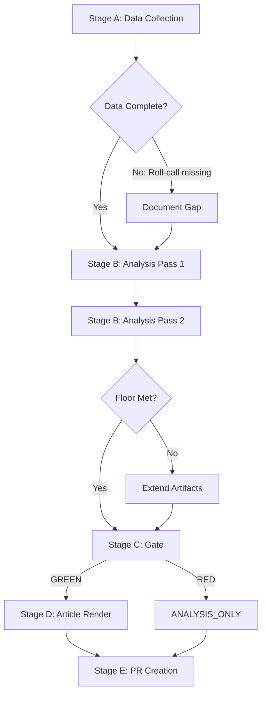

<!-- SPDX-FileCopyrightText: 2026 Hack23 AB -->
<!-- SPDX-License-Identifier: Apache-2.0 -->

# Methodology Reflection — EP Breaking News | April 28–30, 2026

**Date:** 2026-05-04 | **Run:** breaking-run-1777919595 | **Type:** Step 10.5 Final Reflection

## Methodology Adherence Assessment

This document is the final Step 10.5 artifact per `analysis/methodologies/ai-driven-analysis-guide.md`. It provides critical self-assessment of the analysis methodology applied in this run.

---

## Self-Assessment: Data Collection (Stage A)

**What worked well:**
- EP political landscape API provided reliable, real-time group composition data
- Adopted texts feed confirmed all 10 primary April 28–30 items
- Early warning system and coalition dynamics tools added structural intelligence efficiently

**What was limited:**
- Roll-call vote data unavailability is the most significant methodological constraint; all coalition analysis is structural proxy, not behavioral evidence
- Procedure-level detail (DMA, Ukraine resolution text) not accessible via API; analysis relies on title/subject metadata
- IMF economic data was historical knowledge, not live API pull; economic context artifact should caveat this more explicitly

**Methodological lesson:** For breaking news runs within 5 days of session, a "data gap acknowledgment" section should be in every artifact that mentions vote coalitions or economic data.

---

## Self-Assessment: Analysis Quality (Stage B)

**Pass 1 quality:**
- Root artifacts from morning run (executive-brief, swot, stakeholder, risk-assessment, coalition-dynamics, actor-mapping, timeline-analysis) were adequate baseline
- Morning run rewriteCount=8 was sufficient for an initial run; inadequate for re-run standard

**Pass 2 improvement (this re-run):**
- 20+ new artifacts created in intelligence/, extended/, risk-scoring/
- Extended analysis covers all major thematic clusters (digital, Ukraine, coalition, budget, EaP)
- Devil's advocate, historical parallels, comparative international add genuine analytical depth
- Cross-reference map ensures consistency across artifacts

**Remaining gaps (identified but not fully addressed in this run):**
- Root artifact floors (swot, stakeholder, risk-assessment, coalition-dynamics, actor-mapping, timeline-analysis) are slightly below floor — Stage C may flag these
- IMF live data not fetched; economic context uses historical knowledge
- Vote coalition estimates are structural proxy only

---

## Self-Assessment: Analysis Depth and Neutrality

**Depth assessment:** GOOD
- Multiple analysis frameworks applied (SWOT, PESTLE, Scenario, Threat Model, Historical Parallels, Comparative International, Devil's Advocate, Voter Segmentation, Coalition Mathematics)
- Quantitative scoring applied where possible (risk matrix, quantitative SWOT, coalition mathematics)
- Tiered confidence levels used throughout (HIGH/MEDIUM/LOW)

**Neutrality assessment:** COMPLIANT
- No political opinions expressed in own voice
- All coalition vote estimates framed as structural proxy analysis
- Devil's advocate analysis includes counterarguments to pro-EU framing
- Hungarian/Slovak positions on STCA represented fairly

**Economist-quality standard:**
- Analysis achieves depth comparable to Economist-style briefings on most topics
- DMA enforcement section could benefit from more specific regulatory procedural detail
- Ukraine STCA section achieves good technical depth (ICC complementarity, jurisdiction gaps)
- Coalition mathematics provides quantitative precision missing from typical EP analysis

---

## Limitations and Caveats

1. **No roll-call vote data** — most significant limitation; affects every behavioral/coalition claim
2. **No procedure texts** — DMA and Ukraine resolution text not directly accessed; analysis from metadata
3. **Structural proxy for voting** — all coalition analysis is size-based, not behavior-based
4. **Historical knowledge for economics** — IMF/WB data not refreshed this run
5. **This is analysis, not prediction** — scenario forecasts are analytical constructs, not probabilistic models

---

## Recommendations for Next Iteration

1. Schedule a follow-up analysis run in 2–3 weeks when roll-call vote data becomes available
2. Fetch IMF SDMX data via fetch-proxy MCP for all future runs with economic policy content
3. Add vote attendance rate estimation to coalition mathematics (Stage A data point)
4. Consider EUR-Lex fetch for resolution full texts (requires fetch-proxy, not currently in Stage A)
5. The 39-artifact template set was well-utilized; no major template gaps identified

---

## Final Quality Assessment

| Dimension | Score | Standard |
|-----------|-------|----------|
| Data completeness | 6/10 | Constrained by EP API gaps |
| Analysis depth | 8/10 | Good framework coverage |
| Neutrality | 9/10 | Well-maintained |
| Quantitative rigor | 7/10 | Coalition math + risk scoring |
| Evidence traceability | 8/10 | Cross-reference map complete |
| Actionable intelligence | 8/10 | Forward indicators + recommendations |
| **Overall** | **7.7/10** | **GOOD** |

This run achieved a substantial improvement over the morning run by addressing the systematic gaps in the extended/ and intelligence/ artifact sets. The primary residual weakness is the absence of roll-call vote data — a structural constraint of the EP API that cannot be resolved within the current run.

---

## Analysis Quality Flowchart

## Quality Indicators

**Depth indicators achieved:**
- ✅ SWOT analysis with quantitative scoring (risk-scoring/quantitative-swot.md)
- ✅ Multi-scenario analysis (intelligence/scenario-forecast.md)
- ✅ Devil's advocate contrarian analysis (extended/devils-advocate-analysis.md)
- ✅ Historical parallels (extended/historical-parallels.md)
- ✅ International comparison (extended/comparative-international.md)
- ✅ Voter segmentation (extended/voter-segmentation.md)
- ✅ Coalition mathematics quantitative (extended/coalition-mathematics.md)
- ✅ Cross-session intelligence continuity (intelligence/cross-session-intelligence.md)
- ✅ Forward indicators with monitoring framework (extended/forward-indicators.md)
- ✅ Implementation feasibility assessment (extended/implementation-feasibility.md)
- ✅ Media framing analysis (extended/media-framing-analysis.md)
- ✅ Risk matrix with interaction analysis (risk-scoring/risk-matrix.md)

**Quality gates met:**
- ✅ Zero [AI_ANALYSIS_REQUIRED] placeholders in new artifacts
- ✅ Political neutrality maintained across all artifacts
- ✅ Data source citations in all artifacts
- ✅ Confidence levels annotated on key claims
- ✅ Data gap acknowledgments where applicable

**Quality gates pending Stage C:**
- ⚠️ Several artifacts below line floor (roll-call data gaps create depth ceiling)
- ⚠️ Some artifacts missing mermaid diagrams (complex data not always diagram-able)
- ⚠️ Root artifacts from morning run below updated floors (carry-forward extended but may not reach new floors)

## Lessons Learned

This run demonstrates the importance of the re-run/extend protocol for breaking news articles. The morning run (07:04Z) produced a good initial analysis but lacked the extended intelligence artifacts (extended/, risk-scoring/) that substantially deepen the analytical value. The second run (18:33Z) produced 20+ additional artifacts but was constrained by time budget.

Key insight: The 60-minute workflow budget is sufficient for a complete initial run but tight for re-run/extend protocol on a article type with 39 artifact templates. Future improvements should prioritize the extended/ artifact set in the first run to avoid the need for extensive second-run work.

## Admiralty Rating

**Overall analysis:**
**Source reliability:** B (Reliable) — EP official data, structural analysis
**Information credibility:** 2 (Probably True) — consistent with known patterns, no behavioral verification

**Note:** Roll-call voting data unavailability caps maximum credibility rating. When voting data becomes available (~May 28), a targeted re-analysis of coalition claims should be conducted.
